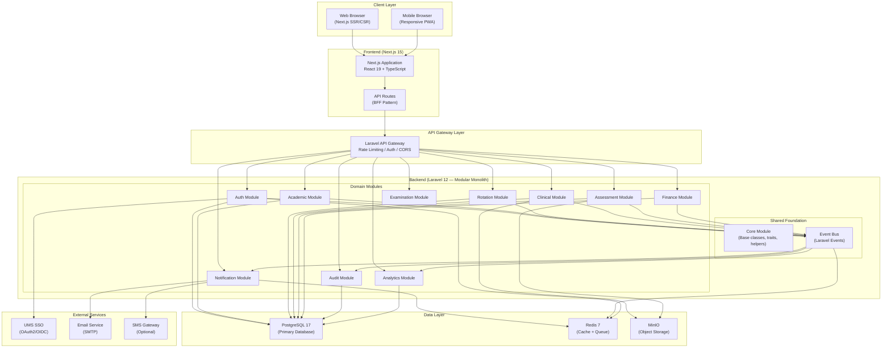
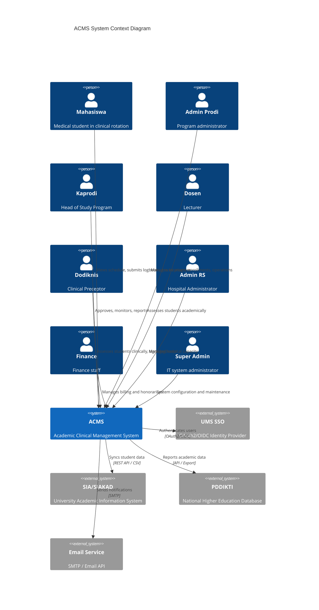
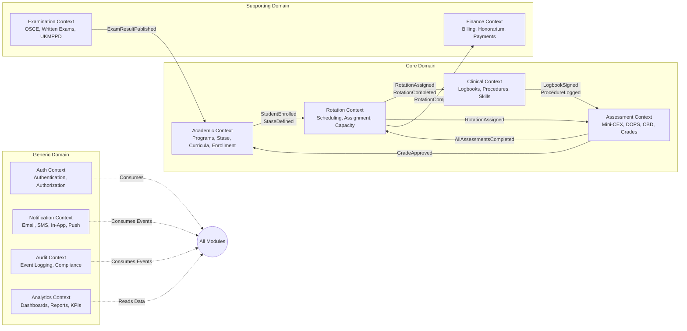
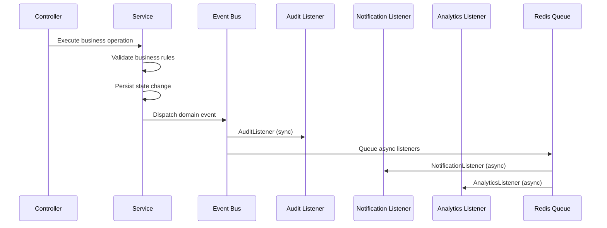
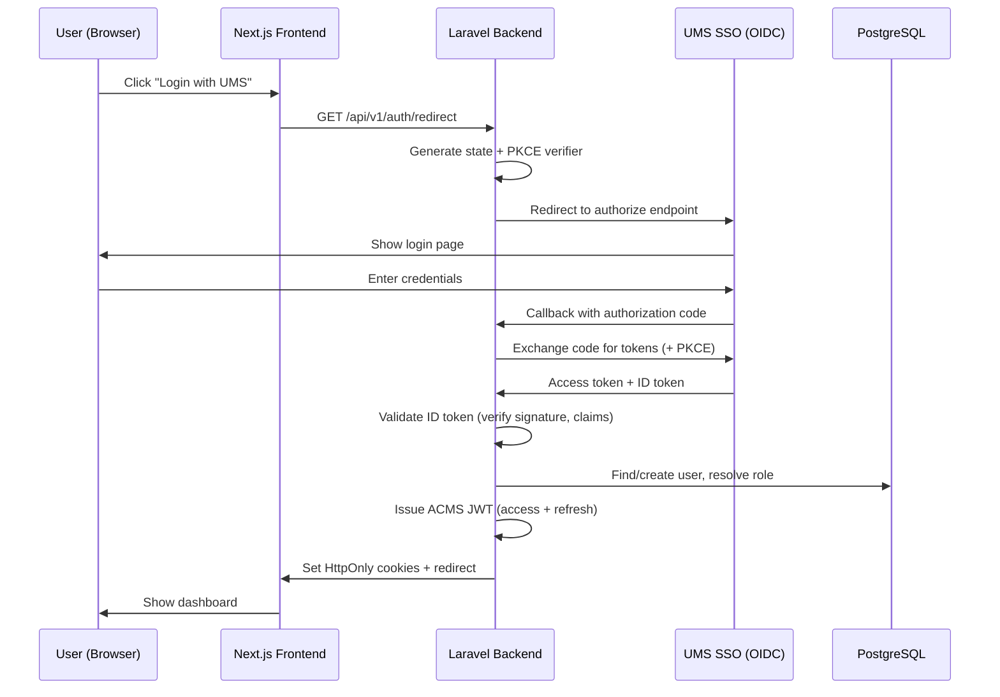
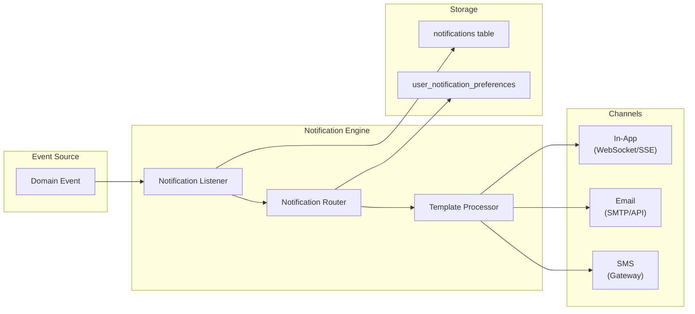
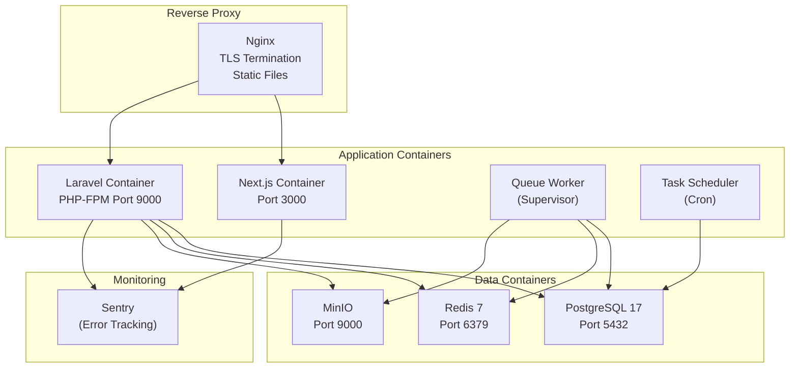
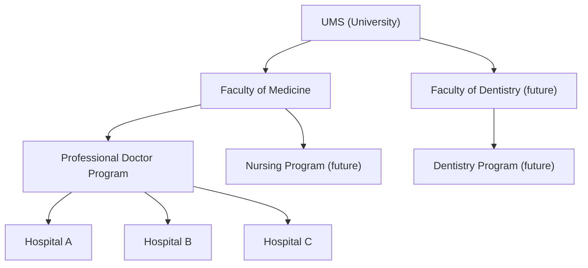

# ACMS — Architecture Specification

**Version**: 2.0  
**Date**: 2026-06-08  
**Status**: Draft  
**Document ID**: ACMS-ARCH-001

---

## Table of Contents

1. [Architecture Overview](#1-architecture-overview)
2. [Architectural Principles](#2-architectural-principles)
3. [Technology Stack](#3-technology-stack)
4. [System Context](#4-system-context)
5. [Domain Model & Bounded Contexts](#5-domain-model--bounded-contexts)
6. [Clean Architecture Layers](#6-clean-architecture-layers)
7. [Module Structure](#7-module-structure)
8. [Event-Driven Architecture](#8-event-driven-architecture)
9. [Authentication & Authorization Architecture](#9-authentication--authorization-architecture)
10. [Data Architecture](#10-data-architecture)
11. [API Architecture](#11-api-architecture)
12. [Storage Architecture](#12-storage-architecture)
13. [Caching Architecture](#13-caching-architecture)
14. [Notification Architecture](#14-notification-architecture)
15. [Frontend Architecture](#15-frontend-architecture)
16. [Deployment Architecture](#16-deployment-architecture)
17. [Security Architecture Overview](#17-security-architecture-overview)
18. [Observability Architecture](#18-observability-architecture)
19. [Multi-Tenancy Architecture](#19-multi-tenancy-architecture)
20. [Cross-Cutting Concerns](#20-cross-cutting-concerns)

---

## 1. Architecture Overview

ACMS follows a **Modular Monolith** architecture pattern with **Domain-Driven Design** tactical patterns, **Clean Architecture** layering, and **Event-Driven** inter-module communication. This provides the modularity benefits of microservices with the operational simplicity of a monolith — appropriate for a small development team (3–5 developers) with future extraction capability.

### High-Level Architecture



---

## 2. Architectural Principles

| # | Principle | Description |
|---|-----------|-------------|
| AP-01 | **Domain-Driven Design** | Business logic organized by domain bounded contexts, not technical layers |
| AP-02 | **Clean Architecture** | Dependencies point inward: Entities → Use Cases → Interface Adapters → Frameworks |
| AP-03 | **SOLID** | Single Responsibility, Open/Closed, Liskov Substitution, Interface Segregation, Dependency Inversion |
| AP-04 | **Modular Monolith** | Independent domain modules with explicit boundaries, deployable as single artifact |
| AP-05 | **Event-Driven** | Inter-module communication via domain events, not direct method calls |
| AP-06 | **API-First** | All functionality exposed via versioned REST APIs; frontend consumes APIs exclusively |
| AP-07 | **Security by Design** | Authentication, authorization, encryption, and input validation are core, not afterthoughts |
| AP-08 | **Audit by Design** | Every significant action produces an audit event; audit is an architectural concern, not a feature |
| AP-09 | **Scalability by Design** | Multi-tenancy columns, caching, queue-based processing, and read replicas designed from day one |
| AP-10 | **Convention over Configuration** | Consistent naming, structure, and patterns reduce cognitive load |

---

## 3. Technology Stack

### 3.1 Frontend

| Technology | Version | Purpose | Rationale |
|------------|---------|---------|-----------|
| Next.js | 15 | React framework, SSR/SSG/ISR | Full-stack React with server-side rendering for SEO and performance |
| React | 19 | UI library | Component-based, large ecosystem, concurrent features |
| TypeScript | 5.x | Type-safe JavaScript | Compile-time error detection, better DX, self-documenting |
| Tailwind CSS | 4.x | Utility-first CSS | Rapid styling, consistent design system, small bundle |
| Shadcn/UI | latest | Component library | Accessible, customizable, not a dependency (copy-paste) |
| TanStack Query | 5.x | Server state management | Caching, background refetching, optimistic updates |
| Zustand | 5.x | Client state management | Lightweight, TypeScript-native, no boilerplate |
| React Hook Form | 7.x | Form management | Performance (uncontrolled inputs), validation integration |
| Zod | 4.x | Schema validation | TypeScript-first, composable, works with React Hook Form (NOTE: v4 has breaking changes vs v3) |
| Recharts | 2.x | Data visualization | React-native charts, responsive, accessible |

### 3.2 Backend

| Technology | Version | Purpose | Rationale |
|------------|---------|---------|-----------|
| Laravel | 12 | PHP framework | Robust ecosystem, Eloquent ORM, queues, events, excellent DX |
| PHP | 8.2+ | Runtime | Named arguments, enums, fibers, readonly properties, performance |
| PostgreSQL | 17 | Primary database (production target) | JSONB, CTEs, window functions, row-level security, partitioning |
| MySQL | 8.x | Primary database (development — XAMPP) | Current dev environment uses MySQL; write migrations with MySQL-compatible syntax |
| Redis | 7.x | Cache + Queue | In-memory performance, pub/sub for real-time, reliable queues |
| MinIO | latest | Object storage | S3-compatible, self-hosted, suitable for documents and media |
| Laravel Sanctum | latest | API authentication | Token-based auth for SPA, lightweight |
| Spatie Permission | latest | RBAC | Mature, well-tested roles and permissions package |
| Laravel Telescope | latest | Development debugging | Query inspection, request monitoring (dev only) |
| Sentry | latest | Error monitoring | Production error tracking with context |

### 3.3 Infrastructure

| Technology | Purpose | Environment |
|------------|---------|-------------|
| Docker + Docker Compose | Containerization | Dev, Staging, Prod |
| Nginx | Reverse proxy / web server | Staging, Prod |
| GitHub Actions | CI/CD pipeline | All |
| Certbot / Let's Encrypt | SSL certificates | Staging, Prod |
| Supervisor | Process management (queue workers) | Staging, Prod |

---

## 4. System Context



---

## 5. Domain Model & Bounded Contexts

### 5.1 Bounded Contexts Map



### 5.2 Context Relationships

| Upstream Context | Downstream Context | Relationship Type | Integration Pattern |
|-----------------|-------------------|-------------------|-------------------|
| Academic | Rotation | Customer-Supplier | Domain Events |
| Rotation | Clinical | Customer-Supplier | Domain Events |
| Rotation | Assessment | Customer-Supplier | Domain Events |
| Clinical | Assessment | Conformist | Shared Kernel (student + stase IDs) |
| Assessment | Academic | Customer-Supplier | Domain Events |
| Rotation | Finance | Customer-Supplier | Domain Events |
| All | Audit | Published Language | Event Subscription |
| All | Notification | Published Language | Event Subscription |
| All | Analytics | Open Host | Read Models / Views |
| Auth | All | Shared Kernel | Middleware Integration |

### 5.3 Aggregate Roots per Context

| Context | Aggregate Roots | Key Entities |
|---------|----------------|-------------|
| Auth | User | Role, Permission, Session |
| Academic | Program, Student | Faculty, Stase, Curriculum, Cohort, Enrollment |
| Rotation | RotationPeriod, RotationAssignment | RotationSlot, HospitalCapacity, SwapRequest |
| Clinical | LogbookEntry | ProcedureLog, SkillChecklist |
| Assessment | Assessment, StaseGrade | MiniCEX, DOPS, CBD, GradeAppeal |
| Examination | OSCESession, WrittenExam | OSCEStation, ExamResult |
| Finance | Invoice, Honorarium | Payment, Disbursement |
| Notification | Notification | NotificationTemplate, NotificationPreference |
| Audit | AuditLog | (append-only, no aggregate behavior) |
| Analytics | (read-only projections) | Dashboard, Report |

---

## 6. Clean Architecture Layers

```
┌─────────────────────────────────────────────────────────┐
│                    Frameworks & Drivers                   │
│  (Laravel, Eloquent, Redis, MinIO, Next.js, PostgreSQL)  │
├─────────────────────────────────────────────────────────┤
│                   Interface Adapters                      │
│  (Controllers, Requests, Resources, Repositories Impl,   │
│   Event Listeners, Job Handlers, API Routes, Middleware)  │
├─────────────────────────────────────────────────────────┤
│                     Use Cases                             │
│  (Application Services, Command Handlers, Query Handlers, │
│   DTOs, Input/Output Ports)                               │
├─────────────────────────────────────────────────────────┤
│                      Entities                             │
│  (Domain Models, Value Objects, Domain Events,            │
│   Domain Services, Business Rules, Repository Interfaces) │
└─────────────────────────────────────────────────────────┘
```

### Layer Rules

| Layer | May Depend On | Must Not Depend On |
|-------|--------------|-------------------|
| Entities (Domain) | Nothing (innermost) | Use Cases, Adapters, Frameworks |
| Use Cases (Application) | Entities | Adapters, Frameworks |
| Interface Adapters | Use Cases, Entities | Frameworks (directly) |
| Frameworks & Drivers | All inner layers | — |

### Dependency Inversion in Practice

```
// Domain layer defines interface (port)
interface RotationRepositoryInterface {
    findById(id: Uuid): ?RotationPeriod;
    save(rotation: RotationPeriod): void;
    findConflicts(studentId: Uuid, startDate, endDate): Collection;
}

// Infrastructure layer implements it (adapter)
class EloquentRotationRepository implements RotationRepositoryInterface {
    // Eloquent-specific implementation
}

// Use case depends on interface, not implementation
class AssignStudentToRotation {
    constructor(private repo: RotationRepositoryInterface) {}
}

// Laravel service container wires them together
$this->app->bind(RotationRepositoryInterface::class, EloquentRotationRepository::class);
```

---

## 7. Module Structure

> **Implementation Note (June 2026):** The actual codebase has **11 modules** in `backend/Modules/`. Three modules in production differ from this design: `Attendance`, `Evaluation`, and `Incident` are implemented as standalone modules; `Notification`, `Analytics`, and `Audit` are currently handled in the main `app/` layer (not as separate nwidart modules). See `Build/CURRENT_STATE_FOR_AI.md §4.2` for the authoritative module list.

### 7.1 Backend Module Directory

Each domain module follows an identical internal structure:

```
app/
├── Modules/
│   ├── Core/                          # Shared Foundation
│   │   ├── Models/
│   │   │   └── BaseModel.php          # UUID, SoftDeletes, audit traits
│   │   ├── Traits/
│   │   │   ├── HasUuid.php
│   │   │   ├── Auditable.php
│   │   │   └── BelongsToTenant.php
│   │   ├── Events/
│   │   │   └── BaseEvent.php
│   │   ├── Exceptions/
│   │   │   ├── DomainException.php
│   │   │   └── BusinessRuleViolation.php
│   │   ├── Http/
│   │   │   ├── Middleware/
│   │   │   └── Resources/
│   │   │       └── BaseResource.php
│   │   ├── Services/
│   │   │   └── BaseService.php
│   │   └── Contracts/
│   │       ├── RepositoryInterface.php
│   │       └── ServiceInterface.php
│   │
│   ├── Auth/                          # Authentication & Authorization
│   │   ├── Models/
│   │   │   ├── User.php
│   │   │   ├── Role.php
│   │   │   └── Permission.php
│   │   ├── Services/
│   │   │   ├── AuthService.php
│   │   │   └── SSOService.php
│   │   ├── Http/
│   │   │   ├── Controllers/
│   │   │   │   ├── AuthController.php
│   │   │   │   └── UserController.php
│   │   │   ├── Requests/
│   │   │   │   ├── LoginRequest.php
│   │   │   │   └── CreateUserRequest.php
│   │   │   ├── Resources/
│   │   │   │   ├── UserResource.php
│   │   │   │   └── UserCollection.php
│   │   │   └── Middleware/
│   │   │       ├── EnsureRoleMiddleware.php
│   │   │       └── EnsureTenantScope.php
│   │   ├── Events/
│   │   │   ├── UserLoggedIn.php
│   │   │   ├── UserLoggedOut.php
│   │   │   └── UserRoleChanged.php
│   │   ├── Listeners/
│   │   ├── Policies/
│   │   │   └── UserPolicy.php
│   │   ├── Repositories/
│   │   │   └── UserRepository.php
│   │   ├── Routes/
│   │   │   └── api.php
│   │   ├── Tests/
│   │   │   ├── Unit/
│   │   │   └── Feature/
│   │   └── Providers/
│   │       └── AuthServiceProvider.php
│   │
│   ├── Academic/                      # Academic Domain
│   │   ├── Models/
│   │   │   ├── Program.php
│   │   │   ├── Faculty.php
│   │   │   ├── Stase.php
│   │   │   ├── Student.php
│   │   │   ├── Cohort.php
│   │   │   ├── Curriculum.php
│   │   │   └── AcademicCalendar.php
│   │   ├── Services/
│   │   ├── Http/
│   │   ├── Events/
│   │   ├── Policies/
│   │   ├── Repositories/
│   │   ├── Routes/
│   │   └── Tests/
│   │
│   ├── Rotation/                      # Rotation Domain
│   ├── Clinical/                      # Clinical Domain
│   ├── Assessment/                    # Assessment Domain
│   ├── Examination/                   # Examination Domain
│   ├── Finance/                       # Finance Domain
│   ├── Attendance/                    # Attendance Domain (GPS check-in/out) [IMPLEMENTED]
│   ├── Evaluation/                    # Evaluation/Survey Domain [IMPLEMENTED]
│   ├── Incident/                      # Incident Reporting Domain [IMPLEMENTED]
│   ├── Notification/                  # Notification Domain [PLANNED — currently in app/Services/]
│   ├── Analytics/                     # Analytics Domain [PLANNED — currently in app/Http/Controllers/Api/]
│   └── Audit/                         # Audit Domain [PLANNED — not yet implemented]
│
├── Providers/
│   └── ModuleServiceProvider.php      # Registers all module providers
│
config/
database/
│   ├── migrations/
│   │   ├── 2026_01_01_000001_create_users_table.php
│   │   ├── 2026_01_01_000010_create_academic_tables.php
│   │   └── ...
│   └── seeders/
routes/
│   └── api.php                        # Includes module routes
tests/
```

### 7.2 Frontend Module Directory

```
src/
├── app/                               # Next.js App Router
│   ├── (auth)/                        # Auth layout group
│   │   ├── login/
│   │   └── callback/
│   ├── (dashboard)/                   # Authenticated layout group
│   │   ├── layout.tsx                 # Dashboard shell (sidebar, topbar)
│   │   ├── page.tsx                   # Role-specific dashboard
│   │   ├── academic/
│   │   ├── rotations/
│   │   ├── clinical/
│   │   ├── assessments/
│   │   ├── examinations/
│   │   ├── finance/
│   │   ├── analytics/
│   │   ├── audit/
│   │   ├── notifications/
│   │   └── settings/
│   ├── layout.tsx                     # Root layout (providers, fonts)
│   └── globals.css
│
├── components/                        # Shared UI components
│   ├── ui/                            # Shadcn/UI primitives
│   ├── layout/                        # Layout components (Sidebar, Topbar)
│   ├── data-display/                  # Tables, cards, charts
│   └── forms/                         # Form components
│
├── features/                          # Domain-specific features
│   ├── academic/
│   │   ├── components/
│   │   ├── hooks/
│   │   ├── services/
│   │   └── types/
│   ├── rotation/
│   ├── clinical/
│   ├── assessment/
│   ├── examination/
│   ├── finance/
│   ├── analytics/
│   └── audit/
│
├── hooks/                             # Shared custom hooks
├── lib/                               # Shared utilities
│   ├── api-client.ts                  # Typed API client
│   ├── auth.ts                        # Auth utilities
│   └── utils.ts                       # General helpers
│
├── stores/                            # Zustand stores
│   ├── auth-store.ts
│   ├── notification-store.ts
│   └── ui-store.ts
│
├── types/                             # Shared TypeScript types
│   ├── api.ts                         # API response types
│   ├── models.ts                      # Domain model types
│   └── enums.ts                       # Shared enums
│
└── config/                            # App configuration
    ├── navigation.ts                  # Role-based nav config
    └── constants.ts
```

### 7.3 Module Interaction Rules

| Rule | Description |
|------|-------------|
| **No direct imports** | Module A must not import classes from Module B directly |
| **Events only** | Cross-module communication exclusively via domain events through the event bus |
| **Shared Kernel** | Only `Core` module may be imported by all other modules |
| **No circular dependencies** | Event flow must be acyclic |
| **Own your data** | Each module owns its database tables; other modules read via events or dedicated query interfaces |
| **API boundary** | Each module defines its own routes, controllers, and resources |

---

## 8. Event-Driven Architecture

### 8.1 Event Flow



### 8.2 Event Categories

| Category | Processing | Examples |
|----------|-----------|---------|
| **Domain Events** | Sync or Async | `RotationAssigned`, `GradeApproved`, `LogbookSigned` |
| **Integration Events** | Async (queued) | `SendEmailNotification`, `SyncWithSIA` |
| **System Events** | Async (queued) | `UserSessionExpired`, `ScheduledTaskCompleted` |

### 8.3 Event Schema

```php
abstract class DomainEvent {
    public readonly string $eventId;       // UUID
    public readonly string $eventType;     // e.g., 'rotation.assigned'
    public readonly string $aggregateId;   // ID of the aggregate root
    public readonly string $aggregateType; // e.g., 'RotationAssignment'
    public readonly string $actorId;       // User who caused the event
    public readonly array $payload;        // Event-specific data
    public readonly Carbon $occurredAt;    // Timestamp
    public readonly int $version;          // Event version for schema evolution
}
```

### 8.4 Domain Event Catalog

| Module | Event | Triggers |
|--------|-------|----------|
| Auth | `UserLoggedIn` | Audit log |
| Auth | `UserLoggedOut` | Audit log |
| Auth | `UserRoleChanged` | Audit log, notification |
| Academic | `StudentEnrolled` | Notification, rotation eligibility check |
| Academic | `StudentStatusChanged` | Rotation cancellation if inactive |
| Academic | `StaseDefined` | Rotation engine update |
| Rotation | `RotationPeriodPublished` | Notifications to all stakeholders |
| Rotation | `RotationAssigned` | Notification to student, hospital, preceptor |
| Rotation | `RotationSwapApproved` | Notification, schedule update |
| Rotation | `RotationCompleted` | Grade finalization trigger, honorarium trigger |
| Clinical | `LogbookEntrySubmitted` | Notification to Dodiknis |
| Clinical | `LogbookEntrySigned` | Progress update, assessment eligibility |
| Clinical | `LogbookEntryRejected` | Notification to student |
| Assessment | `AssessmentSubmitted` | Grade recalculation, notification |
| Assessment | `GradeApproved` | Notification to student, transcript update |
| Assessment | `GradeAppealed` | Notification to review committee |
| Examination | `OSCECompleted` | Grade integration |
| Examination | `ExamResultPublished` | Notification, transcript update |
| Finance | `InvoiceIssued` | Notification to student |
| Finance | `PaymentReceived` | Invoice status update |
| Finance | `HonorariumApproved` | Notification to finance for disbursement |

---

## 9. Authentication & Authorization Architecture

### 9.1 Authentication Flow



### 9.2 Token Architecture

| Token | Type | Lifetime | Storage | Purpose |
|-------|------|----------|---------|---------|
| Access Token | JWT (RS256) | 15 minutes | HttpOnly Secure cookie | API authentication |
| Refresh Token | Opaque | 7 days | HttpOnly Secure cookie | Access token renewal |
| CSRF Token | Random | Session | Cookie + Header | CSRF protection |

### 9.3 Authorization Enforcement

```
Request → Authenticate Middleware (JWT validation)
        → Tenant Scope Middleware (inject program_id/hospital_id)
        → Rate Limit Middleware
        → Role Middleware (check role permission for route)
        → Controller
        → Policy (fine-grained resource-level check)
        → Service (business rule validation)
```

---

## 10. Data Architecture

### 10.1 Multi-Tenancy Strategy

**Pattern**: Shared Schema with Discriminator Columns

All tenant-scoped tables include:
- `program_id` — scope to specific study program
- `faculty_id` — scope to specific faculty (optional, derived from program)

Global scoping middleware automatically applies WHERE clauses based on authenticated user's tenant context.

```php
// Applied automatically via BelongsToTenant trait
class Student extends BaseModel {
    use BelongsToTenant; // Adds global scope: WHERE program_id = {current_program}
}
```

### 10.2 Database Design Conventions

| Convention | Standard |
|-----------|----------|
| Primary keys | UUID v7 (time-ordered for index performance) |
| Table naming | Plural snake_case (`students`, `rotation_assignments`) |
| Column naming | snake_case (`created_at`, `student_id`) |
| Foreign keys | `{singular_table}_id` |
| Timestamps | `created_at`, `updated_at` on all tables |
| Soft deletes | `deleted_at` on all domain entities |
| JSON columns | JSONB for metadata/config, never for relational data |
| Enums | VARCHAR with app-level validation (not DB enums — migration-friendly) |
| Indexes | B-tree on FKs, GIN on JSONB, composite on frequent filter combinations |

### 10.3 Data Partitioning Strategy (Phase 3)

- **Audit logs**: Range partition by `created_at` (monthly partitions)
- **Notifications**: Range partition by `created_at` (quarterly partitions)
- **Analytics**: Materialized views with refresh schedules

---

## 11. API Architecture

### 11.1 API Design Standards

| Aspect | Standard |
|--------|----------|
| Base URL | `/api/v1/` |
| Versioning | URI path versioning (`/api/v1/`, `/api/v2/`) |
| Format | JSON (Content-Type: application/json) |
| Authentication | Bearer token via HttpOnly cookie (auto-attached) |
| Pagination | Cursor-based (default), offset for admin grids |
| Filtering | Query parameters (`?status=active&hospital_id=xxx`) |
| Sorting | `?sort=created_at&order=desc` |
| Partial response | `?fields=id,name,email` |
| Rate limiting | 100 req/min per user, 1000 req/min per IP |

### 11.2 Response Envelope

**Success Response**:
```json
{
    "data": { ... },
    "meta": {
        "pagination": {
            "cursor": "eyJpZCI6MTB9",
            "per_page": 20,
            "has_more": true
        }
    }
}
```

**Error Response** (RFC 7807):
```json
{
    "error": {
        "type": "validation_error",
        "code": "ROTATION_CAPACITY_EXCEEDED",
        "message": "Hospital capacity exceeded for the selected stase and period",
        "details": {
            "hospital_id": "uuid",
            "stase_id": "uuid",
            "current_count": 8,
            "max_capacity": 8
        }
    }
}
```

### 11.3 API Route Structure

```
/api/v1/
├── auth/
│   ├── POST   /login             # Initiate SSO
│   ├── POST   /callback          # SSO callback
│   ├── POST   /refresh           # Refresh token
│   ├── POST   /logout            # Invalidate session
│   └── GET    /me                # Current user profile
│
├── users/                         # User management
├── programs/                      # Program management
├── faculties/                     # Faculty management
├── hospitals/                     # Hospital management
│
├── academic/
│   ├── stase/                     # Stase CRUD
│   ├── students/                  # Student management
│   ├── cohorts/                   # Cohort management
│   ├── curricula/                 # Curriculum management
│   └── calendar/                  # Academic calendar
│
├── rotations/
│   ├── periods/                   # Rotation periods
│   ├── assignments/               # Student assignments
│   ├── swaps/                     # Swap requests
│   ├── capacity/                  # Hospital capacity
│   └── schedule/                  # Schedule views
│
├── clinical/
│   ├── logbooks/                  # Logbook entries
│   ├── procedures/                # Procedure logs
│   └── skills/                    # Skill checklists
│
├── assessments/
│   ├── mini-cex/                  # Mini-CEX
│   ├── dops/                      # DOPS
│   ├── cbd/                       # CBD
│   ├── grades/                    # Stase grades
│   └── appeals/                   # Grade appeals
│
├── examinations/
│   ├── osce/                      # OSCE sessions
│   ├── written/                   # Written exams
│   └── ukmppd/                    # UKMPPD tracking
│
├── finance/
│   ├── invoices/                  # Billing
│   ├── payments/                  # Payments
│   └── honorarium/                # Honorarium
│
├── notifications/                 # Notification management
├── analytics/                     # Dashboards and reports
└── audit/                         # Audit log queries
```

---

## 12. Storage Architecture

### 12.1 MinIO Bucket Structure

```
acms-storage/
├── logbooks/                      # Logbook attachments
│   └── {student_id}/{entry_id}/
├── assessments/                   # Assessment documents
│   └── {assessment_id}/
├── documents/                     # General documents
│   └── {entity_type}/{entity_id}/
├── exports/                       # Generated reports (temporary)
│   └── {user_id}/{date}/
├── avatars/                       # User profile photos
│   └── {user_id}/
└── templates/                     # Document templates
```

### 12.2 File Handling Rules

| Rule | Policy |
|------|--------|
| Max file size | 10 MB per file |
| Allowed types | PDF, JPG, JPEG, PNG, WEBP, DOCX, XLSX |
| Virus scanning | ClamAV scan before storage (Phase 2) |
| URL signing | Pre-signed URLs with 1-hour expiry for downloads |
| Access control | File access validated against user's permission on parent entity |
| Backup | MinIO replication or daily rsync to backup storage |

---

## 13. Caching Architecture

### 13.1 Cache Layers

| Layer | Technology | TTL | Use Case |
|-------|-----------|-----|----------|
| L1: Application | Laravel Cache (in-memory) | Request lifecycle | Request-scoped data |
| L2: Distributed | Redis | Varies | Cross-request shared data |
| L3: Database | PostgreSQL materialized views | Refresh schedule | Analytics aggregations |

### 13.2 Cache Key Convention

```
acms:{module}:{entity}:{id}:{variant}

Examples:
acms:rotation:capacity:hospital-uuid:stase-uuid
acms:academic:student:student-uuid:progress
acms:auth:user:user-uuid:permissions
```

### 13.3 Cache Invalidation

| Strategy | When |
|----------|------|
| Event-driven invalidation | Domain event triggers cache clear for affected keys |
| TTL-based expiry | Dashboard data: 5 min, user permissions: 1 min, analytics: 1 hour |
| Manual flush | Admin UI for emergency cache clearing |

---

## 14. Notification Architecture



### 14.1 Real-Time Delivery

- **Technology**: Laravel Reverb (WebSocket) or Server-Sent Events (SSE)
- **Fallback**: Long polling with 30-second interval
- **Use Cases**: In-app notification badge, assessment submission alerts, rotation changes

---

## 15. Frontend Architecture

### 15.1 Rendering Strategy

| Page Type | Strategy | Reason |
|-----------|----------|--------|
| Login, public pages | SSG (Static) | No dynamic data, fast load |
| Dashboard | CSR with SSR shell | Dynamic data, personalized |
| Schedule views | CSR | Highly interactive, real-time updates |
| Reports | SSR | Data-heavy, printable |
| Forms | CSR | Interactive, validation |

### 15.2 State Management Strategy

| State Type | Technology | Examples |
|-----------|-----------|---------|
| Server state | TanStack Query | API data, lists, entities |
| UI state | Zustand | Sidebar open/close, theme, form state |
| URL state | Next.js searchParams | Filters, pagination, active tabs |
| Form state | React Hook Form | Form values, validation errors |

### 15.3 Design System

- **Base**: Shadcn/UI components (accessible, customizable)
- **Theme**: CSS variables for light/dark mode
- **Typography**: Inter (primary), system font stack (fallback)
- **Colors**: HSL-based design tokens for consistency
- **Spacing**: 4px grid system (0.25rem increments)
- **Breakpoints**: Mobile (375px), Tablet (768px), Desktop (1280px), Wide (1536px)

---

## 16. Deployment Architecture

### 16.1 Environment Overview

| Environment | Purpose | Infrastructure |
|-------------|---------|---------------|
| Development | Local development | Docker Compose (XAMPP transition) |
| Staging | Pre-production testing | University server (Docker) |
| Production | Live system | University server (Docker) |

### 16.2 Production Deployment



### 16.3 Docker Compose Services

```yaml
services:
  nginx:       # Reverse proxy, TLS, static files
  frontend:    # Next.js (node:22-alpine)
  backend:     # Laravel (php:8.4-fpm-alpine)
  worker:      # Queue worker (same Laravel image)
  scheduler:   # Cron scheduler (same Laravel image)
  postgres:    # PostgreSQL 17
  redis:       # Redis 7
  minio:       # MinIO (S3-compatible storage)
```

---

## 17. Security Architecture Overview

> Full details in SECURITY_ARCHITECTURE.md

### 17.1 Defense in Depth

```
┌─ Network Layer ──────── Firewall, TLS 1.3, CORS ─────────────┐
│  ┌─ Transport Layer ── HTTPS, HSTS, Certificate Pinning ───┐  │
│  │  ┌─ Application Layer ── Auth, RBAC, Input Validation ┐ │  │
│  │  │  ┌─ Data Layer ──── Encryption at Rest, Masking ──┐│ │  │
│  │  │  │  ┌─ Audit Layer ── Immutable Logging ────────┐ ││ │  │
│  │  │  │  └──────────────────────────────────────────┘  ││ │  │
│  │  │  └────────────────────────────────────────────────┘│ │  │
│  │  └──────────────────────────────────────────────────┘  │  │
│  └──────────────────────────────────────────────────────────┘  │
└──────────────────────────────────────────────────────────────┘
```

### 17.2 Key Security Controls

| Control | Implementation |
|---------|---------------|
| Authentication | OAuth2/OIDC + JWT (RS256) |
| Authorization | RBAC (Spatie) + Row-Level Security + Laravel Policies |
| Encryption in Transit | TLS 1.3 (Nginx) |
| Encryption at Rest | PostgreSQL pgcrypto for sensitive fields |
| Input Validation | Laravel Form Requests + Zod (frontend) |
| Output Encoding | React auto-escaping + Laravel Blade escaping |
| CSRF Protection | Double-submit cookie pattern |
| Rate Limiting | Laravel RateLimiter (Redis-backed) |
| SQL Injection | Eloquent ORM (parameterized queries only) |
| XSS | Content Security Policy headers |
| File Upload Security | Type validation + size limits + path traversal prevention |
| Dependency Scanning | Dependabot + Composer audit + npm audit |

---

## 18. Observability Architecture

### 18.1 Three Pillars

| Pillar | Tool | Purpose |
|--------|------|---------|
| **Logs** | Laravel Log (Monolog) → structured JSON | Application event logging |
| **Metrics** | Custom health endpoints + Redis counters | Performance and business metrics |
| **Traces** | Sentry Performance | Request tracing, slow query detection |

### 18.2 Health Check Endpoints

```
GET /api/health          → Overall system health
GET /api/health/db       → Database connectivity
GET /api/health/redis    → Redis connectivity
GET /api/health/storage  → MinIO connectivity
GET /api/health/queue    → Queue worker status
```

### 18.3 Monitoring Alerts

| Alert | Condition | Channel |
|-------|-----------|---------|
| High error rate | > 10 errors/minute | Sentry + Email |
| Slow API response | p95 > 2 seconds | Sentry |
| Queue backlog | > 1000 pending jobs | Email |
| Disk space | > 85% used | Email |
| Database connections | > 80% pool | Email |
| Failed login spike | > 20 failures/minute | Email + In-app |

---

## 19. Multi-Tenancy Architecture

### 19.1 Tenant Model



### 19.2 Tenant Resolution

```
Request → JWT contains user_id
        → User model has program_id, hospital_id (nullable)
        → TenantScope middleware sets tenant context
        → All queries automatically filtered by tenant columns
        → Cross-tenant queries require Super Admin role
```

### 19.3 Tenant-Scoped Entities

| Entity | Tenant Column | Scope |
|--------|--------------|-------|
| Students | program_id | Per program |
| Stase | program_id | Per program |
| Rotation Periods | program_id | Per program |
| Hospitals | — (global) | Shared across programs |
| Hospital Capacities | program_id, hospital_id | Per program per hospital |
| Users | program_id (nullable) | SA is global, others are scoped |
| Audit Logs | program_id | Per program |

---

## 20. Cross-Cutting Concerns

### 20.1 Error Handling

```
Application Exception
├── DomainException (business rule violations)
│   ├── RotationCapacityExceededException
│   ├── PrerequisiteNotMetException
│   └── GradeAlreadyApprovedException
├── AuthenticationException (401)
├── AuthorizationException (403)
├── ValidationException (422)
├── NotFoundException (404)
└── SystemException (500, unexpected)
```

### 20.2 Logging Standards

| Level | Usage |
|-------|-------|
| `emergency` | System unusable |
| `critical` | Data loss risk |
| `error` | Operation failed |
| `warning` | Degraded but functional |
| `info` | Significant business events |
| `debug` | Development diagnostics (disabled in production) |

### 20.3 Date/Time Handling

- **Storage**: UTC in database (`TIMESTAMP WITH TIME ZONE`)
- **Display**: WIB (UTC+7) for all Indonesian users
- **API**: ISO 8601 format (`2026-06-08T14:30:00+07:00`)
- **Library**: Carbon (PHP), date-fns (TypeScript)

### 20.4 Internationalization

- **Primary locale**: `id-ID` (Bahasa Indonesia)
- **Secondary locale**: `en-US` (English)
- **Backend**: Laravel localization (`lang/id/`, `lang/en/`)
- **Frontend**: next-intl with message catalogs
- **Date/number formatting**: Locale-aware (IDR currency, Indonesian date format)

---

## 21. Enterprise System Upgrades (Added in Develop Phase)

### 21.1 Dynamic SMTP Routing Engine
To prevent hardcoded email routing, ACMS uses a **Matrix Engine** stored as a JSON object in the `settings` table (`smtp_notification_matrix`). 
Controllers DO NOT decide who gets emailed. Controllers only provide context (`[ 'grade' => 'E' ]`). The `NotificationService` evaluates the JSON rules to determine if a condition is met, and if so, sends the email to the dynamically assigned recipient.

### 21.2 Dynamic Master Data (System References)
Hardcoded enums are strictly forbidden for user-facing dropdowns (e.g. Incident Types). All such data must be stored in the `system_references` table and exposed via `SystemReferenceController`. Validations must use the `exists` rule against this table, enabling Super Admins to add/remove categories on the fly without deploying code.
