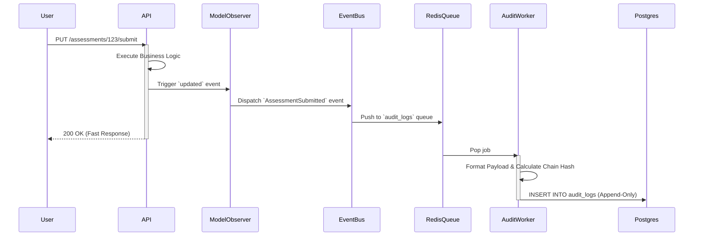

# ACMS — Audit Trail & Forensics Specification

**Document ID**: ACMS-AUDIT-002  
**Version**: 1.0.0  
**Last Updated**: 2026-06-08  
**Status**: Approved  
**Owner**: Security Architect / Data Governance  
**Audience**: Backend developers, Security Auditors, Compliance Officers  
**Related Documents**: PRD.md, ARCHITECTURE.md, DATABASE_SCHEMA.md  
**Regulatory References**: KKI (Konsil Kedokteran Indonesia), LAM-PTKes, UU PDP (Law No. 27/2022 on Personal Data Protection)

---

## Table of Contents
1. [Overview & Objectives](#1-overview--objectives)
2. [Compliance Requirements](#2-compliance-requirements)
3. [Architectural Design](#3-architectural-design)
4. [Data Schema](#4-data-schema)
5. [Tamper-Evident Hash Chaining](#5-tamper-evident-hash-chaining)
6. [Comprehensive Event Catalog](#6-comprehensive-event-catalog)
7. [Payload Specifications](#7-payload-specifications)
8. [Performance & Scalability](#8-performance--scalability)
9. [Archival & Retention Strategy](#9-archival--retention-strategy)
10. [Access Control & Meta-Auditing](#10-access-control--meta-auditing)
11. [Implementation Guidelines](#11-implementation-guidelines)

---

## 1. Overview & Objectives

The Audit Trail module is a mission-critical foundational component of the Academic Clinical Management System (ACMS). In the context of medical education, grades, clinical logbooks, and rotation schedules are considered highly sensitive and legally binding academic records.

### Objectives:
- **Non-repudiation**: Ensure no user can deny performing an action.
- **Forensics**: Allow administrators to reconstruct the exact state of an entity at any point in time.
- **Compliance**: Satisfy rigorous external audits from the Ministry of Education and Medical Councils.
- **Data Privacy**: Track all access to Sensitive Personal Data (PII) to comply with UU PDP.

---

## 2. Compliance Requirements

| Regulation | Requirement | ACMS Implementation |
|------------|-------------|---------------------|
| **UU PDP (Art. 16)** | Must record processing of personal data. | Read-access logging for sensitive modules (e.g., student grades). |
| **LAM-PTKes** | Grade authenticity and transparency. | Strict logging of grade calculation, approval, and modification with before/after payloads. |
| **KKI** | Clinical logbook verification. | Audit trail of preceptor digital signatures and rejection notes. |
| **ISO 27001 (A.12.4)**| Protection of log information. | Tamper-evident hash chaining and append-only database restrictions. |

---

## 3. Architectural Design

To prevent the audit logging process from degrading the performance of core business transactions, the architecture relies on an **Asynchronous Event-Driven Pipeline**.

### 3.1 Event Flow



### 3.2 Design Principles
1. **Fire-and-Forget**: The primary application pushes to Redis and immediately returns the HTTP response.
2. **Event Sourcing (Lite)**: While ACMS is not fully Event Sourced, the `audit_logs` table stores sufficient delta (`old_payload`, `new_payload`) to reconstruct states.
3. **Immutability**: PostgreSQL table-level triggers will reject any `UPDATE` or `DELETE` statements executed against the `audit_logs` table.

---

## 4. Data Schema

The `audit_logs` table is designed to handle millions of rows. It uses UUIDv7 for sequential, time-based sorting to avoid B-Tree index fragmentation.

```sql
CREATE TABLE audit_logs (
    id UUID PRIMARY KEY, -- UUIDv7
    program_id UUID NULL, -- Tenant isolation
    actor_id UUID NULL, -- User who performed the action (NULL for system/cron)
    actor_role VARCHAR(50) NULL, -- Role active during the action
    action VARCHAR(100) NOT NULL, -- Standardized event name
    target_type VARCHAR(100) NOT NULL, -- Polymorphic relation (e.g., 'App\Models\Stase')
    target_id UUID NOT NULL, -- Polymorphic ID
    old_payload JSONB NULL, -- State before transaction
    new_payload JSONB NULL, -- State after transaction
    metadata JSONB NULL, -- Extraneous context (e.g., calculated score delta)
    ip_address INET NULL, -- Client IP
    user_agent TEXT NULL, -- Client Browser/Device
    previous_hash VARCHAR(64) NULL, -- Cryptographic link to previous record
    hash VARCHAR(64) NOT NULL, -- Current record signature
    created_at TIMESTAMP WITH TIME ZONE NOT NULL DEFAULT NOW()
);

-- Indexing Strategy
CREATE INDEX idx_audit_target ON audit_logs(target_type, target_id);
CREATE INDEX idx_audit_actor ON audit_logs(actor_id);
CREATE INDEX idx_audit_action ON audit_logs(action);
CREATE INDEX idx_audit_created_at ON audit_logs(created_at);
```

---

## 5. Tamper-Evident Hash Chaining

To cryptographically prove that audit logs have not been maliciously altered directly in the database (e.g., by a rogue DBA), ACMS implements a lightweight blockchain-style hash chain.

### 5.1 Hashing Algorithm
For each new audit log entry $N$:

$$ Hash_N = SHA256( Hash_{N-1} \parallel Action_N \parallel TargetID_N \parallel ActorID_N \parallel NewPayload_N \parallel Timestamp_N \parallel SecretSalt ) $$

- `Hash_{N-1}` is the `hash` column of the most recently inserted row.
- `SecretSalt` is an application-level secret stored in `.env` (not in the database).

### 5.2 Verification Process
A daily scheduled job (`php artisan audit:verify-chain`) runs during off-peak hours (02:00 WIB) to recalculate the hashes of the previous 24 hours. If a mismatch is found, a high-severity alert is dispatched to the Security Team via email and Slack/WhatsApp webhook.

---

## 6. Comprehensive Event Catalog

Every state transition and critical CRUD operation in the system maps to a standardized action string.

### 6.1 Authentication & Security (`auth.*`, `security.*`)
| Action String | Trigger | Payload Notes |
|---------------|---------|---------------|
| `auth.login.success` | User logs in successfully | Contains SSO provider info |
| `auth.login.failed` | Failed login attempt | Contains failed email/NIM attempts |
| `auth.logout` | User logs out | Session duration |
| `security.role.assigned` | Super Admin grants role | `old`: [], `new`: ['Admin Prodi'] |
| `security.role.revoked` | Super Admin revokes role | |

### 6.2 Academic Management (`academic.*`)
| Action String | Trigger | Payload Notes |
|---------------|---------|---------------|
| `academic.program.created` | New study program added | |
| `academic.stase.updated` | Curriculum changes | e.g., duration changed 4 -> 6 weeks |
| `academic.student.enrolled` | Student batch imported | |
| `academic.student.status_changed` | Active -> Leave | Includes leave reason |

### 6.3 Rotation Engine (`rotation.*`)
| Action String | Trigger | Payload Notes |
|---------------|---------|---------------|
| `rotation.period.published` | Draft schedule goes live | |
| `rotation.assignment.created` | Student assigned to hospital | Includes capacity delta |
| `rotation.assignment.cancelled`| Admin cancels assignment | Reason mandatory |
| `rotation.swap.approved` | Two students swap hospitals | Atomic record for both targets |

### 6.4 Clinical Activities (`clinical.*`)
| Action String | Trigger | Payload Notes |
|---------------|---------|---------------|
| `clinical.logbook.submitted` | Student submits entry | Patient initials, diagnosis |
| `clinical.logbook.signed` | Dodiknis approves | Digital signature timestamp |
| `clinical.logbook.rejected` | Dodiknis requests revision| Rejection feedback text |

### 6.5 Assessment & Grading (`grade.*`, `assessment.*`)
| Action String | Trigger | Payload Notes |
|---------------|---------|---------------|
| `assessment.mini_cex.submitted`| Assessor finalizes rubric | Full JSON rubric scores |
| `grade.stase.calculated` | System aggregates scores | Math formula inputs/outputs |
| `grade.stase.approved` | Kaprodi signs off | |
| `grade.stase.appealed` | Student disputes grade | Appeal justification |
| `grade.stase.adjusted` | Panel changes grade | `old_payload`: {score: 60}, `new`: {score: 75} |

### 6.6 Financial Operations (`finance.*`)
| Action String | Trigger | Payload Notes |
|---------------|---------|---------------|
| `finance.honorarium.calculated`| System calculates payout | Base rate, multiplier, tax |
| `finance.honorarium.approved` | Kaprodi approves batch | |
| `finance.honorarium.disbursed` | Finance completes transfer| Bank Ref Number |

---

## 7. Payload Specifications

To ensure the `JSONB` columns remain searchable and don't bloat infinitely, payloads should only contain **scalar attributes that changed** (Dirty States).

### Example: Stase Grade Adjustment (Appeal)
**Action**: `grade.stase.adjusted`

**`old_payload`**:
```json
{
  "status": "published",
  "final_score": 68.50,
  "letter_grade": "C+"
}
```

**`new_payload`**:
```json
{
  "status": "published",
  "final_score": 75.00,
  "letter_grade": "B+"
}
```

**`metadata`**:
```json
{
  "appeal_id": "01HGW...",
  "panel_members": ["01HGX...", "01HGY..."],
  "justification": "Recalculation due to omitted DOPS assessment from RSUD Moewardi."
}
```

---

## 8. Performance & Scalability

Audit tables grow exponentially. To ensure Postgres performance remains stable over years:

### 8.1 Table Partitioning
The `audit_logs` table will use **PostgreSQL Declarative Partitioning** based on the `created_at` column, partitioned by **Month**.

```sql
CREATE TABLE audit_logs ( ... ) PARTITION BY RANGE (created_at);
CREATE TABLE audit_logs_2026_01 PARTITION OF audit_logs FOR VALUES FROM ('2026-01-01') TO ('2026-02-01');
```
This ensures that querying recent logs (which happens 99% of the time) only scans a small, manageable partition.

### 8.2 Asynchronous Queues
Laravel's Redis Queue handles the writes. During peak load (e.g., bulk logbook approvals at the end of a rotation period), the queue acts as a shock absorber. The `audit-worker` supervisor process will be configured with high concurrency (e.g., `numprocs=5`).

---

## 9. Archival & Retention Strategy

Regulatory frameworks define how long records must be kept.

| Record Type | Retention Requirement | Storage Strategy |
|-------------|-----------------------|------------------|
| Auth Logs | 2 Years | Kept in Postgres for 2 years, then purged. |
| Clinical/Rotation | 5 Years | Partition dropped from Postgres after 2 years. Archived to MinIO. |
| Grades/Assessments| Permanent | Kept in Postgres for 5 years. Archived to MinIO (Cold Storage) permanently. |
| Financial | 10 Years | Kept in Postgres for 3 years. Archived to MinIO. |

### 9.1 Archival Pipeline
A scheduled job runs on the 1st of every month:
1. Identifies partitions older than the hot-storage threshold (e.g., > 2 years).
2. Exports the partition to an encrypted CSV/Parquet file.
3. Uploads the file to the on-premise MinIO cluster.
4. Drops the PostgreSQL partition to reclaim disk space.

---

## 10. Access Control & Meta-Auditing

### 10.1 Read Access
Viewing the Audit Trail is strictly limited to:
- **Super Admin (SA)**: Global view.
- **Kaprodi (KP)**: Scoped view (only events related to their Program).

### 10.2 Meta-Auditing
"Who watches the watchers?" 
When a Kaprodi or Super Admin searches, views, or exports the audit log, that action itself generates an audit log (`audit.viewed`, `audit.exported`).

If a Super Admin executes a data export query, the `metadata` will capture the exact search parameters:
```json
{
  "filters_applied": {
    "target_type": "App\\Models\\StaseGrade",
    "date_range": ["2026-01-01", "2026-06-01"]
  },
  "rows_returned": 450
}
```

---

## 11. Implementation Guidelines

### 11.1 Package Selection
While `spatie/laravel-activitylog` is a popular choice, ACMS will implement a **custom solution** to natively support UUIDv7, PostgreSQL partitioning, and hash-chaining, which are difficult to shoehorn into Spatie's generic package.

### 11.2 Eloquent Traits
Create an `Auditable` trait that automatically registers Eloquent model observers for `created`, `updated`, `deleted`, and `restored` events.

```php
trait Auditable {
    public static function bootAuditable() {
        static::updated(function ($model) {
            AuditDispatcher::dispatch(
                action: 'updated',
                target: $model,
                old: $model->getOriginal(),
                new: $model->getChanges()
            );
        });
    }
}
```

### 11.3 Context Awareness
The `AuditDispatcher` must be able to resolve the current actor and IP from the Laravel Request lifecycle, even when dispatched to a queue. This requires passing the `actor_id`, `ip`, and `user_agent` explicitly into the queued job payload.
