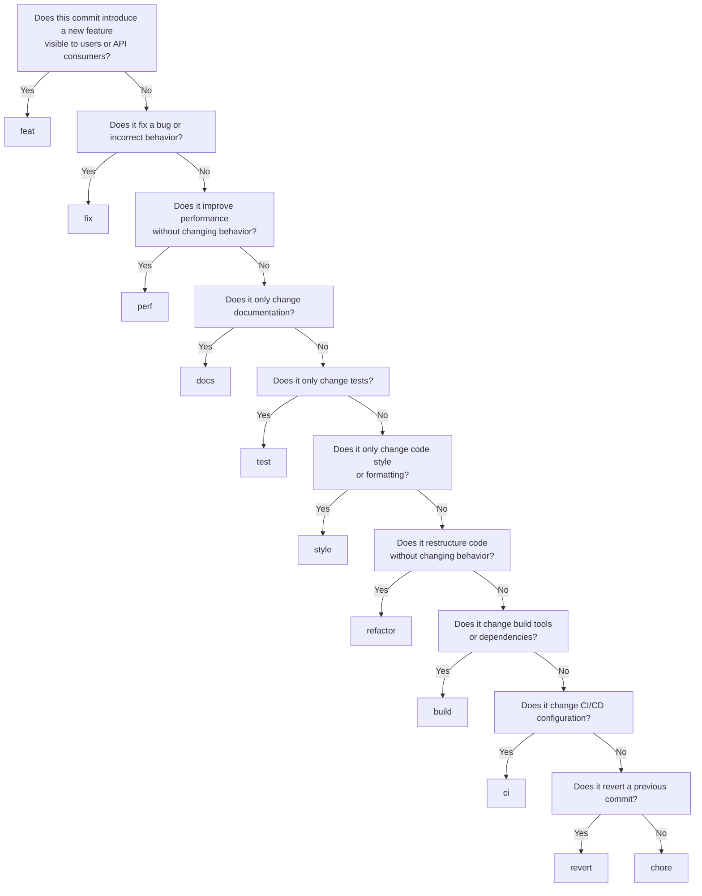
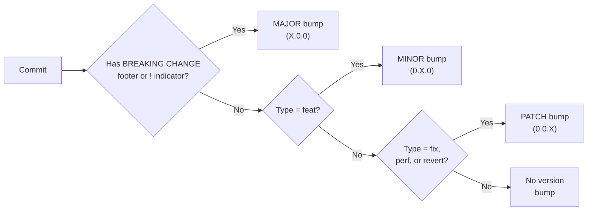
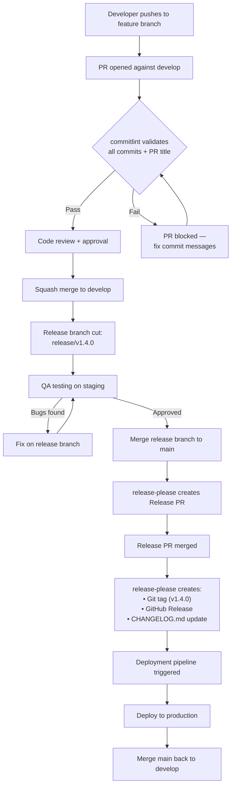

# ACMS Conventional Commits Specification

**Document ID**: ACMS-BUILD-007  
**Version**: 1.0.0  
**Last Updated**: 2026-06-08  
**Status**: Approved  
**Owner**: Engineering Lead  
**Audience**: All contributors (developers, reviewers, DevOps, CI/CD systems)  
**Based On**: [Conventional Commits 1.0.0](https://www.conventionalcommits.org/en/v1.0.0/)

---

## Table of Contents

1. [Overview](#1-overview)
2. [Commit Message Format](#2-commit-message-format)
3. [Types](#3-types)
4. [Scopes](#4-scopes-mapped-to-acms-domains)
5. [Subject Rules](#5-subject-rules)
6. [Body Rules](#6-body-rules)
7. [Footer Rules](#7-footer-rules)
8. [Breaking Changes](#8-breaking-changes)
9. [Examples](#9-examples)
10. [Multi-Line Commit Guidelines](#10-multi-line-commit-guidelines)
11. [Revert Commits](#11-revert-commits)
12. [Merge and Squash Policy](#12-merge-and-squash-policy)
13. [CI Enforcement](#13-ci-enforcement)
14. [Release Automation](#14-release-automation)
15. [Quick Reference Card](#15-quick-reference-card)
16. [Glossary](#16-glossary)

---

## 1. Overview

### 1.1 Purpose

This document defines the mandatory commit message convention for the Academic Clinical Management System (ACMS). Every commit to any ACMS repository **MUST** conform to this specification. Non-conforming commits are automatically rejected by CI enforcement hooks.

### 1.2 Goals

| Goal | Description |
|------|-------------|
| **Automated Changelogs** | Generate `CHANGELOG.md` automatically from commit history using `conventional-changelog` or `release-please` |
| **Semantic Versioning** | Derive the next SemVer version (`MAJOR.MINOR.PATCH`) directly from commit types |
| **Clear History** | Provide a human-readable, searchable, and machine-parseable commit history |
| **Traceability** | Link every change to a scope (domain module), issue number, and change type |
| **CI/CD Integration** | Enable automated release pipelines, deployment gates, and change classification |
| **Code Review** | Help reviewers understand intent before reading code |

### 1.3 Scope of Application

This specification applies to:

- **All branches**: `main`, `develop`, `feature/*`, `fix/*`, `release/*`, `hotfix/*`
- **All repositories**: Frontend (Next.js), Backend (Laravel), Infrastructure, Documentation
- **All contributors**: Internal developers, external contributors, automated bots
- **All commit methods**: Direct commits, squash merges, merge commits, cherry-picks

### 1.4 Specification Basis

This convention extends [Conventional Commits 1.0.0](https://www.conventionalcommits.org/en/v1.0.0/) with ACMS-specific scopes, additional rules for clinical domain traceability, and enforcement tooling integrated into the project's CI/CD pipeline.

---

## 2. Commit Message Format

### 2.1 Structure

Every commit message **MUST** follow this exact structure:

```
<type>(<scope>): <subject>
                                    ← blank line (mandatory if body exists)
[optional body]
                                    ← blank line (mandatory if footer exists)
[optional footer(s)]
```

### 2.2 Component Breakdown

```
feat(rotation): add conflict detection for overlapping stase assignments
│    │          │
│    │          └─ Subject: imperative mood, lowercase, no period, ≤72 chars
│    │
│    └─ Scope: ACMS domain module affected (see §4)
│
└─ Type: category of change (see §3)
```

### 2.3 Formal Grammar (EBNF)

```ebnf
commit      = header, [ "\n\n", body ], [ "\n\n", footer+ ] ;
header      = type, [ "(", scope, ")" ], [ "!" ], ":", " ", subject ;
type        = "feat" | "fix" | "docs" | "style" | "refactor"
            | "perf" | "test" | "build" | "ci" | "chore" | "revert" ;
scope       = letter, { letter | digit | "-" | "/" } ;
subject     = non-empty-text ;        (* ≤72 characters *)
body        = non-empty-text ;        (* wrapped at 80 characters *)
footer      = token, ": ", value
            | token, " #", value ;
token       = "BREAKING CHANGE"       (* exactly this string *)
            | word, { "-", word } ;   (* e.g., Refs, Reviewed-by, Co-authored-by *)
```

### 2.4 Line Length Limits

| Component | Max Length | Enforced By |
|-----------|-----------|-------------|
| Header (entire first line) | 72 characters | commitlint `header-max-length` |
| Body (each line) | 80 characters | commitlint `body-max-line-length` |
| Footer (each line) | 80 characters | commitlint `footer-max-line-length` |

---

## 3. Types

### 3.1 Type Definitions

| Type | Description | SemVer Impact | Appears in CHANGELOG |
|------|-------------|---------------|----------------------|
| `feat` | Introduces a new feature or user-facing capability | **MINOR** bump | ✅ Yes — "Features" |
| `fix` | Fixes a bug, defect, or incorrect behavior | **PATCH** bump | ✅ Yes — "Bug Fixes" |
| `docs` | Documentation-only changes (README, JSDoc, PHPDoc, API docs, markdown) | None | ❌ No |
| `style` | Code style changes that do not affect logic (formatting, whitespace, semicolons, linting fixes) | None | ❌ No |
| `refactor` | Code restructuring with no functional change and no bug fix | None | ❌ No |
| `perf` | Performance improvement without changing external behavior | **PATCH** bump | ✅ Yes — "Performance" |
| `test` | Adding, updating, or fixing tests (no production code change) | None | ❌ No |
| `build` | Changes to build system, tooling, or dependencies (Composer, npm, Vite, Docker) | None | ❌ No |
| `ci` | Changes to CI/CD configuration files and scripts (GitHub Actions, GitLab CI, Husky) | None | ❌ No |
| `chore` | Routine maintenance tasks that don't modify src or test files (`.gitignore`, IDE configs, scripts) | None | ❌ No |
| `revert` | Reverts a previous commit (must reference the reverted commit SHA) | **PATCH** bump | ✅ Yes — "Reverts" |

### 3.2 Type Selection Decision Tree



### 3.3 Type Rules

1. **Only one type per commit.** If a commit contains both a feature and a fix, split it into two commits.
2. **Type MUST be lowercase.** `Feat`, `FEAT`, `FIX` are all invalid.
3. **When in doubt, prefer `refactor` over `feat`.** A change is only `feat` if it adds user-visible or API-visible functionality.
4. **`chore` is the catch-all.** Use it only when no other type applies.

---

## 4. Scopes (Mapped to ACMS Domains)

### 4.1 Domain Scopes

These scopes correspond to ACMS bounded contexts and domain modules as defined in `ARCHITECTURE.md`:

| Scope | Domain Module | Description | Example Entities |
|-------|---------------|-------------|------------------|
| `auth` | Authentication & Authorization | Login, SSO, OAuth2/OIDC, sessions, tokens, RBAC, permissions | User, Role, Permission, Session, Token |
| `academic` | Academic Management | Programs, curricula, courses, semesters, academic calendars | Program, Curriculum, Course, Semester, AcademicPeriod |
| `rotation` | Clinical Rotation | Stase scheduling, hospital assignments, student placement, conflict detection | Rotation, Stase, RotationSlot, HospitalQuota, RotationAssignment |
| `clinical` | Clinical Activities | Logbooks, clinical procedures, patient encounters, skill tracking | Logbook, LogbookEntry, ClinicalProcedure, PatientEncounter, SkillRecord |
| `assessment` | Assessment & Grading | Mini-CEX, DOPS, CBD, competency evaluation, grade calculation | Assessment, MiniCEX, DOPS, CBD, Grade, CompetencyScore |
| `examination` | Examinations | OSCE, written exams, UKMPPD preparation, exam scheduling | Examination, OSCEStation, WrittenExam, ExamResult, UKMPPDPrep |
| `finance` | Financial Operations | Billing, honorarium, payment tracking, financial reporting | Invoice, Payment, Honorarium, BillingCycle, FinancialReport |
| `notification` | Notification System | Email, SMS, push notifications, in-app alerts, notification preferences | Notification, NotificationTemplate, Channel, Preference, DeliveryLog |
| `analytics` | Analytics & Reporting | Dashboards, KPI tracking, report generation, data aggregation | Report, Dashboard, KPI, DataAggregation, ExportJob |
| `audit` | Audit Trail | Immutable event logs, compliance tracking, activity monitoring | AuditLog, AuditEvent, AuditQuery, RetentionPolicy |

### 4.2 Infrastructure Scopes

| Scope | Description | Examples |
|-------|-------------|---------|
| `core` | Shared foundation code — base classes, value objects, domain events, utilities, shared kernel | Base model, shared traits, event bus, helper functions |
| `ui` | Shared UI components — design system, form components, layout, Shadcn/UI customizations | Button, DataTable, FormField, Modal, Layout, ThemeProvider |
| `api` | API-wide concerns — middleware, routing, versioning, request/response formatting, CORS | API middleware, route registration, response transformer, rate limiter |
| `db` | Database — migrations, schema changes, seeders, indexing, query optimization | Migration files, seeder classes, index creation, view definitions |
| `infra` | Infrastructure & deployment — Docker, Nginx, server configuration, environment setup | Dockerfile, docker-compose, Nginx config, deploy scripts |
| `deps` | Dependency management — Composer, npm/pnpm package updates, lock file changes | composer.json, package.json, lock files, dependency patches |

### 4.3 Scope Rules

1. **Scope is optional but strongly recommended.** Omit only for changes that genuinely span the entire system (e.g., global linting rule change).
2. **Scope MUST be lowercase** and use kebab-case if multi-word: `auth`, `rotation`, `ui`.
3. **Use the most specific scope.** If a change touches the rotation scheduling algorithm, use `rotation`, not `core`.
4. **Nested scopes are allowed** using `/` separator for sub-module precision:
   - `assessment/mini-cex` — Change specific to Mini-CEX assessment
   - `examination/osce` — Change specific to OSCE examination
   - `rotation/scheduling` — Change specific to the scheduling algorithm
   - `auth/oauth` — Change specific to OAuth flow
   - `clinical/logbook` — Change specific to logbook module
   - `finance/honorarium` — Change specific to honorarium calculation
5. **Do not invent ad-hoc scopes.** All scopes must be registered in the commitlint configuration (§13.1). To add a new scope, update the configuration and this document via PR.

### 4.4 Scope-to-Directory Mapping

| Scope | Backend Path (Laravel) | Frontend Path (Next.js) |
|-------|------------------------|-------------------------|
| `auth` | `app/Modules/Auth/` | `src/modules/auth/` |
| `academic` | `app/Modules/Academic/` | `src/modules/academic/` |
| `rotation` | `app/Modules/Rotation/` | `src/modules/rotation/` |
| `clinical` | `app/Modules/Clinical/` | `src/modules/clinical/` |
| `assessment` | `app/Modules/Assessment/` | `src/modules/assessment/` |
| `examination` | `app/Modules/Examination/` | `src/modules/examination/` |
| `finance` | `app/Modules/Finance/` | `src/modules/finance/` |
| `notification` | `app/Modules/Notification/` | `src/modules/notification/` |
| `analytics` | `app/Modules/Analytics/` | `src/modules/analytics/` |
| `audit` | `app/Modules/Audit/` | `src/modules/audit/` |
| `core` | `app/Core/` | `src/core/` |
| `ui` | N/A | `src/components/ui/` |
| `api` | `app/Http/`, `routes/` | `src/lib/api/` |
| `db` | `database/` | N/A |
| `infra` | `docker/`, `deploy/` | `docker/`, `deploy/` |
| `deps` | `composer.json`, `composer.lock` | `package.json`, `pnpm-lock.yaml` |

---

## 5. Subject Rules

The subject is the concise description on the header line, immediately following the colon and space.

### 5.1 Mandatory Rules

| Rule | Correct ✅ | Incorrect ❌ |
|------|-----------|-------------|
| **Imperative mood** — write as a command | `add validation for stase overlap` | `added validation...` / `adds validation...` / `adding validation...` |
| **Lowercase first letter** — no capital start | `update rotation query performance` | `Update rotation query performance` |
| **No period at end** — no trailing punctuation | `fix grade calculation rounding error` | `fix grade calculation rounding error.` |
| **Max 72 characters** — entire header line | `feat(rotation): add conflict detection` | `feat(rotation): add a comprehensive conflict detection system for all clinical rotation scheduling scenarios` |
| **No issue numbers in subject** — use footer | `fix null pointer in assessment form` | `fix null pointer in assessment form (#234)` |

### 5.2 Imperative Mood Test

The subject should complete this sentence naturally:

> **"If applied, this commit will \<subject\>."**

| Test | Subject | Natural? |
|------|---------|----------|
| ✅ | `add rotation conflict validator` | "If applied, this commit will **add rotation conflict validator**." |
| ✅ | `remove deprecated assessment API endpoint` | "If applied, this commit will **remove deprecated assessment API endpoint**." |
| ✅ | `fix OSCE score calculation overflow` | "If applied, this commit will **fix OSCE score calculation overflow**." |
| ❌ | `added rotation conflict validator` | "If applied, this commit will **added rotation conflict validator**." ← unnatural |
| ❌ | `fixes OSCE score calculation` | "If applied, this commit will **fixes OSCE score calculation**." ← unnatural |

### 5.3 Common Imperative Verbs

| Action | Verb | Example |
|--------|------|---------|
| Create | `add`, `create`, `introduce`, `implement` | `add Mini-CEX submission workflow` |
| Modify | `update`, `change`, `modify`, `adjust`, `revise` | `update honorarium calculation formula` |
| Remove | `remove`, `delete`, `drop`, `deprecate` | `remove legacy rotation assignment endpoint` |
| Fix | `fix`, `correct`, `resolve`, `patch` | `fix timezone handling in exam scheduling` |
| Improve | `improve`, `optimize`, `enhance`, `simplify` | `optimize rotation query with index hints` |
| Move | `move`, `rename`, `relocate`, `extract` | `extract grade calculation into service class` |
| Enforce | `enforce`, `validate`, `restrict`, `require` | `enforce stase prerequisite check` |

---

## 6. Body Rules

The body provides additional context about _what_ changed and _why_ it changed.

### 6.1 Rules

| Rule | Description |
|------|-------------|
| **Blank line separator** | There **MUST** be exactly one blank line between the subject and body |
| **Wrap at 80 characters** | Each line in the body **MUST NOT** exceed 80 characters |
| **Explain what and why** | Describe the motivation and context, not the implementation details |
| **Do not explain how** | The diff shows _how_; the body explains _why_ the diff exists |
| **Use bullet points** | For multiple related points, use `-` bullet points |
| **Reference domain rules** | When relevant, reference business rules, regulatory requirements, or architectural decisions |

### 6.2 Body Templates

#### For Bug Fixes

```
fix(assessment): correct Mini-CEX score aggregation for partial entries

The previous implementation averaged all rubric scores including
ungraded items (score = 0), deflating the final competency score.
Ungraded items must be excluded from the calculation per KKI
assessment guidelines.

This caused students with partially completed Mini-CEX evaluations
to receive artificially low scores during the Pediatrics rotation.
```

#### For Features

```
feat(rotation): add automatic waitlist management for full stase slots

When a stase assignment reaches hospital capacity, students are now
placed on a priority waitlist instead of receiving an error. The
waitlist is ordered by:
  1. Academic seniority (earlier cohort first)
  2. Prerequisite completion date
  3. Registration timestamp

When a slot opens (cancellation or capacity increase), the next
eligible student is automatically assigned and notified.
```

#### For Refactors

```
refactor(core): extract event dispatcher into standalone service

The event dispatcher was tightly coupled to the Laravel service
container, making it impossible to unit test domain event handlers
without bootstrapping the entire framework.

Extracting it into a standalone service with a clear interface
(EventDispatcherInterface) aligns with the Clean Architecture
boundary rules defined in ADR-001.
```

---

## 7. Footer Rules

Footers provide structured metadata. Each footer occupies a separate line in the format `Token: Value` or `Token #Value`.

### 7.1 Standard Footers

| Footer | Format | Purpose | Required? |
|--------|--------|---------|-----------|
| `BREAKING CHANGE` | `BREAKING CHANGE: <description>` | Signals a breaking API or behavior change — triggers **MAJOR** version bump | Required when breaking |
| `Refs` | `Refs: #<issue-number>` | References related issue(s) without closing them | Optional |
| `Closes` | `Closes #<issue-number>` | Closes the referenced issue upon merge | Optional |
| `Fixes` | `Fixes #<issue-number>` | Closes a bug issue upon merge | Optional |
| `Reviewed-by` | `Reviewed-by: <Name> <email>` | Records the code reviewer | Optional |
| `Co-authored-by` | `Co-authored-by: <Name> <email>` | Credits co-authors (GitHub standard) | Optional |
| `See-also` | `See-also: #<issue-number>` | References related but non-blocking issues | Optional |
| `Supersedes` | `Supersedes: <commit-sha>` | Indicates this commit replaces a previous one | Optional |
| `ADR` | `ADR: ADR-<number>` | References an Architecture Decision Record | Optional |

### 7.2 Footer Rules

1. **One footer per line.** Do not combine multiple footers on a single line.
2. **Blank line separator.** There **MUST** be exactly one blank line between the body (or subject, if no body) and the first footer.
3. **`BREAKING CHANGE` MUST be uppercase.** `breaking change`, `Breaking Change`, or `Breaking-Change` are all invalid.
4. **`BREAKING CHANGE` can also be indicated with `!`** after the scope in the header: `feat(api)!: change response format`. Both the `!` and the `BREAKING CHANGE` footer are valid; when using `!`, a `BREAKING CHANGE` footer with details is still recommended.
5. **Multiple footers are allowed:**

```
Closes #142
Refs: #98, #101
Reviewed-by: Dr. Ahmad <ahmad@ums.ac.id>
ADR: ADR-011
```

---

## 8. Breaking Changes

### 8.1 What Constitutes a Breaking Change

A breaking change is any modification that requires consumers (other modules, API clients, or users) to change their code, configuration, or behavior. In the ACMS context:

| Breaking Change Category | Example |
|--------------------------|---------|
| API response structure change | Changing assessment score from `number` to `{value: number, scale: string}` |
| API endpoint removal or rename | Removing `/api/v1/rotations` in favor of `/api/v2/rotation-assignments` |
| Required field addition | Adding `preceptor_id` as required to the rotation assignment request |
| Database schema change (non-additive) | Renaming `stase_id` column to `rotation_type_id` |
| Authentication flow change | Changing from cookie-based to bearer token authentication |
| Permission model change | Splitting `manage-rotations` into `create-rotation` and `assign-rotation` |
| Domain event payload change | Changing `RotationAssigned` event from flat to nested structure |
| Configuration key change | Renaming `ACMS_ROTATION_MAX_CAPACITY` to `ROTATION_SLOT_LIMIT` |

### 8.2 Breaking Change Format

**Method 1: `!` indicator in header + footer detail**

```
feat(api)!: restructure assessment response payload

The assessment API response now uses a nested structure with
separate sections for scores, feedback, and metadata. This
improves consistency across Mini-CEX, DOPS, and CBD responses.

BREAKING CHANGE: The /api/v1/assessments/{id} response payload
has changed. The flat `score`, `feedback`, and `assessor_name`
fields are now nested under `result.scores`, `result.feedback`,
and `meta.assessor` respectively. All API consumers must update
their response parsing. See migration guide in docs/api-v2.md.

Refs: #312
ADR: ADR-009
```

**Method 2: `BREAKING CHANGE` footer only**

```
refactor(db): rename stase tables to use rotation terminology

BREAKING CHANGE: The `stase_assignments` table has been renamed
to `rotation_assignments`. The `stase_id` column is now
`rotation_type_id`. Run migration 2026_06_08_rename_stase_tables
to update. All queries referencing the old table/column names
must be updated.
```

### 8.3 SemVer Impact Summary



---

## 9. Examples

### 9.1 Simple Feature — No Body

```
feat(rotation): add stase prerequisite validation
```

### 9.2 Feature with Body and Footer

```
feat(assessment): implement Mini-CEX digital submission form

Add a multi-step form for clinical preceptors (Dodiknis) to
submit Mini-CEX assessments directly from mobile devices. The
form includes:
- Patient encounter context (setting, complexity)
- 7-domain competency scoring (1-9 Likert scale)
- Free-text feedback with minimum character requirement
- Digital signature capture

The form validates against KKI competency standards and
prevents submission of incomplete evaluations.

Closes #187
Refs: #142, #156
```

### 9.3 Bug Fix with Root Cause Explanation

```
fix(rotation): prevent double-booking of hospital slots

Students could be assigned to the same hospital slot twice if
two Admin Prodi users submitted assignments concurrently. The
race condition occurred because the capacity check and the
insert were not wrapped in a database transaction with a
row-level lock.

Added SELECT FOR UPDATE on the rotation_slots table within
a serializable transaction to guarantee atomicity.

Fixes #203
```

### 9.4 Documentation Change

```
docs(api): add OpenAPI schema for assessment endpoints
```

### 9.5 Style Change — Formatting Only

```
style(clinical): apply Pint formatting to logbook service classes
```

### 9.6 Refactor with ADR Reference

```
refactor(core): migrate event bus from sync to async dispatch

Domain events are now dispatched through Redis Queue instead of
synchronous in-process handlers. This decouples event producers
from consumers, improving response times for write operations.

Synchronous dispatch is retained for events requiring immediate
consistency (e.g., RotationCapacityExceeded).

ADR: ADR-008
Refs: #267
```

### 9.7 Performance Improvement

```
perf(analytics): add composite index for rotation summary queries

The dashboard rotation summary query was performing a sequential
scan on 50,000+ rotation_assignments rows. Adding a composite
index on (program_id, academic_period_id, status) reduces query
time from ~2.4s to ~45ms.

Refs: #298
```

### 9.8 Test Addition

```
test(assessment): add unit tests for DOPS score normalization

Cover edge cases:
- All rubric items scored (normal path)
- Partial scoring with N/A items excluded
- Minimum passing threshold boundary
- Score rounding to 2 decimal places
```

### 9.9 Build System Change

```
build(deps): upgrade Laravel framework from 12.1 to 12.2

Includes security patch for session fixation vulnerability
(CVE-2026-XXXXX) and performance improvements to Eloquent
query builder.
```

### 9.10 CI Configuration Change

```
ci: add PHPStan level 8 analysis to GitHub Actions pipeline
```

### 9.11 Chore — Maintenance Task

```
chore: update .gitignore to exclude MinIO local data directory
```

### 9.12 Revert with Original Reference

```
revert(rotation): revert "add automatic waitlist management"

This reverts commit a1b2c3d4e5f6. The waitlist feature caused
a deadlock when processing concurrent slot releases during the
Surgery rotation transition period. Rolling back until the
concurrency issue is resolved.

Refs: #334
```

### 9.13 Breaking Change — API Restructure

```
feat(api)!: version assessment endpoints under /api/v2

All assessment endpoints have been moved from /api/v1/assessments
to /api/v2/assessments with a restructured response format.
The v1 endpoints remain available but are deprecated and will
be removed in ACMS 3.0.0.

BREAKING CHANGE: API consumers using /api/v1/assessments/* must
migrate to /api/v2/assessments/* by 2026-09-01. Response payload
uses the new envelope format: { data, meta, links }. See the
migration guide at docs/api-v1-to-v2.md.

Closes #301
ADR: ADR-009
```

### 9.14 Database Migration

```
feat(db): add examination_results table for OSCE scoring

Create the examination_results table to store structured OSCE
station scores. Supports multiple scoring rubrics per station
and links results to both the examiner (Dosen) and the student
(Mahasiswa).

Includes indexes for:
- (examination_id, student_id) — unique constraint
- (examiner_id) — for examiner workload queries
- (station_id, score) — for station difficulty analysis

Refs: #245
```

### 9.15 Multi-Scope Notification Feature

```
feat(notification): add real-time rotation assignment alerts

Students now receive immediate push notifications when assigned
to a new clinical rotation. Notifications include:
- Hospital name and department
- Start and end dates
- Assigned preceptor (Dodiknis) name and contact
- Required pre-rotation checklist link

Delivery channels: in-app (WebSocket), email, and optional SMS
for students who have enabled SMS preferences.

Closes #178
Refs: #134, #156
Reviewed-by: Dr. Sari <sari@ums.ac.id>
```

### 9.16 Finance Domain Feature

```
feat(finance): implement monthly honorarium calculation engine

Calculate Dodiknis honorarium based on:
- Number of students supervised per stase
- Assessment submissions completed (Mini-CEX, DOPS, CBD)
- Clinical teaching hours logged
- Hospital tier multiplier

Amounts are rounded to the nearest IDR 1,000 and include
tax withholding (PPh 21) calculation.

Closes #256
Refs: #198
```

### 9.17 Audit Trail Enhancement

```
feat(audit): add immutable audit log for grade modifications

All grade changes now produce an append-only audit record
capturing: previous value, new value, modifier identity,
timestamp, IP address, and justification text.

Grade audit records cannot be soft-deleted and are excluded
from the standard data purge lifecycle per medical education
record-keeping requirements (KKI Regulation).

Closes #289
ADR: ADR-012
```

---

## 10. Multi-Line Commit Guidelines

### 10.1 When to Include a Body

| Situation | Body Required? |
|-----------|---------------|
| Simple, self-explanatory change | ❌ No — subject is sufficient |
| Bug fix with non-obvious root cause | ✅ Yes — explain the root cause |
| Feature with business logic | ✅ Yes — explain the business rules |
| Refactor changing architecture | ✅ Yes — explain motivation |
| Breaking change | ✅ Yes — explain migration path |
| Performance improvement | ✅ Yes — include before/after metrics |
| Any change touching clinical data or patient safety | ✅ Yes — explain compliance rationale |

### 10.2 Commit Message Template

Configure Git to use a commit template for consistency:

```bash
# Set the template globally
git config --global commit.template .gitmessage

# Or per-repository
git config commit.template .gitmessage
```

**`.gitmessage` template file:**

```
# <type>(<scope>): <subject>  [max 72 chars]
#
# Explain WHAT changed and WHY (not how). Wrap at 80 chars.
#
#
# Footer(s):
# BREAKING CHANGE: <description>
# Closes #<issue>
# Refs: #<issue>
# Reviewed-by: <name> <email>
# ADR: ADR-<number>
#
# --- TYPES ---
# feat:     New feature                    → MINOR version bump
# fix:      Bug fix                        → PATCH version bump
# docs:     Documentation only             → No version bump
# style:    Formatting, whitespace         → No version bump
# refactor: Code restructuring             → No version bump
# perf:     Performance improvement        → PATCH version bump
# test:     Adding/updating tests          → No version bump
# build:    Build system/dependencies      → No version bump
# ci:       CI/CD configuration            → No version bump
# chore:    Maintenance tasks              → No version bump
# revert:   Revert a previous commit       → PATCH version bump
#
# --- SCOPES ---
# auth, academic, rotation, clinical, assessment, examination,
# finance, notification, analytics, audit, core, ui, api, db,
# infra, deps
```

---

## 11. Revert Commits

### 11.1 Format

Revert commits **MUST** follow this format:

```
revert(<original-scope>): revert "<original-subject>"

This reverts commit <full-SHA>.

<Explanation of why the revert is necessary>

Refs: #<issue>
```

### 11.2 Rules

1. **The subject MUST include the original commit's subject** in quotes.
2. **The body MUST include the full SHA** of the reverted commit.
3. **The body SHOULD explain why** the revert was necessary.
4. **The scope SHOULD match** the original commit's scope.
5. **Reverting a revert** is allowed — treat it as a new `feat` or `fix`.

---

## 12. Merge and Squash Policy

### 12.1 Branch Merge Strategy

| Target Branch | Merge Strategy | Commit Message Rule |
|---------------|---------------|---------------------|
| `main` ← `release/*` | **Merge commit** (no fast-forward) | Merge commit auto-generated; individual commits must all comply |
| `main` ← `hotfix/*` | **Merge commit** (no fast-forward) | Merge commit auto-generated; hotfix commit must comply |
| `develop` ← `feature/*` | **Squash merge** | Squashed commit message **MUST** be conventional format |
| `develop` ← `fix/*` | **Squash merge** | Squashed commit message **MUST** be conventional format |
| `release/*` ← `develop` | **Merge commit** (no fast-forward) | Merge commit auto-generated |

### 12.2 Squash Merge Rules

When squash-merging a feature branch:

1. **The squash commit message MUST follow this specification.** The individual WIP commits on the feature branch are discarded.
2. **The PR title MUST be in conventional commit format** — many CI tools use the PR title as the squash commit message.
3. **Include all relevant issue references** in the squash commit footer.

**Example PR title (becomes squash commit subject):**

```
feat(rotation): implement constraint-based scheduling algorithm
```

### 12.3 WIP Commits on Feature Branches

While working on a feature branch, developers **MAY** use informal commit messages (e.g., `wip`, `checkpoint`, `fixup`) as long as the branch will be squash-merged. However, following conventional format even on feature branches is **recommended** for better `git log` readability.

---

## 13. CI Enforcement

### 13.1 commitlint Configuration

All commits are validated by [commitlint](https://commitlint.js.org/) using the `@commitlint/config-conventional` preset with ACMS-specific overrides.

**`commitlint.config.js`** (project root):

```javascript
// commitlint.config.js
// ACMS Conventional Commit Enforcement
// Based on: @commitlint/config-conventional
// See: Build/CONVENTIONAL_COMMITS.md

module.exports = {
  extends: ['@commitlint/config-conventional'],
  rules: {
    // --- Header ---
    'header-max-length': [2, 'always', 72],
    'header-min-length': [2, 'always', 10],

    // --- Type ---
    'type-enum': [
      2,
      'always',
      [
        'feat',
        'fix',
        'docs',
        'style',
        'refactor',
        'perf',
        'test',
        'build',
        'ci',
        'chore',
        'revert',
      ],
    ],
    'type-case': [2, 'always', 'lower-case'],
    'type-empty': [2, 'never'],

    // --- Scope ---
    'scope-enum': [
      2,
      'always',
      [
        // Domain scopes
        'auth',
        'academic',
        'rotation',
        'clinical',
        'assessment',
        'examination',
        'finance',
        'notification',
        'analytics',
        'audit',
        // Infrastructure scopes
        'core',
        'ui',
        'api',
        'db',
        'infra',
        'deps',
        // Nested scopes (registered explicitly)
        'assessment/mini-cex',
        'assessment/dops',
        'assessment/cbd',
        'examination/osce',
        'examination/written',
        'examination/ukmppd',
        'rotation/scheduling',
        'rotation/assignment',
        'clinical/logbook',
        'clinical/procedure',
        'auth/oauth',
        'auth/rbac',
        'finance/honorarium',
        'finance/billing',
        'notification/email',
        'notification/sms',
        'notification/push',
      ],
    ],
    'scope-case': [2, 'always', 'lower-case'],
    'scope-empty': [1, 'never'], // Warning (not error) if missing

    // --- Subject ---
    'subject-case': [2, 'always', 'lower-case'],
    'subject-empty': [2, 'never'],
    'subject-full-stop': [2, 'never', '.'],
    'subject-min-length': [2, 'always', 5],

    // --- Body ---
    'body-max-line-length': [2, 'always', 80],
    'body-leading-blank': [2, 'always'],

    // --- Footer ---
    'footer-max-line-length': [2, 'always', 80],
    'footer-leading-blank': [2, 'always'],

    // --- General ---
    'signed-off-by': [0, 'always', 'Signed-off-by:'],
  },
};
```

### 13.2 Husky Git Hooks

[Husky](https://typicode.github.io/husky/) is used to enforce commit message validation locally before commits reach the remote repository.

**Installation and setup:**

```bash
# Install dependencies
npm install --save-dev husky @commitlint/cli @commitlint/config-conventional

# Initialize Husky
npx husky init

# Create commit-msg hook
echo 'npx --no -- commitlint --edit "$1"' > .husky/commit-msg
chmod +x .husky/commit-msg
```

**`.husky/commit-msg`:**

```bash
#!/usr/bin/env sh
. "$(dirname -- "$0")/_/husky.sh"

# Validate commit message against ACMS conventional commit rules
npx --no -- commitlint --edit "$1"

# Exit code 1 = commit rejected with error message
# Exit code 0 = commit accepted
```

**`.husky/pre-commit`** (additional quality gates):

```bash
#!/usr/bin/env sh
. "$(dirname -- "$0")/_/husky.sh"

# Run lint-staged for code quality checks before commit
npx lint-staged
```

### 13.3 GitHub Actions Workflow

Commit messages are also validated in the CI pipeline as a second layer of defense, catching commits pushed via `--no-verify` or from contributors who haven't set up local hooks.

**`.github/workflows/commitlint.yml`:**

```yaml
name: Commit Lint

on:
  pull_request:
    branches: [main, develop, 'release/**']
  push:
    branches: [develop]

permissions:
  contents: read
  pull-requests: read

jobs:
  commitlint:
    name: Validate Commit Messages
    runs-on: ubuntu-latest
    timeout-minutes: 5

    steps:
      - name: Checkout repository
        uses: actions/checkout@v4
        with:
          fetch-depth: 0  # Full history for commitlint range

      - name: Setup Node.js
        uses: actions/setup-node@v4
        with:
          node-version: '22'
          cache: 'npm'

      - name: Install commitlint
        run: |
          npm install --save-dev \
            @commitlint/cli \
            @commitlint/config-conventional

      - name: Validate commits (PR)
        if: github.event_name == 'pull_request'
        run: |
          npx commitlint \
            --from ${{ github.event.pull_request.base.sha }} \
            --to ${{ github.event.pull_request.head.sha }} \
            --verbose

      - name: Validate commits (Push)
        if: github.event_name == 'push'
        run: |
          npx commitlint \
            --from ${{ github.event.before }} \
            --to ${{ github.event.after }} \
            --verbose

  pr-title:
    name: Validate PR Title
    runs-on: ubuntu-latest
    if: github.event_name == 'pull_request'
    timeout-minutes: 5

    steps:
      - name: Checkout repository
        uses: actions/checkout@v4

      - name: Setup Node.js
        uses: actions/setup-node@v4
        with:
          node-version: '22'
          cache: 'npm'

      - name: Install commitlint
        run: |
          npm install --save-dev \
            @commitlint/cli \
            @commitlint/config-conventional

      - name: Validate PR title as conventional commit
        run: |
          echo "${{ github.event.pull_request.title }}" | \
            npx commitlint --verbose
```

### 13.4 GitLab CI Configuration (Alternative)

For teams using GitLab instead of GitHub:

**`.gitlab-ci.yml`** (commitlint job):

```yaml
commitlint:
  stage: lint
  image: node:22-alpine
  rules:
    - if: '$CI_PIPELINE_SOURCE == "merge_request_event"'
    - if: '$CI_COMMIT_BRANCH == "develop"'
  before_script:
    - npm install --save-dev @commitlint/cli @commitlint/config-conventional
  script:
    - |
      if [ -n "$CI_MERGE_REQUEST_DIFF_BASE_SHA" ]; then
        npx commitlint \
          --from "$CI_MERGE_REQUEST_DIFF_BASE_SHA" \
          --to "HEAD" \
          --verbose
      else
        echo "$CI_COMMIT_MESSAGE" | npx commitlint --verbose
      fi
  tags:
    - docker
```

### 13.5 Rejection Policy

| Violation | Severity | Action |
|-----------|----------|--------|
| Invalid or missing type | 🔴 Error | Commit rejected locally by Husky; PR blocked by CI |
| Unknown scope (not in allowed list) | 🔴 Error | Commit rejected |
| Subject starts with uppercase | 🔴 Error | Commit rejected |
| Subject ends with period | 🔴 Error | Commit rejected |
| Header exceeds 72 characters | 🔴 Error | Commit rejected |
| Body line exceeds 80 characters | 🔴 Error | Commit rejected |
| Missing blank line before body | 🔴 Error | Commit rejected |
| Missing blank line before footer | 🔴 Error | Commit rejected |
| Missing scope | ⚠️ Warning | Commit allowed with warning; reviewer should request scope |
| PR title not in conventional format | 🔴 Error | PR cannot be merged (squash merge uses PR title) |

### 13.6 Bypassing Enforcement (Emergency Only)

In rare emergency situations (production hotfix with broken CI), commits may bypass validation:

```bash
# Local bypass (skips Husky hooks)
git commit --no-verify -m "fix(auth): patch critical SSO token leak"

# The commit MUST still follow conventional format manually
# CI validation on the PR will still enforce the rules
```

> [!CAUTION]
> Using `--no-verify` is auditable. The CI pipeline will still validate the commit message when the PR is opened. Reserve this for genuine emergencies only.

---

## 14. Release Automation

### 14.1 How Commits Drive Semantic Versioning

ACMS uses [Semantic Versioning 2.0.0](https://semver.org/) with the version format `MAJOR.MINOR.PATCH`:

| Commit Characteristic | Version Bump | Example |
|-----------------------|-------------|---------|
| Any commit with `BREAKING CHANGE` footer or `!` indicator | **MAJOR** (X.0.0) | `1.3.7` → `2.0.0` |
| `feat` type (without breaking change) | **MINOR** (0.X.0) | `1.3.7` → `1.4.0` |
| `fix`, `perf`, or `revert` type (without breaking change) | **PATCH** (0.0.X) | `1.3.7` → `1.3.8` |
| `docs`, `style`, `refactor`, `test`, `build`, `ci`, `chore` | **No bump** | `1.3.7` → `1.3.7` |
| Multiple types in one release | **Highest wins** | feat + fix → MINOR |

### 14.2 CHANGELOG.md Auto-Generation

The `CHANGELOG.md` file is automatically generated from conventional commit messages using [conventional-changelog](https://github.com/conventional-changelog/conventional-changelog) or [release-please](https://github.com/googleapis/release-please).

**Generated CHANGELOG structure:**

```markdown
# Changelog

## [1.4.0] - 2026-07-15

### ⚠ BREAKING CHANGES

* **api:** assessment response payload restructured (#312)

### Features

* **rotation:** add constraint-based scheduling algorithm (#278)
* **assessment:** implement Mini-CEX digital submission form (#187)
* **notification:** add real-time rotation assignment alerts (#178)
* **finance:** implement monthly honorarium calculation engine (#256)

### Bug Fixes

* **rotation:** prevent double-booking of hospital slots (#203)
* **assessment:** correct Mini-CEX score aggregation (#195)

### Performance Improvements

* **analytics:** add composite index for rotation summary queries (#298)

## [1.3.7] - 2026-06-20

### Bug Fixes

* **auth:** fix session timeout not redirecting to SSO (#167)
* **clinical:** fix logbook entry duplication on retry (#172)
```

### 14.3 Release-Please Configuration

ACMS uses [release-please](https://github.com/googleapis/release-please) for automated release management.

**`release-please-config.json`** (project root):

```json
{
  "$schema": "https://raw.githubusercontent.com/googleapis/release-please/main/schemas/config.json",
  "release-type": "node",
  "bump-minor-pre-major": true,
  "bump-patch-for-minor-pre-major": false,
  "include-component-in-tag": false,
  "include-v-in-tag": true,
  "changelog-sections": [
    { "type": "feat", "section": "Features" },
    { "type": "fix", "section": "Bug Fixes" },
    { "type": "perf", "section": "Performance Improvements" },
    { "type": "revert", "section": "Reverts" },
    { "type": "docs", "section": "Documentation", "hidden": true },
    { "type": "style", "section": "Styles", "hidden": true },
    { "type": "refactor", "section": "Code Refactoring", "hidden": true },
    { "type": "test", "section": "Tests", "hidden": true },
    { "type": "build", "section": "Build System", "hidden": true },
    { "type": "ci", "section": "Continuous Integration", "hidden": true },
    { "type": "chore", "section": "Miscellaneous Chores", "hidden": true }
  ]
}
```

**`.release-please-manifest.json`:**

```json
{
  ".": "1.0.0"
}
```

### 14.4 GitHub Actions Release Workflow

**`.github/workflows/release.yml`:**

```yaml
name: Release

on:
  push:
    branches: [main]

permissions:
  contents: write
  pull-requests: write

jobs:
  release-please:
    name: Create Release
    runs-on: ubuntu-latest
    timeout-minutes: 10

    outputs:
      release_created: ${{ steps.release.outputs.release_created }}
      tag_name: ${{ steps.release.outputs.tag_name }}
      version: ${{ steps.release.outputs.version }}

    steps:
      - name: Run release-please
        id: release
        uses: googleapis/release-please-action@v4
        with:
          release-type: node
          config-file: release-please-config.json
          manifest-file: .release-please-manifest.json

  deploy-staging:
    name: Deploy to Staging
    needs: release-please
    if: needs.release-please.outputs.release_created == 'true'
    runs-on: ubuntu-latest
    environment: staging
    timeout-minutes: 15

    steps:
      - name: Checkout tag
        uses: actions/checkout@v4
        with:
          ref: ${{ needs.release-please.outputs.tag_name }}

      - name: Deploy to staging
        run: |
          echo "Deploying ACMS ${{ needs.release-please.outputs.version }}"
          # Deployment commands here
```

### 14.5 Release Tagging Strategy

| Tag Format | Usage | Example |
|------------|-------|---------|
| `v{MAJOR}.{MINOR}.{PATCH}` | Production releases | `v1.4.0` |
| `v{MAJOR}.{MINOR}.{PATCH}-rc.{N}` | Release candidates | `v1.4.0-rc.1` |
| `v{MAJOR}.{MINOR}.{PATCH}-beta.{N}` | Beta pre-releases | `v1.4.0-beta.3` |
| `v{MAJOR}.{MINOR}.{PATCH}-alpha.{N}` | Alpha pre-releases | `v1.4.0-alpha.1` |

**Tag creation rules:**

1. Tags are **created automatically** by release-please when a release PR is merged to `main`.
2. Tags are **never created manually** — all releases flow through the automated pipeline.
3. Tags follow [SemVer 2.0.0](https://semver.org/) with a `v` prefix.
4. Release candidates are created from `release/*` branches for UAT testing.
5. Each tag triggers the deployment pipeline for the appropriate environment.

### 14.6 Release Lifecycle Flow



---

## 15. Quick Reference Card

### 15.1 Cheat Sheet

```
┌─────────────────────────────────────────────────────────┐
│  ACMS CONVENTIONAL COMMIT QUICK REFERENCE               │
├─────────────────────────────────────────────────────────┤
│                                                         │
│  FORMAT:                                                │
│  <type>(<scope>): <subject>                             │
│                                                         │
│  TYPES:          SEMVER:    CHANGELOG:                   │
│  feat            MINOR      ✅ Features                  │
│  fix             PATCH      ✅ Bug Fixes                 │
│  perf            PATCH      ✅ Performance               │
│  revert          PATCH      ✅ Reverts                   │
│  docs            —          ❌                           │
│  style           —          ❌                           │
│  refactor        —          ❌                           │
│  test            —          ❌                           │
│  build           —          ❌                           │
│  ci              —          ❌                           │
│  chore           —          ❌                           │
│                                                         │
│  SCOPES (domain):                                       │
│  auth, academic, rotation, clinical, assessment,        │
│  examination, finance, notification, analytics, audit   │
│                                                         │
│  SCOPES (infra):                                        │
│  core, ui, api, db, infra, deps                         │
│                                                         │
│  SUBJECT: imperative · lowercase · no period · ≤72ch    │
│  BODY: what & why · wrap 80ch · blank line before       │
│  FOOTER: BREAKING CHANGE · Refs · Closes · Reviewed-by  │
│                                                         │
│  BREAKING CHANGE → MAJOR version bump                   │
│  feat!(...): or BREAKING CHANGE: footer                  │
│                                                         │
└─────────────────────────────────────────────────────────┘
```

### 15.2 Common Patterns

```bash
# Simple feature
git commit -m "feat(rotation): add stase prerequisite validation"

# Bug fix with issue reference
git commit -m "fix(assessment): correct score rounding in Mini-CEX

Round to 2 decimal places instead of truncating.

Fixes #203"

# Breaking change
git commit -m "feat(api)!: change pagination format to cursor-based

BREAKING CHANGE: offset-based pagination removed from all list
endpoints. Use cursor parameter instead of page/per_page."

# Dependencies update
git commit -m "build(deps): upgrade Shadcn/UI to 2.1.0"

# Database migration
git commit -m "feat(db): add patient_encounters table for clinical logging"
```

---

## 16. Glossary

| Term | Definition |
|------|------------|
| **Conventional Commits** | A specification for adding human- and machine-readable meaning to commit messages |
| **SemVer** | Semantic Versioning — a versioning scheme using `MAJOR.MINOR.PATCH` format |
| **commitlint** | A tool to lint commit messages against a configured set of rules |
| **Husky** | A tool for managing Git hooks in a JavaScript/Node.js project |
| **release-please** | A Google-maintained tool that automates CHANGELOG generation and release creation from conventional commits |
| **Squash merge** | A merge strategy that combines all commits from a branch into a single commit |
| **Breaking change** | A change that is not backward-compatible and requires consumer modifications |
| **Scope** | An optional contextual identifier in the commit header indicating which domain module is affected |
| **Stase** | Indonesian term for a clinical rotation period in medical education (see: `rotation` scope) |
| **Mini-CEX** | Mini Clinical Evaluation Exercise — a workplace-based assessment method (see: `assessment` scope) |
| **DOPS** | Direct Observation of Procedural Skills — a clinical assessment tool (see: `assessment` scope) |
| **CBD** | Case-Based Discussion — a clinical reasoning assessment (see: `assessment` scope) |
| **OSCE** | Objective Structured Clinical Examination (see: `examination` scope) |
| **UKMPPD** | Uji Kompetensi Mahasiswa Program Profesi Dokter — national medical competency examination (see: `examination` scope) |
| **Dodiknis** | Dosen Pendidik Klinis — Clinical Preceptor (see: `assessment`, `clinical` scopes) |
| **KKI** | Konsil Kedokteran Indonesia — Indonesian Medical Council |
| **UU PDP** | Undang-Undang Pelindungan Data Pribadi — Indonesian Personal Data Protection Law |

---

## Document History

| Version | Date | Author | Changes |
|---------|------|--------|---------|
| 1.0.0 | 2026-06-08 | Engineering Lead | Initial specification |

---

> [!NOTE]
> This document is the authoritative source for commit message conventions in the ACMS project. Any conflicts between this document and external tooling configuration should be resolved in favor of this document. Configuration files (`commitlint.config.js`, Husky hooks, CI workflows) are derived artifacts and must be updated whenever this specification changes.
