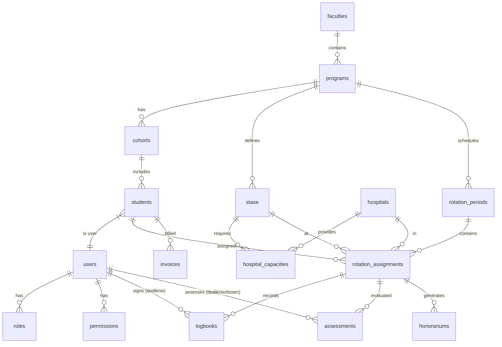

# ACMS — Database Schema Specification

**Version**: 2.0  
**Date**: 2026-06-08  
**Status**: Draft  
**Document ID**: ACMS-DB-001

---

## 1. Design Conventions

### 1.1 Data Types & Standards

- **Primary Keys**: `UUID` (version 7 preferred for sequential time-based sorting)
- **Foreign Keys**: `UUID` referencing primary keys, named `{table_singular}_id`
- **Soft Deletes**: `deleted_at` (TIMESTAMP WITH TIME ZONE) on all major entities
- **Timestamps**: `created_at`, `updated_at` (TIMESTAMP WITH TIME ZONE)
- **JSON Metadata**: `JSONB` for extensible metadata and configuration
- **Enums**: Stored as `VARCHAR` to avoid complex migration of DB-level enums
- **Naming**: Plural `snake_case` for tables, singular `snake_case` for columns
- **Multi-Tenancy**: `program_id` on all tenant-scoped tables

### 1.2 Multi-Tenancy Strategy
ACMS uses a **shared schema** with a discriminator column.
The discriminator column is `program_id`. Any table containing `program_id` MUST be filtered by global scopes in the application layer.

---

## 2. Entity Relationship Diagram (ERD)

---

## 3. Schema Definitions by Domain

### 3.1 Authentication & Authorization

#### `users`
Core identity table representing anyone who logs into the system.

| Column | Type | Constraints | Description |
|--------|------|-------------|-------------|
| `id` | UUID | PK | Primary Key |
| `name` | VARCHAR(255) | NOT NULL | Full name |
| `email` | VARCHAR(255) | UNIQUE, NOT NULL | UMS Institutional Email |
| `identity_number` | VARCHAR(50) | UNIQUE, NULL | NIM (Student) or NIP/NIDN (Staff) |
| `status` | VARCHAR(50) | NOT NULL | 'active', 'inactive', 'suspended' |
| `program_id` | UUID | FK, NULL | Nullable for global users (Super Admin) |
| `hospital_id` | UUID | FK, NULL | Required for Admin RS / Dodiknis |
| `last_login_at`| TIMESTAMP | NULL | Last successful login |
| `created_at` | TIMESTAMP | NOT NULL | |
| `updated_at` | TIMESTAMP | NOT NULL | |
| `deleted_at` | TIMESTAMP | NULL | Soft delete marker |

#### `roles` / `permissions` / `model_has_roles` (Spatie Schema)
Standard Spatie/Laravel-Permission tables tailored with UUIDs.

---

### 3.2 Academic Management

#### `programs`
Study programs (e.g., Professional Doctor, Dentistry).

| Column | Type | Constraints | Description |
|--------|------|-------------|-------------|
| `id` | UUID | PK | |
| `faculty_id` | UUID | FK, NOT NULL | |
| `code` | VARCHAR(20) | UNIQUE | e.g., 'PD' |
| `name` | VARCHAR(255) | NOT NULL | e.g., 'Program Profesi Dokter' |
| `accreditation`| VARCHAR(10) | NULL | 'A', 'B', 'Unggul' |

#### `stase`
Clinical rotation departments defined by a program.

| Column | Type | Constraints | Description |
|--------|------|-------------|-------------|
| `id` | UUID | PK | |
| `program_id` | UUID | FK, NOT NULL | Tenant scoping |
| `code` | VARCHAR(20) | NOT NULL | e.g., 'IPD', 'BED' |
| `name` | VARCHAR(255) | NOT NULL | e.g., 'Ilmu Penyakit Dalam' |
| `duration_weeks`| INT | NOT NULL | Standard duration |
| `passing_grade`| DECIMAL(5,2)| NOT NULL | Minimum score (e.g., 60.00) |
| `is_mandatory` | BOOLEAN | DEFAULT true | |
| `color_code` | VARCHAR(7) | NULL | Hex color for UI charts |

#### `students`
Student academic records (1:1 with `users`).

| Column | Type | Constraints | Description |
|--------|------|-------------|-------------|
| `id` | UUID | PK | |
| `user_id` | UUID | FK, UNIQUE | Links to login identity |
| `program_id` | UUID | FK, NOT NULL | |
| `cohort_id` | UUID | FK, NOT NULL | |
| `status` | VARCHAR(50) | NOT NULL | 'active', 'leave', 'graduated', 'dropout' |
| `enrollment_date`| DATE | NOT NULL | |

---

### 3.3 Rotation Management

#### `hospitals`
Partner hospitals where students complete clinical rotations.

| Column | Type | Constraints | Description |
|--------|------|-------------|-------------|
| `id` | UUID | PK | |
| `code` | VARCHAR(20) | UNIQUE | |
| `name` | VARCHAR(255) | NOT NULL | e.g., 'RSUD Dr. Moewardi' |
| `type` | VARCHAR(50) | NOT NULL | 'Utama', 'Satelit', 'Afiliasi' |
| `address` | TEXT | NULL | |

#### `hospital_capacities`
Quota constraints for rotation scheduling.

| Column | Type | Constraints | Description |
|--------|------|-------------|-------------|
| `id` | UUID | PK | |
| `hospital_id` | UUID | FK, NOT NULL | |
| `stase_id` | UUID | FK, NOT NULL | |
| `rotation_period_id`| UUID| FK, NULL | If NULL, applies as default capacity |
| `max_students` | INT | NOT NULL | Student quota limit |

#### `rotation_periods`
Time boundaries for clinical schedules.

| Column | Type | Constraints | Description |
|--------|------|-------------|-------------|
| `id` | UUID | PK | |
| `program_id` | UUID | FK, NOT NULL | |
| `name` | VARCHAR(255) | NOT NULL | e.g., 'Periode 1 Ganjil 2026/2027' |
| `start_date` | DATE | NOT NULL | |
| `end_date` | DATE | NOT NULL | |
| `status` | VARCHAR(50) | NOT NULL | 'draft', 'published', 'active', 'completed' |

#### `rotation_assignments`
The core scheduling record placing a student in a hospital for a stase.

| Column | Type | Constraints | Description |
|--------|------|-------------|-------------|
| `id` | UUID | PK | |
| `rotation_period_id`| UUID | FK, NOT NULL | |
| `student_id` | UUID | FK, NOT NULL | |
| `stase_id` | UUID | FK, NOT NULL | |
| `hospital_id` | UUID | FK, NOT NULL | |
| `preceptor_id` | UUID | FK, NULL | Assigned Dodiknis |
| `status` | VARCHAR(50) | NOT NULL | 'pending', 'confirmed', 'in_progress', 'completed', 'remedial' |
| `final_score` | DECIMAL(5,2)| NULL | Calculated upon completion |
| `final_grade` | VARCHAR(5) | NULL | 'A', 'B+', etc. |

---

### 3.4 Clinical Activities

#### `logbook_entries`

| Column | Type | Constraints | Description |
|--------|------|-------------|-------------|
| `id` | UUID | PK | |
| `rotation_assignment_id`| UUID| FK, NOT NULL | Context for the entry |
| `student_id` | UUID | FK, NOT NULL | Submitter |
| `preceptor_id` | UUID | FK, NOT NULL | Assessor/Sign-off |
| `activity_date`| DATE | NOT NULL | |
| `activity_type`| VARCHAR(50) | NOT NULL | 'case', 'procedure', 'duty' |
| `description` | TEXT | NOT NULL | |
| `patient_initials`| VARCHAR(10)| NULL | Anonymized identifier |
| `medical_record_no`| VARCHAR(50)| NULL | Encrypted / Masked |
| `status` | VARCHAR(50) | NOT NULL | 'draft', 'submitted', 'signed', 'rejected' |
| `preceptor_feedback`| TEXT | NULL | |

---

### 3.5 Assessment & Examination

#### `assessments`
Polymorphic table for Mini-CEX, DOPS, CBD.

| Column | Type | Constraints | Description |
|--------|------|-------------|-------------|
| `id` | UUID | PK | |
| `rotation_assignment_id`| UUID| FK, NOT NULL | |
| `student_id` | UUID | FK, NOT NULL | |
| `assessor_id` | UUID | FK, NOT NULL | Dosen or Dodiknis |
| `type` | VARCHAR(50) | NOT NULL | 'mini_cex', 'dops', 'cbd' |
| `assessment_date`| DATE | NOT NULL | |
| `scores` | JSONB | NOT NULL | Rubric scores |
| `total_score` | DECIMAL(5,2)| NOT NULL | Calculated out of 100 |
| `qualitative_feedback`| TEXT| NOT NULL | |
| `status` | VARCHAR(50) | NOT NULL | 'draft', 'submitted', 'acknowledged' |

---

### 3.6 Financial Operations

#### `honorariums`
Calculated preceptor compensation.

| Column | Type | Constraints | Description |
|--------|------|-------------|-------------|
| `id` | UUID | PK | |
| `program_id` | UUID | FK, NOT NULL | |
| `preceptor_id` | UUID | FK, NOT NULL | |
| `rotation_period_id`| UUID | FK, NOT NULL | |
| `hospital_id` | UUID | FK, NOT NULL | |
| `total_students`| INT | NOT NULL | |
| `base_rate` | DECIMAL(15,2)| NOT NULL | IDR |
| `total_amount` | DECIMAL(15,2)| NOT NULL | IDR |
| `tax_amount` | DECIMAL(15,2)| NOT NULL | PPh 21 |
| `net_amount` | DECIMAL(15,2)| NOT NULL | IDR |
| `status` | VARCHAR(50) | NOT NULL | 'draft', 'verified', 'approved', 'disbursed' |

---

### 3.7 Audit Trail

#### `audit_logs`
Immutable logging of all system actions.

| Column | Type | Constraints | Description |
|--------|------|-------------|-------------|
| `id` | UUID | PK | |
| `program_id` | UUID | FK, NULL | Tenant context |
| `actor_id` | UUID | FK, NULL | Who did it |
| `action` | VARCHAR(100) | NOT NULL | e.g., 'rotation.assigned', 'grade.approved' |
| `target_type` | VARCHAR(255)| NOT NULL | Polymorphic entity class |
| `target_id` | UUID | NOT NULL | Polymorphic entity ID |
| `old_payload` | JSONB | NULL | Before state |
| `new_payload` | JSONB | NULL | After state |
| `ip_address` | INET | NULL | |
| `user_agent` | TEXT | NULL | |
| `created_at` | TIMESTAMP | NOT NULL | No updated_at/deleted_at (append-only) |

---

## 4. Database Security & Integrity

- **Row-Level Security (RLS)**: PostgreSQL RLS policies applied to prevent cross-tenant leakage.
- **Constraints**: Database-level `CHECK` constraints (e.g., `total_score BETWEEN 0 AND 100`).
- **Indexes**: `CREATE INDEX` on all foreign keys, tenant IDs (`program_id`), and frequent query targets (e.g., `status`).
- **Encryption**: Columns containing potentially sensitive personal data encrypted at rest.

---

## 5. System Core & Configuration (Added in Develop Phase)

#### `settings`
Contains global configuration, including the advanced SMTP routing matrix.

| Column | Type | Constraints | Description |
|--------|------|-------------|-------------|
| `id` | UUID | PK | |
| `key` | VARCHAR | UNIQUE | e.g., 'smtp_notification_matrix' |
| `value` | JSONB | NULL | Complex configuration arrays |

#### `system_references`
Master Data for dropdowns replacing hardcoded enums (e.g. incident types).

| Column | Type | Constraints | Description |
|--------|------|-------------|-------------|
| `id` | UUID | PK | |
| `category` | VARCHAR | NOT NULL | e.g. 'incident_types' |
| `name` | VARCHAR | NOT NULL | Display name |
| `value` | VARCHAR | NOT NULL | System value |
| `is_active`| BOOLEAN | DEFAULT 1 | |

#### `incident_reports`
Tracks clinical incidents with RBAC scoping.

| Column | Type | Constraints | Description |
|--------|------|-------------|-------------|
| `id` | UUID | PK | |
| `incident_type`| VARCHAR | FK | Matches system_references |
| `status` | VARCHAR | NOT NULL | 'submitted', 'investigating', 'resolved' |
