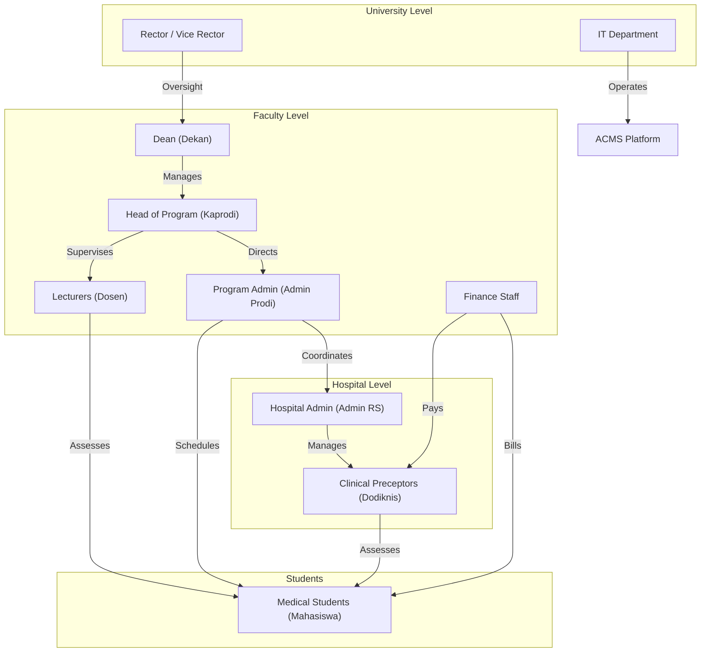

# ACMS — Product Requirements Document (PRD)

**Version**: 2.0  
**Date**: 2026-06-08  
**Status**: Draft  
**Owner**: Faculty of Medicine, Universitas Muhammadiyah Surakarta (UMS)  
**Document ID**: ACMS-PRD-001

---

## Table of Contents

1. [Vision & Mission](#1-vision--mission)
2. [Business Context](#2-business-context)
3. [Scope](#3-scope)
4. [Glossary](#4-glossary)
5. [User Personas](#5-user-personas)
6. [Functional Requirements](#6-functional-requirements)
7. [Non-Functional Requirements](#7-non-functional-requirements)
8. [Business Rules](#8-business-rules)
9. [Integration Requirements](#9-integration-requirements)
10. [Regulatory & Compliance Requirements](#10-regulatory--compliance-requirements)
11. [Success Metrics](#11-success-metrics)
12. [Constraints & Assumptions](#12-constraints--assumptions)

---

## 1. Vision & Mission

### Vision

An integrated platform that manages the complete lifecycle of clinical and health profession education — from student enrollment through clinical rotations, assessments, examinations, and graduation — serving as the single source of truth for all stakeholders.

### Mission

- **Digitize** all manual administrative processes in the Professional Doctor Program
- **Eliminate** scheduling conflicts, data fragmentation, and delayed communications
- **Enable** data-driven decision making for academic leadership
- **Ensure** regulatory compliance with Indonesian medical education standards
- **Scale** to support multiple health profession programs, faculties, campuses, and hospital networks

---

## 2. Business Context

### 2.1 Primary Target

**Faculty of Medicine, Universitas Muhammadiyah Surakarta (UMS)**  
**Program**: Program Profesi Dokter (Professional Doctor / Koas)

The Professional Doctor Program is a post-academic clinical education phase where medical graduates complete supervised clinical rotations (stase) across multiple teaching hospitals (Rumah Sakit Pendidikan). Students rotate through 12–15 clinical departments over approximately 2 years, accumulating required clinical competencies before sitting the national competency examination (UKMPPD).

### 2.2 Current Pain Points

| # | Pain Point | Impact |
|---|-----------|--------|
| 1 | Manual rotation scheduling via spreadsheets | Frequent conflicts, capacity overflows, hours of administrative rework |
| 2 | Paper-based logbooks and assessment forms | Lost records, delayed grading, no real-time progress visibility |
| 3 | Fragmented communication (WhatsApp, email, phone) | Missed notifications, no audit trail, information asymmetry |
| 4 | No centralized student progress dashboard | Kaprodi cannot identify at-risk students proactively |
| 5 | Manual honorarium calculation for clinical preceptors | Errors, delays, dissatisfaction |
| 6 | No accreditation data readily available | Weeks of manual data gathering before LAM-PTKes visits |
| 7 | No integration with university SIA/SIAKAD | Duplicate data entry, inconsistencies |

### 2.3 Future Expansion

The architecture must support the following without requiring fundamental redesign:

| Dimension | Current | Future |
|-----------|---------|--------|
| Programs | 1 (Professional Doctor) | Dentistry, Nursing, Pharmacy, Physiotherapy, Specialist Programs |
| Faculties | 1 (Medicine) | Multiple faculties across health sciences |
| Hospitals | 3–5 partner hospitals | 10+ hospitals across multiple cities |
| Campuses | 1 (Surakarta) | Multi-campus UMS network |

### 2.4 Stakeholder Map

---

## 3. Scope

### 3.1 In Scope (MVP)

| Domain | Description |
|--------|-------------|
| Authentication & Authorization | SSO via OAuth2/OIDC with UMS identity provider, RBAC with 8 roles |
| Academic Management | Programs, curricula, stase definitions, student enrollment, academic calendar |
| Rotation Management | Rotation period creation, automated/manual student assignment, conflict detection, capacity management |
| Clinical Activities | Digital logbooks, clinical procedure logging, skill checklists, preceptor feedback |
| Assessment & Grading | Mini-CEX, DOPS, CBD assessment forms, grade submission and approval workflows |
| Notifications | Email and in-app notifications for scheduling, assessments, approvals |
| Audit Trail | Immutable logging of all significant actions |
| Dashboards | Role-specific dashboards with key metrics |

### 3.2 In Scope (Phase 2)

| Domain | Description |
|--------|-------------|
| Examination Management | OSCE scheduling and scoring, written exam management, UKMPPD tracking |
| Finance | Billing, payment tracking, Dodiknis honorarium calculation and disbursement |
| Advanced Analytics | Cohort analysis, predictive at-risk scoring, accreditation reporting |
| Multi-Program Support | Onboard additional health profession programs |

### 3.3 In Scope (Phase 3)

| Domain | Description |
|--------|-------------|
| External Integrations | PDDIKTI reporting, SIA/SIAKAD sync, e-learning platform integration |
| Mobile Application | Native/PWA mobile app for students and preceptors |
| Advanced Rotation Engine | AI-assisted optimal rotation scheduling |
| Document Management | Formal document workflow (letters, certificates, transcripts) |

### 3.4 Out of Scope

| Item | Reason |
|------|--------|
| Electronic Medical Records (EMR) | Separate system domain, regulatory complexity |
| University-wide SIA/SIAKAD replacement | ACMS integrates with existing SIA, does not replace it |
| Hospital operational systems (HIS) | Hospital systems are external; ACMS only coordinates student placement |
| Research management | Separate domain not part of clinical education |
| Alumni management | Post-graduation tracking is out of initial scope |
| Video conferencing | Use existing tools (Zoom, Google Meet); ACMS may link but not host |

---

## 4. Glossary

| Indonesian Term | English Term | Definition |
|-----------------|-------------|------------|
| Stase | Clinical Rotation | A supervised clinical learning period in a specific medical department (e.g., Internal Medicine, Surgery) |
| Koas | Clinical Clerkship Student | A medical graduate undertaking the Professional Doctor Program |
| Dodiknis | Clinical Preceptor | A licensed physician at a teaching hospital who supervises and assesses students (Dokter Pendidik Klinis) |
| Dosen | Lecturer | A faculty member responsible for academic teaching and assessment |
| Kaprodi | Head of Study Program | The academic leader of a study program (Ketua Program Studi) |
| Admin Prodi | Program Administrator | Staff managing operational aspects of the study program |
| Admin RS | Hospital Administrator | Staff at the partner hospital managing student logistics |
| Rumah Sakit Mitra | Partner Hospital | Teaching hospital with a formal MoU for clinical education |
| RS Pendidikan | Teaching Hospital | Hospital accredited for medical education |
| Logbook | Clinical Logbook | Record of clinical activities, procedures, and competencies achieved |
| Mini-CEX | Mini Clinical Evaluation Exercise | Direct observation assessment of clinical skills |
| DOPS | Direct Observation of Procedural Skills | Assessment of specific clinical procedure performance |
| CBD / CbD | Case-Based Discussion | Assessment via structured discussion of a clinical case |
| OSCE | Objective Structured Clinical Examination | Standardized multi-station clinical skills examination |
| UKMPPD | National Competency Exam | Ujian Kompetensi Mahasiswa Program Profesi Dokter — national licensing exam |
| KKI | Indonesian Medical Council | Konsil Kedokteran Indonesia — regulatory authority |
| LAM-PTKes | Health Education Accreditation | Lembaga Akreditasi Mandiri Pendidikan Tinggi Kesehatan |
| SNPK | National Medical Education Standards | Standar Nasional Pendidikan Kedokteran |
| PDDIKTI | National Higher Education Database | Pangkalan Data Pendidikan Tinggi — national reporting system |
| SIA / SIAKAD | Academic Information System | University-wide student information system |
| Honorarium | Preceptor Fee | Payment to clinical preceptors for supervising students |
| UU PDP | Data Protection Law | Undang-Undang Pelindungan Data Pribadi (Law No. 27/2022) |
| Wahana | Training Site | Clinical training facility (hospital/clinic) |
| IPK | GPA | Indeks Prestasi Kumulatif |
| SKS | Credit Unit | Satuan Kredit Semester |

---

## 5. User Personas

### 5.1 Super Admin

**Role ID**: SA  
**Profile**: IT department staff responsible for system-wide configuration.  
**Goals**: Maintain system health, manage global settings, onboard new programs/hospitals.  
**Pain Points**: Lack of system monitoring tools, manual user provisioning.  
**Key Tasks**:
- Manage users and role assignments across all programs
- Configure system-wide settings (academic calendar templates, notification rules)
- Monitor system health and performance
- Manage hospital and faculty registrations
- Handle escalated support issues

### 5.2 Admin Prodi (Program Administrator)

**Role ID**: AP  
**Profile**: Administrative staff (typically 1–3 per program) handling daily operations.  
**Goals**: Efficiently schedule rotations, manage student logistics, reduce administrative overhead.  
**Pain Points**: Spreadsheet-based scheduling, manual conflict resolution, repetitive data entry.  
**Key Tasks**:
- Create and manage rotation periods and assignments
- Enroll students into programs and cohorts
- Manage stase definitions and hospital-stase mappings
- Generate operational reports
- Coordinate with hospital admins on capacity
- Process student requests (rotation swaps, leave)

### 5.3 Kaprodi (Head of Study Program)

**Role ID**: KP  
**Profile**: Senior academic leader responsible for program quality and accreditation.  
**Goals**: Monitor program performance, ensure quality standards, prepare accreditation data.  
**Pain Points**: No real-time visibility into student progress, manual accreditation data gathering.  
**Key Tasks**:
- Approve rotation schedules and grade changes
- Monitor student progress and identify at-risk students
- Review program-level analytics and KPIs
- Generate accreditation reports (LAM-PTKes)
- Approve financial operations (honorarium)
- Make strategic decisions based on data

### 5.4 Dosen (Lecturer)

**Role ID**: DO  
**Profile**: Faculty member responsible for academic components of clinical education.  
**Goals**: Efficiently assess students, track academic performance.  
**Pain Points**: Paper-based assessment forms, delayed grade submission, no digital portfolio.  
**Key Tasks**:
- Assess students (academic evaluations, written exams)
- Submit and manage grades
- View assigned students and their progress
- Participate in OSCE as examiner

### 5.5 Dodiknis (Clinical Preceptor)

**Role ID**: DK  
**Profile**: Practicing physician at a partner hospital who supervises students during rotations.  
**Goals**: Easily assess students in clinical settings, often on mobile devices between patients.  
**Pain Points**: Paper forms lost, forgotten assessments, no clear student assignment list.  
**Key Tasks**:
- View assigned students for current rotation
- Perform clinical assessments (Mini-CEX, DOPS, CBD)
- Sign off on logbook entries
- Provide clinical feedback
- Track student attendance and performance

### 5.6 Admin RS (Hospital Administrator)

**Role ID**: AR  
**Profile**: Administrative staff at partner hospital managing student placement logistics.  
**Goals**: Manage hospital capacity, ensure smooth student rotation logistics.  
**Pain Points**: Overbooking, unclear schedules, communication gaps with university.  
**Key Tasks**:
- Manage department capacity quotas per rotation period
- View incoming student rotation schedule
- Manage preceptor (Dodiknis) assignments to departments
- Report facility availability and constraints
- Coordinate logistics (access badges, orientation schedules)

### 5.7 Mahasiswa (Student)

**Role ID**: MH  
**Profile**: Medical graduate (Koas) completing clinical rotations across hospitals.  
**Goals**: Track own progress, know schedule, complete requirements efficiently.  
**Pain Points**: Unclear schedules, lost logbooks, delayed grade feedback, anxiety about progress.  
**Key Tasks**:
- View personal rotation schedule
- Submit logbook entries and clinical procedure logs
- View assessment results and grades
- Track competency completion progress
- Request rotation swaps or leave
- Receive notifications about schedules and assessments
- View requirements checklist per stase

### 5.8 Finance

**Role ID**: FN  
**Profile**: Finance department staff handling clinical education financial operations.  
**Goals**: Accurate billing, timely honorarium processing, financial transparency.  
**Pain Points**: Manual honorarium calculation, payment tracking in spreadsheets.  
**Key Tasks**:
- Generate student billing/invoices
- Track payment status
- Calculate Dodiknis honorarium based on rotation data
- Process honorarium approval and disbursement
- Generate financial reports

---

## 6. Functional Requirements

### 6.1 Authentication & Authorization Domain

#### FR-001: SSO Authentication

**As** any user,  
**I want** to login using my UMS institutional account via SSO,  
**So that** I don't need separate credentials for ACMS.

**Acceptance Criteria**:
- [ ] System authenticates via OAuth2/OIDC with UMS identity provider
- [ ] Upon successful authentication, user role is resolved from local role mapping table
- [ ] JWT access token (15 min expiry) and refresh token (7 day expiry) are issued
- [ ] Failed login attempts are logged with IP address and timestamp
- [ ] Account lockout after 5 consecutive failed attempts (30 min cooldown)
- [ ] Session is invalidated on explicit logout
- [ ] Concurrent session limit: maximum 3 active sessions per user
- [ ] All authentication events are recorded in audit trail

**Priority**: P0 — MVP  
**Domain**: Authentication

---

#### FR-002: Role-Based Authorization

**As** a system administrator,  
**I want** users to have role-based access control,  
**So that** each user can only access features appropriate to their role.

**Acceptance Criteria**:
- [ ] 8 predefined roles are available (SA, AP, KP, DO, DK, AR, MH, FN)
- [ ] Users can have exactly one primary role
- [ ] Each API endpoint enforces role-based access via middleware
- [ ] Row-level security ensures users can only access data within their scope (program, hospital)
- [ ] Permission changes take effect immediately (no cached stale permissions)
- [ ] Role assignment requires Super Admin or Admin Prodi approval
- [ ] All authorization failures return 403 with descriptive error code

**Priority**: P0 — MVP  
**Domain**: Authorization

---

#### FR-003: User Management

**As** a Super Admin or Admin Prodi,  
**I want** to manage user accounts and role assignments,  
**So that** users have appropriate system access.

**Acceptance Criteria**:
- [ ] Create user accounts with profile information (name, NIM/NIP, email, phone)
- [ ] Assign or change user roles
- [ ] Activate or deactivate user accounts (soft disable, no data loss)
- [ ] Bulk import users via CSV/Excel upload
- [ ] Search and filter users by role, program, status
- [ ] View user activity summary (last login, action count)
- [ ] Super Admin can manage users across all programs
- [ ] Admin Prodi can only manage users within their program

**Priority**: P0 — MVP  
**Domain**: Authentication

---

### 6.2 Academic Management Domain

#### FR-010: Program Management

**As** a Super Admin,  
**I want** to define and manage academic programs,  
**So that** the system supports multiple health profession programs.

**Acceptance Criteria**:
- [ ] Create program with: name, code, faculty, degree level, duration, accreditation status
- [ ] Each program has its own set of stase (rotations), curricula, and cohorts
- [ ] Programs are isolated — users scoped to one program cannot see another's data
- [ ] Program can be activated or deactivated
- [ ] At least one program (Professional Doctor) must exist at system initialization

**Priority**: P0 — MVP  
**Domain**: Academic

---

#### FR-011: Stase (Clinical Rotation Department) Definition

**As** an Admin Prodi,  
**I want** to define the clinical rotation departments (stase),  
**So that** students can be assigned to structured rotation schedules.

**Acceptance Criteria**:
- [ ] Create stase with: name, code, department, default duration (weeks), minimum competency requirements
- [ ] Assign stase to one or more partner hospitals (each hospital may offer different capacity per stase)
- [ ] Define prerequisite stase (e.g., Internal Medicine before Cardiology sub-specialties)
- [ ] Define minimum clinical procedure counts per stase (e.g., 10 patient encounters, 5 procedures)
- [ ] Define assessment requirements per stase (which assessments are required to complete the stase)
- [ ] Stase can be mandatory or elective
- [ ] Set stase-specific grading rubric and passing threshold

**Priority**: P0 — MVP  
**Domain**: Academic

---

#### FR-012: Student Enrollment & Cohort Management

**As** an Admin Prodi,  
**I want** to manage student enrollment and cohort grouping,  
**So that** students are properly registered for clinical rotations.

**Acceptance Criteria**:
- [ ] Enroll students into a program with: NIM, name, cohort/batch, enrollment date, academic status
- [ ] Group students into cohorts (angkatan) by enrollment year
- [ ] Track student status: Active, On Leave (cuti), Suspended, Graduated, Dropped Out
- [ ] Student profile includes: photo, contact info, emergency contact, blood type, health insurance
- [ ] Bulk enrollment via CSV import
- [ ] Transfer student between cohorts (with audit trail)
- [ ] Generate student ID cards / QR codes for hospital check-in

**Priority**: P0 — MVP  
**Domain**: Academic

---

#### FR-013: Academic Calendar Management

**As** an Admin Prodi,  
**I want** to manage the academic calendar,  
**So that** rotation scheduling respects academic periods and holidays.

**Acceptance Criteria**:
- [ ] Define academic year and semester boundaries
- [ ] Define rotation periods within each semester (start date, end date, stase assignments)
- [ ] Mark holiday/blackout periods (Hari Raya, semester breaks, institutional events)
- [ ] Calendar visible to all roles (filtered by relevance)
- [ ] Calendar integrates with rotation scheduling engine (prevents assignment during blackout periods)
- [ ] Support for overlapping rotation periods across different stase durations

**Priority**: P0 — MVP  
**Domain**: Academic

---

#### FR-014: Curriculum & Competency Framework

**As** a Kaprodi,  
**I want** to define the competency framework for the program,  
**So that** student assessments are aligned with national standards.

**Acceptance Criteria**:
- [ ] Define competency domains aligned with SNPK (7 areas of competence)
- [ ] Map competencies to specific stase
- [ ] Define minimum competency levels per stase (checklist items)
- [ ] Track student competency attainment across all stase
- [ ] Generate competency gap reports
- [ ] Competency framework is versioned (curriculum changes don't retroactively affect graduated students)

**Priority**: P1 — Phase 2  
**Domain**: Academic

---

### 6.3 Rotation Management Domain

#### FR-020: Rotation Period Creation

**As** an Admin Prodi,  
**I want** to create rotation periods,  
**So that** students can be scheduled into clinical rotations.

**Acceptance Criteria**:
- [ ] Create rotation period with: name, start date, end date, associated stase, assigned hospitals
- [ ] Each rotation period has a defined capacity per hospital per stase
- [ ] Rotation periods respect academic calendar (no overlap with blackout periods)
- [ ] Rotation period status: Draft → Published → In Progress → Completed
- [ ] Only Draft and Published periods can be modified
- [ ] Publishing a rotation period triggers notifications to all affected students and hospitals

**Priority**: P0 — MVP  
**Domain**: Rotation

---

#### FR-021: Student Rotation Assignment

**As** an Admin Prodi,  
**I want** to assign students to rotation slots,  
**So that** each student has a complete rotation schedule for their program.

**Acceptance Criteria**:
- [ ] Manual assignment: Admin selects student → stase → hospital → period
- [ ] Automatic assignment: System generates optimal assignment based on constraints
- [ ] Constraint validation:
  - No student double-booked (same period, different stase)
  - Hospital capacity not exceeded for the stase+period combination
  - Prerequisite stase completed before dependent stase
  - Student status is Active
  - No assignment during student's approved leave periods
- [ ] Assignment status: Pending → Confirmed → In Progress → Completed → Cancelled
- [ ] Batch assignment for entire cohort
- [ ] Drag-and-drop schedule builder (visual Gantt-like interface)
- [ ] Assignment change triggers notification to student, hospital, and preceptor

**Priority**: P0 — MVP  
**Domain**: Rotation

---

#### FR-022: Rotation Swap & Rescheduling

**As** a student,  
**I want** to request a rotation swap or schedule change,  
**So that** I can accommodate personal circumstances.

**Acceptance Criteria**:
- [ ] Student submits swap request with: target student (for swap) or new preferred period, reason
- [ ] Request enters approval workflow: Student → Admin Prodi → (optional) Kaprodi
- [ ] Both students' schedules are validated against constraints before approval
- [ ] Approved swap atomically updates both students' schedules
- [ ] Rejected requests include reason
- [ ] Request deadline: minimum 2 weeks before rotation start
- [ ] Maximum swap requests per student per semester: configurable (default 2)

**Priority**: P0 — MVP  
**Domain**: Rotation

---

#### FR-023: Hospital Capacity Management

**As** a Hospital Administrator,  
**I want** to manage my hospital's student capacity per department,  
**So that** clinical learning quality is maintained.

**Acceptance Criteria**:
- [ ] Set maximum student capacity per stase per rotation period
- [ ] Set preceptor availability per department per rotation period
- [ ] View capacity utilization dashboard (slots filled / total capacity)
- [ ] Receive alerts when capacity is approaching limit (80% threshold)
- [ ] Block/unblock specific periods (e.g., hospital renovation, doctor conferences)
- [ ] Capacity changes after rotation is published require Admin Prodi notification

**Priority**: P0 — MVP  
**Domain**: Rotation

---

#### FR-024: Rotation Dashboard & Visualization

**As** an Admin Prodi or Kaprodi,  
**I want** a visual overview of all rotation schedules,  
**So that** I can identify gaps, conflicts, and utilization patterns at a glance.

**Acceptance Criteria**:
- [ ] Gantt chart view showing all students × stase × time
- [ ] Calendar view per hospital showing daily student count
- [ ] Heatmap view showing utilization across hospitals and departments
- [ ] Filter by: cohort, stase, hospital, status
- [ ] Color-coded conflict indicators
- [ ] Export schedule to PDF/Excel
- [ ] Print-friendly view for hospital distribution

**Priority**: P0 — MVP  
**Domain**: Rotation

---

### 6.4 Clinical Activities Domain

#### FR-030: Digital Logbook

**As** a student,  
**I want** to record my clinical activities in a digital logbook,  
**So that** my clinical experience is documented and verifiable.

**Acceptance Criteria**:
- [ ] Create logbook entry with: date, stase, hospital, department, activity type, description, patient demographics (anonymized), diagnosis, procedures performed, supervisor
- [ ] Attach photos/documents to logbook entries (e.g., anonymized case photos)
- [ ] Entry status: Draft → Submitted → Signed Off → Rejected (with feedback)
- [ ] Dodiknis can sign off (approve) or reject entries with comments
- [ ] Entries cannot be modified after sign-off (immutable)
- [ ] Logbook completion progress visible as percentage per stase
- [ ] Minimum entry count enforced per stase before stase completion

**Priority**: P0 — MVP  
**Domain**: Clinical

---

#### FR-031: Clinical Procedure Logging

**As** a student,  
**I want** to log clinical procedures I've performed or observed,  
**So that** I can track my procedural competency.

**Acceptance Criteria**:
- [ ] Log procedure with: procedure name (from standard list), role (performed independently, assisted, observed), date, patient type, complexity level, outcome
- [ ] Each stase has a defined minimum procedure list with required counts
- [ ] Progress tracker shows: procedure name, required count, completed count, remaining
- [ ] Procedure log validated by Dodiknis signature
- [ ] Procedure catalog maintained by Admin Prodi (aligned with SNPK)

**Priority**: P0 — MVP  
**Domain**: Clinical

---

#### FR-032: Skill Checklist

**As** a Dodiknis,  
**I want** to assess student clinical skills against a structured checklist,  
**So that** competency attainment is standardized and verifiable.

**Acceptance Criteria**:
- [ ] Skill checklist templates defined per stase (aligned with competency framework)
- [ ] Checklist items rated: Not Observed, Below Expected, At Expected Level, Above Expected
- [ ] Each checklist item has an optional free-text comment
- [ ] Completed checklists are timestamped and attributed to the assessing Dodiknis
- [ ] Checklist completion is required for stase sign-off
- [ ] Aggregate skill attainment visible on student dashboard

**Priority**: P1 — Phase 2  
**Domain**: Clinical

---

### 6.5 Assessment & Grading Domain

#### FR-040: Mini-CEX Assessment

**As** a Dodiknis,  
**I want** to perform Mini-CEX assessments on students,  
**So that** I can evaluate their clinical skills in real-time encounters.

**Acceptance Criteria**:
- [ ] Mini-CEX form includes: clinical setting, complexity, focus areas (medical interviewing, physical examination, professionalism, clinical judgment, counseling, organization/efficiency, overall competence)
- [ ] Each area scored on a 1-9 scale (1-3: below expectations, 4-6: meets expectations, 7-9: above expectations)
- [ ] Evaluator provides written narrative feedback (mandatory)
- [ ] Student acknowledged notification after assessment completion
- [ ] Minimum number of Mini-CEX assessments per stase: configurable (default 2)
- [ ] Assessment results contribute to stase final grade with configurable weight

**Priority**: P0 — MVP  
**Domain**: Assessment

---

#### FR-041: DOPS Assessment

**As** a Dodiknis,  
**I want** to assess students performing specific clinical procedures,  
**So that** procedural competency is formally evaluated.

**Acceptance Criteria**:
- [ ] DOPS form includes: procedure name, indication, preparation, technical ability, aseptic technique, post-procedure care, communication, overall performance
- [ ] Each area scored on a 1-9 scale
- [ ] Mandatory written feedback
- [ ] Minimum DOPS per stase: configurable
- [ ] Procedure list linked to stase procedure requirements

**Priority**: P0 — MVP  
**Domain**: Assessment

---

#### FR-042: CBD (Case-Based Discussion) Assessment

**As** a Dosen or Dodiknis,  
**I want** to assess students through structured case discussions,  
**So that** clinical reasoning and knowledge are evaluated.

**Acceptance Criteria**:
- [ ] CBD form includes: case complexity, medical record keeping, clinical assessment, investigation/referral, treatment, follow-up, professionalism, overall judgment
- [ ] Each area scored on a 1-9 scale
- [ ] Case summary attached
- [ ] Mandatory written feedback

**Priority**: P0 — MVP  
**Domain**: Assessment

---

#### FR-043: Grade Submission & Approval Workflow

**As** an assessor (Dosen/Dodiknis),  
**I want** to submit grades that go through an approval process,  
**So that** grade integrity is maintained.

**Acceptance Criteria**:
- [ ] Assessor submits assessment scores
- [ ] Individual assessment scores automatically aggregate into stase grade (weighted average configurable)
- [ ] Stase grade status: Pending → Submitted → Under Review → Approved → Published
- [ ] Approval workflow: Assessor → Admin Prodi (verification) → Kaprodi (approval)
- [ ] Grade modification after approval requires formal appeal process
- [ ] Published grades are visible to student
- [ ] Grade scale: A (≥85), A- (≥80), B+ (≥75), B (≥70), C+ (≥65), C (≥60), D (≥50), E (<50)
- [ ] Passing threshold per stase: configurable (default ≥ C / 60)
- [ ] Failed stase requires remedial rotation

**Priority**: P0 — MVP  
**Domain**: Assessment

---

#### FR-044: Grade Appeal Process

**As** a student,  
**I want** to appeal a grade I believe is incorrect,  
**So that** there is a fair dispute resolution mechanism.

**Acceptance Criteria**:
- [ ] Student submits appeal with: stase, contested grade, evidence/argument
- [ ] Appeal window: 14 days after grade publication
- [ ] Appeal review by: Kaprodi + independent Dosen reviewer
- [ ] Possible outcomes: Grade Maintained, Grade Adjusted, Re-assessment Ordered
- [ ] Appeal decision is final and recorded in audit trail
- [ ] Maximum one appeal per stase per student

**Priority**: P1 — Phase 2  
**Domain**: Assessment

---

### 6.6 Examination Domain

#### FR-050: OSCE Management

**As** an Admin Prodi,  
**I want** to manage OSCE examinations,  
**So that** clinical competency is formally tested in a standardized format.

**Acceptance Criteria**:
- [ ] Create OSCE session with: date, location, stations (10–20), examiners, students, time per station
- [ ] Station definition: scenario, checklist items, passing criteria, required equipment
- [ ] Student scheduling across stations (rotation through all stations)
- [ ] Real-time score entry by examiners (tablet/mobile-friendly)
- [ ] Automatic score aggregation across stations
- [ ] Pass/fail determination with configurable passing criteria
- [ ] Score breakdown report per student per station
- [ ] OSCE result contributes to stase grade

**Priority**: P1 — Phase 2  
**Domain**: Examination

---

#### FR-051: Written Examination Management

**As** an Admin Prodi or Dosen,  
**I want** to manage written examinations,  
**So that** theoretical knowledge is assessed.

**Acceptance Criteria**:
- [ ] Create exam with: title, stase, type (MCQ, essay, mixed), date, duration, total marks
- [ ] MCQ support: import questions from question bank, randomize order, set passing score
- [ ] Score entry and automatic grading for MCQ
- [ ] Manual grading for essay questions
- [ ] Results published after all grading complete and Kaprodi approval
- [ ] Exam results contribute to stase grade with configurable weight

**Priority**: P1 — Phase 2  
**Domain**: Examination

---

#### FR-052: UKMPPD Preparation Tracking

**As** a Kaprodi,  
**I want** to track students' readiness for UKMPPD,  
**So that** we can improve our national pass rate.

**Acceptance Criteria**:
- [ ] UKMPPD readiness score calculated from: all stase grades, OSCE results, try-out exam scores
- [ ] Track UKMPPD attempt history: attempt number, score, pass/fail, date
- [ ] Cohort-level UKMPPD pass rate analytics
- [ ] At-risk identification: students below readiness threshold flagged for intervention
- [ ] Compare with national average (manual input)

**Priority**: P1 — Phase 2  
**Domain**: Examination

---

### 6.7 Finance Domain

#### FR-060: Student Billing

**As** Finance staff,  
**I want** to generate and track student bills related to clinical education,  
**So that** financial operations are transparent and auditable.

**Acceptance Criteria**:
- [ ] Generate invoices for: rotation fees, material fees, examination fees, other charges
- [ ] Invoice status: Draft → Issued → Paid → Overdue → Cancelled
- [ ] Payment recording with: date, amount, method, reference number, receipt
- [ ] Payment reminder notifications at configurable intervals (7, 14, 30 days overdue)
- [ ] Student can view own billing history and outstanding amounts
- [ ] Bulk invoice generation per cohort/rotation period

**Priority**: P1 — Phase 2  
**Domain**: Finance

---

#### FR-061: Dodiknis Honorarium Management

**As** Finance staff,  
**I want** to calculate and process honorarium payments for clinical preceptors,  
**So that** preceptors are fairly compensated for their supervision work.

**Acceptance Criteria**:
- [ ] Automatic honorarium calculation based on: number of students supervised, rotation duration, stase type, assessment activities completed
- [ ] Honorarium rate configurable per stase, per hospital, per preceptor level
- [ ] Calculation formula transparent and auditable
- [ ] Honorarium approval workflow: Finance calculates → Admin Prodi verifies → Kaprodi approves → Finance disburses
- [ ] Disbursement tracking with: date, amount, bank details, transfer reference
- [ ] Tax calculation (PPh 21) integration
- [ ] Honorarium reports per period, per hospital, per preceptor

**Priority**: P1 — Phase 2  
**Domain**: Finance

---

### 6.8 Notification Domain

#### FR-070: Multi-Channel Notification System

**As** any user,  
**I want** to receive timely notifications about relevant events,  
**So that** I don't miss important deadlines or actions required.

**Acceptance Criteria**:
- [ ] Notification channels: In-app (real-time), Email, SMS (optional, for critical only)
- [ ] Notification triggers:
  - Rotation assignment/change
  - Assessment submitted/graded
  - Logbook entry signed off/rejected
  - Grade published
  - Approval required (for approvers)
  - Deadline reminders (assessment, logbook, rotation end)
  - System announcements
- [ ] User notification preferences: per-channel toggle per notification type
- [ ] In-app notification center with: unread count, mark as read, filter by type
- [ ] Email notifications use professional templates with institution branding
- [ ] Notification history stored for 1 year
- [ ] Real-time delivery via WebSocket for in-app notifications

**Priority**: P0 — MVP  
**Domain**: Notification

---

#### FR-071: Broadcast Messaging

**As** an Admin Prodi or Kaprodi,  
**I want** to send broadcast messages to groups of users,  
**So that** I can communicate important announcements efficiently.

**Acceptance Criteria**:
- [ ] Target audience selection: by role, by cohort, by hospital, by stase, or custom selection
- [ ] Message types: Announcement, Urgent, Reminder
- [ ] Delivery confirmation tracking (sent, delivered, read)
- [ ] Schedule messages for future delivery
- [ ] Attach files to broadcast messages

**Priority**: P1 — Phase 2  
**Domain**: Notification

---

### 6.9 Audit & Compliance Domain

#### FR-080: Comprehensive Audit Trail

**As** a Kaprodi or Super Admin,  
**I want** all significant system actions to be logged immutably,  
**So that** we have a verifiable record for compliance and dispute resolution.

**Acceptance Criteria**:
- [ ] All CRUD operations on core entities are logged
- [ ] All authentication events are logged
- [ ] All approval/rejection actions are logged with actor, timestamp, and reason
- [ ] Audit logs are append-only (cannot be modified or deleted)
- [ ] Log schema: actor, action, target entity, before/after state, timestamp, IP address
- [ ] Query interface with filters: date range, actor, action type, entity type
- [ ] Export audit logs to CSV/PDF for compliance reporting
- [ ] Audit log access is itself audited (meta-auditing)
- [ ] Retention: minimum 7 years for academic records, 10 years for financial records

**Priority**: P0 — MVP  
**Domain**: Audit

---

### 6.10 Dashboard & Analytics Domain

#### FR-090: Role-Specific Dashboards

**As** any user,  
**I want** a personalized dashboard showing information relevant to my role,  
**So that** I can efficiently manage my responsibilities.

**Acceptance Criteria**:
- [ ] Each role has a customized dashboard layout
- [ ] Dashboard widgets include: action items, recent activity, key metrics, calendar
- [ ] Data refreshes at minimum every 5 minutes (or real-time for critical items)
- [ ] Responsive design (works on desktop, tablet, mobile)
- [ ] Specific widget requirements per role defined in ANALYTICS_SPEC.md

**Priority**: P0 — MVP  
**Domain**: Analytics

---

#### FR-091: Student Progress Tracking

**As** a Kaprodi or Admin Prodi,  
**I want** to view comprehensive student progress reports,  
**So that** I can identify at-risk students and intervene proactively.

**Acceptance Criteria**:
- [ ] Individual student progress: completed stase, grades, logbook completion, procedure counts
- [ ] Cohort-level progress: average completion rate, grade distribution, at-risk count
- [ ] At-risk flags: failing grades, incomplete logbooks, missed assessments
- [ ] Progress comparison: student vs. cohort average vs. previous cohorts
- [ ] Export progress report as PDF (for student meetings, accreditation)
- [ ] Timeline visualization of student's rotation journey

**Priority**: P0 — MVP  
**Domain**: Analytics

---

## 7. Non-Functional Requirements

### NFR-001: Performance

| Metric | Requirement |
|--------|------------|
| Page load time (initial) | ≤ 3 seconds on 4G connection |
| API response time (95th percentile) | ≤ 500ms for standard CRUD |
| API response time (rotation scheduling) | ≤ 10 seconds for full cohort auto-assignment |
| Concurrent users | Support 500 simultaneous users |
| Database query time | ≤ 200ms for indexed queries |
| File upload | Support up to 10MB per file, 50MB total per request |

### NFR-002: Availability

| Metric | Requirement |
|--------|------------|
| Uptime SLA | 99.5% (excludes scheduled maintenance) |
| Scheduled maintenance window | Saturday 00:00–06:00 WIB |
| Recovery Time Objective (RTO) | ≤ 4 hours |
| Recovery Point Objective (RPO) | ≤ 1 hour |

### NFR-003: Scalability

| Metric | Requirement |
|--------|------------|
| Student capacity | 500 active students (MVP), 5,000 (Phase 3) |
| Program capacity | 1 program (MVP), 10 programs (Phase 3) |
| Hospital capacity | 5 hospitals (MVP), 50 hospitals (Phase 3) |
| Data retention | 10+ years of historical data without performance degradation |
| File storage | 1 TB (MVP), 10 TB (Phase 3) |

### NFR-004: Security

| Requirement | Standard |
|-------------|----------|
| Data in transit | TLS 1.3 |
| Data at rest | AES-256 encryption for sensitive fields |
| Authentication | OAuth2/OIDC, JWT with RS256 signing |
| Password policy | Handled by SSO provider (UMS) |
| Session management | HttpOnly, Secure, SameSite=Strict cookies |
| API rate limiting | 100 requests/minute per user, 1000/minute per IP |
| Vulnerability scanning | OWASP Top 10 compliance |
| Dependency scanning | Weekly automated scan (Dependabot / Snyk) |

### NFR-005: Usability

| Requirement | Standard |
|-------------|----------|
| Responsive design | Desktop (1920px), Tablet (768px), Mobile (375px) |
| Accessibility | WCAG 2.1 Level AA |
| Browser support | Chrome, Firefox, Safari, Edge (last 2 versions) |
| Language | Bahasa Indonesia (primary), English (secondary) |
| Onboarding | New users can complete first key task without training within 5 minutes |

### NFR-006: Maintainability

| Requirement | Standard |
|-------------|----------|
| Code coverage | ≥ 80% (backend), ≥ 70% (frontend) |
| Documentation | API docs auto-generated, module READMEs required |
| Code style | PSR-12 (PHP), ESLint + Prettier (TypeScript) |
| Architecture | Clean Architecture, < 10 cyclomatic complexity per method |
| Dependencies | No dependency with known critical vulnerabilities |

### NFR-007: Compliance

| Requirement | Standard |
|-------------|----------|
| Data protection | UU PDP (Law No. 27/2022) compliance |
| Medical education | KKI and SNPK alignment |
| Accreditation | LAM-PTKes data export capability |
| Audit trail | Immutable, minimum 7-year retention |
| Data residency | All data stored within Indonesia |

---

## 8. Business Rules

### BR-001: Rotation Scheduling Constraints

- A student cannot be assigned to two stase simultaneously (no time overlap)
- A student must complete prerequisite stase before being assigned to a dependent stase
- Hospital capacity per stase per period must not be exceeded
- A student on approved leave cannot be assigned to rotations during the leave period
- Rotation assignments can only be modified while the rotation period is in Draft or Published status
- Once a rotation is In Progress, changes require a formal swap/reschedule request

### BR-002: Assessment & Grading Rules

- Assessment scores cannot be modified after Kaprodi approval
- Failed stase (grade < passing threshold) requires remedial rotation
- Remedial rotation counts as a new rotation attempt (tracked separately)
- Maximum remedial attempts per stase: 2 (third failure triggers academic review)
- All required assessments (Mini-CEX, DOPS, CBD counts) must be completed before stase grade finalization
- Logbook completion is a prerequisite for stase completion (cannot pass stase with incomplete logbook)

### BR-003: Logbook & Clinical Documentation Rules

- Logbook entries must be submitted within 7 days of the clinical activity
- Late submissions are flagged but accepted (Admin Prodi can configure grace period)
- Signed-off entries are immutable — no edits allowed after Dodiknis sign-off
- Rejected entries return to Draft status for student revision
- File attachments to logbook entries are limited to images and PDFs (max 5MB each)

### BR-004: Financial Rules

- Honorarium calculation is based on actual student supervision data (not projected)
- Honorarium cannot be disbursed without Kaprodi approval
- Invoice amounts are calculated from published fee schedules (version-controlled)
- Payment reversal requires Super Admin authorization and audit documentation

### BR-005: Academic Calendar Rules

- No rotation can be scheduled during declared blackout periods
- Semester boundaries define rotation period groupings
- Academic year runs August–July (configurable per program)
- Minimum rotation period duration: 2 weeks
- Maximum rotation period duration: 12 weeks

### BR-006: User Lifecycle Rules

- Student accounts are created upon program enrollment and deactivated upon graduation/dropout
- Dodiknis accounts are tied to hospital affiliation — deactivated if hospital partnership ends
- Deactivated accounts retain data for historical reference but cannot login
- Account deletion (hard delete) requires Super Admin authorization and is only allowed for accounts with no associated academic records

---

## 9. Integration Requirements

### INT-001: UMS SSO (OAuth2/OIDC)

- **Direction**: ACMS → UMS Identity Provider
- **Protocol**: OAuth2 Authorization Code Flow with PKCE
- **Data Exchange**: User identity, email, institutional ID (NIM/NIP)
- **Frequency**: On every login
- **Fallback**: Local login capability for emergency access (Super Admin only)

### INT-002: SIA/SIAKAD (University Academic System)

- **Direction**: Bidirectional
- **Data Exchange**: Student enrollment status, GPA, course completion
- **Frequency**: Nightly batch sync
- **Format**: REST API or file-based (CSV) depending on SIA capabilities
- **Priority**: Phase 3

### INT-003: PDDIKTI Reporting

- **Direction**: ACMS → PDDIKTI
- **Data Exchange**: Student enrollment, graduation, program statistics
- **Frequency**: Semester-end batch
- **Format**: PDDIKTI prescribed format (XML/CSV)
- **Priority**: Phase 3

### INT-004: Email Service

- **Direction**: ACMS → Email Provider
- **Protocol**: SMTP or Email API (SendGrid, Mailgun, or institutional SMTP)
- **Data Exchange**: Notification emails, reports
- **Frequency**: Event-driven
- **Priority**: P0 — MVP

### INT-005: File Storage (MinIO)

- **Direction**: ACMS ↔ MinIO
- **Protocol**: S3-compatible API
- **Data Exchange**: Documents, images, attachments
- **Frequency**: On-demand
- **Priority**: P0 — MVP

---

## 10. Regulatory & Compliance Requirements

### REG-001: KKI (Konsil Kedokteran Indonesia)

The system must support documentation of student competency attainment aligned with KKI's 7 areas of competence for medical doctors:
1. Effective Communication
2. Clinical Skills
3. Medical Knowledge
4. Managing Health Problems
5. Information Management
6. Self-Awareness and Self-Development
7. Ethics, Morals, Medicolegal, and Patient Safety

### REG-002: SNPK (Standar Nasional Pendidikan Kedokteran)

Assessment methods and competency tracking must align with SNPK requirements for clinical education phase.

### REG-003: LAM-PTKes Accreditation

The system must be capable of generating data required for LAM-PTKes accreditation visits, including:
- Student-to-preceptor ratios
- Assessment methodology documentation
- Student outcome statistics (pass rates, time-to-graduation)
- Clinical facility utilization reports
- Curriculum compliance evidence

### REG-004: UU PDP (Data Protection)

- Personal data inventory and processing records maintained
- Lawful basis for processing documented (legitimate interest for educational purposes)
- Data subject rights supported (access, rectification, erasure of non-academic data)
- Data breach notification procedures in place
- Data Protection Impact Assessment for high-risk processing (assessment scores, health data)
- Consent mechanism for optional data processing (analytics, surveys)

---

## 11. Success Metrics

### 11.1 Operational Metrics (6 months post-launch)

| Metric | Target |
|--------|--------|
| Rotation scheduling time | Reduced by 80% (from days to hours) |
| Assessment processing time | Reduced by 70% |
| Data entry errors | Reduced by 90% |
| Student complaint resolution time | Reduced by 60% |
| Accreditation data preparation time | Reduced by 85% |

### 11.2 Adoption Metrics (3 months post-launch)

| Metric | Target |
|--------|--------|
| Daily Active Users (DAU) | ≥ 60% of total users |
| Student logbook digital adoption | ≥ 90% within 3 months |
| Assessment digital adoption | 100% (mandate) |
| User satisfaction score (SUS) | ≥ 70 (above average) |

### 11.3 Academic Quality Metrics (12 months post-launch)

| Metric | Target |
|--------|--------|
| At-risk student early identification rate | ≥ 80% identified before failure |
| UKMPPD first-attempt pass rate | Improvement of ≥ 5% over baseline |
| On-time graduation rate | Improvement of ≥ 10% over baseline |

---

## 12. Constraints & Assumptions

### Constraints

1. **Budget**: Developed with a small team (3–5 developers), phased delivery required
2. **Timeline**: MVP must be operational within 6 months of development start
3. **Infrastructure**: Initial deployment on university-managed servers (not public cloud)
4. **SSO Dependency**: UMS OAuth2/OIDC provider must be available; implementation blocked until SSO endpoint is confirmed
5. **Hospital Cooperation**: Partner hospitals must designate Admin RS staff for the system
6. **Regulatory**: Any changes to KKI/SNPK standards may require system updates

### Assumptions

1. UMS has an operational OAuth2/OIDC identity provider or can deploy one (e.g., Keycloak)
2. All target users have internet access (minimum 4G) and modern browsers
3. Clinical preceptors (Dodiknis) will use the system on smartphones or tablets at clinical sites
4. Partner hospitals will provide dedicated internet access for student and preceptor use
5. The university IT department will provide server infrastructure for deployment
6. Faculty leadership has approved the digitization initiative and will mandate adoption
7. Existing academic data (student records, historical grades) will be migrated from current systems (scope defined separately)