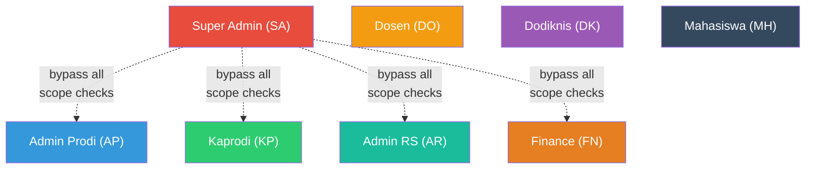
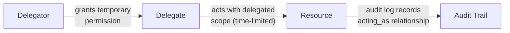
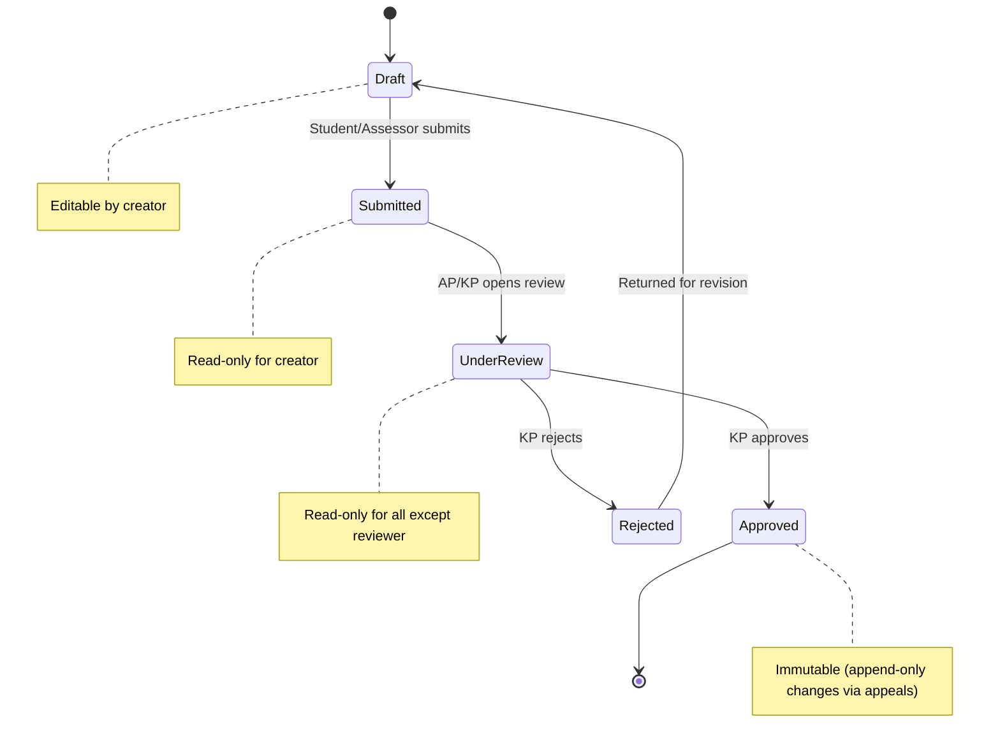

# RBAC Matrix — Academic Clinical Management System

**Document ID**: ACMS-BUILD-008  
**Version**: 1.0.0  
**Date**: 2026-06-08  
**Status**: Draft  
**Owner**: Enterprise Architecture Board  
**Classification**: Internal — Confidential  
**Last Reviewed**: 2026-06-08  
**Next Review**: 2026-07-08  

---

## Table of Contents

1. [Overview](#1-overview)
2. [Role Definitions](#2-role-definitions)
3. [Permission Codes](#3-permission-codes)
4. [Permission Matrix](#4-permission-matrix)
   - 4.1 [System Administration](#41-system-administration)
   - 4.2 [Academic Management](#42-academic-management)
   - 4.3 [Rotation Management](#43-rotation-management)
   - 4.4 [Clinical Activities](#44-clinical-activities)
   - 4.5 [Assessment & Grading](#45-assessment--grading)
   - 4.6 [Examinations](#46-examinations)
   - 4.7 [Financial Operations](#47-financial-operations)
   - 4.8 [Notifications](#48-notifications)
   - 4.9 [Analytics & Reports](#49-analytics--reports)
   - 4.10 [Audit Trail](#410-audit-trail)
   - 4.11 [File Management](#411-file-management)
5. [Row-Level Security Rules](#5-row-level-security-rules)
6. [Permission Inheritance](#6-permission-inheritance)
7. [Delegation Rules](#7-delegation-rules)
8. [Dynamic Permissions](#8-dynamic-permissions)
9. [API Endpoint Authorization](#9-api-endpoint-authorization)
10. [Implementation Notes](#10-implementation-notes)
11. [Appendix A — Permission Catalog](#appendix-a--permission-catalog)
12. [Appendix B — Glossary](#appendix-b--glossary)
13. [Revision History](#revision-history)

---

## 1. Overview

### 1.1 Purpose

This document defines the complete Role-Based Access Control (RBAC) matrix for the Academic Clinical Management System (ACMS). It specifies which roles may perform which actions on which resources, under what conditions, and with what scope constraints.

### 1.2 Scope

The RBAC matrix covers:

- **8 core user roles** within the ACMS
- **11 resource categories** spanning all system domains
- **Row-level security** (RLS) rules for data isolation
- **Permission inheritance** hierarchy
- **Delegation** rules for temporary role assumption
- **Dynamic permissions** that change based on workflow state
- **API endpoint authorization** mapping
- **Implementation guidance** for Laravel Policies, Gates, Middleware, and Spatie Permission

### 1.3 Design Principles

| Principle | Description |
|-----------|-------------|
| **Least Privilege** | Every role receives the minimum permissions required to perform its function. No role has broader access than explicitly documented here. |
| **Deny by Default** | Any resource–action combination not explicitly granted in this matrix is denied. |
| **Separation of Duties** | Critical operations (e.g., grade submission vs. grade approval) require different roles. No single role can both submit and approve the same record. |
| **Scope Isolation** | Permissions are further restricted by scope — program, hospital, or personal ownership — as defined in the Row-Level Security section. |
| **Auditability** | Every permission check (grant or deny) is logged to the audit trail with the evaluating policy, requesting user, target resource, and result. |
| **Multi-Tenancy Awareness** | All permission checks incorporate tenant discriminator columns (`program_id`, `faculty_id`) to prevent cross-tenant data leakage. |

### 1.4 Relationship to Other Documents

| Document | Relationship |
|----------|-------------|
| `ARCHITECTURE.md` | Defines the Clean Architecture layers where authorization enforcement occurs |
| `DATABASE_SCHEMA.md` | Defines the `roles`, `permissions`, `model_has_roles`, `role_has_permissions` tables |
| `API_SPECIFICATION.md` | Maps every API endpoint to the required permission codes from this document |
| `AUDIT_TRAIL_SPEC.md` | Defines what authorization events are captured and retained |
| `WORKFLOW_ENGINE.md` | Defines the state transitions that trigger dynamic permission changes |
| `CODING_STANDARDS.md` | Defines the Laravel Policy/Gate naming conventions and testing requirements |

---

## 2. Role Definitions

### 2.1 Role Summary

| Code | Role Name | Indonesian Name | Scope | Description |
|------|-----------|-----------------|-------|-------------|
| **SA** | Super Admin | Super Admin | Global | System-wide administration. Manages all programs, faculties, hospitals, and global configuration. Has unrestricted access to all resources. This role is intentionally limited to ≤ 3 users. |
| **AP** | Admin Prodi | Admin Program Studi | Program | Manages day-to-day academic operations for a specific study program (`program_id`). Creates rotations, enrolls students, manages schedules. |
| **KP** | Kaprodi | Ketua Program Studi | Program | Head of Study Program. Oversight, monitoring, and approval authority. Approves grades, rotation plans, and curriculum changes for their program. |
| **DO** | Dosen | Dosen / Lecturer | Program | Faculty member responsible for academic assessment. Conducts Mini-CEX, DOPS, CBD, writes exam questions, grades OSCE stations. Scoped to their assigned stase and students. |
| **DK** | Dodiknis | Dokter Pendidik Klinis | Hospital + Stase | Clinical Preceptor at a partner hospital. Supervises students during clinical rotations, provides clinical assessment and logbook sign-offs. Scoped to their hospital and assigned stase. |
| **AR** | Admin RS | Admin Rumah Sakit | Hospital | Hospital Administrator at a partner hospital. Manages hospital capacity, facilities, and clinical placement logistics. Scoped to their hospital (`hospital_id`). |
| **MH** | Mahasiswa | Mahasiswa | Own Records | Medical student in the Professional Doctor Program (Koas). Can view their own academic records, submit logbook entries, and request rotation swaps. |
| **FN** | Finance | Finance / Keuangan | Program | Financial administrator. Manages billing, payment tracking, and honorarium calculation/distribution. Scoped to their assigned program(s). |

### 2.2 Role Constraints

| Constraint | Rule |
|-----------|------|
| **One primary role per user** | Each user account holds exactly one primary role. A user cannot be both Dosen and Mahasiswa simultaneously. |
| **Multi-program assignment** | AP, KP, DO, and FN can be assigned to multiple programs. Each program assignment is a separate scope context. |
| **Multi-hospital assignment** | DK and AR can be assigned to multiple hospitals. Each hospital assignment is a separate scope context. |
| **Role activation** | Roles are active only for the academic period they are assigned. Historical role assignments are retained for audit but do not grant current access. |
| **Super Admin bypass** | SA bypasses all scope restrictions. This is enforced at the authorization layer, not by granting individual permissions. SA actions are logged with elevated audit detail. |

---

## 3. Permission Codes

### 3.1 Action Codes

| Code | Action | Description |
|------|--------|-------------|
| **C** | Create | Insert a new resource record |
| **R** | Read | View/retrieve resource data |
| **U** | Update | Modify an existing resource record |
| **D** | Delete | Remove a resource record (soft-delete unless otherwise specified) |
| **A** | Approve | Execute an approval action on a resource (state transition) |
| **—** | No Access | The role has no permission for this resource–action combination |

### 3.2 Scope Modifiers

Scope modifiers appear as superscript annotations on action codes to further constrain the permission:

| Modifier | Meaning | Example |
|----------|---------|---------|
| **Own** | Only the user's own records | `R-Own` — Student can read only their own grades |
| **Scope** | Within the user's assigned scope (program, hospital, stase) | `R-Scope` — Dosen can read grades only for students in their assigned stase |
| **Prog** | Within the user's assigned program(s) | `R-Prog` — Admin Prodi can read all students within their program |
| **Hosp** | Within the user's assigned hospital(s) | `R-Hosp` — Admin RS can read rotation data for their hospital |
| **All** | No scope restriction (global access) | `R-All` — Super Admin can read all records across the system |

### 3.3 Reading the Matrix

A cell value like `CR-Scope` means the role can **Create** and **Read** records, but only within their assigned scope. A cell value of `CRUD-All` means full access with no scope restriction. A dash (`—`) means no access at all.

---

## 4. Permission Matrix

> [!IMPORTANT]
> Super Admin (SA) has **full CRUD + Approve** access to **all resources** with **global scope** (`CRUDA-All`). For brevity, the SA column shows `✦` to indicate unrestricted access. The only exception is noted inline where SA access is intentionally constrained.

### 4.1 System Administration

| Resource | SA | AP | KP | DO | DK | AR | MH | FN |
|----------|----|----|----|----|----|----|----|----|
| **User Accounts — Create** | ✦ | C-Prog | — | — | — | — | — | — |
| **User Accounts — Read** | ✦ | R-Prog | R-Prog | R-Scope | R-Scope | R-Hosp | R-Own | R-Prog |
| **User Accounts — Update** | ✦ | U-Prog | — | U-Own | U-Own | U-Own | U-Own | U-Own |
| **User Accounts — Delete** | ✦ | — | — | — | — | — | — | — |
| **User Accounts — Deactivate** | ✦ | U-Prog | — | — | — | — | — | — |
| **Role Assignment** | ✦ | C-Prog¹ | — | — | — | — | — | — |
| **System Configuration** | ✦ | — | — | — | — | — | — | — |
| **Program Management — Create** | ✦ | — | — | — | — | — | — | — |
| **Program Management — Read** | ✦ | R-Prog | R-Prog | R-Prog | — | — | R-Own | R-Prog |
| **Program Management — Update** | ✦ | — | — | — | — | — | — | — |
| **Program Management — Delete** | ✦ | — | — | — | — | — | — | — |
| **Faculty Management** | ✦ | — | — | — | — | — | — | — |
| **Hospital Management — Create** | ✦ | — | — | — | — | — | — | — |
| **Hospital Management — Read** | ✦ | R-Prog | R-Prog | R-Scope | R-Hosp | R-Hosp | R-Prog | — |
| **Hospital Management — Update** | ✦ | — | — | — | — | U-Hosp | — | — |
| **Hospital Management — Delete** | ✦ | — | — | — | — | — | — | — |
| **Academic Period Management** | ✦ | CR-Prog | R-Prog | R-Prog | — | — | R-Own | R-Prog |
| **System Health Monitor** | ✦ | — | — | — | — | — | — | — |
| **Feature Flags** | ✦ | — | — | — | — | — | — | — |
| **Email Templates** | ✦ | R-Prog | — | — | — | — | — | — |

> ¹ Admin Prodi can assign roles **except** SA and KP. SA role assignment requires an existing SA. KP role assignment requires SA approval.

---

### 4.2 Academic Management

| Resource | SA | AP | KP | DO | DK | AR | MH | FN |
|----------|----|----|----|----|----|----|----|----|
| **Curriculum — Create** | ✦ | C-Prog | — | — | — | — | — | — |
| **Curriculum — Read** | ✦ | R-Prog | R-Prog | R-Prog | R-Prog | — | R-Own | — |
| **Curriculum — Update** | ✦ | U-Prog | A-Prog | — | — | — | — | — |
| **Curriculum — Delete** | ✦ | D-Prog² | — | — | — | — | — | — |
| **Stase Definition — Create** | ✦ | C-Prog | — | — | — | — | — | — |
| **Stase Definition — Read** | ✦ | R-Prog | R-Prog | R-Prog | R-Scope | R-Hosp | R-Prog | — |
| **Stase Definition — Update** | ✦ | U-Prog | A-Prog | — | — | — | — | — |
| **Stase Definition — Delete** | ✦ | D-Prog² | — | — | — | — | — | — |
| **Course / Mata Kuliah — Create** | ✦ | C-Prog | — | — | — | — | — | — |
| **Course / Mata Kuliah — Read** | ✦ | R-Prog | R-Prog | R-Prog | R-Scope | — | R-Own | — |
| **Course / Mata Kuliah — Update** | ✦ | U-Prog | A-Prog | — | — | — | — | — |
| **Course / Mata Kuliah — Delete** | ✦ | D-Prog² | — | — | — | — | — | — |
| **Academic Calendar — Create** | ✦ | C-Prog | — | — | — | — | — | — |
| **Academic Calendar — Read** | ✦ | R-Prog | R-Prog | R-Prog | R-Prog | R-Hosp | R-Prog | R-Prog |
| **Academic Calendar — Update** | ✦ | U-Prog | A-Prog | — | — | — | — | — |
| **Academic Calendar — Delete** | ✦ | D-Prog² | — | — | — | — | — | — |
| **Student Enrollment — Create** | ✦ | C-Prog | — | — | — | — | — | — |
| **Student Enrollment — Read** | ✦ | R-Prog | R-Prog | R-Scope | R-Scope | R-Hosp | R-Own | R-Prog |
| **Student Enrollment — Update** | ✦ | U-Prog | A-Prog | — | — | — | — | — |
| **Student Enrollment — Delete** | ✦ | D-Prog | — | — | — | — | — | — |
| **Prerequisite Rules** | ✦ | CRU-Prog | R-Prog | R-Prog | — | — | R-Prog | — |
| **Competency Catalog** | ✦ | CRU-Prog | RU-Prog | R-Prog | R-Scope | — | R-Prog | — |

> ² Delete is only allowed when the record has no dependent data (e.g., no students enrolled, no assessments completed). Enforced by the domain service.

---

### 4.3 Rotation Management

| Resource | SA | AP | KP | DO | DK | AR | MH | FN |
|----------|----|----|----|----|----|----|----|----|
| **Rotation Period — Create** | ✦ | C-Prog | — | — | — | — | — | — |
| **Rotation Period — Read** | ✦ | R-Prog | R-Prog | R-Prog | R-Hosp | R-Hosp | R-Own | R-Prog |
| **Rotation Period — Update** | ✦ | U-Prog | A-Prog | — | — | — | — | — |
| **Rotation Period — Delete** | ✦ | D-Prog³ | — | — | — | — | — | — |
| **Rotation Assignment — Create** | ✦ | C-Prog | — | — | — | — | — | — |
| **Rotation Assignment — Read** | ✦ | R-Prog | R-Prog | R-Scope | R-Scope | R-Hosp | R-Own | R-Prog |
| **Rotation Assignment — Update** | ✦ | U-Prog | A-Prog | — | — | — | — | — |
| **Rotation Assignment — Delete** | ✦ | D-Prog³ | — | — | — | — | — | — |
| **Rotation Assignment — Approve** | ✦ | — | A-Prog | — | — | — | — | — |
| **Rotation Schedule (Published)** | ✦ | R-Prog | R-Prog | R-Scope | R-Scope | R-Hosp | R-Own | — |
| **Rotation Swap Request — Create** | ✦ | C-Prog | — | — | — | — | C-Own | — |
| **Rotation Swap Request — Read** | ✦ | R-Prog | R-Prog | — | — | — | R-Own | — |
| **Rotation Swap Request — Approve** | ✦ | A-Prog | A-Prog | — | — | — | — | — |
| **Rotation Swap Request — Cancel** | ✦ | U-Prog | — | — | — | — | U-Own⁴ | — |
| **Hospital Capacity Quotas — Create** | ✦ | — | — | — | — | C-Hosp | — | — |
| **Hospital Capacity Quotas — Read** | ✦ | R-Prog | R-Prog | — | R-Hosp | R-Hosp | — | — |
| **Hospital Capacity Quotas — Update** | ✦ | — | — | — | — | U-Hosp | — | — |
| **Hospital–Stase Mapping — Create** | ✦ | C-Prog | — | — | — | C-Hosp | — | — |
| **Hospital–Stase Mapping — Read** | ✦ | R-Prog | R-Prog | R-Scope | R-Hosp | R-Hosp | R-Prog | — |
| **Hospital–Stase Mapping — Update** | ✦ | U-Prog | — | — | — | U-Hosp | — | — |
| **Hospital–Stase Mapping — Delete** | ✦ | D-Prog | — | — | — | D-Hosp³ | — | — |
| **Preceptor Assignment** | ✦ | CRU-Prog | R-Prog | R-Scope | R-Own | R-Hosp | R-Own | — |
| **Blackout Period Management** | ✦ | CRU-Prog | R-Prog | — | — | CRU-Hosp | — | — |

> ³ Delete only allowed for rotation periods/assignments in `draft` state. Published or active rotations cannot be deleted.
> ⁴ Student can cancel their own swap request only while it is in `pending` state.

---

### 4.4 Clinical Activities

| Resource | SA | AP | KP | DO | DK | AR | MH | FN |
|----------|----|----|----|----|----|----|----|----|
| **Logbook Entry — Create** | ✦ | — | — | — | — | — | C-Own | — |
| **Logbook Entry — Read** | ✦ | R-Prog | R-Prog | R-Scope | R-Scope | — | R-Own | — |
| **Logbook Entry — Update** | ✦ | — | — | — | — | — | U-Own⁵ | — |
| **Logbook Entry — Delete** | ✦ | — | — | — | — | — | D-Own⁵ | — |
| **Logbook Entry — Sign-off** | ✦ | — | — | A-Scope | A-Scope | — | — | — |
| **Clinical Procedure Log — Create** | ✦ | — | — | — | — | — | C-Own | — |
| **Clinical Procedure Log — Read** | ✦ | R-Prog | R-Prog | R-Scope | R-Scope | — | R-Own | — |
| **Clinical Procedure Log — Update** | ✦ | — | — | — | — | — | U-Own⁵ | — |
| **Clinical Procedure Log — Verify** | ✦ | — | — | A-Scope | A-Scope | — | — | — |
| **Patient Encounter Log — Create** | ✦ | — | — | — | — | — | C-Own | — |
| **Patient Encounter Log — Read** | ✦ | R-Prog | R-Prog | R-Scope | R-Scope | — | R-Own | — |
| **Patient Encounter Log — Update** | ✦ | — | — | — | — | — | U-Own⁵ | — |
| **Skill Checklist — Read** | ✦ | R-Prog | R-Prog | R-Scope | R-Scope | — | R-Own | — |
| **Skill Checklist — Update Progress** | ✦ | — | — | U-Scope | U-Scope | — | — | — |
| **Preceptor Feedback — Create** | ✦ | — | — | C-Scope | C-Scope | — | — | — |
| **Preceptor Feedback — Read** | ✦ | R-Prog | R-Prog | R-Scope | R-Scope | — | R-Own | — |
| **Preceptor Feedback — Update** | ✦ | — | — | U-Own⁶ | U-Own⁶ | — | — | — |
| **Clinical Activity Summary** | ✦ | R-Prog | R-Prog | R-Scope | R-Scope | R-Hosp | R-Own | — |

> ⁵ Students can update/delete their own logbook entries, procedure logs, and encounter logs only while the entry is in `draft` state. Once submitted, the entry is immutable for the student.
> ⁶ Preceptor feedback can be updated by the original author only within 72 hours of creation and only if no subsequent actions (e.g., grade calculation) have consumed the feedback.

---

### 4.5 Assessment & Grading

| Resource | SA | AP | KP | DO | DK | AR | MH | FN |
|----------|----|----|----|----|----|----|----|----|
| **Mini-CEX Assessment — Create** | ✦ | — | — | C-Scope | C-Scope | — | — | — |
| **Mini-CEX Assessment — Read** | ✦ | R-Prog | R-Prog | R-Scope | R-Scope | — | R-Own | — |
| **Mini-CEX Assessment — Update** | ✦ | — | — | U-Own⁷ | U-Own⁷ | — | — | — |
| **DOPS Assessment — Create** | ✦ | — | — | C-Scope | C-Scope | — | — | — |
| **DOPS Assessment — Read** | ✦ | R-Prog | R-Prog | R-Scope | R-Scope | — | R-Own | — |
| **DOPS Assessment — Update** | ✦ | — | — | U-Own⁷ | U-Own⁷ | — | — | — |
| **CBD Assessment — Create** | ✦ | — | — | C-Scope | C-Scope | — | — | — |
| **CBD Assessment — Read** | ✦ | R-Prog | R-Prog | R-Scope | R-Scope | — | R-Own | — |
| **CBD Assessment — Update** | ✦ | — | — | U-Own⁷ | U-Own⁷ | — | — | — |
| **Logbook Assessment (Sign-off)** | ✦ | — | — | A-Scope | A-Scope | — | — | — |
| **Grade Submission — Create** | ✦ | — | — | C-Scope | C-Scope | — | — | — |
| **Grade Submission — Read** | ✦ | R-Prog | R-Prog | R-Scope | R-Scope | — | R-Own | — |
| **Grade Submission — Update** | ✦ | — | — | U-Own⁸ | U-Own⁸ | — | — | — |
| **Grade Approval** | ✦ | — | A-Prog | — | — | — | — | — |
| **Grade Record (Final, Approved)** | ✦ | R-Prog | R-Prog | R-Scope | R-Scope | — | R-Own | — |
| **Grade Appeal — Create** | ✦ | — | — | — | — | — | C-Own | — |
| **Grade Appeal — Read** | ✦ | R-Prog | R-Prog | R-Scope | R-Scope | — | R-Own | — |
| **Grade Appeal — Review** | ✦ | — | A-Prog | — | — | — | — | — |
| **Grade Appeal — Resolve** | ✦ | — | A-Prog | U-Scope⁹ | — | — | — | — |
| **Assessment Rubric — Create** | ✦ | CRU-Prog | — | — | — | — | — | — |
| **Assessment Rubric — Read** | ✦ | R-Prog | R-Prog | R-Prog | R-Scope | — | R-Prog | — |
| **Assessment Rubric — Update** | ✦ | U-Prog | A-Prog | — | — | — | — | — |
| **Stase Completion Status** | ✦ | R-Prog | R-Prog | R-Scope | R-Scope | R-Hosp | R-Own | — |

> ⁷ Assessors can update their own assessments only while the assessment is in `draft` state. Once submitted (state = `submitted`), the assessment is locked for the assessor.
> ⁸ Grades can only be updated by the submitting assessor while in `submitted` state (before approval). Once approved, grades are immutable except via the appeal process.
> ⁹ When a grade appeal is upheld by KP, the original Dosen (or a designated Dosen) is asked to revise the grade. This is a scoped update, not an unrestricted edit.

---

### 4.6 Examinations

| Resource | SA | AP | KP | DO | DK | AR | MH | FN |
|----------|----|----|----|----|----|----|----|----|
| **OSCE Schedule — Create** | ✦ | C-Prog | — | — | — | — | — | — |
| **OSCE Schedule — Read** | ✦ | R-Prog | R-Prog | R-Prog | — | R-Hosp¹⁰ | R-Own | — |
| **OSCE Schedule — Update** | ✦ | U-Prog | A-Prog | — | — | — | — | — |
| **OSCE Schedule — Delete** | ✦ | D-Prog¹¹ | — | — | — | — | — | — |
| **OSCE Station Assignment** | ✦ | CRU-Prog | R-Prog | R-Scope | — | — | R-Own | — |
| **OSCE Score Entry — Create** | ✦ | — | — | C-Scope | — | — | — | — |
| **OSCE Score Entry — Read** | ✦ | R-Prog | R-Prog | R-Scope | — | — | R-Own | — |
| **OSCE Score Entry — Update** | ✦ | — | — | U-Own⁷ | — | — | — | — |
| **Written Exam — Create** | ✦ | C-Prog | — | — | — | — | — | — |
| **Written Exam — Read** | ✦ | R-Prog | R-Prog | R-Scope | — | — | R-Own¹² | — |
| **Written Exam — Update** | ✦ | U-Prog | A-Prog | — | — | — | — | — |
| **Written Exam — Delete** | ✦ | D-Prog¹¹ | — | — | — | — | — | — |
| **Exam Question Bank — Create** | ✦ | — | — | C-Prog | — | — | — | — |
| **Exam Question Bank — Read** | ✦ | R-Prog | R-Prog | R-Own | — | — | — | — |
| **Exam Question Bank — Update** | ✦ | — | — | U-Own | — | — | — | — |
| **Exam Question Bank — Delete** | ✦ | D-Prog | — | D-Own¹³ | — | — | — | — |
| **Exam Results — Read** | ✦ | R-Prog | R-Prog | R-Scope | — | — | R-Own | — |
| **Exam Results — Publish** | ✦ | — | A-Prog | — | — | — | — | — |
| **UKMPPD Tracking — Read** | ✦ | R-Prog | R-Prog | R-Scope | — | — | R-Own | — |
| **UKMPPD Tracking — Update** | ✦ | U-Prog | — | — | — | — | — | — |
| **Remedial Exam — Create** | ✦ | C-Prog | — | — | — | — | — | — |
| **Remedial Exam — Read** | ✦ | R-Prog | R-Prog | R-Scope | — | — | R-Own | — |
| **Remedial Exam — Approve** | ✦ | — | A-Prog | — | — | — | — | — |
| **Remedial Exam Results** | ✦ | R-Prog | R-Prog | R-Scope | — | — | R-Own | — |

> ¹⁰ Hospital admins can view OSCE schedules only when the OSCE is held at their hospital.
> ¹¹ Exam schedules can only be deleted in `draft` state before any student registrations.
> ¹² Students can view exam content only during the active exam session window. Post-exam, they can only view their results, not the exam content.
> ¹³ Dosen can delete their own exam questions only when the question has not been included in any published exam.

---

### 4.7 Financial Operations

| Resource | SA | AP | KP | DO | DK | AR | MH | FN |
|----------|----|----|----|----|----|----|----|----|
| **Billing Record — Create** | ✦ | — | — | — | — | — | — | C-Prog |
| **Billing Record — Read** | ✦ | R-Prog | R-Prog | — | — | — | R-Own | R-Prog |
| **Billing Record — Update** | ✦ | — | — | — | — | — | — | U-Prog |
| **Billing Record — Delete** | ✦ | — | — | — | — | — | — | D-Prog¹⁴ |
| **Payment Tracking — Create** | ✦ | — | — | — | — | — | — | C-Prog |
| **Payment Tracking — Read** | ✦ | R-Prog | R-Prog | — | — | — | R-Own | R-Prog |
| **Payment Tracking — Update** | ✦ | — | — | — | — | — | — | U-Prog |
| **Student Payment Status** | ✦ | R-Prog | R-Prog | — | — | — | R-Own | R-Prog |
| **Honorarium Calculation — Create** | ✦ | — | — | — | — | — | — | C-Prog |
| **Honorarium Calculation — Read** | ✦ | R-Prog | R-Prog | R-Own | R-Own | — | — | R-Prog |
| **Honorarium Calculation — Update** | ✦ | — | — | — | — | — | — | U-Prog |
| **Honorarium Approval** | ✦ | — | A-Prog | — | — | — | — | — |
| **Honorarium Disbursement** | ✦ | — | — | — | — | — | — | CRU-Prog |
| **Financial Reports — General** | ✦ | R-Prog | R-Prog | — | — | — | — | R-Prog |
| **Financial Reports — Detailed** | ✦ | — | R-Prog | — | — | — | — | R-Prog |
| **Invoice Generation** | ✦ | — | — | — | — | — | — | C-Prog |
| **Refund Processing** | ✦ | — | — | — | — | — | — | CRU-Prog¹⁵ |

> ¹⁴ Billing records can only be deleted when in `draft` state and no payments have been recorded.
> ¹⁵ Refunds above a configurable threshold (default: IDR 5,000,000) require KP approval.

---

### 4.8 Notifications

| Resource | SA | AP | KP | DO | DK | AR | MH | FN |
|----------|----|----|----|----|----|----|----|----|
| **System Broadcast — Send** | ✦ | — | — | — | — | — | — | — |
| **Program Notification — Send** | ✦ | C-Prog | C-Prog | — | — | — | — | C-Prog |
| **Hospital Notification — Send** | ✦ | — | — | — | — | C-Hosp | — | — |
| **Individual Notification — Send** | ✦ | C-Prog | C-Prog | C-Scope | C-Scope | C-Hosp | — | C-Prog |
| **Notification Preferences — Read** | ✦ | R-Own | R-Own | R-Own | R-Own | R-Own | R-Own | R-Own |
| **Notification Preferences — Update** | ✦ | U-Own | U-Own | U-Own | U-Own | U-Own | U-Own | U-Own |
| **Notification History — Read** | ✦ | R-Prog | R-Prog | R-Own | R-Own | R-Hosp | R-Own | R-Own |
| **Notification Templates — Manage** | ✦ | R-Prog | — | — | — | — | — | — |
| **Scheduled Notifications** | ✦ | CRU-Prog | R-Prog | — | — | — | — | — |
| **Notification Channel Config** | ✦ | — | — | — | — | — | — | — |

---

### 4.9 Analytics & Reports

| Resource | SA | AP | KP | DO | DK | AR | MH | FN |
|----------|----|----|----|----|----|----|----|----|
| **System Dashboard** | ✦ | — | — | — | — | — | — | — |
| **Program Dashboard** | ✦ | R-Prog | R-Prog | — | — | — | — | — |
| **Hospital Dashboard** | ✦ | R-Prog | R-Prog | — | — | R-Hosp | — | — |
| **Personal Dashboard** | ✦ | R-Own | R-Own | R-Own | R-Own | R-Own | R-Own | R-Own |
| **Student Progress Report — Individual** | ✦ | R-Prog | R-Prog | R-Scope | R-Scope | — | R-Own | — |
| **Student Progress Report — Cohort** | ✦ | R-Prog | R-Prog | — | — | — | — | — |
| **Program-Wide Analytics** | ✦ | R-Prog | R-Prog | — | — | — | — | — |
| **Stase Completion Analytics** | ✦ | R-Prog | R-Prog | R-Scope | R-Scope | R-Hosp | — | — |
| **Assessment Analytics** | ✦ | R-Prog | R-Prog | R-Scope | R-Scope | — | — | — |
| **Hospital Utilization Report** | ✦ | R-Prog | R-Prog | — | — | R-Hosp | — | — |
| **Preceptor Workload Report** | ✦ | R-Prog | R-Prog | R-Own | R-Own | R-Hosp | — | — |
| **Financial Summary Report** | ✦ | R-Prog | R-Prog | — | — | — | — | R-Prog |
| **UKMPPD Pass Rate Analytics** | ✦ | R-Prog | R-Prog | — | — | — | — | — |
| **Regulatory Compliance Report** | ✦ | R-Prog | R-Prog | — | — | — | — | — |
| **Export Report Data (CSV/PDF)** | ✦ | R-Prog | R-Prog | R-Scope | R-Scope | R-Hosp | R-Own | R-Prog |

---

### 4.10 Audit Trail

| Resource | SA | AP | KP | DO | DK | AR | MH | FN |
|----------|----|----|----|----|----|----|----|----|
| **View Audit Logs — System** | ✦ | — | — | — | — | — | — | — |
| **View Audit Logs — Program** | ✦ | R-Prog | R-Prog | — | — | — | — | — |
| **View Audit Logs — Own Actions** | ✦ | R-Own | R-Own | R-Own | R-Own | R-Own | R-Own | R-Own |
| **Export Audit Data** | ✦ | — | — | — | — | — | — | — |
| **Audit Log Configuration** | ✦ | — | — | — | — | — | — | — |
| **Audit Log Retention Mgmt** | ✦ | — | — | — | — | — | — | — |

> [!CAUTION]
> Audit logs are **append-only** and **immutable**. No role — including Super Admin — can update or delete audit log entries. The `✦` for SA in this category only applies to Read and Export operations, never to modification or deletion.

---

### 4.11 File Management

| Resource | SA | AP | KP | DO | DK | AR | MH | FN |
|----------|----|----|----|----|----|----|----|----|
| **Upload — Profile Photo** | ✦ | U-Own | U-Own | U-Own | U-Own | U-Own | U-Own | U-Own |
| **Upload — Logbook Attachments** | ✦ | — | — | — | — | — | C-Own | — |
| **Upload — Assessment Evidence** | ✦ | — | — | C-Scope | C-Scope | — | — | — |
| **Upload — Administrative Docs** | ✦ | C-Prog | — | — | — | C-Hosp | — | C-Prog |
| **Upload — Exam Materials** | ✦ | C-Prog | — | C-Prog | — | — | — | — |
| **Upload — Student Documents** | ✦ | — | — | — | — | — | C-Own | — |
| **Download — Own Documents** | ✦ | R-Own | R-Own | R-Own | R-Own | R-Own | R-Own | R-Own |
| **Download — Program Documents** | ✦ | R-Prog | R-Prog | R-Scope | R-Scope | R-Hosp | — | R-Prog |
| **Download — Student Documents** | ✦ | R-Prog | R-Prog | R-Scope | R-Scope | — | R-Own | — |
| **Delete — Own Documents** | ✦ | D-Own | D-Own | D-Own | D-Own | D-Own | D-Own¹⁶ | D-Own |
| **Delete — Program Documents** | ✦ | D-Prog | — | — | — | — | — | — |
| **Storage Quota Management** | ✦ | — | — | — | — | — | — | — |
| **Virus Scan Override** | ✦ | — | — | — | — | — | — | — |

> ¹⁶ Students can only delete their own documents when the document is not referenced by a submitted logbook entry, assessment, or any other finalized record.

---

## 5. Row-Level Security Rules

Row-Level Security (RLS) ensures that even when a role has Read permission for a resource category, the returned data is filtered to only the records within that user's authorized scope.

### 5.1 RLS Filtering Rules

| Role | Primary Filter | Secondary Filter | Description |
|------|----------------|-------------------|-------------|
| **SA** | None | None | Unrestricted access to all rows across all tenants |
| **AP** | `program_id IN (user.program_ids)` | None | Sees only records belonging to their assigned program(s) |
| **KP** | `program_id IN (user.program_ids)` | None | Same as AP; scoped to their program(s) |
| **DO** | `program_id IN (user.program_ids)` | `stase_id IN (user.assigned_stase_ids) AND academic_period_id = current_period` | Sees only students and records within their assigned stase(s) for the current academic period |
| **DK** | `hospital_id IN (user.hospital_ids)` | `stase_id IN (user.assigned_stase_ids) AND rotation_id IN (active_rotations)` | Sees only students currently rotating at their hospital in their assigned stase |
| **AR** | `hospital_id IN (user.hospital_ids)` | None | Sees only records related to their hospital(s) |
| **MH** | `student_id = user.id` | None | Sees only their own records |
| **FN** | `program_id IN (user.program_ids)` | None | Sees only financial records for their assigned program(s) |

### 5.2 Cross-Scope Visibility Rules

| Scenario | Allowed? | Justification |
|----------|----------|---------------|
| AP views students from another program | ❌ No | Strict program isolation |
| KP views all programs in their faculty | ❌ No | KP scope is program-level, not faculty-level. Faculty-level viewing requires SA or a future Faculty Dean role. |
| DO views students across multiple stase they teach | ✅ Yes | Dosen may teach multiple stase. Each stase they are assigned to is within their scope. |
| DK views students at a hospital they are not assigned to | ❌ No | Strict hospital isolation |
| MH views another student's grades | ❌ No | Students see only their own records |
| FN views clinical activity details | ❌ No | Finance sees financial records only. Clinical data is not within Finance scope, even if financially relevant. |
| AR views student assessment details | ❌ No | Hospital admins see rotation logistics (who, when, where) but not clinical assessment content |
| DO views financial data | ❌ No | Dosen can view their own honorarium records only |

### 5.3 Temporal RLS Rules

| Rule | Description |
|------|-------------|
| **Active Period Restriction** | DO and DK see only records from the current academic period by default. Historical data requires an explicit query with audit logging. |
| **Post-Graduation Access** | After a student graduates, their records remain accessible to AP and KP for 7 years (regulatory retention). MH access is terminated upon graduation but can be restored via SA for transcript requests. |
| **Inactive Preceptor** | When a DK is deactivated at a hospital, their access to that hospital's data is immediately revoked. Their historical assessments remain in the system but are not editable. |

---

## 6. Permission Inheritance

### 6.1 Role Hierarchy

ACMS uses a **flat role model** — roles do not inherit permissions from other roles. Each role's permissions are explicitly defined in the matrix above. This design was chosen to:

1. **Prevent privilege escalation** through unexpected inheritance chains
2. **Maintain audit clarity** — every permission is traceable to an explicit grant, not an implicit inheritance
3. **Simplify the mental model** — each role is self-contained and fully documented



> [!NOTE]
> The diagram above shows that SA can bypass scope checks to act with any scope, but SA does **not** inherit other roles' permissions — SA has its own superset of permissions defined independently.

### 6.2 Scope Inheritance within a Role

While roles do not inherit from each other, a user's **scope** can encompass multiple entities:

| Role | Scope Entity | Inheritance Rule |
|------|-------------|-----------------|
| AP | Program | If assigned to Program A and Program B, permissions apply independently to each program. No cross-program data leakage. |
| KP | Program | Same as AP. KP of Program A cannot approve grades in Program B. |
| DO | Program + Stase | Permissions apply to the intersection of their program(s) and assigned stase(s). |
| DK | Hospital + Stase | Permissions apply to the intersection of their hospital(s) and assigned stase(s). |
| AR | Hospital | If assigned to multiple hospitals, permissions apply independently. |
| FN | Program | Same as AP. Financial scope is per-program. |
| MH | Self | No inheritance. Scope is always exactly `student_id = self`. |

---

## 7. Delegation Rules

### 7.1 Delegation Model

ACMS supports **explicit, time-bounded, audited delegation** where one user can temporarily act on behalf of another within defined constraints.



### 7.2 Delegation Rules

| Delegator Role | Can Delegate To | Delegatable Permissions | Constraints |
|---------------|-----------------|------------------------|-------------|
| **SA** | Any SA | All SA permissions | Requires a second SA to approve the delegation. Cannot delegate to non-SA roles. |
| **KP** | AP or DO | Grade approval, rotation approval, curriculum approval | Maximum delegation period: 30 days. Must specify exact permissions delegated. Delegation is logged and timestamped. |
| **AP** | Another AP (within same program) | Student management, rotation management, notification sending | Maximum delegation period: 14 days. Cannot delegate role assignment. |
| **DO** | Another DO (within same stase) | Assessment creation, logbook sign-off | Maximum delegation period: 7 days. Only for the delegator's assigned students. Requires AP notification. |
| **DK** | Another DK (within same hospital + stase) | Clinical assessment, logbook sign-off | Maximum delegation period: 7 days. Requires AR or AP notification. |
| **AR** | Another AR (within same hospital) | Capacity management, hospital profile updates | Maximum delegation period: 14 days. Cannot delegate hospital onboarding/offboarding. |
| **MH** | — | No delegation allowed | Students cannot delegate. |
| **FN** | Another FN (within same program) | Billing, payment tracking | Maximum delegation period: 14 days. Cannot delegate honorarium approval. |

### 7.3 Delegation Lifecycle

| Phase | Requirements |
|-------|-------------|
| **Request** | Delegator specifies: delegate user, permissions, start/end datetime, reason |
| **Approval** | KP→AP/DO: Auto-approved if within standard constraints. SA→SA: Requires second SA approval. All others: Auto-approved with notification to supervisor. |
| **Active** | Delegate can perform delegated actions. All actions are logged with `acting_as: {delegator_id}` in the audit trail. Delegated permissions do not stack with the delegate's own permissions — they run in parallel. |
| **Expiry** | Delegation automatically expires at the specified end datetime. No manual revocation needed, but early revocation is supported. |
| **Revocation** | Delegator or SA can revoke a delegation at any time. Revocation is immediate and logged. |

### 7.4 Delegation Constraints

| Constraint | Rule |
|-----------|------|
| **No re-delegation** | A delegate cannot further delegate the permissions they received. |
| **No privilege escalation** | A delegator can only delegate permissions they themselves hold. |
| **Scope bound** | Delegated permissions are bound to the delegator's scope, not the delegate's. If Dosen A delegates to Dosen B, Dosen B can only assess Dosen A's assigned students. |
| **Audit tagging** | Every action performed under delegation is tagged with both the delegate's identity and the delegator's identity. |
| **Conflict resolution** | If a delegate has their own permissions that conflict with delegated permissions, the delegate acts under their own permissions by default. Delegated permissions must be explicitly invoked. |

---

## 8. Dynamic Permissions

Dynamic permissions are permissions that change based on the **state** of a resource or the **context** of the request. These are enforced in addition to the static matrix above.

### 8.1 Workflow State-Based Permissions



| Resource State | Student (MH) | Assessor (DO/DK) | Admin (AP) | Approver (KP) |
|---------------|-------------|------------------|-----------|---------------|
| **Draft** | CRUD-Own | — | R-Prog | — |
| **Submitted** | R-Own | R-Scope | R-Prog | R-Prog |
| **Under Review** | R-Own | R-Scope | R-Prog | RUA-Prog |
| **Approved** | R-Own | R-Scope | R-Prog | R-Prog |
| **Rejected** | CRUD-Own (reverts to Draft) | — | R-Prog | R-Prog |

### 8.2 Assessment State Permissions

| Assessment State | Assessor (DO/DK) | Student (MH) | Admin (AP) | Approver (KP) |
|-----------------|------------------|-------------|-----------|---------------|
| **In Progress** (assessor filling out) | CRU-Own | — | — | — |
| **Submitted** (assessor finalized) | R-Own | R-Own | R-Prog | R-Prog |
| **Grade Submitted** | R-Own | R-Own | R-Prog | RA-Prog |
| **Grade Approved** | R-Own | R-Own | R-Prog | R-Prog |
| **Appealed** | R-Own + U-Scope⁹ | R-Own | R-Prog | RA-Prog |

### 8.3 Rotation State Permissions

| Rotation State | AP | KP | AR | MH |
|---------------|----|----|----|----|
| **Planning** | CRUD-Prog | R-Prog | R-Hosp | — |
| **Published** | RU-Prog | RA-Prog | R-Hosp | R-Own |
| **Active** | R-Prog | R-Prog | R-Hosp | R-Own |
| **Completed** | R-Prog | R-Prog | R-Hosp | R-Own |
| **Cancelled** | R-Prog | R-Prog | R-Hosp | R-Own |

### 8.4 Time-Based Permission Rules

| Rule | Description | Enforcement |
|------|-------------|-------------|
| **Grade Edit Window** | After a grade is submitted, the assessor has a 48-hour window to self-correct before the grade enters the approval queue. After 48 hours, the grade auto-transitions to `under_review`. | Scheduled job + state machine |
| **Logbook Submission Deadline** | Students must submit logbook entries within 7 days of the clinical encounter. After 7 days, the entry can still be created but is flagged as `late`. After 30 days, creation is blocked. | Domain validation rule |
| **Rotation Swap Window** | Rotation swap requests can only be created at least 14 days before the rotation start date. Requests made later are automatically rejected. | Domain validation rule |
| **Exam Result Visibility Embargo** | Exam results are invisible to students until the KP publishes them. The `R-Own` permission for MH on exam results is conditional on `is_published = true`. | Policy condition |
| **Assessment Feedback Cooldown** | After an assessment is completed, the preceptor feedback is hidden from the student for 24 hours to prevent immediate confrontation. | Policy condition with timestamp check |
| **End-of-Stase Lock** | When a student's rotation in a stase ends, their ability to create new logbook entries and clinical activity records for that stase is revoked within 7 days of the rotation end date. | Scope recalculation on rotation state change |

### 8.5 Contextual Permission Rules

| Context | Permission Modification | Rationale |
|---------|------------------------|-----------|
| **During OSCE Exam Session** | MH gains `R-Own` on OSCE station content. All other read permissions for OSCE content are suspended for the duration. | Exam integrity — only the student taking the exam can see their station content. |
| **Student on Leave** | MH loses all `C` (Create) permissions for clinical activities and assessments. `R-Own` is retained. | Students on approved leave should not be logging clinical activities. |
| **Hospital Under Suspension** | All `C` permissions for AR at the suspended hospital are revoked. `R-Hosp` is retained. AP can still assign rotations to other hospitals. | Prevents new activity creation at a suspended partner hospital while retaining data access. |
| **Academic Period Transition** | During the transition window (2 weeks before/after period boundary), both the ending period and starting period are visible. Outside this window, only the current period is in scope. | Allows assessors to finalize grades from the ending period while new rotations begin. |

---

## 9. API Endpoint Authorization

### 9.1 Authorization Middleware Stack

Every API request passes through the following middleware chain in order:

```
Request → Authentication → Rate Limiting → Tenant Resolution → Role Check → Permission Check → Scope Filter → Controller
```

| Layer | Purpose | Implementation |
|-------|---------|---------------|
| **Authentication** | Verify JWT token validity and extract user identity | `auth:sanctum` middleware |
| **Rate Limiting** | Prevent API abuse | `throttle:api` middleware |
| **Tenant Resolution** | Resolve `program_id` and `faculty_id` from the authenticated user | Custom `ResolveTenant` middleware |
| **Role Check** | Verify the user has one of the allowed roles for the endpoint | `role:sa,ap,kp` middleware (Spatie) |
| **Permission Check** | Verify the user has the specific permission for the action | Laravel Policy `authorize()` call |
| **Scope Filter** | Apply RLS filters to the query based on the user's scope | Global query scope on Eloquent models |

### 9.2 Endpoint Authorization Map

> [!NOTE]
> This section maps representative API endpoints to their required role and permission. For the exhaustive endpoint list, see `API_SPECIFICATION.md`.

#### 9.2.1 System Administration Endpoints

| Method | Endpoint | Required Role(s) | Permission | Scope |
|--------|----------|-------------------|------------|-------|
| `GET` | `/api/v1/users` | SA, AP | `user.list` | SA: All, AP: Prog |
| `POST` | `/api/v1/users` | SA, AP | `user.create` | SA: All, AP: Prog |
| `GET` | `/api/v1/users/{id}` | SA, AP, KP, DO, DK, AR, MH, FN | `user.view` | Per RLS rules |
| `PUT` | `/api/v1/users/{id}` | SA, AP, Own | `user.update` | SA: All, AP: Prog, Own: Self |
| `DELETE` | `/api/v1/users/{id}` | SA | `user.delete` | All |
| `POST` | `/api/v1/users/{id}/roles` | SA, AP | `role.assign` | SA: All, AP: Prog (restricted) |
| `GET` | `/api/v1/config` | SA | `config.view` | All |
| `PUT` | `/api/v1/config` | SA | `config.update` | All |
| `GET` | `/api/v1/programs` | SA, AP, KP | `program.list` | SA: All, AP/KP: Prog |
| `POST` | `/api/v1/programs` | SA | `program.create` | All |
| `GET` | `/api/v1/hospitals` | SA, AP, KP, DO, DK, AR | `hospital.list` | Per RLS rules |
| `POST` | `/api/v1/hospitals` | SA | `hospital.create` | All |
| `PUT` | `/api/v1/hospitals/{id}` | SA, AR | `hospital.update` | SA: All, AR: Hosp |

#### 9.2.2 Academic Management Endpoints

| Method | Endpoint | Required Role(s) | Permission | Scope |
|--------|----------|-------------------|------------|-------|
| `GET` | `/api/v1/curricula` | SA, AP, KP, DO, DK, MH | `curriculum.list` | Per RLS rules |
| `POST` | `/api/v1/curricula` | SA, AP | `curriculum.create` | SA: All, AP: Prog |
| `PUT` | `/api/v1/curricula/{id}` | SA, AP | `curriculum.update` | SA: All, AP: Prog |
| `PUT` | `/api/v1/curricula/{id}/approve` | SA, KP | `curriculum.approve` | SA: All, KP: Prog |
| `GET` | `/api/v1/stases` | SA, AP, KP, DO, DK, AR, MH | `stase.list` | Per RLS rules |
| `POST` | `/api/v1/stases` | SA, AP | `stase.create` | SA: All, AP: Prog |
| `PUT` | `/api/v1/stases/{id}` | SA, AP | `stase.update` | SA: All, AP: Prog |
| `GET` | `/api/v1/enrollments` | SA, AP, KP, DO, DK, AR, MH, FN | `enrollment.list` | Per RLS rules |
| `POST` | `/api/v1/enrollments` | SA, AP | `enrollment.create` | SA: All, AP: Prog |
| `GET` | `/api/v1/academic-calendar` | SA, AP, KP, DO, DK, AR, MH, FN | `calendar.list` | Per RLS rules |
| `POST` | `/api/v1/academic-calendar` | SA, AP | `calendar.create` | SA: All, AP: Prog |

#### 9.2.3 Rotation Management Endpoints

| Method | Endpoint | Required Role(s) | Permission | Scope |
|--------|----------|-------------------|------------|-------|
| `GET` | `/api/v1/rotations` | SA, AP, KP, DO, DK, AR, MH, FN | `rotation.list` | Per RLS rules |
| `POST` | `/api/v1/rotations` | SA, AP | `rotation.create` | SA: All, AP: Prog |
| `PUT` | `/api/v1/rotations/{id}` | SA, AP | `rotation.update` | SA: All, AP: Prog |
| `DELETE` | `/api/v1/rotations/{id}` | SA, AP | `rotation.delete` | Draft only |
| `PUT` | `/api/v1/rotations/{id}/approve` | SA, KP | `rotation.approve` | SA: All, KP: Prog |
| `POST` | `/api/v1/rotation-assignments` | SA, AP | `rotation-assignment.create` | SA: All, AP: Prog |
| `GET` | `/api/v1/rotation-assignments` | SA, AP, KP, DO, DK, AR, MH, FN | `rotation-assignment.list` | Per RLS rules |
| `POST` | `/api/v1/rotation-swaps` | SA, AP, MH | `rotation-swap.create` | SA: All, AP: Prog, MH: Own |
| `PUT` | `/api/v1/rotation-swaps/{id}/approve` | SA, AP, KP | `rotation-swap.approve` | SA: All, AP/KP: Prog |
| `GET` | `/api/v1/hospital-quotas` | SA, AP, KP, DK, AR | `hospital-quota.list` | Per RLS rules |
| `PUT` | `/api/v1/hospital-quotas/{id}` | SA, AR | `hospital-quota.update` | SA: All, AR: Hosp |

#### 9.2.4 Clinical Activities Endpoints

| Method | Endpoint | Required Role(s) | Permission | Scope |
|--------|----------|-------------------|------------|-------|
| `GET` | `/api/v1/logbook-entries` | SA, AP, KP, DO, DK, MH | `logbook.list` | Per RLS rules |
| `POST` | `/api/v1/logbook-entries` | SA, MH | `logbook.create` | SA: All, MH: Own |
| `PUT` | `/api/v1/logbook-entries/{id}` | SA, MH | `logbook.update` | SA: All, MH: Own (Draft only) |
| `DELETE` | `/api/v1/logbook-entries/{id}` | SA, MH | `logbook.delete` | SA: All, MH: Own (Draft only) |
| `PUT` | `/api/v1/logbook-entries/{id}/sign-off` | SA, DO, DK | `logbook.signoff` | SA: All, DO/DK: Scope |
| `POST` | `/api/v1/clinical-procedures` | SA, MH | `procedure.create` | SA: All, MH: Own |
| `GET` | `/api/v1/clinical-procedures` | SA, AP, KP, DO, DK, MH | `procedure.list` | Per RLS rules |
| `PUT` | `/api/v1/clinical-procedures/{id}/verify` | SA, DO, DK | `procedure.verify` | SA: All, DO/DK: Scope |
| `POST` | `/api/v1/patient-encounters` | SA, MH | `encounter.create` | SA: All, MH: Own |
| `GET` | `/api/v1/patient-encounters` | SA, AP, KP, DO, DK, MH | `encounter.list` | Per RLS rules |
| `POST` | `/api/v1/preceptor-feedback` | SA, DO, DK | `feedback.create` | SA: All, DO/DK: Scope |
| `GET` | `/api/v1/skill-checklists` | SA, AP, KP, DO, DK, MH | `skill-checklist.list` | Per RLS rules |
| `PUT` | `/api/v1/skill-checklists/{id}` | SA, DO, DK | `skill-checklist.update` | SA: All, DO/DK: Scope |

#### 9.2.5 Assessment & Grading Endpoints

| Method | Endpoint | Required Role(s) | Permission | Scope |
|--------|----------|-------------------|------------|-------|
| `POST` | `/api/v1/assessments/mini-cex` | SA, DO, DK | `assessment.mini-cex.create` | SA: All, DO/DK: Scope |
| `POST` | `/api/v1/assessments/dops` | SA, DO, DK | `assessment.dops.create` | SA: All, DO/DK: Scope |
| `POST` | `/api/v1/assessments/cbd` | SA, DO, DK | `assessment.cbd.create` | SA: All, DO/DK: Scope |
| `GET` | `/api/v1/assessments` | SA, AP, KP, DO, DK, MH | `assessment.list` | Per RLS rules |
| `PUT` | `/api/v1/assessments/{id}` | SA, DO, DK | `assessment.update` | Draft only, Own only |
| `POST` | `/api/v1/grades` | SA, DO, DK | `grade.submit` | SA: All, DO/DK: Scope |
| `GET` | `/api/v1/grades` | SA, AP, KP, DO, DK, MH | `grade.list` | Per RLS rules |
| `PUT` | `/api/v1/grades/{id}` | SA, DO, DK | `grade.update` | Pre-approval, Own only |
| `PUT` | `/api/v1/grades/{id}/approve` | SA, KP | `grade.approve` | SA: All, KP: Prog |
| `POST` | `/api/v1/grade-appeals` | SA, MH | `grade-appeal.create` | SA: All, MH: Own |
| `PUT` | `/api/v1/grade-appeals/{id}/review` | SA, KP | `grade-appeal.review` | SA: All, KP: Prog |

#### 9.2.6 Examination Endpoints

| Method | Endpoint | Required Role(s) | Permission | Scope |
|--------|----------|-------------------|------------|-------|
| `GET` | `/api/v1/exams/osce` | SA, AP, KP, DO, AR, MH | `osce.list` | Per RLS rules |
| `POST` | `/api/v1/exams/osce` | SA, AP | `osce.create` | SA: All, AP: Prog |
| `POST` | `/api/v1/exams/osce/{id}/scores` | SA, DO | `osce.score` | SA: All, DO: Scope |
| `GET` | `/api/v1/exams/written` | SA, AP, KP, DO, MH | `exam.list` | Per RLS rules |
| `POST` | `/api/v1/exams/written` | SA, AP | `exam.create` | SA: All, AP: Prog |
| `GET` | `/api/v1/exams/results` | SA, AP, KP, DO, MH | `exam-result.list` | Per RLS rules |
| `PUT` | `/api/v1/exams/results/{id}/publish` | SA, KP | `exam-result.publish` | SA: All, KP: Prog |
| `GET` | `/api/v1/ukmppd-tracking` | SA, AP, KP, DO, MH | `ukmppd.list` | Per RLS rules |
| `POST` | `/api/v1/exams/remedial` | SA, AP | `remedial.create` | SA: All, AP: Prog |

#### 9.2.7 Financial Operations Endpoints

| Method | Endpoint | Required Role(s) | Permission | Scope |
|--------|----------|-------------------|------------|-------|
| `GET` | `/api/v1/billing` | SA, AP, KP, MH, FN | `billing.list` | Per RLS rules |
| `POST` | `/api/v1/billing` | SA, FN | `billing.create` | SA: All, FN: Prog |
| `PUT` | `/api/v1/billing/{id}` | SA, FN | `billing.update` | SA: All, FN: Prog |
| `GET` | `/api/v1/payments` | SA, AP, KP, MH, FN | `payment.list` | Per RLS rules |
| `POST` | `/api/v1/payments` | SA, FN | `payment.create` | SA: All, FN: Prog |
| `GET` | `/api/v1/honorarium` | SA, AP, KP, DO, DK, FN | `honorarium.list` | Per RLS rules |
| `POST` | `/api/v1/honorarium` | SA, FN | `honorarium.create` | SA: All, FN: Prog |
| `PUT` | `/api/v1/honorarium/{id}/approve` | SA, KP | `honorarium.approve` | SA: All, KP: Prog |
| `GET` | `/api/v1/financial-reports` | SA, AP, KP, FN | `financial-report.list` | Per RLS rules |

#### 9.2.8 Notification & Audit Endpoints

| Method | Endpoint | Required Role(s) | Permission | Scope |
|--------|----------|-------------------|------------|-------|
| `POST` | `/api/v1/notifications/broadcast` | SA | `notification.broadcast` | All |
| `POST` | `/api/v1/notifications` | SA, AP, KP, DO, DK, AR, FN | `notification.send` | Per scope |
| `GET` | `/api/v1/notifications` | All roles | `notification.list` | Own |
| `PUT` | `/api/v1/notification-preferences` | All roles | `notification-pref.update` | Own |
| `GET` | `/api/v1/audit-logs` | SA, AP, KP | `audit.list` | SA: All, AP/KP: Prog |
| `GET` | `/api/v1/audit-logs/export` | SA | `audit.export` | All |

#### 9.2.9 Analytics & Reporting Endpoints

| Method | Endpoint | Required Role(s) | Permission | Scope |
|--------|----------|-------------------|------------|-------|
| `GET` | `/api/v1/dashboard/system` | SA | `dashboard.system` | All |
| `GET` | `/api/v1/dashboard/program` | SA, AP, KP | `dashboard.program` | SA: All, AP/KP: Prog |
| `GET` | `/api/v1/dashboard/hospital` | SA, AP, KP, AR | `dashboard.hospital` | Per RLS rules |
| `GET` | `/api/v1/dashboard/personal` | All roles | `dashboard.personal` | Own |
| `GET` | `/api/v1/reports/student-progress/{id}` | SA, AP, KP, DO, DK, MH | `report.student-progress` | Per RLS rules |
| `GET` | `/api/v1/reports/program-analytics` | SA, AP, KP | `report.program-analytics` | SA: All, AP/KP: Prog |
| `GET` | `/api/v1/reports/hospital-utilization` | SA, AP, KP, AR | `report.hospital-utilization` | Per RLS rules |
| `GET` | `/api/v1/reports/export` | SA, AP, KP, DO, DK, AR, MH, FN | `report.export` | Per RLS rules |

#### 9.2.10 File Management Endpoints

| Method | Endpoint | Required Role(s) | Permission | Scope |
|--------|----------|-------------------|------------|-------|
| `POST` | `/api/v1/files/upload` | All roles | `file.upload` | Per context (see §4.11) |
| `GET` | `/api/v1/files/{id}` | All roles | `file.download` | Per RLS rules |
| `DELETE` | `/api/v1/files/{id}` | SA, AP, Own | `file.delete` | Per RLS rules |
| `GET` | `/api/v1/files` | SA, AP, KP | `file.list` | Per RLS rules |

---

## 10. Implementation Notes

### 10.1 Technology Stack

| Component | Technology | Purpose |
|-----------|-----------|---------|
| **Permission Package** | [Spatie Laravel Permission](https://spatie.be/docs/laravel-permission) v6.x | Role and permission management, role assignment, permission checking |
| **Authorization Policies** | Laravel Policies | Resource-level authorization with scope checking |
| **Authorization Gates** | Laravel Gates | Simple boolean permission checks |
| **Middleware** | Laravel Middleware | Request-level role and permission enforcement |
| **Query Scopes** | Eloquent Global Scopes | Automatic RLS filtering on all queries |

### 10.2 Database Schema (Spatie Permission Tables)

```
┌─────────────────────┐    ┌─────────────────────────┐    ┌─────────────────────┐
│      roles          │    │   role_has_permissions   │    │    permissions      │
├─────────────────────┤    ├─────────────────────────┤    ├─────────────────────┤
│ id (PK)             │◄──┤ role_id (FK)             │    │ id (PK)             │
│ name                │    │ permission_id (FK)       ├───►│ name                │
│ guard_name          │    └─────────────────────────┘    │ guard_name          │
│ description         │                                    └─────────────────────┘
│ is_system_role      │    ┌─────────────────────────┐
│ max_users           │    │   model_has_roles       │
│ created_at          │◄──┤ role_id (FK)             │
│ updated_at          │    │ model_type              │
└─────────────────────┘    │ model_id (FK → users)   │
                           │ scope_type              │
                           │ scope_id                │
                           └─────────────────────────┘
```

Additional ACMS-specific tables:

```
┌──────────────────────────┐    ┌─────────────────────────────┐
│   user_program_scopes    │    │   user_hospital_scopes      │
├──────────────────────────┤    ├─────────────────────────────┤
│ id (PK)                  │    │ id (PK)                     │
│ user_id (FK)             │    │ user_id (FK)                │
│ program_id (FK)          │    │ hospital_id (FK)            │
│ academic_period_id (FK)  │    │ academic_period_id (FK)     │
│ is_active (bool)         │    │ is_active (bool)            │
│ assigned_at (timestamp)  │    │ assigned_at (timestamp)     │
│ revoked_at (timestamp?)  │    │ revoked_at (timestamp?)     │
└──────────────────────────┘    └─────────────────────────────┘

┌──────────────────────────┐    ┌─────────────────────────────┐
│   user_stase_scopes      │    │   delegations               │
├──────────────────────────┤    ├─────────────────────────────┤
│ id (PK)                  │    │ id (PK)                     │
│ user_id (FK)             │    │ delegator_id (FK → users)   │
│ stase_id (FK)            │    │ delegate_id (FK → users)    │
│ hospital_id (FK?)        │    │ permissions (jsonb)         │
│ academic_period_id (FK)  │    │ scope_type                  │
│ is_active (bool)         │    │ scope_id                    │
│ assigned_at (timestamp)  │    │ reason (text)               │
│ revoked_at (timestamp?)  │    │ starts_at (timestamp)       │
└──────────────────────────┘    │ expires_at (timestamp)      │
                                │ revoked_at (timestamp?)     │
                                │ approved_by (FK → users?)   │
                                │ created_at (timestamp)      │
                                └─────────────────────────────┘
```

### 10.3 Laravel Policy Implementation Pattern

Each resource domain has a corresponding Policy class. The policy encapsulates both the static permission check and the scope check.

**Naming Convention**: `{Resource}Policy` — e.g., `LogbookEntryPolicy`, `GradePolicy`, `RotationPolicy`

**Policy Method Mapping**:

| Policy Method | CRUD Action | Permission Code |
|--------------|-------------|-----------------|
| `viewAny()` | List / Index | `{resource}.list` |
| `view()` | Read single | `{resource}.view` |
| `create()` | Create | `{resource}.create` |
| `update()` | Update | `{resource}.update` |
| `delete()` | Delete | `{resource}.delete` |
| `approve()` | Approve (custom) | `{resource}.approve` |
| `signOff()` | Sign-off (custom) | `{resource}.signoff` |
| `export()` | Export data | `{resource}.export` |

**Example Policy Structure** (pseudocode for Logbook Entry):

```
LogbookEntryPolicy:

  viewAny(user):
    if user.hasRole('super-admin'): return true
    if user.hasRole('mahasiswa'): return true  // scope applied by global scope
    if user.hasAnyRole('admin-prodi', 'kaprodi'): return true  // scope applied
    if user.hasAnyRole('dosen', 'dodiknis'): return true  // scope applied
    return false

  view(user, logbookEntry):
    if user.hasRole('super-admin'): return true
    if user.hasRole('mahasiswa'): return logbookEntry.student_id == user.id
    if user.hasRole('admin-prodi'): return user.programIds.includes(logbookEntry.program_id)
    if user.hasRole('dosen'):
      return user.assignedStaseIds.includes(logbookEntry.stase_id)
        AND user.programIds.includes(logbookEntry.program_id)
    if user.hasRole('dodiknis'):
      return user.hospitalIds.includes(logbookEntry.hospital_id)
        AND user.assignedStaseIds.includes(logbookEntry.stase_id)
    return false

  create(user):
    if user.hasRole('super-admin'): return true
    if user.hasRole('mahasiswa'):
      return user.hasActiveRotation()
        AND logbookEntry.stase_id == user.currentRotation.stase_id
        AND NOT user.isOnLeave()
    return false

  update(user, logbookEntry):
    if user.hasRole('super-admin'): return true
    if user.hasRole('mahasiswa'):
      return logbookEntry.student_id == user.id
        AND logbookEntry.state == 'draft'
    return false

  delete(user, logbookEntry):
    // Same as update — only in draft state
    return this.update(user, logbookEntry)

  signOff(user, logbookEntry):
    if user.hasRole('super-admin'): return true
    if user.hasAnyRole('dosen', 'dodiknis'):
      return logbookEntry.state == 'submitted'
        AND user.assignedStaseIds.includes(logbookEntry.stase_id)
        AND (user.hasRole('dosen')
          ? user.programIds.includes(logbookEntry.program_id)
          : user.hospitalIds.includes(logbookEntry.hospital_id))
    return false
```

### 10.4 Eloquent Global Scope for RLS

Every model that requires RLS filtering registers a global scope:

```
TenantScope:

  apply(builder, model):
    user = auth().user()
    if not user: return  // unauthenticated — handled by auth middleware

    if user.hasRole('super-admin'): return  // no filter for SA

    switch user.primaryRole:
      case 'mahasiswa':
        builder.where('student_id', user.id)
      case 'admin-prodi', 'kaprodi', 'finance':
        builder.whereIn('program_id', user.programIds)
      case 'dosen':
        builder.whereIn('program_id', user.programIds)
               .whereIn('stase_id', user.assignedStaseIds)
      case 'dodiknis':
        builder.whereIn('hospital_id', user.hospitalIds)
               .whereIn('stase_id', user.assignedStaseIds)
      case 'admin-rs':
        builder.whereIn('hospital_id', user.hospitalIds)
```

### 10.5 Middleware Registration

```
// Route group middleware examples:

// Super Admin only routes
Route::middleware(['auth:sanctum', 'role:super-admin'])
  ->prefix('api/v1/config')
  ->group(...)

// Program-scoped admin routes
Route::middleware(['auth:sanctum', 'role:super-admin|admin-prodi'])
  ->prefix('api/v1/programs')
  ->group(...)

// Multi-role routes with policy-based authorization
Route::middleware(['auth:sanctum'])
  ->prefix('api/v1/logbook-entries')
  ->group(function () {
      // Authorization is handled by LogbookEntryPolicy, not middleware
      Route::get('/', [LogbookEntryController::class, 'index']);
      Route::post('/', [LogbookEntryController::class, 'store']);
      Route::put('/{id}', [LogbookEntryController::class, 'update']);
  })
```

### 10.6 Permission Seeding

All permissions and roles are seeded via a database seeder that runs during deployment. The seeder is idempotent — it creates missing permissions and roles without duplicating existing ones.

**Seeder Structure**:

```
RolePermissionSeeder:

  Roles:
    - super-admin (guard: api, max_users: 3, is_system_role: true)
    - admin-prodi (guard: api, is_system_role: true)
    - kaprodi (guard: api, is_system_role: true)
    - dosen (guard: api, is_system_role: true)
    - dodiknis (guard: api, is_system_role: true)
    - admin-rs (guard: api, is_system_role: true)
    - mahasiswa (guard: api, is_system_role: true)
    - finance (guard: api, is_system_role: true)

  Permission Groups:
    user:     [list, view, create, update, delete, deactivate]
    role:     [list, view, assign, revoke]
    config:   [view, update]
    program:  [list, view, create, update, delete]
    hospital: [list, view, create, update, delete]
    curriculum: [list, view, create, update, delete, approve]
    stase:    [list, view, create, update, delete]
    calendar: [list, view, create, update, delete]
    enrollment: [list, view, create, update, delete]
    rotation: [list, view, create, update, delete, approve]
    rotation-assignment: [list, view, create, update, delete]
    rotation-swap: [list, view, create, approve, cancel]
    hospital-quota: [list, view, create, update]
    logbook:  [list, view, create, update, delete, signoff]
    procedure: [list, view, create, update, verify]
    encounter: [list, view, create, update]
    skill-checklist: [list, view, update]
    feedback: [list, view, create, update]
    assessment.mini-cex: [list, view, create, update]
    assessment.dops: [list, view, create, update]
    assessment.cbd: [list, view, create, update]
    grade:    [list, view, submit, update, approve]
    grade-appeal: [list, view, create, review, resolve]
    osce:     [list, view, create, update, delete, score]
    exam:     [list, view, create, update, delete]
    exam-question: [list, view, create, update, delete]
    exam-result: [list, view, publish]
    ukmppd:   [list, view, update]
    remedial: [list, view, create, approve]
    billing:  [list, view, create, update, delete]
    payment:  [list, view, create, update]
    honorarium: [list, view, create, update, approve, disburse]
    financial-report: [list, view]
    invoice:  [list, view, create]
    refund:   [list, view, create, update]
    notification: [list, send, broadcast]
    notification-pref: [view, update]
    dashboard: [system, program, hospital, personal]
    report:   [student-progress, program-analytics, hospital-utilization, export]
    audit:    [list, view, export, configure]
    file:     [upload, download, delete, list]
    delegation: [create, view, revoke]
```

### 10.7 Testing Requirements

Every permission defined in this matrix must have corresponding test coverage:

| Test Type | Description | Coverage Target |
|-----------|-------------|----------------|
| **Unit Tests** | Test each Policy method in isolation with mocked user roles and scopes | 100% of policy methods |
| **Integration Tests** | Test API endpoints with authenticated users of each role | 100% of endpoints × 8 roles |
| **Negative Tests** | Verify that unauthorized roles receive `403 Forbidden` | 100% of denied permission combinations |
| **Scope Tests** | Verify that RLS filters correctly restrict data visibility | Each role × cross-scope scenarios |
| **State Tests** | Verify dynamic permissions change correctly with resource state transitions | Each stateful resource × all states |
| **Delegation Tests** | Verify delegation grants/revokes work correctly and are time-bounded | Full delegation lifecycle |

**Test Naming Convention**: `test_{role}_can_{action}_{resource}` and `test_{role}_cannot_{action}_{resource}`

Example test cases:
- `test_mahasiswa_can_create_own_logbook_entry`
- `test_mahasiswa_cannot_create_logbook_entry_for_another_student`
- `test_dosen_cannot_view_students_outside_assigned_stase`
- `test_admin_prodi_cannot_view_students_in_another_program`
- `test_grade_becomes_immutable_after_approval`
- `test_delegated_dosen_can_signoff_logbook_within_delegation_period`
- `test_delegated_dosen_cannot_signoff_logbook_after_delegation_expires`

---

## Appendix A — Permission Catalog

The following table lists every unique permission string used in the system, organized by resource group. These strings are used as the `name` column in the Spatie `permissions` table.

| # | Permission String | Description |
|---|-------------------|-------------|
| 1 | `user.list` | List user accounts |
| 2 | `user.view` | View a single user account |
| 3 | `user.create` | Create a new user account |
| 4 | `user.update` | Update a user account |
| 5 | `user.delete` | Delete (soft) a user account |
| 6 | `user.deactivate` | Deactivate a user account |
| 7 | `role.list` | List available roles |
| 8 | `role.view` | View role details |
| 9 | `role.assign` | Assign a role to a user |
| 10 | `role.revoke` | Revoke a role from a user |
| 11 | `config.view` | View system configuration |
| 12 | `config.update` | Update system configuration |
| 13 | `program.list` | List programs |
| 14 | `program.view` | View program details |
| 15 | `program.create` | Create a new program |
| 16 | `program.update` | Update a program |
| 17 | `program.delete` | Delete a program |
| 18 | `hospital.list` | List hospitals |
| 19 | `hospital.view` | View hospital details |
| 20 | `hospital.create` | Create a new hospital record |
| 21 | `hospital.update` | Update hospital details |
| 22 | `hospital.delete` | Delete a hospital record |
| 23 | `curriculum.list` | List curricula |
| 24 | `curriculum.view` | View curriculum details |
| 25 | `curriculum.create` | Create a new curriculum |
| 26 | `curriculum.update` | Update a curriculum |
| 27 | `curriculum.delete` | Delete a curriculum |
| 28 | `curriculum.approve` | Approve a curriculum change |
| 29 | `stase.list` | List stase definitions |
| 30 | `stase.view` | View stase details |
| 31 | `stase.create` | Create a new stase definition |
| 32 | `stase.update` | Update a stase definition |
| 33 | `stase.delete` | Delete a stase definition |
| 34 | `calendar.list` | List academic calendar entries |
| 35 | `calendar.view` | View calendar entry details |
| 36 | `calendar.create` | Create a calendar entry |
| 37 | `calendar.update` | Update a calendar entry |
| 38 | `calendar.delete` | Delete a calendar entry |
| 39 | `enrollment.list` | List student enrollments |
| 40 | `enrollment.view` | View enrollment details |
| 41 | `enrollment.create` | Enroll a student |
| 42 | `enrollment.update` | Update enrollment status |
| 43 | `enrollment.delete` | Remove an enrollment |
| 44 | `rotation.list` | List rotation periods |
| 45 | `rotation.view` | View rotation details |
| 46 | `rotation.create` | Create a rotation period |
| 47 | `rotation.update` | Update a rotation period |
| 48 | `rotation.delete` | Delete a rotation period |
| 49 | `rotation.approve` | Approve a rotation plan |
| 50 | `rotation-assignment.list` | List rotation assignments |
| 51 | `rotation-assignment.view` | View assignment details |
| 52 | `rotation-assignment.create` | Assign student to rotation |
| 53 | `rotation-assignment.update` | Update a rotation assignment |
| 54 | `rotation-assignment.delete` | Remove a rotation assignment |
| 55 | `rotation-swap.list` | List swap requests |
| 56 | `rotation-swap.view` | View swap request details |
| 57 | `rotation-swap.create` | Create a swap request |
| 58 | `rotation-swap.approve` | Approve/reject a swap request |
| 59 | `rotation-swap.cancel` | Cancel a swap request |
| 60 | `hospital-quota.list` | List hospital capacity quotas |
| 61 | `hospital-quota.view` | View quota details |
| 62 | `hospital-quota.create` | Create a hospital quota |
| 63 | `hospital-quota.update` | Update a hospital quota |
| 64 | `logbook.list` | List logbook entries |
| 65 | `logbook.view` | View logbook entry details |
| 66 | `logbook.create` | Create a logbook entry |
| 67 | `logbook.update` | Update a logbook entry |
| 68 | `logbook.delete` | Delete a logbook entry |
| 69 | `logbook.signoff` | Sign off a logbook entry |
| 70 | `procedure.list` | List clinical procedures |
| 71 | `procedure.view` | View procedure details |
| 72 | `procedure.create` | Log a clinical procedure |
| 73 | `procedure.update` | Update procedure log |
| 74 | `procedure.verify` | Verify a procedure was performed |
| 75 | `encounter.list` | List patient encounters |
| 76 | `encounter.view` | View encounter details |
| 77 | `encounter.create` | Log a patient encounter |
| 78 | `encounter.update` | Update encounter log |
| 79 | `skill-checklist.list` | List skill checklists |
| 80 | `skill-checklist.view` | View checklist details |
| 81 | `skill-checklist.update` | Update checklist progress |
| 82 | `feedback.list` | List preceptor feedback |
| 83 | `feedback.view` | View feedback details |
| 84 | `feedback.create` | Create preceptor feedback |
| 85 | `feedback.update` | Update preceptor feedback |
| 86 | `assessment.mini-cex.list` | List Mini-CEX assessments |
| 87 | `assessment.mini-cex.view` | View Mini-CEX details |
| 88 | `assessment.mini-cex.create` | Create a Mini-CEX assessment |
| 89 | `assessment.mini-cex.update` | Update a Mini-CEX assessment |
| 90 | `assessment.dops.list` | List DOPS assessments |
| 91 | `assessment.dops.view` | View DOPS details |
| 92 | `assessment.dops.create` | Create a DOPS assessment |
| 93 | `assessment.dops.update` | Update a DOPS assessment |
| 94 | `assessment.cbd.list` | List CBD assessments |
| 95 | `assessment.cbd.view` | View CBD details |
| 96 | `assessment.cbd.create` | Create a CBD assessment |
| 97 | `assessment.cbd.update` | Update a CBD assessment |
| 98 | `grade.list` | List grades |
| 99 | `grade.view` | View grade details |
| 100 | `grade.submit` | Submit a grade |
| 101 | `grade.update` | Update a submitted grade |
| 102 | `grade.approve` | Approve a grade |
| 103 | `grade-appeal.list` | List grade appeals |
| 104 | `grade-appeal.view` | View appeal details |
| 105 | `grade-appeal.create` | File a grade appeal |
| 106 | `grade-appeal.review` | Review a grade appeal |
| 107 | `grade-appeal.resolve` | Resolve a grade appeal |
| 108 | `osce.list` | List OSCE schedules |
| 109 | `osce.view` | View OSCE details |
| 110 | `osce.create` | Create an OSCE schedule |
| 111 | `osce.update` | Update an OSCE schedule |
| 112 | `osce.delete` | Delete an OSCE schedule |
| 113 | `osce.score` | Enter OSCE scores |
| 114 | `exam.list` | List written exams |
| 115 | `exam.view` | View exam details |
| 116 | `exam.create` | Create a written exam |
| 117 | `exam.update` | Update a written exam |
| 118 | `exam.delete` | Delete a written exam |
| 119 | `exam-question.list` | List exam questions |
| 120 | `exam-question.view` | View question details |
| 121 | `exam-question.create` | Create an exam question |
| 122 | `exam-question.update` | Update an exam question |
| 123 | `exam-question.delete` | Delete an exam question |
| 124 | `exam-result.list` | List exam results |
| 125 | `exam-result.view` | View result details |
| 126 | `exam-result.publish` | Publish exam results |
| 127 | `ukmppd.list` | List UKMPPD tracking records |
| 128 | `ukmppd.view` | View UKMPPD details |
| 129 | `ukmppd.update` | Update UKMPPD tracking data |
| 130 | `remedial.list` | List remedial exams |
| 131 | `remedial.view` | View remedial exam details |
| 132 | `remedial.create` | Create a remedial exam |
| 133 | `remedial.approve` | Approve a remedial exam |
| 134 | `billing.list` | List billing records |
| 135 | `billing.view` | View billing details |
| 136 | `billing.create` | Create a billing record |
| 137 | `billing.update` | Update a billing record |
| 138 | `billing.delete` | Delete a billing record |
| 139 | `payment.list` | List payments |
| 140 | `payment.view` | View payment details |
| 141 | `payment.create` | Record a payment |
| 142 | `payment.update` | Update a payment record |
| 143 | `honorarium.list` | List honorarium records |
| 144 | `honorarium.view` | View honorarium details |
| 145 | `honorarium.create` | Create honorarium calculation |
| 146 | `honorarium.update` | Update honorarium record |
| 147 | `honorarium.approve` | Approve honorarium disbursement |
| 148 | `honorarium.disburse` | Execute honorarium disbursement |
| 149 | `financial-report.list` | List financial reports |
| 150 | `financial-report.view` | View financial report details |
| 151 | `invoice.list` | List invoices |
| 152 | `invoice.view` | View invoice details |
| 153 | `invoice.create` | Generate an invoice |
| 154 | `refund.list` | List refunds |
| 155 | `refund.view` | View refund details |
| 156 | `refund.create` | Create a refund |
| 157 | `refund.update` | Update a refund |
| 158 | `notification.list` | List notifications |
| 159 | `notification.send` | Send a notification |
| 160 | `notification.broadcast` | Send system-wide broadcast |
| 161 | `notification-pref.view` | View notification preferences |
| 162 | `notification-pref.update` | Update notification preferences |
| 163 | `dashboard.system` | Access system-level dashboard |
| 164 | `dashboard.program` | Access program-level dashboard |
| 165 | `dashboard.hospital` | Access hospital-level dashboard |
| 166 | `dashboard.personal` | Access personal dashboard |
| 167 | `report.student-progress` | View student progress reports |
| 168 | `report.program-analytics` | View program analytics |
| 169 | `report.hospital-utilization` | View hospital utilization data |
| 170 | `report.export` | Export report data |
| 171 | `audit.list` | View audit log entries |
| 172 | `audit.view` | View audit log details |
| 173 | `audit.export` | Export audit log data |
| 174 | `audit.configure` | Configure audit log settings |
| 175 | `file.upload` | Upload files |
| 176 | `file.download` | Download files |
| 177 | `file.delete` | Delete files |
| 178 | `file.list` | List files |
| 179 | `delegation.create` | Create a delegation |
| 180 | `delegation.view` | View delegation details |
| 181 | `delegation.revoke` | Revoke a delegation |

**Total Unique Permissions: 181**

---

## Appendix B — Glossary

| Term | Indonesian | Description |
|------|-----------|-------------|
| **Stase** | Stase / Rotasi Klinik | A clinical rotation department (e.g., Internal Medicine, Surgery) |
| **Koas** | Koas / Ko-Asisten | Medical student in the Professional Doctor Program (clinical rotation phase) |
| **Dodiknis** | Dokter Pendidik Klinis | Clinical Preceptor — a physician at a teaching hospital who supervises and assesses medical students |
| **Kaprodi** | Ketua Program Studi | Head of Study Program — the academic leader responsible for program oversight |
| **Admin Prodi** | Admin Program Studi | Program Administrator — handles day-to-day academic operations |
| **Admin RS** | Admin Rumah Sakit | Hospital Administrator — manages hospital-side logistics |
| **Mini-CEX** | Mini-CEX | Mini Clinical Evaluation Exercise — direct observation assessment of clinical skills |
| **DOPS** | DOPS | Direct Observation of Procedural Skills — assessment of a student performing a clinical procedure |
| **CBD** | CBD | Case-Based Discussion — assessment through structured discussion of a clinical case |
| **OSCE** | OSCE | Objective Structured Clinical Examination — multi-station practical exam |
| **UKMPPD** | Uji Kompetensi Mahasiswa Program Profesi Dokter | National competency examination for medical graduates |
| **KKI** | Konsil Kedokteran Indonesia | Indonesian Medical Council — national regulatory body |
| **LAM-PTKes** | Lembaga Akreditasi Mandiri Pendidikan Tinggi Kesehatan | Independent Accreditation Agency for Health Higher Education |
| **SNPK** | Standar Nasional Pendidikan Kedokteran | National Standards for Medical Education |
| **PDDIKTI** | Pangkalan Data Pendidikan Tinggi | National Higher Education Database |
| **UU PDP** | Undang-Undang Pelindungan Data Pribadi | Personal Data Protection Law (Law No. 27/2022) |
| **RLS** | — | Row-Level Security — database/application pattern to filter visible rows based on user identity |
| **RBAC** | — | Role-Based Access Control — authorization model where permissions are assigned to roles, and roles are assigned to users |

---

## Revision History

| Version | Date | Author | Changes |
|---------|------|--------|---------|
| 1.0.0 | 2026-06-08 | Enterprise Architecture Board | Initial comprehensive RBAC matrix |

---

> [!NOTE]
> This document is the authoritative source for all RBAC decisions in ACMS. Any deviation from this matrix in code must be raised as a defect. Changes to this matrix require approval from the Kaprodi (for academic domain changes), SA (for system-level changes), or the Enterprise Architecture Board (for structural changes to the RBAC model itself).
