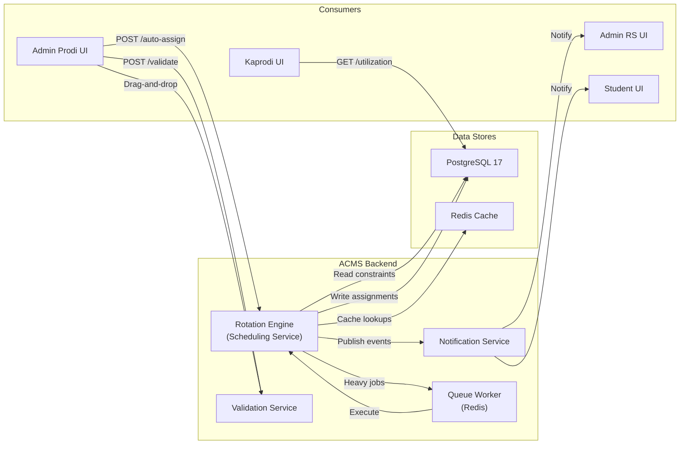
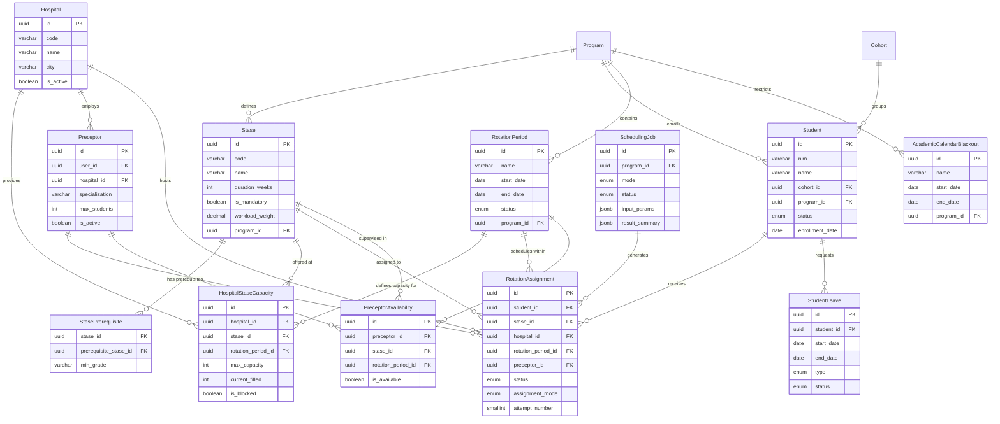
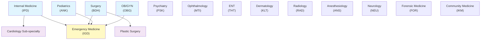
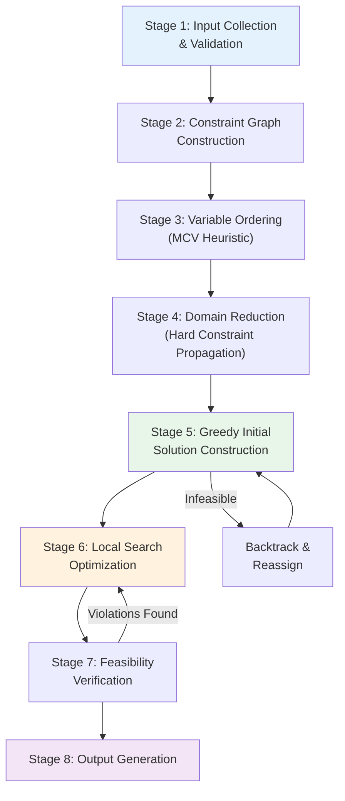
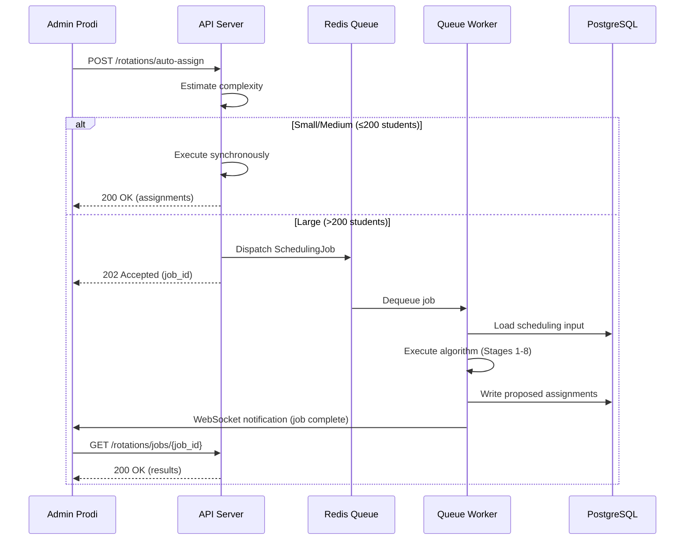
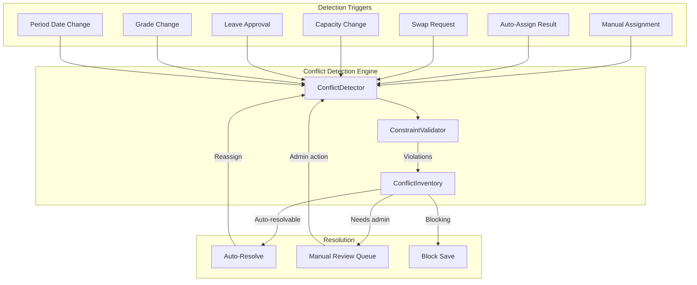
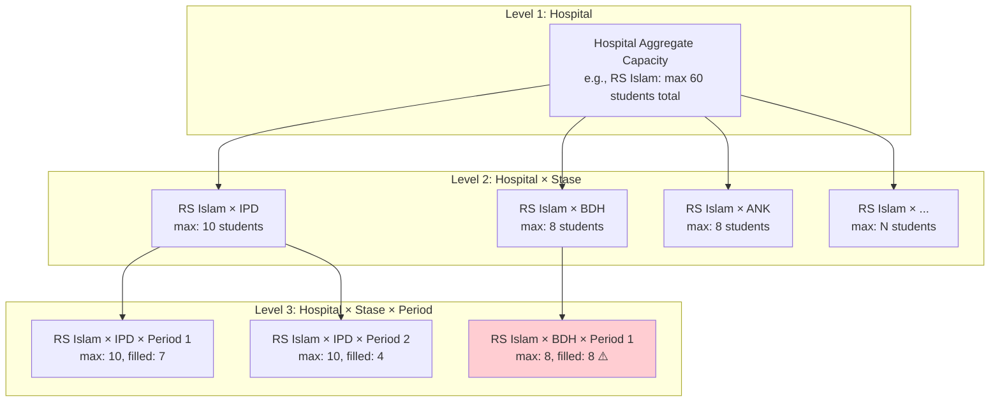
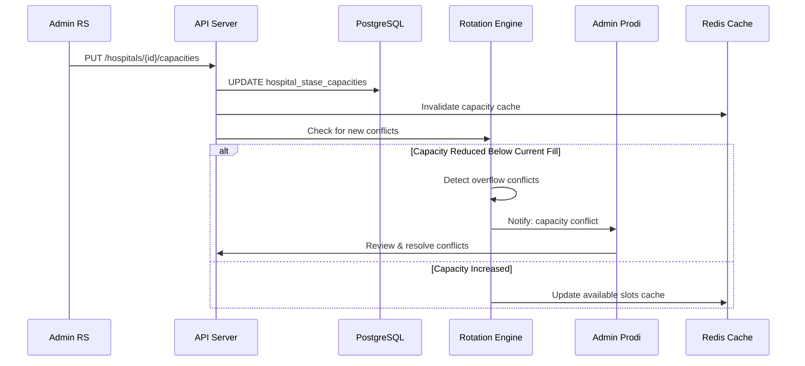
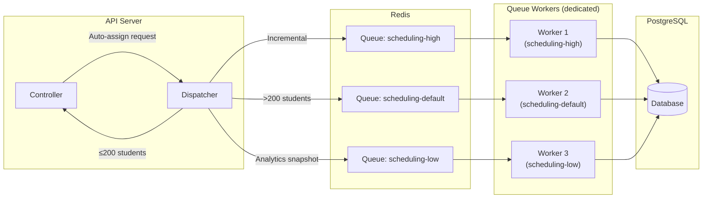

# ACMS — Clinical Rotation Scheduling Engine Specification

**Version**: 1.0
**Date**: 2026-06-08
**Status**: Draft
**Owner**: Faculty of Medicine, Universitas Muhammadiyah Surakarta (UMS)
**Document ID**: ACMS-ROT-001
**Parent Document**: [PRD.md](./PRD.md) (ACMS-PRD-001)

---

## Table of Contents

1. [Overview](#1-overview)
2. [Domain Model](#2-domain-model)
3. [Constraint Definitions](#3-constraint-definitions)
4. [Scheduling Algorithm](#4-scheduling-algorithm)
5. [Conflict Detection & Resolution](#5-conflict-detection--resolution)
6. [Capacity Management](#6-capacity-management)
7. [API Design](#7-api-design)
8. [Data Structures](#8-data-structures)
9. [Performance Optimization](#9-performance-optimization)
10. [Edge Cases](#10-edge-cases)
11. [Testing Strategy](#11-testing-strategy)

---

## 1. Overview

### 1.1 Purpose

The Rotation Scheduling Engine is the core algorithmic component of ACMS responsible for assigning medical students (Koas) to clinical rotation slots across multiple teaching hospitals and departments (stase). It automates what is currently a multi-day, error-prone manual process of scheduling 200+ students across 12–15 stase at 3–5 partner hospitals over 4 semesters.

This document specifies the scheduling algorithm, constraint model, data structures, API contracts, and operational characteristics of the engine. It serves as the authoritative reference for backend developers implementing the `Rotation` bounded context.

### 1.2 Problem Classification

Clinical rotation scheduling is a **constrained scheduling/assignment problem** — a variant of the nurse rostering problem (NRP) in operations research. The problem exhibits:

- **Combinatorial complexity**: Assigning _N_ students to _S_ stase across _H_ hospitals over _P_ periods yields a search space of O((S × H)^(N × P)).
- **Hard constraints**: Inviolable rules (capacity limits, no double-booking, prerequisites).
- **Soft constraints**: Optimization objectives (fairness, minimal travel, workload balance).
- **Dynamic state**: Assignments change due to swaps, leaves, failures, and capacity adjustments.

### 1.3 Scheduling Modes

The engine supports three operational modes, selectable by Admin Prodi per scheduling session:

| Mode | Description | Use Case | User Interaction |
|------|-------------|----------|------------------|
| **Fully Automatic** | Engine generates complete assignment set satisfying all constraints | Bulk scheduling at semester start | Review → Approve/Reject |
| **Semi-Automatic** | Engine suggests assignments; admin confirms or adjusts each | Incremental scheduling, complex cohorts | Per-assignment confirm/edit |
| **Manual** | Admin creates assignments individually via drag-and-drop UI; engine validates in real-time | Ad-hoc assignments, edge cases, swaps | Real-time constraint feedback |

### 1.4 Operational Parameters

| Parameter | Value | Source |
|-----------|-------|--------|
| Target scheduling time (full cohort) | ≤ 10 seconds | NFR-001 |
| Maximum concurrent scheduling jobs | 3 per program | System configuration |
| Maximum students per scheduling run | 500 | NFR-003 |
| Supported stase count | 15 (expandable to 30) | PRD §3.1 |
| Supported hospital count | 5 (expandable to 50) | NFR-003 |
| Rotation period duration range | 2–12 weeks | BR-005 |

### 1.5 System Context



---

## 2. Domain Model

### 2.1 Entity Definitions

#### 2.1.1 Student

A medical graduate enrolled in the Professional Doctor Program (Koas) who must complete a prescribed set of clinical rotations.

| Attribute | Type | Description |
|-----------|------|-------------|
| `id` | UUID | Primary key |
| `nim` | VARCHAR(20) | Student identification number (unique per program) |
| `name` | VARCHAR(255) | Full name |
| `cohort_id` | UUID | FK → Cohort (angkatan/batch grouping) |
| `program_id` | UUID | FK → Program (multi-tenant discriminator) |
| `status` | ENUM | `active`, `on_leave`, `suspended`, `graduated`, `dropped_out` |
| `enrollment_date` | DATE | Date of program enrollment |
| `expected_graduation` | DATE | Projected graduation date |

#### 2.1.2 Stase (Clinical Rotation Department)

A clinical department/specialty through which students must rotate. Each stase defines a unit of clinical education.

| Attribute | Type | Description |
|-----------|------|-------------|
| `id` | UUID | Primary key |
| `code` | VARCHAR(10) | Unique code (e.g., `IPD`, `BDH`, `ANK`) |
| `name` | VARCHAR(100) | Full name (e.g., "Internal Medicine", "Surgery") |
| `duration_weeks` | INTEGER | Default duration in weeks (2–12) |
| `is_mandatory` | BOOLEAN | Whether stase is required for graduation |
| `workload_weight` | DECIMAL(3,2) | Relative workload score (1.0 = standard, 1.5 = heavy) |
| `program_id` | UUID | FK → Program |
| `sks` | INTEGER | Credit units (Satuan Kredit Semester) |

#### 2.1.3 StasePrerequisite

Defines prerequisite relationships between stase.

| Attribute | Type | Description |
|-----------|------|-------------|
| `stase_id` | UUID | FK → Stase (the dependent stase) |
| `prerequisite_stase_id` | UUID | FK → Stase (must be completed first) |
| `min_grade` | VARCHAR(2) | Minimum grade required in prerequisite (default: `C`) |

#### 2.1.4 Hospital

A partner teaching hospital (Rumah Sakit Mitra) where clinical rotations take place.

| Attribute | Type | Description |
|-----------|------|-------------|
| `id` | UUID | Primary key |
| `code` | VARCHAR(10) | Short code (e.g., `RSIS`, `RSUD`) |
| `name` | VARCHAR(255) | Full hospital name |
| `city` | VARCHAR(100) | City location |
| `is_active` | BOOLEAN | Whether hospital is currently accepting students |

#### 2.1.5 RotationPeriod

A defined time window during which a set of rotations occurs. Typically maps to one stase duration cycle.

| Attribute | Type | Description |
|-----------|------|-------------|
| `id` | UUID | Primary key |
| `name` | VARCHAR(100) | Descriptive name (e.g., "Period 1 – Sep 2026") |
| `start_date` | DATE | Period start date (inclusive) |
| `end_date` | DATE | Period end date (inclusive) |
| `academic_year_id` | UUID | FK → AcademicYear |
| `semester` | SMALLINT | Semester number (1 or 2) |
| `status` | ENUM | `draft`, `published`, `in_progress`, `completed`, `cancelled` |
| `program_id` | UUID | FK → Program |

#### 2.1.6 HospitalStaseCapacity (RotationSlot Pool)

Defines how many students a hospital can accept for a given stase in a given rotation period.

| Attribute | Type | Description |
|-----------|------|-------------|
| `id` | UUID | Primary key |
| `hospital_id` | UUID | FK → Hospital |
| `stase_id` | UUID | FK → Stase |
| `rotation_period_id` | UUID | FK → RotationPeriod |
| `max_capacity` | INTEGER | Maximum student slots |
| `current_filled` | INTEGER | Current assigned count (denormalized, maintained by triggers) |
| `is_blocked` | BOOLEAN | Whether this slot pool is blocked (e.g., renovation) |

#### 2.1.7 RotationAssignment

The core assignment entity: a specific student assigned to a specific stase at a specific hospital during a specific rotation period.

| Attribute | Type | Description |
|-----------|------|-------------|
| `id` | UUID | Primary key |
| `student_id` | UUID | FK → Student |
| `stase_id` | UUID | FK → Stase |
| `hospital_id` | UUID | FK → Hospital |
| `rotation_period_id` | UUID | FK → RotationPeriod |
| `preceptor_id` | UUID | FK → Preceptor (nullable; assigned later) |
| `status` | ENUM | `pending`, `confirmed`, `in_progress`, `completed`, `cancelled`, `failed` |
| `assignment_mode` | ENUM | `automatic`, `semi_automatic`, `manual` |
| `attempt_number` | SMALLINT | 1 = first attempt, 2+ = remedial |
| `created_by` | UUID | FK → User (who created the assignment) |
| `scheduling_job_id` | UUID | FK → SchedulingJob (null if manual) |

#### 2.1.8 Preceptor (Dodiknis)

A clinical preceptor who supervises students during rotations.

| Attribute | Type | Description |
|-----------|------|-------------|
| `id` | UUID | Primary key |
| `user_id` | UUID | FK → User |
| `hospital_id` | UUID | FK → Hospital |
| `specialization` | VARCHAR(100) | Clinical specialization |
| `max_students` | INTEGER | Maximum concurrent students (default: 8) |
| `is_active` | BOOLEAN | Current availability status |

#### 2.1.9 PreceptorAvailability

Tracks preceptor availability per rotation period per stase.

| Attribute | Type | Description |
|-----------|------|-------------|
| `id` | UUID | Primary key |
| `preceptor_id` | UUID | FK → Preceptor |
| `stase_id` | UUID | FK → Stase |
| `rotation_period_id` | UUID | FK → RotationPeriod |
| `is_available` | BOOLEAN | Whether available for this period |
| `max_students_override` | INTEGER | Period-specific capacity override (nullable) |

#### 2.1.10 StudentLeave

Tracks approved leave periods for students.

| Attribute | Type | Description |
|-----------|------|-------------|
| `id` | UUID | Primary key |
| `student_id` | UUID | FK → Student |
| `start_date` | DATE | Leave start (inclusive) |
| `end_date` | DATE | Leave end (inclusive) |
| `type` | ENUM | `medical`, `personal`, `academic`, `maternity` |
| `status` | ENUM | `pending`, `approved`, `rejected`, `cancelled` |

#### 2.1.11 AcademicCalendarBlackout

Periods during which no rotations may be scheduled.

| Attribute | Type | Description |
|-----------|------|-------------|
| `id` | UUID | Primary key |
| `name` | VARCHAR(100) | Description (e.g., "Hari Raya Idul Fitri 2026") |
| `start_date` | DATE | Blackout start (inclusive) |
| `end_date` | DATE | Blackout end (inclusive) |
| `program_id` | UUID | FK → Program (null = all programs) |

#### 2.1.12 SchedulingJob

Tracks asynchronous scheduling executions.

| Attribute | Type | Description |
|-----------|------|-------------|
| `id` | UUID | Primary key |
| `program_id` | UUID | FK → Program |
| `mode` | ENUM | `automatic`, `semi_automatic` |
| `status` | ENUM | `queued`, `running`, `completed`, `failed`, `cancelled` |
| `input_params` | JSONB | Serialized input parameters |
| `result_summary` | JSONB | Scheduling results (counts, violations, score) |
| `started_at` | TIMESTAMP | Execution start time |
| `completed_at` | TIMESTAMP | Execution end time |
| `created_by` | UUID | FK → User |
| `error_message` | TEXT | Error details if failed |

### 2.2 Entity-Relationship Diagram



### 2.3 Key Relationships and Cardinalities

| Relationship | Cardinality | Description |
|-------------|-------------|-------------|
| Student → RotationAssignment | 1:N | A student has many assignments (one per stase) |
| Stase → RotationAssignment | 1:N | A stase has many students assigned across periods |
| Hospital → RotationAssignment | 1:N | A hospital hosts many student assignments |
| RotationPeriod → RotationAssignment | 1:N | A period contains many assignments |
| Hospital × Stase × RotationPeriod → HospitalStaseCapacity | 1:1 | Unique capacity per combination |
| Stase → StasePrerequisite | 1:N | A stase may have multiple prerequisites |
| Preceptor → RotationAssignment | 1:N | A preceptor supervises multiple students |
| Student × RotationPeriod → RotationAssignment | 1:1 | A student has at most one assignment per period |
| SchedulingJob → RotationAssignment | 1:N | A scheduling job generates multiple assignments |

---

## 3. Constraint Definitions

All constraints are identified with a stable code for traceability in logs, validation responses, and conflict reports.

### 3.1 Hard Constraints

Hard constraints are **inviolable**. Any proposed assignment that violates a hard constraint **MUST** be rejected. The engine will never produce or accept a solution containing hard constraint violations.

#### HC-01: No Student Double-Booking

| Property | Value |
|----------|-------|
| **Code** | `HC-01` |
| **Name** | No Student Double-Booking |
| **Rule** | A student MUST NOT be assigned to more than one stase during overlapping rotation periods. |
| **Formal Definition** | ∀ assignments A₁, A₂ where A₁.student_id = A₂.student_id ∧ A₁.id ≠ A₂.id: periods(A₁) ∩ periods(A₂) = ∅ |
| **Validation Query** | Check for date range overlaps between the candidate period and all existing active assignments for the student. |
| **Error Code** | `CONFLICT_DOUBLE_BOOKING` |
| **Error Message** | `Student {nim} is already assigned to {stase_code} at {hospital_code} during {period_name} which overlaps with the proposed assignment.` |

**Overlap Detection Logic**:
```
overlap(P1, P2) = P1.start_date <= P2.end_date AND P2.start_date <= P1.end_date
```

#### HC-02: Hospital Capacity Not Exceeded

| Property | Value |
|----------|-------|
| **Code** | `HC-02` |
| **Name** | Hospital Capacity Limit |
| **Rule** | The number of students assigned to a specific stase at a specific hospital during a specific rotation period MUST NOT exceed the declared `max_capacity`. |
| **Formal Definition** | ∀ (hospital_id, stase_id, rotation_period_id): COUNT(active_assignments) ≤ max_capacity |
| **Validation Query** | `SELECT current_filled FROM hospital_stase_capacities WHERE hospital_id = ? AND stase_id = ? AND rotation_period_id = ?; assert current_filled < max_capacity` |
| **Error Code** | `CONFLICT_CAPACITY_EXCEEDED` |
| **Error Message** | `Hospital {hospital_code} has reached capacity ({current}/{max}) for {stase_code} during {period_name}.` |

#### HC-03: Prerequisite Stase Completed

| Property | Value |
|----------|-------|
| **Code** | `HC-03` |
| **Name** | Prerequisite Completion |
| **Rule** | A student MUST have completed all prerequisite stase (with the required minimum grade) before being assigned to a dependent stase. |
| **Formal Definition** | ∀ prerequisite P of stase S: ∃ assignment A where A.student_id = student ∧ A.stase_id = P.prerequisite_stase_id ∧ A.status = 'completed' ∧ A.grade ≥ P.min_grade |
| **Validation Query** | Join `stase_prerequisites` with `rotation_assignments` to verify all prerequisites are satisfied. |
| **Error Code** | `CONFLICT_PREREQUISITE_MISSING` |
| **Error Message** | `Student {nim} has not completed prerequisite stase {prereq_code} (required grade: {min_grade}) for {stase_code}.` |

**Prerequisite Graph**:


> [!NOTE]
> The prerequisite graph is configurable per program. The diagram above shows the default configuration for the Professional Doctor Program. Admin Prodi can modify prerequisite relationships through the stase management interface.

#### HC-04: Student Must Be Active

| Property | Value |
|----------|-------|
| **Code** | `HC-04` |
| **Name** | Active Student Status |
| **Rule** | Only students with `status = 'active'` may receive rotation assignments. |
| **Formal Definition** | ∀ assignment A: student(A).status = 'active' |
| **Validation Query** | `SELECT status FROM students WHERE id = ?; assert status = 'active'` |
| **Error Code** | `CONFLICT_STUDENT_INACTIVE` |
| **Error Message** | `Student {nim} has status '{status}' and cannot be assigned to rotations.` |

#### HC-05: No Assignment During Approved Leave

| Property | Value |
|----------|-------|
| **Code** | `HC-05` |
| **Name** | Leave Period Exclusion |
| **Rule** | A student MUST NOT be assigned to any rotation that overlaps with an approved leave period. |
| **Formal Definition** | ∀ assignment A, ∀ leave L where L.student_id = A.student_id ∧ L.status = 'approved': periods(A) ∩ [L.start_date, L.end_date] = ∅ |
| **Validation Query** | Check overlap between candidate rotation period dates and all approved leave dates for the student. |
| **Error Code** | `CONFLICT_LEAVE_OVERLAP` |
| **Error Message** | `Student {nim} has approved {leave_type} leave from {start} to {end} which overlaps with {period_name}.` |

#### HC-06: No Assignment During Blackout Periods

| Property | Value |
|----------|-------|
| **Code** | `HC-06` |
| **Name** | Academic Calendar Blackout |
| **Rule** | No rotation period may overlap with a declared academic calendar blackout period. |
| **Formal Definition** | ∀ rotation_period RP, ∀ blackout B: [RP.start_date, RP.end_date] ∩ [B.start_date, B.end_date] = ∅ |
| **Note** | This constraint is enforced at rotation period creation time, not at individual assignment time. If a rotation period already exists and a new blackout is added that overlaps, existing assignments are flagged for review. |
| **Error Code** | `CONFLICT_BLACKOUT_OVERLAP` |
| **Error Message** | `Rotation period {period_name} overlaps with blackout period '{blackout_name}' ({start} to {end}).` |

#### HC-07: Program Enrollment Verification

| Property | Value |
|----------|-------|
| **Code** | `HC-07` |
| **Name** | Program Enrollment Match |
| **Rule** | A student MUST be enrolled in the program that offers the stase being assigned. |
| **Formal Definition** | ∀ assignment A: student(A).program_id = stase(A).program_id |
| **Validation Query** | `SELECT s.program_id, st.program_id FROM students s, stase st WHERE s.id = ? AND st.id = ?; assert s.program_id = st.program_id` |
| **Error Code** | `CONFLICT_PROGRAM_MISMATCH` |
| **Error Message** | `Student {nim} (program: {student_program}) cannot be assigned to stase {stase_code} (program: {stase_program}).` |

#### HC-08: Preceptor-to-Student Ratio

| Property | Value |
|----------|-------|
| **Code** | `HC-08` |
| **Name** | Preceptor Capacity Limit |
| **Rule** | The number of students assigned to a single preceptor in a single rotation period MUST NOT exceed the preceptor's `max_students` limit (configurable, default: 8). |
| **Formal Definition** | ∀ preceptor P, ∀ rotation_period RP: COUNT(assignments where preceptor_id = P.id ∧ rotation_period_id = RP.id ∧ status IN ('confirmed','in_progress')) ≤ P.max_students |
| **Configuration** | System default: 8. Overridable per preceptor. Period-specific override via `PreceptorAvailability.max_students_override`. |
| **Error Code** | `CONFLICT_PRECEPTOR_OVERLOADED` |
| **Error Message** | `Preceptor {name} has reached capacity ({current}/{max}) for {period_name}.` |

### 3.2 Soft Constraints

Soft constraints are **optimization objectives**. The engine attempts to satisfy them but may relax them when hard constraints cannot be met otherwise. Each soft constraint has a configurable weight used in scoring solutions.

#### SC-01: Even Distribution Across Hospitals (Fairness)

| Property | Value |
|----------|-------|
| **Code** | `SC-01` |
| **Name** | Hospital Distribution Fairness |
| **Rule** | Students should be distributed as evenly as possible across hospitals for each stase and rotation period, relative to each hospital's capacity. |
| **Metric** | Coefficient of Variation (CV) of utilization rates across hospitals for each stase-period combination. |
| **Target** | CV < 0.15 (utilization rates within 15% of mean) |
| **Weight** | 30 (configurable) |
| **Scoring** | `penalty = Σ(stase, period) max(0, CV(utilization_rates) - 0.15) × weight` |

**Utilization Rate Calculation**:
```
utilization_rate(hospital, stase, period) = current_filled / max_capacity
CV = std_dev(utilization_rates) / mean(utilization_rates)
```

#### SC-02: Minimize Hospital Changes Between Consecutive Rotations

| Property | Value |
|----------|-------|
| **Code** | `SC-02` |
| **Name** | Hospital Continuity |
| **Rule** | When a student has consecutive rotation periods, the engine should prefer assigning consecutive stase at the same hospital to reduce travel burden. |
| **Metric** | Total number of hospital transitions across all students' consecutive assignments. |
| **Target** | Minimize total transitions |
| **Weight** | 20 (configurable) |
| **Scoring** | `penalty = Σ(students) count(hospital_transitions) × weight` |

#### SC-03: Respect Student Hospital Preference

| Property | Value |
|----------|-------|
| **Code** | `SC-03` |
| **Name** | Student Preference Respect |
| **Rule** | If the student preference system is enabled, assignments should respect student hospital preferences where possible. |
| **Metric** | Percentage of assignments matching student's top 3 preferences. |
| **Target** | ≥ 70% of assignments match a student preference |
| **Weight** | 15 (configurable) |
| **Scoring** | `penalty = Σ(assignments) preference_penalty(rank) × weight` where rank 1 = 0, rank 2 = 0.3, rank 3 = 0.6, no match = 1.0 |
| **Prerequisite** | `system_config.student_preference_enabled = true` |

#### SC-04: Balance Preceptor Workload

| Property | Value |
|----------|-------|
| **Code** | `SC-04` |
| **Name** | Preceptor Workload Balance |
| **Rule** | The number of students assigned to each preceptor across the academic year should be balanced (within a hospital and stase). |
| **Metric** | Standard deviation of annual student counts per preceptor within each hospital-stase pair. |
| **Target** | Standard deviation < 2 students |
| **Weight** | 15 (configurable) |
| **Scoring** | `penalty = Σ(hospital, stase) max(0, std_dev(preceptor_loads) - 2) × weight` |

#### SC-05: Cohort Grouping

| Property | Value |
|----------|-------|
| **Code** | `SC-05` |
| **Name** | Cohort Proximity |
| **Rule** | Students from the same cohort should be grouped together at the same hospital when possible to foster peer learning. |
| **Metric** | Cohort fragmentation index: number of distinct hospitals a single cohort is spread across per stase-period. |
| **Target** | Fragmentation index ≤ 2 hospitals per cohort per stase-period |
| **Weight** | 10 (configurable) |
| **Scoring** | `penalty = Σ(cohort, stase, period) max(0, distinct_hospitals - 2) × weight` |

#### SC-06: Spread Major Stase Evenly

| Property | Value |
|----------|-------|
| **Code** | `SC-06` |
| **Name** | Workload Temporal Balance |
| **Rule** | High-workload stase (workload_weight ≥ 1.3) should be spread evenly across a student's timeline, avoiding consecutive heavy rotations. |
| **Metric** | Number of consecutive heavy stase assignments per student. |
| **Target** | Maximum 2 consecutive heavy stase |
| **Weight** | 10 (configurable) |
| **Scoring** | `penalty = Σ(students) max(0, consecutive_heavy_count - 2) × weight` |

### 3.3 Constraint Summary Matrix

| Code | Name | Type | Enforcement | Phase |
|------|------|------|-------------|-------|
| HC-01 | No Double-Booking | Hard | Block | MVP |
| HC-02 | Hospital Capacity | Hard | Block | MVP |
| HC-03 | Prerequisite Completion | Hard | Block | MVP |
| HC-04 | Active Student Status | Hard | Block | MVP |
| HC-05 | Leave Period Exclusion | Hard | Block | MVP |
| HC-06 | Blackout Period Exclusion | Hard | Block | MVP |
| HC-07 | Program Enrollment Match | Hard | Block | MVP |
| HC-08 | Preceptor-Student Ratio | Hard | Block | MVP |
| SC-01 | Hospital Distribution | Soft | Optimize | MVP |
| SC-02 | Hospital Continuity | Soft | Optimize | MVP |
| SC-03 | Student Preference | Soft | Optimize | Phase 2 |
| SC-04 | Preceptor Workload Balance | Soft | Optimize | Phase 2 |
| SC-05 | Cohort Grouping | Soft | Optimize | MVP |
| SC-06 | Workload Temporal Balance | Soft | Optimize | MVP |

---

## 4. Scheduling Algorithm

### 4.1 Algorithm Selection

The rotation scheduling problem is NP-hard in general. However, the practical problem size (≤ 500 students, ≤ 15 stase, ≤ 5 hospitals, ≤ 20 periods per year) is tractable with well-chosen heuristics.

#### Primary Approach: Constraint Satisfaction Problem (CSP) with Heuristic Search

| Component | Method | Rationale |
|-----------|--------|-----------|
| Problem Formulation | CSP with variables, domains, constraints | Natural mapping to the assignment problem structure |
| Construction | Greedy heuristic with Most Constrained Variable (MCV) ordering | Produces feasible initial solution quickly |
| Constraint Enforcement | Forward-checking with constraint propagation (AC-3) | Prunes infeasible assignments early, reduces backtracking |
| Optimization | Iterative local search with swap neighborhoods | Improves soft constraint satisfaction without violating hard constraints |
| Fallback | Manual assignment with real-time validation | Guaranteed human override for edge cases |

#### Why Not Other Approaches?

| Approach | Reason for Rejection |
|----------|---------------------|
| Integer Linear Programming (ILP) | Over-engineered for this problem size; requires solver dependency (Gurobi, CPLEX); harder to maintain |
| Genetic Algorithm | Non-deterministic; harder to guarantee hard constraint satisfaction; longer convergence time |
| Pure Backtracking CSP | Too slow without heuristics for larger instances; no optimization of soft constraints |
| Simulated Annealing | Good for optimization but harder to guarantee feasibility; parameter tuning required |

### 4.2 Algorithm Steps

The scheduling algorithm is executed as a pipeline of sequential stages. Each stage has defined inputs, outputs, and invariants.



#### Stage 1: Input Collection & Validation

**Purpose**: Gather all data required for scheduling and validate preconditions.

**Inputs**:
1. **Students**: List of students to schedule (filtered by program, cohort, status = `active`)
2. **Stase Requirements**: Per-student list of stase that need assignment (excluding already completed/in-progress)
3. **Rotation Periods**: Target periods for assignment (status = `draft` or `published`)
4. **Hospital Capacities**: `HospitalStaseCapacity` records for target periods
5. **Existing Assignments**: Current active assignments (to avoid conflicts)
6. **Prerequisites**: Stase prerequisite graph
7. **Student Leaves**: Approved leave records
8. **Blackout Periods**: Academic calendar blackout dates
9. **Preceptor Availability**: Per-period preceptor availability
10. **Constraint Weights**: Soft constraint weights from system configuration

**Validation Checks**:
- At least one student and one stase must be provided
- All target rotation periods must exist and be in `draft` or `published` status
- Capacity data must exist for all hospital-stase-period combinations
- No circular dependencies in prerequisite graph (detect via topological sort)

**Output**: Validated `SchedulingInput` data structure (§8.1)

#### Stage 2: Constraint Graph Construction

**Purpose**: Build an in-memory representation of all constraints as a graph for efficient propagation.

**Process**:
1. Create a **constraint node** for each hard constraint (HC-01 through HC-08)
2. Create **variable nodes** for each (student, stase) pair requiring assignment
3. Create **domain nodes** for each feasible (hospital, period) slot per variable
4. Add **edges** between constraint nodes and variable nodes they affect
5. Index constraints by type for O(1) lookup during propagation

**Data Structure**: Adjacency list representation with constraint nodes, variable nodes, and arc connections (§8.1.2).

#### Stage 3: Variable Ordering (Most Constrained Variable Heuristic)

**Purpose**: Determine the order in which (student, stase) pairs are assigned to slots. Assigning the most constrained variables first reduces the search space dramatically.

**MCV Heuristic**: Sort variables by ascending domain size (number of feasible slots) after initial domain reduction. Ties are broken by:
1. **Highest prerequisite depth** — assign students needing foundational stase first
2. **Fewest remaining stase** — students with fewer remaining requirements get priority (closer to graduation)
3. **Alphabetical NIM** — deterministic tiebreaker for reproducibility

**Algorithm**:
```
function orderVariables(variables, domains):
    for each variable V in variables:
        V.domain_size = |domains[V]|
        V.prereq_depth = maxDepth(V.stase, prerequisite_graph)
        V.remaining_stase = countRemainingStase(V.student)

    sort variables by:
        1. domain_size ASC          (most constrained first)
        2. prereq_depth DESC        (deepest prerequisites first)
        3. remaining_stase ASC      (closest to graduation first)
        4. student.nim ASC          (deterministic tiebreak)

    return sorted variables
```

#### Stage 4: Domain Reduction (Hard Constraint Propagation)

**Purpose**: Eliminate infeasible (hospital, period) slots from each variable's domain using hard constraints before constructing a solution. This is the key step that makes the algorithm tractable.

**Process** (applied per variable):

```
function reduceDomain(variable, allConstraints, existingAssignments):
    student = variable.student
    stase = variable.stase
    domain = allFeasibleSlots(stase)  // all (hospital, period) combinations

    // HC-01: Remove slots overlapping with student's existing assignments
    for each assignment in existingAssignments[student]:
        domain.removeWhere(slot => overlaps(slot.period, assignment.period))

    // HC-02: Remove slots where hospital capacity is full
    domain.removeWhere(slot => capacity(slot.hospital, stase, slot.period).isFull())

    // HC-03: Remove slots in periods before prerequisite completion
    for each prereq in prerequisites(stase):
        if not completedOrScheduledBefore(student, prereq, slot.period):
            domain.removeWhere(slot => not prereqSatisfiable(prereq, slot.period))

    // HC-05: Remove slots overlapping with approved leaves
    for each leave in approvedLeaves(student):
        domain.removeWhere(slot => overlaps(slot.period, leave))

    // HC-06: Already enforced at period creation (blackout periods)

    // HC-07: Remove slots for stase from different programs (should be pre-filtered)
    domain.removeWhere(slot => stase.program_id != student.program_id)

    // HC-08: Remove slots where all preceptors are at capacity
    domain.removeWhere(slot => noAvailablePreceptor(slot.hospital, stase, slot.period))

    return domain
```

**Arc Consistency (AC-3)**: After initial domain reduction, apply arc consistency to propagate the effects. If assigning variable V₁ to a slot removes the last feasible slot from variable V₂, then V₁'s assignment to that slot is also infeasible.

```
function propagateAC3(variables, domains, constraints):
    queue = allArcs(variables, constraints)
    while queue is not empty:
        (Vi, Vj) = queue.dequeue()
        if revise(Vi, Vj, domains):
            if domains[Vi] is empty:
                return FAILURE  // No feasible solution exists
            for each Vk in neighbors(Vi) - {Vj}:
                queue.enqueue((Vk, Vi))
    return SUCCESS
```

#### Stage 5: Greedy Initial Solution Construction

**Purpose**: Build a feasible (hard-constraint-satisfying) assignment using greedy slot selection with soft constraint scoring.

**Algorithm**:

```
function constructGreedySolution(orderedVariables, domains, softConstraints):
    solution = []
    for each variable V in orderedVariables:
        if domains[V] is empty:
            // Backtrack: undo last assignment and try next domain value
            if not backtrack(solution, domains, V):
                markInfeasible(V)
                continue

        // Score each remaining slot by soft constraint satisfaction
        scoredSlots = []
        for each slot in domains[V]:
            score = evaluateSoftConstraints(V, slot, solution, softConstraints)
            scoredSlots.append((slot, score))

        // Select slot with best (lowest) penalty score
        bestSlot = scoredSlots.sortBy(score ASC).first()

        // Assign
        assignment = createAssignment(V.student, V.stase, bestSlot)
        solution.append(assignment)

        // Update state: decrement capacity, update constraint graph
        updateCapacity(bestSlot, -1)
        propagateAssignment(assignment, domains, orderedVariables)

    return solution
```

**Soft Constraint Evaluation per Slot**:

```
function evaluateSoftConstraints(variable, slot, currentSolution, weights):
    penalty = 0

    // SC-01: Hospital distribution fairness
    utilizationAfter = predictUtilization(slot, currentSolution)
    penalty += fairnessPenalty(utilizationAfter) * weights.SC01

    // SC-02: Hospital continuity
    prevAssignment = lastAssignment(variable.student, currentSolution)
    if prevAssignment and prevAssignment.hospital != slot.hospital:
        penalty += 1.0 * weights.SC02

    // SC-03: Student preference (if enabled)
    if preferencesEnabled:
        prefRank = getPreferenceRank(variable.student, slot.hospital)
        penalty += preferencePenalty(prefRank) * weights.SC03

    // SC-05: Cohort grouping
    cohortSpread = countCohortHospitals(variable.student.cohort, variable.stase, slot.period, currentSolution)
    if cohortSpread > 2:
        penalty += (cohortSpread - 2) * weights.SC05

    // SC-06: Workload temporal balance
    consecutiveHeavy = countConsecutiveHeavy(variable.student, variable.stase, slot.period, currentSolution)
    if consecutiveHeavy > 2:
        penalty += (consecutiveHeavy - 2) * weights.SC06

    return penalty
```

**Backtracking Strategy**:

Backtracking is triggered when a variable has an empty domain. The engine uses **chronological backtracking** with a depth limit:

```
function backtrack(solution, domains, failedVariable, maxDepth=5):
    for depth in 1..maxDepth:
        // Undo last 'depth' assignments
        undone = solution.popLast(depth)

        // Restore domains and capacities
        for each assignment in undone:
            restoreDomain(assignment, domains)
            updateCapacity(assignment.slot, +1)

        // Re-propagate domains for failed variable
        reduceDomain(failedVariable, ...)

        if domains[failedVariable] is not empty:
            // Re-queue undone variables for reassignment
            requeue(undone, orderedVariables)
            return true

    return false  // Backtracking exhausted
```

#### Stage 6: Local Search Optimization (Swap-Based Improvement)

**Purpose**: Improve the initial greedy solution's soft constraint score through iterative swaps without violating hard constraints.

**Swap Neighborhoods**:

1. **Student-Student Swap**: Swap the hospital assignments of two students in the same stase and period.
2. **Period Shift**: Move a student's assignment to a different period (if available in domain).
3. **Hospital Reassign**: Move a student from one hospital to another for the same stase and period.

**Algorithm** (Hill Climbing with Random Restarts):

```
function localSearchOptimize(solution, constraints, maxIterations=1000, maxNoImprove=200):
    bestSolution = solution
    bestScore = evaluateFullScore(solution, constraints)
    noImproveCount = 0

    for iteration in 1..maxIterations:
        // Generate random swap from neighborhood
        swap = selectRandomSwap(solution, neighborhoodType=random)

        // Validate hard constraints
        if not validateHardConstraints(swap, solution):
            continue

        // Apply swap tentatively
        newSolution = applySwap(solution, swap)
        newScore = evaluateFullScore(newSolution, constraints)

        if newScore < bestScore:
            bestSolution = newSolution
            bestScore = newScore
            noImproveCount = 0
        else:
            noImproveCount++

        if noImproveCount >= maxNoImprove:
            break  // Convergence reached

    return bestSolution
```

**Full Score Evaluation**:

```
function evaluateFullScore(solution, softConstraints):
    totalPenalty = 0
    totalPenalty += evaluateSC01(solution) * weights.SC01  // Fairness
    totalPenalty += evaluateSC02(solution) * weights.SC02  // Continuity
    totalPenalty += evaluateSC03(solution) * weights.SC03  // Preferences
    totalPenalty += evaluateSC04(solution) * weights.SC04  // Preceptor balance
    totalPenalty += evaluateSC05(solution) * weights.SC05  // Cohort grouping
    totalPenalty += evaluateSC06(solution) * weights.SC06  // Workload balance
    return totalPenalty
```

#### Stage 7: Feasibility Verification

**Purpose**: Final validation pass confirming all hard constraints are satisfied in the output solution.

**Process**:
1. Re-validate every assignment against all 8 hard constraints
2. Aggregate soft constraint scores for reporting
3. Flag any residual violations (should be zero for a correct algorithm)
4. Generate constraint satisfaction report

**Output**: `ConstraintSatisfactionReport` with:
- Hard constraint pass/fail per assignment
- Soft constraint scores (individual and total)
- Infeasible variables (students/stase that could not be assigned)
- Warnings (near-capacity slots, close deadlines)

#### Stage 8: Output Generation

**Purpose**: Package the solution into the response format for the caller.

**Output** (`SchedulingResult`):

| Field | Type | Description |
|-------|------|-------------|
| `job_id` | UUID | Scheduling job identifier |
| `assignments` | Array | List of proposed `RotationAssignment` records |
| `unassigned` | Array | Student-stase pairs that could not be feasibly assigned |
| `constraint_report` | Object | Full constraint satisfaction report |
| `score` | Object | Soft constraint scores (per-constraint and total) |
| `statistics` | Object | Summary stats (count assigned, utilization, etc.) |
| `execution_time_ms` | Integer | Wall-clock execution time |

### 4.3 Complexity Analysis

#### Theoretical Complexity

| Parameter | Symbol | Typical Value | Maximum Value |
|-----------|--------|---------------|---------------|
| Students | N | 200 | 500 |
| Stase | S | 12 | 15 |
| Hospitals | H | 3 | 5 |
| Periods per year | P | 8 | 20 |

**Search Space Size** (brute force): O((H × P)^(N × S))
- Typical: (3 × 8)^(200 × 12) = 24^2400 ≈ 10^3312 — **intractable** without heuristics

**With Domain Reduction**: Each variable's domain is reduced to 1–5 feasible slots on average after hard constraint propagation.
- Reduced space: O(5^(N × S/P)) ≈ O(5^300) — still large, but the greedy construction with MCV ordering avoids exploring most of the tree.

**Greedy Construction**: O(N × S × H × C) where C is the per-assignment constraint checking cost.
- Typical: 200 × 12 × 3 × 8 = 57,600 operations — **milliseconds**.

**Local Search**: O(I × N × C) where I is the iteration count.
- Typical: 1000 × 200 × 8 = 1,600,000 operations — **under 1 second**.

#### Performance Targets

| Scenario | Students | Stase | Hospitals | Target Time | Strategy |
|----------|----------|-------|-----------|-------------|----------|
| Small cohort | ≤ 50 | 12 | 3 | ≤ 1 second | Synchronous, in-request |
| Medium cohort (typical) | 51–200 | 12–15 | 3–5 | ≤ 5 seconds | Synchronous, in-request |
| Large cohort | 201–500 | 12–15 | 3–5 | ≤ 10 seconds | Background job with progress |
| Extra-large cohort | > 500 | 15+ | 5+ | ≤ 60 seconds | Background job, partitioned |

#### Strategies for Staying Under 10-Second Target

1. **Aggressive Domain Reduction**: HC propagation typically reduces each variable's domain to 1–5 slots, collapsing the combinatorial explosion.
2. **Greedy Construction**: Produces a feasible solution in O(N × S × H) — typically 50ms for 200 students.
3. **Bounded Local Search**: Cap iterations at 1,000 with early termination when no improvement is found for 200 iterations.
4. **Pre-computed Indexes**: Capacity maps, prerequisite DAGs, and leave calendars are loaded once into indexed data structures.
5. **Incremental Evaluation**: Soft constraint scores are updated incrementally per swap (delta evaluation) rather than recomputed from scratch.
6. **Partitioning**: For > 500 students, partition by cohort and schedule each partition independently (cohorts are largely independent due to different prerequisite states).

#### Background Job Processing

For scheduling runs exceeding the 5-second synchronous threshold:



---

## 5. Conflict Detection & Resolution

### 5.1 Conflict Types

Conflicts are detected during three phases: (1) real-time validation during manual assignment, (2) batch validation during auto-assign, and (3) post-assignment monitoring for state changes.

#### 5.1.1 Time Conflict (Student Double-Booked)

| Property | Value |
|----------|-------|
| **Constraint** | HC-01 |
| **Severity** | Critical |
| **Detection Trigger** | Assignment creation, rotation period date change, swap request |
| **Detection Query** | `SELECT * FROM rotation_assignments WHERE student_id = ? AND status IN ('pending','confirmed','in_progress') AND EXISTS (SELECT 1 FROM rotation_periods rp1, rotation_periods rp2 WHERE rp1.id = existing.rotation_period_id AND rp2.id = ? AND rp1.start_date <= rp2.end_date AND rp2.start_date <= rp1.end_date)` |

#### 5.1.2 Capacity Conflict (Hospital Overflow)

| Property | Value |
|----------|-------|
| **Constraint** | HC-02 |
| **Severity** | Critical |
| **Detection Trigger** | Assignment creation, capacity reduction by Admin RS |
| **Detection Query** | `SELECT max_capacity, current_filled FROM hospital_stase_capacities WHERE hospital_id = ? AND stase_id = ? AND rotation_period_id = ? AND current_filled >= max_capacity` |

#### 5.1.3 Prerequisite Conflict (Missing Requirements)

| Property | Value |
|----------|-------|
| **Constraint** | HC-03 |
| **Severity** | Critical |
| **Detection Trigger** | Assignment creation, grade revision (failed prerequisite) |
| **Detection Query** | `SELECT sp.prerequisite_stase_id FROM stase_prerequisites sp WHERE sp.stase_id = ? AND NOT EXISTS (SELECT 1 FROM rotation_assignments ra JOIN rotation_grades rg ON ra.id = rg.assignment_id WHERE ra.student_id = ? AND ra.stase_id = sp.prerequisite_stase_id AND ra.status = 'completed' AND rg.letter_grade >= sp.min_grade)` |

#### 5.1.4 Preceptor Conflict (Overloaded)

| Property | Value |
|----------|-------|
| **Constraint** | HC-08 |
| **Severity** | High |
| **Detection Trigger** | Preceptor assignment, preceptor availability change |
| **Detection Query** | `SELECT COUNT(*) as current_count, p.max_students FROM rotation_assignments ra JOIN preceptors p ON ra.preceptor_id = p.id WHERE ra.preceptor_id = ? AND ra.rotation_period_id = ? AND ra.status IN ('confirmed','in_progress') GROUP BY p.max_students HAVING COUNT(*) >= p.max_students` |

#### 5.1.5 Leave Conflict (Assigned During Approved Leave)

| Property | Value |
|----------|-------|
| **Constraint** | HC-05 |
| **Severity** | Critical |
| **Detection Trigger** | Leave approval (post-assignment), assignment creation |
| **Detection Query** | `SELECT sl.* FROM student_leaves sl JOIN rotation_assignments ra ON sl.student_id = ra.student_id JOIN rotation_periods rp ON ra.rotation_period_id = rp.id WHERE sl.student_id = ? AND sl.status = 'approved' AND rp.start_date <= sl.end_date AND sl.start_date <= rp.end_date AND ra.status IN ('pending','confirmed','in_progress')` |

### 5.2 Conflict Detection Architecture



### 5.3 Resolution Strategies

#### 5.3.1 Automatic Resolution

Applied when a conflict can be resolved without human judgment. The engine attempts automatic resolution in priority order:

| Conflict Type | Auto-Resolution Strategy |
|---------------|------------------------|
| Capacity Overflow (single student) | Reassign student to alternative hospital with available capacity for same stase and period. Select hospital with best soft constraint score. |
| Preceptor Overloaded | Reassign student to alternative preceptor at the same hospital. If none available, escalate to manual resolution. |
| Time Conflict (single overlap) | Move the lower-priority assignment (later-created, or remedial) to the next available period. |

**Auto-Resolution Algorithm**:

```
function autoResolve(conflict):
    switch conflict.type:
        case CAPACITY_EXCEEDED:
            alternativeSlots = findAlternativeHospitals(
                conflict.stase,
                conflict.period,
                exclude=[conflict.hospital]
            )
            if alternativeSlots is not empty:
                bestSlot = rankBySOftConstraints(alternativeSlots, conflict.student)
                reassign(conflict.assignment, bestSlot)
                return RESOLVED

        case PRECEPTOR_OVERLOADED:
            alternativePreceptors = findAvailablePreceptors(
                conflict.hospital,
                conflict.stase,
                conflict.period
            )
            if alternativePreceptors is not empty:
                bestPreceptor = selectLeastLoaded(alternativePreceptors)
                reassignPreceptor(conflict.assignment, bestPreceptor)
                return RESOLVED

        case DOUBLE_BOOKING:
            laterAssignment = conflict.assignments.sortBy(created_at).last()
            nextPeriod = findNextAvailablePeriod(
                laterAssignment.student,
                laterAssignment.stase
            )
            if nextPeriod is not null:
                moveAssignment(laterAssignment, nextPeriod)
                return RESOLVED

    return ESCALATED  // Cannot auto-resolve
```

#### 5.3.2 Flagged for Manual Resolution

When automatic resolution is not possible or the conflict requires human judgment:

1. **Create conflict record** in `rotation_conflicts` table with type, affected entities, and suggested resolutions.
2. **Notify Admin Prodi** via in-app notification and email with conflict summary.
3. **Generate suggestions**: Provide 2–3 ranked alternative assignments for the admin to choose from.
4. **Track resolution**: Conflict remains open until admin takes action. SLA: resolve within 48 hours.

**Suggestion Generation**:

For each conflict, the engine generates up to 3 alternative resolutions ranked by soft constraint score:

```
function generateSuggestions(conflict, maxSuggestions=3):
    suggestions = []

    // Strategy 1: Move to different hospital
    altHospitals = findAlternativeHospitals(conflict.stase, conflict.period)
    for each hospital in altHospitals:
        score = evaluateMove(conflict.student, conflict.stase, hospital, conflict.period)
        suggestions.append({type: 'REASSIGN_HOSPITAL', hospital, score})

    // Strategy 2: Move to different period
    altPeriods = findAlternativePeriods(conflict.student, conflict.stase)
    for each period in altPeriods:
        score = evaluateMove(conflict.student, conflict.stase, conflict.hospital, period)
        suggestions.append({type: 'RESCHEDULE_PERIOD', period, score})

    // Strategy 3: Swap with another student
    swapCandidates = findSwapCandidates(conflict)
    for each candidate in swapCandidates:
        score = evaluateSwap(conflict.student, candidate)
        suggestions.append({type: 'SWAP_STUDENTS', candidate, score})

    return suggestions.sortBy(score ASC).take(maxSuggestions)
```

#### 5.3.3 Blocking (Prevent Save Until Resolved)

In **manual mode**, hard constraint violations are detected in real-time as the admin creates or modifies assignments. The UI prevents saving an assignment that violates any hard constraint.

**Behavior**:
- Constraint validation runs on each assignment change (< 50ms response time required)
- Violations are displayed inline with specific error messages and constraint codes
- The "Save" button is disabled while violations exist
- Soft constraint violations are displayed as warnings but do not block save

---

## 6. Capacity Management

### 6.1 Capacity Model

#### 6.1.1 Three-Level Capacity Hierarchy



#### 6.1.2 Capacity Configuration

| Level | Configured By | Granularity | Mutability |
|-------|--------------|-------------|------------|
| Hospital aggregate | Super Admin | Per hospital | At onboarding |
| Hospital × Stase | Admin RS | Per stase | Per semester |
| Hospital × Stase × Period | Admin RS | Per rotation period | Per period (with notification) |
| Preceptor capacity | Admin RS / Preceptor | Per preceptor per period | Anytime (with notification) |

#### 6.1.3 Capacity Data Flow



#### 6.1.4 Dynamic Capacity Adjustments

The capacity model supports real-time changes from hospitals:

| Scenario | Trigger | System Behavior |
|----------|---------|----------------|
| Hospital reduces capacity | Admin RS updates capacity | If `current_filled > new_max_capacity`, create capacity conflict record and notify Admin Prodi |
| Hospital blocks a period | Admin RS sets `is_blocked = true` | All pending assignments for that slot are flagged as conflicts |
| Preceptor becomes unavailable | Admin RS or Preceptor updates availability | Students assigned to this preceptor are flagged for reassignment |
| Hospital adds new stase offering | Admin RS creates new capacity record | New slots become available in scheduling engine |

### 6.2 Utilization Tracking

#### 6.2.1 Utilization Metrics

| Metric | Formula | Description |
|--------|---------|-------------|
| **Slot Utilization Rate** | `current_filled / max_capacity × 100` | Per hospital-stase-period |
| **Hospital Utilization Rate** | `SUM(current_filled) / SUM(max_capacity) × 100` | Aggregate across all stase for a hospital in a period |
| **Stase Fill Rate** | `SUM(current_filled) / SUM(max_capacity) × 100` | Aggregate across all hospitals for a stase in a period |
| **Program Coverage** | `assigned_students / eligible_students × 100` | Percentage of students with assignments for a period |
| **Preceptor Load Factor** | `assigned_students / max_students × 100` | Per preceptor per period |

#### 6.2.2 Utilization Alert Thresholds

| Threshold | Level | Action |
|-----------|-------|--------|
| ≥ 80% | **Warning** (Yellow) | In-app notification to Admin Prodi and Admin RS; highlighted on dashboard |
| ≥ 95% | **Critical** (Orange) | Email notification to Admin Prodi, Admin RS, and Kaprodi |
| = 100% | **Full** (Red) | Slot locked for automatic assignment; badge on dashboard; manual override required |
| > 100% | **Overflow** (Red, blinking) | Conflict created; blocking alert to Admin Prodi |

#### 6.2.3 Real-Time Utilization Dashboard

The utilization dashboard provides a visual overview accessible to Admin Prodi, Kaprodi, and Admin RS.

**Dashboard Components**:

| Component | Visualization | Data Source |
|-----------|--------------|-------------|
| Capacity Heatmap | Grid: Hospitals × Stase, colored by utilization % | `hospital_stase_capacities` (cached in Redis) |
| Trend Chart | Line chart: utilization over rotation periods | Historical snapshots (materialized view) |
| Hospital Summary Cards | Per-hospital card with total/available/filled slots | `hospital_stase_capacities` aggregated |
| Preceptor Load Table | Table with preceptor name, assigned count, capacity | `rotation_assignments` + `preceptors` |
| Conflict Counter | Badge with active conflict count by type | `rotation_conflicts` |

**Dashboard Refresh Strategy**:
- Initial load: Full query from PostgreSQL (cached for 60 seconds in Redis)
- Incremental updates: WebSocket push on assignment changes
- Manual refresh: Cache-busting reload button

#### 6.2.4 Historical Utilization Analytics

For planning future rotation periods, the system maintains utilization history:

- **Snapshot frequency**: Daily at 00:00 WIB (cron job)
- **Retention**: 3 years
- **Analytics available**:
  - Average utilization by hospital across semesters
  - Peak utilization periods
  - Trend analysis (growing/shrinking demand per stase)
  - Capacity adequacy forecast (can current capacity support next cohort?)

---

## 7. API Design

All endpoints are prefixed with `/api/v1` and require authentication. Authorization is enforced per endpoint as specified.

### 7.1 POST /api/v1/rotations/auto-assign

**Purpose**: Trigger automatic rotation assignment for a set of students.

**Authorization**: `Admin Prodi`, `Kaprodi`

#### Request

```json
{
  "program_id": "uuid",
  "rotation_period_ids": ["uuid", "uuid"],
  "student_filter": {
    "cohort_ids": ["uuid"],
    "student_ids": ["uuid"],
    "status": "active"
  },
  "stase_ids": ["uuid"],
  "mode": "automatic",
  "constraint_weights": {
    "SC01_fairness": 30,
    "SC02_continuity": 20,
    "SC03_preference": 15,
    "SC04_preceptor_balance": 15,
    "SC05_cohort_grouping": 10,
    "SC06_workload_balance": 10
  },
  "options": {
    "respect_existing_assignments": true,
    "allow_partial_solution": true,
    "max_execution_seconds": 10
  }
}
```

**Request Schema**:

| Field | Type | Required | Default | Description |
|-------|------|----------|---------|-------------|
| `program_id` | UUID | Yes | — | Target program |
| `rotation_period_ids` | UUID[] | Yes | — | Target rotation periods |
| `student_filter.cohort_ids` | UUID[] | No | All cohorts | Filter by cohort |
| `student_filter.student_ids` | UUID[] | No | All students | Filter by specific students |
| `student_filter.status` | string | No | `active` | Student status filter |
| `stase_ids` | UUID[] | No | All stase | Filter by specific stase |
| `mode` | enum | Yes | — | `automatic` or `semi_automatic` |
| `constraint_weights` | object | No | System defaults | Custom soft constraint weights |
| `options.respect_existing_assignments` | boolean | No | `true` | Whether to keep existing assignments |
| `options.allow_partial_solution` | boolean | No | `true` | Allow result with some students unassigned |
| `options.max_execution_seconds` | integer | No | `10` | Maximum execution time |

#### Response (Synchronous — ≤ 200 students)

**Status**: `200 OK`

```json
{
  "job_id": "uuid",
  "status": "completed",
  "mode": "automatic",
  "execution_time_ms": 3420,
  "summary": {
    "total_students": 180,
    "total_assignments_created": 2160,
    "total_unassigned": 3,
    "hard_constraint_violations": 0,
    "soft_constraint_score": 42.5
  },
  "assignments": [
    {
      "id": "uuid",
      "student_id": "uuid",
      "student_nim": "J500210001",
      "student_name": "Ahmad Yusuf",
      "stase_id": "uuid",
      "stase_code": "IPD",
      "stase_name": "Internal Medicine",
      "hospital_id": "uuid",
      "hospital_code": "RSIS",
      "hospital_name": "RS Islam Surakarta",
      "rotation_period_id": "uuid",
      "period_name": "Period 1 – Sep 2026",
      "period_start": "2026-09-01",
      "period_end": "2026-10-12",
      "preceptor_id": "uuid",
      "preceptor_name": "dr. Siti Aminah, Sp.PD",
      "status": "pending",
      "assignment_mode": "automatic",
      "attempt_number": 1
    }
  ],
  "unassigned": [
    {
      "student_id": "uuid",
      "student_nim": "J500210045",
      "stase_id": "uuid",
      "stase_code": "BDH",
      "reason": "CONFLICT_PREREQUISITE_MISSING",
      "details": "Prerequisite stase IPD not yet completed."
    }
  ],
  "constraint_report": {
    "hard_constraints": {
      "HC01_no_double_booking": { "status": "PASS", "violations": 0 },
      "HC02_capacity_limit": { "status": "PASS", "violations": 0 },
      "HC03_prerequisites": { "status": "PASS", "violations": 0 },
      "HC04_active_status": { "status": "PASS", "violations": 0 },
      "HC05_leave_exclusion": { "status": "PASS", "violations": 0 },
      "HC06_blackout_exclusion": { "status": "PASS", "violations": 0 },
      "HC07_program_enrollment": { "status": "PASS", "violations": 0 },
      "HC08_preceptor_ratio": { "status": "PASS", "violations": 0 }
    },
    "soft_constraints": {
      "SC01_fairness": { "score": 12.5, "details": "CV of utilization: 0.11 (target < 0.15)" },
      "SC02_continuity": { "score": 8.0, "details": "42 hospital transitions across 180 students" },
      "SC03_preference": { "score": 7.5, "details": "78% assignments match top-3 preference" },
      "SC04_preceptor_balance": { "score": 5.0, "details": "Mean preceptor load std_dev: 1.2" },
      "SC05_cohort_grouping": { "score": 4.5, "details": "Mean fragmentation index: 1.8" },
      "SC06_workload_balance": { "score": 5.0, "details": "3 students with >2 consecutive heavy stase" }
    },
    "total_score": 42.5
  }
}
```

#### Response (Asynchronous — > 200 students)

**Status**: `202 Accepted`

```json
{
  "job_id": "uuid",
  "status": "queued",
  "message": "Scheduling job queued. You will be notified upon completion.",
  "estimated_completion_seconds": 15,
  "poll_url": "/api/v1/rotations/jobs/{job_id}",
  "websocket_channel": "scheduling.jobs.{job_id}"
}
```

### 7.2 POST /api/v1/rotations/validate

**Purpose**: Validate a proposed assignment set without persisting. Used for semi-automatic mode and manual validation.

**Authorization**: `Admin Prodi`, `Kaprodi`

#### Request

```json
{
  "assignments": [
    {
      "student_id": "uuid",
      "stase_id": "uuid",
      "hospital_id": "uuid",
      "rotation_period_id": "uuid",
      "preceptor_id": "uuid"
    }
  ],
  "validate_against_existing": true
}
```

#### Response

**Status**: `200 OK`

```json
{
  "is_valid": false,
  "total_assignments": 5,
  "valid_count": 4,
  "invalid_count": 1,
  "results": [
    {
      "index": 0,
      "student_id": "uuid",
      "stase_id": "uuid",
      "is_valid": true,
      "violations": [],
      "warnings": [
        {
          "code": "SC02_HOSPITAL_CHANGE",
          "message": "Student will change hospitals between consecutive rotations (RS Islam → RSUD Moewardi).",
          "severity": "info"
        }
      ]
    },
    {
      "index": 3,
      "student_id": "uuid",
      "stase_id": "uuid",
      "is_valid": false,
      "violations": [
        {
          "code": "HC01_DOUBLE_BOOKING",
          "constraint": "HC-01",
          "message": "Student J500210012 is already assigned to PSK at RSUD during Period 2 (overlapping dates).",
          "conflicting_assignment_id": "uuid",
          "severity": "critical"
        }
      ],
      "warnings": []
    }
  ]
}
```

### 7.3 GET /api/v1/rotations/conflicts

**Purpose**: Retrieve current unresolved conflicts for a program.

**Authorization**: `Admin Prodi`, `Kaprodi`

#### Query Parameters

| Parameter | Type | Required | Description |
|-----------|------|----------|-------------|
| `program_id` | UUID | Yes | Target program |
| `type` | string | No | Filter by conflict type: `double_booking`, `capacity`, `prerequisite`, `preceptor`, `leave` |
| `status` | string | No | Filter: `open`, `resolved`, `auto_resolved` |
| `severity` | string | No | Filter: `critical`, `high`, `medium` |
| `rotation_period_id` | UUID | No | Filter by period |
| `page` | integer | No | Pagination page (default: 1) |
| `per_page` | integer | No | Items per page (default: 25, max: 100) |

#### Response

**Status**: `200 OK`

```json
{
  "data": [
    {
      "id": "uuid",
      "type": "capacity_exceeded",
      "constraint_code": "HC-02",
      "severity": "critical",
      "status": "open",
      "created_at": "2026-09-01T08:30:00Z",
      "description": "RS Islam Surakarta has exceeded capacity for Surgery (BDH) during Period 1 (9/8 → overflow by 1).",
      "affected_entities": {
        "hospital": { "id": "uuid", "code": "RSIS", "name": "RS Islam Surakarta" },
        "stase": { "id": "uuid", "code": "BDH", "name": "Surgery" },
        "rotation_period": { "id": "uuid", "name": "Period 1 – Sep 2026" },
        "assignments": [
          { "id": "uuid", "student_nim": "J500210033", "student_name": "Budi Santoso" }
        ]
      },
      "suggestions": [
        {
          "type": "REASSIGN_HOSPITAL",
          "description": "Move Budi Santoso to RSUD Moewardi (5/8 capacity, 62.5% utilized)",
          "target_hospital": { "id": "uuid", "code": "RSUD", "name": "RSUD Dr. Moewardi" },
          "soft_score_delta": -2.5,
          "action_url": "/api/v1/rotations/assignments/{id}/reassign"
        },
        {
          "type": "RESCHEDULE_PERIOD",
          "description": "Move Budi Santoso to Period 2 at RS Islam (3/8 capacity, 37.5% utilized)",
          "target_period": { "id": "uuid", "name": "Period 2 – Oct 2026" },
          "soft_score_delta": -1.0,
          "action_url": "/api/v1/rotations/assignments/{id}/reschedule"
        }
      ]
    }
  ],
  "meta": {
    "current_page": 1,
    "per_page": 25,
    "total": 3,
    "total_pages": 1
  },
  "summary": {
    "total_open": 3,
    "by_type": {
      "double_booking": 0,
      "capacity_exceeded": 2,
      "prerequisite_missing": 1,
      "preceptor_overloaded": 0,
      "leave_overlap": 0
    },
    "by_severity": {
      "critical": 2,
      "high": 1,
      "medium": 0
    }
  }
}
```

### 7.4 GET /api/v1/rotations/utilization

**Purpose**: Get capacity utilization data for dashboard rendering.

**Authorization**: `Admin Prodi`, `Kaprodi`, `Admin RS`

#### Query Parameters

| Parameter | Type | Required | Description |
|-----------|------|----------|-------------|
| `program_id` | UUID | Yes | Target program |
| `rotation_period_id` | UUID | No | Specific period (default: current active period) |
| `hospital_id` | UUID | No | Filter by hospital (Admin RS sees only own hospital) |
| `stase_id` | UUID | No | Filter by stase |
| `format` | string | No | `summary`, `detailed`, `heatmap` (default: `summary`) |

#### Response (format=detailed)

**Status**: `200 OK`

```json
{
  "rotation_period": {
    "id": "uuid",
    "name": "Period 1 – Sep 2026",
    "start_date": "2026-09-01",
    "end_date": "2026-10-12",
    "status": "in_progress"
  },
  "overall": {
    "total_capacity": 240,
    "total_filled": 187,
    "utilization_pct": 77.9,
    "available_slots": 53
  },
  "by_hospital": [
    {
      "hospital_id": "uuid",
      "hospital_code": "RSIS",
      "hospital_name": "RS Islam Surakarta",
      "total_capacity": 80,
      "total_filled": 68,
      "utilization_pct": 85.0,
      "alert_level": "warning",
      "by_stase": [
        {
          "stase_id": "uuid",
          "stase_code": "IPD",
          "stase_name": "Internal Medicine",
          "max_capacity": 10,
          "current_filled": 9,
          "utilization_pct": 90.0,
          "available": 1,
          "alert_level": "critical",
          "is_blocked": false,
          "preceptors": [
            {
              "preceptor_id": "uuid",
              "name": "dr. Siti Aminah, Sp.PD",
              "assigned_students": 5,
              "max_students": 8,
              "load_pct": 62.5
            }
          ]
        }
      ]
    }
  ],
  "alerts": [
    {
      "level": "warning",
      "message": "RS Islam Surakarta overall utilization at 85% for Period 1",
      "hospital_code": "RSIS"
    },
    {
      "level": "critical",
      "message": "RS Islam × Internal Medicine at 90% capacity (9/10 slots filled)",
      "hospital_code": "RSIS",
      "stase_code": "IPD"
    }
  ]
}
```

### 7.5 POST /api/v1/rotations/swap

**Purpose**: Execute a swap between two students' rotation assignments.

**Authorization**: `Admin Prodi`

#### Request

```json
{
  "assignment_a_id": "uuid",
  "assignment_b_id": "uuid",
  "reason": "Student request – personal circumstances",
  "skip_soft_validation": false
}
```

**Validation Rules**:
- Both assignments must be in `pending` or `confirmed` status
- Swap must not introduce any hard constraint violations for either student
- If `skip_soft_validation` is false, soft constraint impact is calculated and reported

#### Response

**Status**: `200 OK`

```json
{
  "swap_id": "uuid",
  "status": "completed",
  "assignment_a": {
    "id": "uuid",
    "student_nim": "J500210001",
    "previous": { "hospital_code": "RSIS", "period_name": "Period 1" },
    "new": { "hospital_code": "RSUD", "period_name": "Period 1" }
  },
  "assignment_b": {
    "id": "uuid",
    "student_nim": "J500210022",
    "previous": { "hospital_code": "RSUD", "period_name": "Period 1" },
    "new": { "hospital_code": "RSIS", "period_name": "Period 1" }
  },
  "soft_score_impact": {
    "before": 42.5,
    "after": 43.1,
    "delta": 0.6,
    "details": "Slight increase in hospital transition penalty for student J500210001"
  },
  "audit": {
    "performed_by": "uuid",
    "performed_at": "2026-09-02T10:15:30Z",
    "reason": "Student request – personal circumstances"
  }
}
```

**Error Response** (validation failure):

**Status**: `422 Unprocessable Entity`

```json
{
  "error": "SWAP_VALIDATION_FAILED",
  "message": "Swap would violate hard constraints.",
  "violations": [
    {
      "code": "HC-03",
      "student_nim": "J500210022",
      "message": "Student J500210022 has not completed prerequisite stase IPD required for the swapped assignment's stase (Cardiology)."
    }
  ]
}
```

### 7.6 API Summary

| Method | Endpoint | Purpose | Auth Roles | Sync/Async |
|--------|----------|---------|-----------|------------|
| `POST` | `/api/v1/rotations/auto-assign` | Trigger auto-assignment | AP, KP | Sync (≤200) / Async (>200) |
| `POST` | `/api/v1/rotations/validate` | Validate proposed assignments | AP, KP | Sync |
| `GET` | `/api/v1/rotations/conflicts` | Get unresolved conflicts | AP, KP | Sync |
| `GET` | `/api/v1/rotations/utilization` | Get capacity utilization | AP, KP, AR | Sync |
| `POST` | `/api/v1/rotations/swap` | Execute student swap | AP | Sync |
| `GET` | `/api/v1/rotations/jobs/{id}` | Get scheduling job status | AP, KP | Sync |
| `DELETE` | `/api/v1/rotations/jobs/{id}` | Cancel queued/running job | AP | Sync |

---

## 8. Data Structures

### 8.1 In-Memory Representations

These data structures are used during algorithm execution and are not persisted to the database.

#### 8.1.1 SchedulingInput

```
SchedulingInput {
    program_id: UUID
    students: Map<UUID, StudentRecord>         // student_id → student data
    stase_list: Map<UUID, StaseRecord>         // stase_id → stase data
    hospitals: Map<UUID, HospitalRecord>       // hospital_id → hospital data
    periods: Map<UUID, PeriodRecord>           // period_id → period data
    capacities: Map<(UUID,UUID,UUID), CapacityRecord>  // (hospital, stase, period) → capacity
    prerequisites: Map<UUID, Set<PrereqRecord>>  // stase_id → set of prerequisites
    existing_assignments: Map<UUID, List<AssignmentRecord>>  // student_id → assignments
    leaves: Map<UUID, List<LeaveRecord>>       // student_id → approved leaves
    blackouts: List<BlackoutRecord>
    preceptors: Map<(UUID,UUID), List<PreceptorRecord>>  // (hospital, stase) → preceptors
    preceptor_loads: Map<(UUID,UUID), int>     // (preceptor_id, period_id) → current load
    constraint_weights: ConstraintWeights
    options: SchedulingOptions
}
```

#### 8.1.2 Constraint Graph

```
ConstraintGraph {
    variables: List<SchedulingVariable>
    domains: Map<VariableID, Set<Slot>>
    constraints: List<Constraint>
    arcs: Map<VariableID, Set<VariableID>>  // adjacency list

    SchedulingVariable {
        id: int                   // internal sequential ID
        student_id: UUID
        stase_id: UUID
        domain_size: int          // updated during propagation
        prereq_depth: int
        remaining_stase: int
    }

    Slot {
        hospital_id: UUID
        rotation_period_id: UUID
        available_preceptor_ids: List<UUID>
    }

    Constraint {
        id: string               // e.g., "HC-01"
        type: enum               // HARD, SOFT
        check: Function          // (variable, slot, solution) → bool
        penalty: Function        // (variable, slot, solution) → float  (soft only)
        affected_variables: Set<VariableID>
    }
}
```

#### 8.1.3 Solution State

```
SolutionState {
    assignments: List<ProposedAssignment>
    capacity_snapshot: Map<(UUID,UUID,UUID), int>  // remaining capacity
    student_timelines: Map<UUID, IntervalTree>     // student_id → assigned periods
    preceptor_loads: Map<(UUID,UUID), int>          // (preceptor, period) → count
    soft_scores: Map<string, float>                // constraint_code → penalty
    total_score: float

    ProposedAssignment {
        variable_id: int
        student_id: UUID
        stase_id: UUID
        hospital_id: UUID
        rotation_period_id: UUID
        preceptor_id: UUID
        soft_penalty: float
    }
}
```

### 8.2 Database Schema

All tables use the `rotation` schema prefix for logical grouping. Multi-tenant isolation is achieved via `program_id` discriminator columns.

#### 8.2.1 Core Tables — Full DDL

```sql
-- ============================================================================
-- ROTATION ENGINE DATABASE SCHEMA
-- Database: PostgreSQL 17
-- Schema: public (rotation-related tables)
-- ============================================================================

-- ----------------------------------------------------------------------------
-- Rotation Periods
-- Defines time windows for clinical rotations within an academic year.
-- ----------------------------------------------------------------------------
CREATE TABLE rotation_periods (
    id                UUID PRIMARY KEY DEFAULT gen_random_uuid(),
    name              VARCHAR(100) NOT NULL,
    start_date        DATE NOT NULL,
    end_date          DATE NOT NULL,
    academic_year_id  UUID NOT NULL REFERENCES academic_years(id),
    semester          SMALLINT NOT NULL CHECK (semester IN (1, 2)),
    status            VARCHAR(20) NOT NULL DEFAULT 'draft'
                      CHECK (status IN ('draft', 'published', 'in_progress', 'completed', 'cancelled')),
    program_id        UUID NOT NULL REFERENCES programs(id),
    created_by        UUID NOT NULL REFERENCES users(id),
    created_at        TIMESTAMPTZ NOT NULL DEFAULT NOW(),
    updated_at        TIMESTAMPTZ NOT NULL DEFAULT NOW(),

    CONSTRAINT ck_rotation_periods_dates CHECK (end_date > start_date),
    CONSTRAINT ck_rotation_periods_duration CHECK (
        (end_date - start_date) >= 14   -- minimum 2 weeks
        AND (end_date - start_date) <= 84  -- maximum 12 weeks
    ),
    CONSTRAINT uq_rotation_periods_name_program UNIQUE (name, program_id)
);

CREATE INDEX idx_rotation_periods_program_status ON rotation_periods (program_id, status);
CREATE INDEX idx_rotation_periods_dates ON rotation_periods (start_date, end_date);
CREATE INDEX idx_rotation_periods_academic_year ON rotation_periods (academic_year_id);

COMMENT ON TABLE rotation_periods IS 'Defines time windows for clinical rotations. Each period represents a scheduling unit (typically 4-6 weeks).';

-- ----------------------------------------------------------------------------
-- Hospital–Stase Capacities
-- Defines maximum student capacity per hospital, per stase, per rotation period.
-- This is the "slot pool" that the scheduling engine allocates from.
-- ----------------------------------------------------------------------------
CREATE TABLE hospital_stase_capacities (
    id                  UUID PRIMARY KEY DEFAULT gen_random_uuid(),
    hospital_id         UUID NOT NULL REFERENCES hospitals(id),
    stase_id            UUID NOT NULL REFERENCES stase(id),
    rotation_period_id  UUID NOT NULL REFERENCES rotation_periods(id),
    max_capacity        INTEGER NOT NULL CHECK (max_capacity >= 0),
    current_filled      INTEGER NOT NULL DEFAULT 0 CHECK (current_filled >= 0),
    is_blocked          BOOLEAN NOT NULL DEFAULT FALSE,
    blocked_reason      TEXT,
    program_id          UUID NOT NULL REFERENCES programs(id),
    created_at          TIMESTAMPTZ NOT NULL DEFAULT NOW(),
    updated_at          TIMESTAMPTZ NOT NULL DEFAULT NOW(),

    CONSTRAINT uq_hospital_stase_capacity UNIQUE (hospital_id, stase_id, rotation_period_id),
    CONSTRAINT ck_filled_le_capacity CHECK (current_filled <= max_capacity OR is_blocked = TRUE)
);

CREATE INDEX idx_hsc_hospital_period ON hospital_stase_capacities (hospital_id, rotation_period_id);
CREATE INDEX idx_hsc_stase_period ON hospital_stase_capacities (stase_id, rotation_period_id);
CREATE INDEX idx_hsc_utilization ON hospital_stase_capacities (rotation_period_id, current_filled, max_capacity);
CREATE INDEX idx_hsc_program ON hospital_stase_capacities (program_id);

COMMENT ON TABLE hospital_stase_capacities IS 'Capacity pool per hospital-stase-period combination. current_filled is maintained by triggers on rotation_assignments.';

-- ----------------------------------------------------------------------------
-- Rotation Assignments
-- The core assignment entity: student → stase → hospital → period.
-- This is the primary output of the scheduling engine.
-- ----------------------------------------------------------------------------
CREATE TABLE rotation_assignments (
    id                  UUID PRIMARY KEY DEFAULT gen_random_uuid(),
    student_id          UUID NOT NULL REFERENCES students(id),
    stase_id            UUID NOT NULL REFERENCES stase(id),
    hospital_id         UUID NOT NULL REFERENCES hospitals(id),
    rotation_period_id  UUID NOT NULL REFERENCES rotation_periods(id),
    preceptor_id        UUID REFERENCES preceptors(id),
    status              VARCHAR(20) NOT NULL DEFAULT 'pending'
                        CHECK (status IN ('pending', 'confirmed', 'in_progress', 'completed', 'cancelled', 'failed')),
    assignment_mode     VARCHAR(20) NOT NULL DEFAULT 'manual'
                        CHECK (assignment_mode IN ('automatic', 'semi_automatic', 'manual')),
    attempt_number      SMALLINT NOT NULL DEFAULT 1 CHECK (attempt_number >= 1 AND attempt_number <= 3),
    scheduling_job_id   UUID REFERENCES scheduling_jobs(id),
    program_id          UUID NOT NULL REFERENCES programs(id),
    created_by          UUID NOT NULL REFERENCES users(id),
    confirmed_at        TIMESTAMPTZ,
    started_at          TIMESTAMPTZ,
    completed_at        TIMESTAMPTZ,
    cancelled_at        TIMESTAMPTZ,
    cancellation_reason TEXT,
    created_at          TIMESTAMPTZ NOT NULL DEFAULT NOW(),
    updated_at          TIMESTAMPTZ NOT NULL DEFAULT NOW(),

    -- HC-01: No student double-booking (enforced at application level for overlapping
    -- periods; this unique constraint prevents exact duplicate assignments)
    CONSTRAINT uq_student_stase_period UNIQUE (student_id, stase_id, rotation_period_id, attempt_number),

    -- Prevent more than 1 active assignment per student per period
    -- (enforced via partial unique index below)
    CONSTRAINT ck_attempt_number CHECK (attempt_number BETWEEN 1 AND 3)
);

-- Partial unique index: at most one active assignment per student per period
CREATE UNIQUE INDEX idx_unique_active_student_period
    ON rotation_assignments (student_id, rotation_period_id)
    WHERE status NOT IN ('cancelled', 'failed');

-- Performance indexes
CREATE INDEX idx_ra_student_status ON rotation_assignments (student_id, status);
CREATE INDEX idx_ra_hospital_stase_period ON rotation_assignments (hospital_id, stase_id, rotation_period_id);
CREATE INDEX idx_ra_preceptor_period ON rotation_assignments (preceptor_id, rotation_period_id)
    WHERE preceptor_id IS NOT NULL;
CREATE INDEX idx_ra_period_status ON rotation_assignments (rotation_period_id, status);
CREATE INDEX idx_ra_scheduling_job ON rotation_assignments (scheduling_job_id)
    WHERE scheduling_job_id IS NOT NULL;
CREATE INDEX idx_ra_program ON rotation_assignments (program_id);

COMMENT ON TABLE rotation_assignments IS 'Core scheduling output: assigns a student to a stase at a hospital during a rotation period. Subject to all hard constraints (HC-01 through HC-08).';

-- ----------------------------------------------------------------------------
-- Stase Prerequisites
-- Defines prerequisite relationships between stase (directed acyclic graph).
-- ----------------------------------------------------------------------------
CREATE TABLE stase_prerequisites (
    stase_id              UUID NOT NULL REFERENCES stase(id) ON DELETE CASCADE,
    prerequisite_stase_id UUID NOT NULL REFERENCES stase(id) ON DELETE CASCADE,
    min_grade             VARCHAR(2) NOT NULL DEFAULT 'C'
                          CHECK (min_grade IN ('A', 'A-', 'B+', 'B', 'C+', 'C', 'D')),
    created_at            TIMESTAMPTZ NOT NULL DEFAULT NOW(),

    PRIMARY KEY (stase_id, prerequisite_stase_id),
    CONSTRAINT ck_no_self_prerequisite CHECK (stase_id != prerequisite_stase_id)
);

CREATE INDEX idx_sp_prerequisite ON stase_prerequisites (prerequisite_stase_id);

COMMENT ON TABLE stase_prerequisites IS 'DAG of stase prerequisite relationships. A student must complete prerequisite_stase_id with at least min_grade before being assigned to stase_id.';

-- ----------------------------------------------------------------------------
-- Preceptor Availability
-- Tracks preceptor availability per stase per rotation period.
-- ----------------------------------------------------------------------------
CREATE TABLE preceptor_availabilities (
    id                    UUID PRIMARY KEY DEFAULT gen_random_uuid(),
    preceptor_id          UUID NOT NULL REFERENCES preceptors(id),
    stase_id              UUID NOT NULL REFERENCES stase(id),
    rotation_period_id    UUID NOT NULL REFERENCES rotation_periods(id),
    is_available          BOOLEAN NOT NULL DEFAULT TRUE,
    max_students_override INTEGER CHECK (max_students_override IS NULL OR max_students_override >= 0),
    unavailability_reason TEXT,
    created_at            TIMESTAMPTZ NOT NULL DEFAULT NOW(),
    updated_at            TIMESTAMPTZ NOT NULL DEFAULT NOW(),

    CONSTRAINT uq_preceptor_stase_period UNIQUE (preceptor_id, stase_id, rotation_period_id)
);

CREATE INDEX idx_pa_stase_period_available ON preceptor_availabilities (stase_id, rotation_period_id, is_available);

COMMENT ON TABLE preceptor_availabilities IS 'Per-period availability declarations for clinical preceptors. Allows period-specific capacity overrides.';

-- ----------------------------------------------------------------------------
-- Student Leaves
-- Approved leave periods during which students cannot be assigned rotations.
-- ----------------------------------------------------------------------------
CREATE TABLE student_leaves (
    id          UUID PRIMARY KEY DEFAULT gen_random_uuid(),
    student_id  UUID NOT NULL REFERENCES students(id),
    start_date  DATE NOT NULL,
    end_date    DATE NOT NULL,
    type        VARCHAR(20) NOT NULL
                CHECK (type IN ('medical', 'personal', 'academic', 'maternity')),
    status      VARCHAR(20) NOT NULL DEFAULT 'pending'
                CHECK (status IN ('pending', 'approved', 'rejected', 'cancelled')),
    reason      TEXT NOT NULL,
    approved_by UUID REFERENCES users(id),
    approved_at TIMESTAMPTZ,
    program_id  UUID NOT NULL REFERENCES programs(id),
    created_at  TIMESTAMPTZ NOT NULL DEFAULT NOW(),
    updated_at  TIMESTAMPTZ NOT NULL DEFAULT NOW(),

    CONSTRAINT ck_leave_dates CHECK (end_date >= start_date)
);

CREATE INDEX idx_sl_student_status ON student_leaves (student_id, status);
CREATE INDEX idx_sl_dates ON student_leaves (start_date, end_date);
CREATE INDEX idx_sl_program ON student_leaves (program_id);

COMMENT ON TABLE student_leaves IS 'Approved leave periods that prevent rotation assignment (HC-05).';

-- ----------------------------------------------------------------------------
-- Academic Calendar Blackout Periods
-- System-wide or program-specific periods where no rotations may be scheduled.
-- ----------------------------------------------------------------------------
CREATE TABLE academic_calendar_blackouts (
    id          UUID PRIMARY KEY DEFAULT gen_random_uuid(),
    name        VARCHAR(100) NOT NULL,
    start_date  DATE NOT NULL,
    end_date    DATE NOT NULL,
    program_id  UUID REFERENCES programs(id),  -- NULL = applies to all programs
    description TEXT,
    created_by  UUID NOT NULL REFERENCES users(id),
    created_at  TIMESTAMPTZ NOT NULL DEFAULT NOW(),
    updated_at  TIMESTAMPTZ NOT NULL DEFAULT NOW(),

    CONSTRAINT ck_blackout_dates CHECK (end_date >= start_date)
);

CREATE INDEX idx_acb_dates ON academic_calendar_blackouts (start_date, end_date);
CREATE INDEX idx_acb_program ON academic_calendar_blackouts (program_id);

COMMENT ON TABLE academic_calendar_blackouts IS 'Blackout periods during which rotation periods must not overlap (HC-06).';

-- ----------------------------------------------------------------------------
-- Scheduling Jobs
-- Tracks asynchronous scheduling engine executions.
-- ----------------------------------------------------------------------------
CREATE TABLE scheduling_jobs (
    id              UUID PRIMARY KEY DEFAULT gen_random_uuid(),
    program_id      UUID NOT NULL REFERENCES programs(id),
    mode            VARCHAR(20) NOT NULL
                    CHECK (mode IN ('automatic', 'semi_automatic')),
    status          VARCHAR(20) NOT NULL DEFAULT 'queued'
                    CHECK (status IN ('queued', 'running', 'completed', 'failed', 'cancelled')),
    input_params    JSONB NOT NULL,
    result_summary  JSONB,
    total_students  INTEGER,
    assigned_count  INTEGER,
    unassigned_count INTEGER,
    soft_score      DECIMAL(10,2),
    execution_time_ms INTEGER,
    started_at      TIMESTAMPTZ,
    completed_at    TIMESTAMPTZ,
    created_by      UUID NOT NULL REFERENCES users(id),
    error_message   TEXT,
    created_at      TIMESTAMPTZ NOT NULL DEFAULT NOW(),
    updated_at      TIMESTAMPTZ NOT NULL DEFAULT NOW()
);

CREATE INDEX idx_sj_program_status ON scheduling_jobs (program_id, status);
CREATE INDEX idx_sj_created ON scheduling_jobs (created_at DESC);

COMMENT ON TABLE scheduling_jobs IS 'Tracks scheduling engine execution history for audit and debugging.';

-- ----------------------------------------------------------------------------
-- Rotation Conflicts
-- Detected constraint violations requiring resolution.
-- ----------------------------------------------------------------------------
CREATE TABLE rotation_conflicts (
    id                  UUID PRIMARY KEY DEFAULT gen_random_uuid(),
    type                VARCHAR(30) NOT NULL
                        CHECK (type IN ('double_booking', 'capacity_exceeded', 'prerequisite_missing',
                                        'preceptor_overloaded', 'leave_overlap', 'blackout_overlap')),
    constraint_code     VARCHAR(10) NOT NULL,
    severity            VARCHAR(10) NOT NULL DEFAULT 'critical'
                        CHECK (severity IN ('critical', 'high', 'medium')),
    status              VARCHAR(20) NOT NULL DEFAULT 'open'
                        CHECK (status IN ('open', 'resolved', 'auto_resolved', 'dismissed')),
    description         TEXT NOT NULL,
    affected_assignment_ids UUID[] NOT NULL DEFAULT '{}',
    affected_student_ids    UUID[] NOT NULL DEFAULT '{}',
    suggestions         JSONB,  -- auto-generated resolution suggestions
    resolution_action   TEXT,
    resolved_by         UUID REFERENCES users(id),
    resolved_at         TIMESTAMPTZ,
    program_id          UUID NOT NULL REFERENCES programs(id),
    rotation_period_id  UUID REFERENCES rotation_periods(id),
    created_at          TIMESTAMPTZ NOT NULL DEFAULT NOW(),
    updated_at          TIMESTAMPTZ NOT NULL DEFAULT NOW()
);

CREATE INDEX idx_rc_program_status ON rotation_conflicts (program_id, status);
CREATE INDEX idx_rc_type ON rotation_conflicts (type, status);
CREATE INDEX idx_rc_period ON rotation_conflicts (rotation_period_id, status);

COMMENT ON TABLE rotation_conflicts IS 'Detected scheduling conflicts requiring resolution. Auto-resolved conflicts are logged for audit.';

-- ----------------------------------------------------------------------------
-- Student Hospital Preferences (Phase 2)
-- Optional: students indicate hospital preferences for soft constraint SC-03.
-- ----------------------------------------------------------------------------
CREATE TABLE student_hospital_preferences (
    id              UUID PRIMARY KEY DEFAULT gen_random_uuid(),
    student_id      UUID NOT NULL REFERENCES students(id),
    hospital_id     UUID NOT NULL REFERENCES hospitals(id),
    preference_rank SMALLINT NOT NULL CHECK (preference_rank BETWEEN 1 AND 5),
    program_id      UUID NOT NULL REFERENCES programs(id),
    academic_year_id UUID NOT NULL REFERENCES academic_years(id),
    created_at      TIMESTAMPTZ NOT NULL DEFAULT NOW(),
    updated_at      TIMESTAMPTZ NOT NULL DEFAULT NOW(),

    CONSTRAINT uq_student_hospital_pref UNIQUE (student_id, hospital_id, academic_year_id),
    CONSTRAINT uq_student_pref_rank UNIQUE (student_id, preference_rank, academic_year_id)
);

CREATE INDEX idx_shp_student ON student_hospital_preferences (student_id, academic_year_id);

COMMENT ON TABLE student_hospital_preferences IS 'Optional student hospital preferences used by soft constraint SC-03 when preference system is enabled.';

-- ----------------------------------------------------------------------------
-- Utilization Snapshots (Historical Analytics)
-- Daily snapshots of capacity utilization for trend analysis.
-- ----------------------------------------------------------------------------
CREATE TABLE utilization_snapshots (
    id                  UUID PRIMARY KEY DEFAULT gen_random_uuid(),
    snapshot_date       DATE NOT NULL,
    hospital_id         UUID NOT NULL REFERENCES hospitals(id),
    stase_id            UUID NOT NULL REFERENCES stase(id),
    rotation_period_id  UUID NOT NULL REFERENCES rotation_periods(id),
    max_capacity        INTEGER NOT NULL,
    current_filled      INTEGER NOT NULL,
    utilization_pct     DECIMAL(5,2) NOT NULL,
    program_id          UUID NOT NULL REFERENCES programs(id),
    created_at          TIMESTAMPTZ NOT NULL DEFAULT NOW(),

    CONSTRAINT uq_utilization_snapshot UNIQUE (snapshot_date, hospital_id, stase_id, rotation_period_id)
);

CREATE INDEX idx_us_date_program ON utilization_snapshots (snapshot_date, program_id);
CREATE INDEX idx_us_hospital ON utilization_snapshots (hospital_id, snapshot_date);

COMMENT ON TABLE utilization_snapshots IS 'Daily utilization snapshots for historical analytics and capacity planning.';
```

#### 8.2.2 Triggers for Capacity Maintenance

```sql
-- ----------------------------------------------------------------------------
-- Trigger: Auto-update current_filled on rotation_assignments changes
-- Maintains the denormalized current_filled counter in hospital_stase_capacities.
-- ----------------------------------------------------------------------------

CREATE OR REPLACE FUNCTION fn_update_capacity_on_assignment()
RETURNS TRIGGER AS $$
DECLARE
    active_statuses TEXT[] := ARRAY['pending', 'confirmed', 'in_progress'];
BEGIN
    -- On INSERT: increment if new status is active
    IF TG_OP = 'INSERT' AND NEW.status = ANY(active_statuses) THEN
        UPDATE hospital_stase_capacities
        SET current_filled = current_filled + 1,
            updated_at = NOW()
        WHERE hospital_id = NEW.hospital_id
          AND stase_id = NEW.stase_id
          AND rotation_period_id = NEW.rotation_period_id;

    -- On UPDATE: handle status transitions
    ELSIF TG_OP = 'UPDATE' THEN
        -- Was active, now inactive → decrement
        IF OLD.status = ANY(active_statuses) AND NOT (NEW.status = ANY(active_statuses)) THEN
            UPDATE hospital_stase_capacities
            SET current_filled = GREATEST(current_filled - 1, 0),
                updated_at = NOW()
            WHERE hospital_id = OLD.hospital_id
              AND stase_id = OLD.stase_id
              AND rotation_period_id = OLD.rotation_period_id;

        -- Was inactive, now active → increment
        ELSIF NOT (OLD.status = ANY(active_statuses)) AND NEW.status = ANY(active_statuses) THEN
            UPDATE hospital_stase_capacities
            SET current_filled = current_filled + 1,
                updated_at = NOW()
            WHERE hospital_id = NEW.hospital_id
              AND stase_id = NEW.stase_id
              AND rotation_period_id = NEW.rotation_period_id;

        -- Hospital changed while active → decrement old, increment new
        ELSIF OLD.hospital_id != NEW.hospital_id
          AND OLD.status = ANY(active_statuses)
          AND NEW.status = ANY(active_statuses) THEN
            UPDATE hospital_stase_capacities
            SET current_filled = GREATEST(current_filled - 1, 0),
                updated_at = NOW()
            WHERE hospital_id = OLD.hospital_id
              AND stase_id = OLD.stase_id
              AND rotation_period_id = OLD.rotation_period_id;

            UPDATE hospital_stase_capacities
            SET current_filled = current_filled + 1,
                updated_at = NOW()
            WHERE hospital_id = NEW.hospital_id
              AND stase_id = NEW.stase_id
              AND rotation_period_id = NEW.rotation_period_id;
        END IF;

    -- On DELETE: decrement if was active
    ELSIF TG_OP = 'DELETE' AND OLD.status = ANY(active_statuses) THEN
        UPDATE hospital_stase_capacities
        SET current_filled = GREATEST(current_filled - 1, 0),
            updated_at = NOW()
        WHERE hospital_id = OLD.hospital_id
          AND stase_id = OLD.stase_id
          AND rotation_period_id = OLD.rotation_period_id;
    END IF;

    RETURN COALESCE(NEW, OLD);
END;
$$ LANGUAGE plpgsql;

CREATE TRIGGER trg_update_capacity_on_assignment
    AFTER INSERT OR UPDATE OR DELETE ON rotation_assignments
    FOR EACH ROW
    EXECUTE FUNCTION fn_update_capacity_on_assignment();

-- ----------------------------------------------------------------------------
-- Trigger: Prevent circular prerequisites
-- Validates that inserting a new prerequisite does not create a cycle.
-- ----------------------------------------------------------------------------

CREATE OR REPLACE FUNCTION fn_check_prerequisite_cycle()
RETURNS TRIGGER AS $$
BEGIN
    -- Use recursive CTE to detect if adding this edge creates a cycle
    IF EXISTS (
        WITH RECURSIVE prereq_chain AS (
            SELECT prerequisite_stase_id AS ancestor
            FROM stase_prerequisites
            WHERE stase_id = NEW.prerequisite_stase_id
            UNION ALL
            SELECT sp.prerequisite_stase_id
            FROM stase_prerequisites sp
            JOIN prereq_chain pc ON sp.stase_id = pc.ancestor
        )
        SELECT 1 FROM prereq_chain WHERE ancestor = NEW.stase_id
    ) THEN
        RAISE EXCEPTION 'Circular prerequisite detected: adding prerequisite % → % would create a cycle',
            NEW.prerequisite_stase_id, NEW.stase_id;
    END IF;

    RETURN NEW;
END;
$$ LANGUAGE plpgsql;

CREATE TRIGGER trg_check_prerequisite_cycle
    BEFORE INSERT ON stase_prerequisites
    FOR EACH ROW
    EXECUTE FUNCTION fn_check_prerequisite_cycle();
```

#### 8.2.3 Key Views

```sql
-- ----------------------------------------------------------------------------
-- View: Current utilization summary (materialized for dashboard performance)
-- ----------------------------------------------------------------------------

CREATE MATERIALIZED VIEW mv_utilization_summary AS
SELECT
    hsc.hospital_id,
    h.code AS hospital_code,
    h.name AS hospital_name,
    hsc.stase_id,
    s.code AS stase_code,
    s.name AS stase_name,
    hsc.rotation_period_id,
    rp.name AS period_name,
    rp.start_date AS period_start,
    rp.end_date AS period_end,
    rp.status AS period_status,
    hsc.max_capacity,
    hsc.current_filled,
    hsc.is_blocked,
    CASE
        WHEN hsc.max_capacity = 0 THEN 0
        ELSE ROUND((hsc.current_filled::DECIMAL / hsc.max_capacity) * 100, 1)
    END AS utilization_pct,
    CASE
        WHEN hsc.is_blocked THEN 'blocked'
        WHEN hsc.current_filled >= hsc.max_capacity THEN 'full'
        WHEN hsc.current_filled >= hsc.max_capacity * 0.95 THEN 'critical'
        WHEN hsc.current_filled >= hsc.max_capacity * 0.80 THEN 'warning'
        ELSE 'normal'
    END AS alert_level,
    hsc.program_id
FROM hospital_stase_capacities hsc
JOIN hospitals h ON h.id = hsc.hospital_id
JOIN stase s ON s.id = hsc.stase_id
JOIN rotation_periods rp ON rp.id = hsc.rotation_period_id
WHERE rp.status IN ('published', 'in_progress');

CREATE UNIQUE INDEX idx_mv_utilization_pk
    ON mv_utilization_summary (hospital_id, stase_id, rotation_period_id);

-- Refresh strategy: on-demand after assignment changes + periodic (every 60s)
-- Application calls: REFRESH MATERIALIZED VIEW CONCURRENTLY mv_utilization_summary;

-- ----------------------------------------------------------------------------
-- View: Student rotation progress
-- ----------------------------------------------------------------------------

CREATE VIEW vw_student_rotation_progress AS
SELECT
    st.id AS student_id,
    st.nim,
    st.name AS student_name,
    st.cohort_id,
    st.program_id,
    s.id AS stase_id,
    s.code AS stase_code,
    s.name AS stase_name,
    s.is_mandatory,
    ra.id AS assignment_id,
    ra.status AS assignment_status,
    ra.attempt_number,
    h.code AS hospital_code,
    rp.name AS period_name,
    rp.start_date,
    rp.end_date,
    CASE
        WHEN ra.status = 'completed' THEN 'completed'
        WHEN ra.status IN ('confirmed', 'in_progress') THEN 'in_progress'
        WHEN ra.status = 'pending' THEN 'scheduled'
        WHEN ra.status = 'failed' THEN 'failed'
        ELSE 'not_assigned'
    END AS progress_status
FROM students st
CROSS JOIN stase s
LEFT JOIN rotation_assignments ra ON ra.student_id = st.id
    AND ra.stase_id = s.id
    AND ra.status NOT IN ('cancelled')
LEFT JOIN hospitals h ON h.id = ra.hospital_id
LEFT JOIN rotation_periods rp ON rp.id = ra.rotation_period_id
WHERE st.program_id = s.program_id;
```

---

## 9. Performance Optimization

### 9.1 Caching Strategy

| Cache Key Pattern | TTL | Data | Invalidation Trigger |
|-------------------|-----|------|---------------------|
| `rotation:capacities:{program_id}:{period_id}` | 60s | All HospitalStaseCapacity for a program-period | Assignment INSERT/UPDATE/DELETE |
| `rotation:prereqs:{program_id}` | 24h | Prerequisite graph for a program | Prerequisite INSERT/DELETE |
| `rotation:leaves:{student_id}` | 5min | Approved leaves for a student | Leave status change |
| `rotation:blackouts:{program_id}` | 24h | Blackout periods for a program | Blackout INSERT/UPDATE/DELETE |
| `rotation:student_assignments:{student_id}` | 60s | Active assignments for a student | Assignment INSERT/UPDATE/DELETE |
| `rotation:preceptor_loads:{period_id}` | 60s | Preceptor load counts for a period | Assignment INSERT/UPDATE/DELETE |
| `rotation:utilization_summary:{program_id}` | 30s | Materialized utilization view data | Materialized view refresh |

**Cache Implementation**:
- **Store**: Redis (same instance as Laravel queue)
- **Serialization**: JSON
- **Strategy**: Cache-aside (read through cache, write invalidation)
- **Warming**: On scheduling job start, pre-load all constraint data into Redis

### 9.2 Incremental Re-Scheduling

When individual changes occur (swap, cancellation, new student), the engine avoids full re-scheduling:

| Change Type | Re-Scheduling Strategy |
|-------------|----------------------|
| Single student added | Find best slot for this student only (Stages 3–7 for 1 variable) |
| Single assignment cancelled | Update capacity; no re-scheduling needed |
| Student swap | Validate both new assignments; no algorithm re-run |
| Capacity reduced | Identify overflow students only; find alternatives for those students |
| Preceptor unavailable | Reassign affected students' preceptor only |
| Prerequisite change | Identify affected students; re-validate their assignments |

**Incremental Algorithm**:
```
function incrementalReschedule(changedEntity, changeType):
    affectedStudents = identifyAffectedStudents(changedEntity, changeType)

    if affectedStudents.count <= 10:
        // Inline rescheduling
        for each student in affectedStudents:
            currentAssignment = getActiveAssignment(student, changedEntity.period)
            if isViolated(currentAssignment):
                alternatives = findAlternatives(student, currentAssignment.stase)
                if alternatives is not empty:
                    reassign(currentAssignment, alternatives.best())
                else:
                    createConflict(currentAssignment)
    else:
        // Batch rescheduling via background job
        dispatchSchedulingJob(affectedStudents, mode='incremental')
```

### 9.3 Database Query Optimization

#### 9.3.1 Critical Query Patterns

**Conflict Check — Double Booking** (must be < 5ms):
```sql
-- Uses the partial unique index idx_unique_active_student_period
EXPLAIN ANALYZE
SELECT EXISTS (
    SELECT 1
    FROM rotation_assignments ra
    JOIN rotation_periods rp ON ra.rotation_period_id = rp.id
    WHERE ra.student_id = $1
      AND ra.status NOT IN ('cancelled', 'failed')
      AND rp.start_date <= $3  -- candidate_end_date
      AND rp.end_date >= $2    -- candidate_start_date
) AS has_conflict;
```

**Capacity Check** (must be < 2ms):
```sql
-- Uses idx_hsc_hospital_period, direct lookup by unique constraint
SELECT max_capacity, current_filled, is_blocked
FROM hospital_stase_capacities
WHERE hospital_id = $1
  AND stase_id = $2
  AND rotation_period_id = $3;
```

**Bulk Prerequisite Validation** (must be < 10ms for 15 stase):
```sql
-- Check all prerequisites for a student in one query
WITH required_prereqs AS (
    SELECT sp.stase_id, sp.prerequisite_stase_id, sp.min_grade
    FROM stase_prerequisites sp
    WHERE sp.stase_id = ANY($2::uuid[])  -- array of target stase IDs
),
completed AS (
    SELECT ra.stase_id, rg.letter_grade
    FROM rotation_assignments ra
    JOIN rotation_grades rg ON rg.assignment_id = ra.id
    WHERE ra.student_id = $1
      AND ra.status = 'completed'
)
SELECT
    rp.stase_id AS target_stase,
    rp.prerequisite_stase_id,
    rp.min_grade AS required_grade,
    c.letter_grade AS achieved_grade,
    CASE WHEN c.letter_grade IS NULL OR c.letter_grade < rp.min_grade
         THEN FALSE ELSE TRUE
    END AS satisfied
FROM required_prereqs rp
LEFT JOIN completed c ON c.stase_id = rp.prerequisite_stase_id;
```

#### 9.3.2 Indexing Strategy Summary

| Index | Purpose | Query Pattern |
|-------|---------|---------------|
| `idx_unique_active_student_period` | HC-01 double-booking check | Overlap detection per student |
| `idx_ra_hospital_stase_period` | HC-02 capacity counting | Count active assignments per slot |
| `idx_ra_preceptor_period` | HC-08 preceptor load | Count per preceptor per period |
| `idx_hsc_utilization` | Dashboard utilization | Sort by fill percentage |
| `idx_sl_student_status` | HC-05 leave check | Find approved leaves per student |
| `idx_acb_dates` | HC-06 blackout check | Range overlap on blackout dates |
| `idx_ra_student_status` | Student timeline queries | All assignments for a student |

### 9.4 Background Job Architecture



**Job Configuration (Laravel Queue)**:

| Queue | Priority | Workers | Timeout | Max Tries | Use Case |
|-------|----------|---------|---------|-----------|----------|
| `scheduling-high` | 1 (highest) | 1 | 30s | 1 | Incremental reschedule, conflict resolution |
| `scheduling-default` | 2 | 2 | 120s | 2 | Full auto-assign for large cohorts |
| `scheduling-low` | 3 | 1 | 300s | 3 | Utilization snapshots, analytics |

**Job Lifecycle Events** (broadcast via WebSocket):

| Event | Payload | Subscriber |
|-------|---------|------------|
| `SchedulingJobQueued` | `{job_id, estimated_time}` | Admin Prodi (requester) |
| `SchedulingJobStarted` | `{job_id, total_students}` | Admin Prodi |
| `SchedulingJobProgress` | `{job_id, assigned, remaining, pct}` | Admin Prodi |
| `SchedulingJobCompleted` | `{job_id, summary}` | Admin Prodi, Kaprodi |
| `SchedulingJobFailed` | `{job_id, error}` | Admin Prodi, Super Admin |

---

## 10. Edge Cases

### 10.1 Student Transfer Between Cohorts Mid-Rotation

**Scenario**: A student is transferred from Cohort 2024 to Cohort 2025 while they have active or pending rotation assignments.

**Handling**:
1. Admin Prodi initiates cohort transfer via student management.
2. System checks for active assignments in the source cohort's schedule:
   - **In-progress assignment**: Allow completion of current rotation. Transfer takes effect at next assignment.
   - **Pending/confirmed assignments**: Flag all future assignments for review. Admin must decide to keep, cancel, or reschedule.
3. After transfer, student's remaining stase requirements are recalculated based on the target cohort's curriculum version.
4. A conflict record of type `COHORT_TRANSFER` is created for each affected assignment.
5. Audit trail records the transfer with before/after cohort, affected assignments, and admin action.

### 10.2 Hospital Suddenly Reduces Capacity

**Scenario**: RS Islam reduces Surgery (BDH) capacity from 8 to 5 for Period 2, but 7 students are already assigned.

**Handling**:
1. Admin RS updates capacity via API → triggers `CapacityReducedEvent`.
2. System detects overflow: `current_filled (7) > new_max_capacity (5)` → 2 students must be moved.
3. Auto-resolution attempt:
   - Identify 2 students with highest soft constraint flexibility (fewest cohort ties, no consecutive-stase-at-same-hospital benefit).
   - Find alternative hospital slots for these students.
   - If alternatives exist: propose automatic reassignment (pending admin approval).
4. If auto-resolution fails: create 2 conflict records, notify Admin Prodi with suggestions.
5. Admin RS is blocked from reducing capacity below `current_filled` for **in-progress** periods. For **published** periods, the reduction is allowed but generates conflicts.

### 10.3 Preceptor Unavailability During Active Rotation

**Scenario**: A preceptor becomes ill during an active rotation period and cannot supervise their 6 assigned students.

**Handling**:
1. Admin RS or the preceptor marks availability as `is_available = false` for the current period.
2. System identifies all active assignments with this preceptor.
3. For each affected assignment:
   - Search for alternative available preceptors at the same hospital for the same stase.
   - If found: reassign preceptor (students stay at same hospital/stase/period).
   - If none available at same hospital: escalate to Admin Prodi (cross-hospital reassignment may be needed).
4. Students and the replacement preceptor are notified.
5. The unavailable preceptor's supervision records for completed assessments are preserved.

### 10.4 Academic Calendar Changes Affecting Active Rotations

**Scenario**: An unplanned national holiday or institutional event is declared during an active rotation period.

**Handling**:
1. Admin Prodi creates a new blackout entry for the affected dates.
2. System evaluates overlap with active rotation periods:
   - **Partial overlap** (blackout covers a few days within a period): No assignment changes. Period dates remain unchanged. The blackout is informational — clinical activities are suspended but the assignment continues.
   - **Full overlap** (blackout covers the entire remaining period): Period is flagged for extension. Admin Prodi must extend the period end date or cancel and reschedule.
3. Affected students and hospitals are notified of the calendar change.
4. If period dates are modified, all date-dependent constraint checks are re-run:
   - New date range overlap checks (HC-01)
   - Leave overlap re-check (HC-05)

### 10.5 Student Failing a Stase (Remedial Rotation)

**Scenario**: A student receives a failing grade (< C) in Surgery, requiring a remedial rotation.

**Handling**:
1. Grade submission triggers `StaseFailedEvent` when final grade < passing threshold.
2. System creates a remedial rotation requirement:
   - `attempt_number = previous_attempt + 1` (max 3 attempts per BR-002).
   - If attempt 3 fails → trigger `AcademicReviewRequired` event (Kaprodi notification).
3. Remedial assignment scheduling:
   - Student is added to the scheduling pool for the next available period offering the failed stase.
   - Same hard constraints apply (capacity, prerequisites — already satisfied, no double-booking).
   - Remedial students are prioritized in variable ordering (fewest remaining stase → closer to graduation).
4. The failed assignment remains in the database with `status = 'failed'` for historical tracking.
5. The student's graduation timeline is recalculated.

### 10.6 Concurrent Scheduling Jobs

**Scenario**: Two Admin Prodi users trigger auto-assign for overlapping student sets simultaneously.

**Handling**:
1. **Pessimistic locking**: When a scheduling job starts, it acquires a Redis lock on the program-period combination:
   - Lock key: `scheduling:lock:{program_id}:{period_id}` with 120-second TTL.
   - If lock is held, the second request receives `409 Conflict` with a message indicating a scheduling job is in progress.
2. **Optimistic concurrency** on assignment writes: Each assignment INSERT uses a database advisory lock on the (student_id, rotation_period_id) pair to prevent duplicate active assignments.
3. After the first job completes and releases the lock, the second request can be retried.

### 10.7 Complete Problem Infeasibility

**Scenario**: Given constraints, it is mathematically impossible to assign all students (e.g., total students > total capacity across all hospitals).

**Handling**:
1. Stage 4 (Domain Reduction) detects variables with empty domains.
2. If `options.allow_partial_solution = true`:
   - Schedule as many students as possible (greedy, best-effort).
   - Report unassigned students with specific reasons (which constraint eliminated all options).
   - Include capacity gap analysis: "15 additional slots needed across hospitals for IPD in Period 3."
3. If `options.allow_partial_solution = false`:
   - Return failure immediately with a diagnostic report.
   - Include minimum additional capacity needed to make the problem feasible.
4. Admin Prodi can then negotiate capacity increases with hospitals or adjust student assignments manually.

---

## 11. Testing Strategy

### 11.1 Test Data Dimensions

| Entity | Count | Rationale |
|--------|-------|-----------|
| Students | 200 | Typical cohort size per PRD §2.3 |
| Stase | 15 | Maximum rotation departments |
| Hospitals | 5 | MVP target |
| Rotation periods per year | 8 | Typical (4 per semester × 2 semesters) |
| Preceptors per hospital | 20 | 4 per stase average × 5 stase per hospital |
| Total preceptors | 100 | 20 × 5 hospitals |
| Cohorts | 4 | Angkatan 2023–2026 active simultaneously |
| Academic year semesters | 4 | 2 years of scheduling data |

### 11.2 Unit Tests

Unit tests validate individual constraint checks and algorithm components in isolation.

#### 11.2.1 Hard Constraint Validation Tests

| Test ID | Component | Test Case | Expected Result |
|---------|-----------|-----------|-----------------|
| UT-HC01-01 | HC-01 Validator | Assign student to non-overlapping period | PASS (no violation) |
| UT-HC01-02 | HC-01 Validator | Assign student to overlapping period | FAIL with `CONFLICT_DOUBLE_BOOKING` |
| UT-HC01-03 | HC-01 Validator | Assign student with cancelled prior assignment (same period) | PASS (cancelled assignments ignored) |
| UT-HC01-04 | HC-01 Validator | Assign student to adjacent but non-overlapping periods (Period 1 ends Sep 30, Period 2 starts Oct 1) | PASS |
| UT-HC02-01 | HC-02 Validator | Assign to slot with remaining capacity | PASS |
| UT-HC02-02 | HC-02 Validator | Assign to slot at max capacity | FAIL with `CONFLICT_CAPACITY_EXCEEDED` |
| UT-HC02-03 | HC-02 Validator | Assign to blocked slot (regardless of capacity) | FAIL with `CONFLICT_CAPACITY_EXCEEDED` |
| UT-HC03-01 | HC-03 Validator | Assign to stase with satisfied prerequisites | PASS |
| UT-HC03-02 | HC-03 Validator | Assign to stase with missing prerequisite | FAIL with `CONFLICT_PREREQUISITE_MISSING` |
| UT-HC03-03 | HC-03 Validator | Assign to stase with prerequisite completed but grade below minimum | FAIL |
| UT-HC03-04 | HC-03 Validator | Assign to stase with no prerequisites defined | PASS |
| UT-HC04-01 | HC-04 Validator | Assign active student | PASS |
| UT-HC04-02 | HC-04 Validator | Assign student with status `on_leave` | FAIL with `CONFLICT_STUDENT_INACTIVE` |
| UT-HC04-03 | HC-04 Validator | Assign student with status `suspended` | FAIL |
| UT-HC05-01 | HC-05 Validator | Assign during non-leave period | PASS |
| UT-HC05-02 | HC-05 Validator | Assign during approved leave (full overlap) | FAIL with `CONFLICT_LEAVE_OVERLAP` |
| UT-HC05-03 | HC-05 Validator | Assign during pending leave (not yet approved) | PASS |
| UT-HC05-04 | HC-05 Validator | Assign during partial leave overlap | FAIL |
| UT-HC07-01 | HC-07 Validator | Assign student to stase in same program | PASS |
| UT-HC07-02 | HC-07 Validator | Assign student to stase in different program | FAIL with `CONFLICT_PROGRAM_MISMATCH` |
| UT-HC08-01 | HC-08 Validator | Assign to preceptor below max_students | PASS |
| UT-HC08-02 | HC-08 Validator | Assign to preceptor at max_students | FAIL with `CONFLICT_PRECEPTOR_OVERLOADED` |
| UT-HC08-03 | HC-08 Validator | Assign to preceptor with period-specific override (higher limit) | PASS |

#### 11.2.2 Algorithm Component Tests

| Test ID | Component | Test Case | Expected Result |
|---------|-----------|-----------|-----------------|
| UT-ALG-01 | Variable Ordering | Students with smaller domains are ordered first | Correct MCV ordering |
| UT-ALG-02 | Domain Reduction | Full capacity slot removed from domain | Domain size decremented |
| UT-ALG-03 | Domain Reduction | All slots removed → empty domain detected | Variable marked infeasible |
| UT-ALG-04 | AC-3 Propagation | Assigning V1 empties V2's domain | Arc inconsistency detected |
| UT-ALG-05 | Greedy Construction | Simple 3-student, 3-stase, 2-hospital scenario | Valid assignment produced |
| UT-ALG-06 | Backtracking | Dead-end at depth 2, backtrack resolves | Valid solution found |
| UT-ALG-07 | Local Search | Swap improves soft score | Solution updated |
| UT-ALG-08 | Local Search | Swap would violate hard constraint | Swap rejected |
| UT-ALG-09 | Prerequisite DAG | Cycle detection in prerequisite graph | Error raised |
| UT-ALG-10 | Overlap Detection | Boundary dates (end = start of next) | No overlap detected |

### 11.3 Property-Based Testing

Property-based tests verify invariants that must hold for any valid scheduling output, regardless of input data.

| Prop ID | Property | Description |
|---------|----------|-------------|
| PBT-01 | **No Hard Constraint Violations** | For any output of the scheduling algorithm, no assignment violates any HC-01 through HC-08. |
| PBT-02 | **Capacity Consistency** | For any output, `SUM(assignments per slot) ≤ slot.max_capacity` for every (hospital, stase, period). |
| PBT-03 | **Completeness** | `assigned + unassigned = total_input_students × target_stase_count` (every student-stase pair is either assigned or reported as unassigned). |
| PBT-04 | **Determinism** | Running the same input with the same constraint weights produces the same output (sorted by assignment ID). |
| PBT-05 | **Monotonic Improvement** | The local search stage never produces a solution with a higher penalty than its input solution. |
| PBT-06 | **Idempotency** | Running auto-assign twice with `respect_existing_assignments = true` produces no additional assignments on the second run. |
| PBT-07 | **Prerequisite Ordering** | For every student, if stase A is a prerequisite of stase B, then A's assigned period ends before B's assigned period starts. |

**Test Generation Strategy**:
- Use a random generator to produce valid `SchedulingInput` with:
  - 10–200 students
  - 5–15 stase
  - 2–5 hospitals
  - 4–8 periods
  - Random prerequisite DAG (acyclic)
  - Random capacity (2–15 per slot)
  - Random leaves (0–3 per student)
- Run 100 iterations per property test per CI build.

### 11.4 Integration Tests

| Test ID | Scenario | Steps | Expected Result |
|---------|----------|-------|-----------------|
| IT-01 | End-to-end auto-assign | Create periods → Set capacities → Run auto-assign → Verify assignments in DB | All students assigned; capacities updated; no conflicts |
| IT-02 | Auto-assign with conflicts | Create scenario where 1 student has no valid slot → Run auto-assign | N-1 students assigned; 1 reported as unassigned with reason |
| IT-03 | Swap execution | Create 2 assignments → Execute swap → Verify both updated | Both assignments updated; capacity unchanged; audit logged |
| IT-04 | Capacity reduction cascade | Assign 8 students → Reduce capacity to 6 → Verify conflicts created | 2 conflict records created with suggestions |
| IT-05 | Prerequisite enforcement | Try to assign student to stase with incomplete prereq → Verify rejection | 422 response with HC-03 violation |
| IT-06 | Concurrent scheduling lock | Start job 1 → Immediately start job 2 for same program-period | Job 2 receives 409 Conflict |
| IT-07 | Incremental reschedule | Cancel 1 assignment → Verify capacity freed → Add new student → Auto-assign | New student gets freed slot |
| IT-08 | Background job lifecycle | Trigger async job → Verify queued status → Wait → Verify completed → Verify WebSocket events | Job progresses through all states |

### 11.5 Load Testing

#### 11.5.1 Test Scenarios

| Scenario | Students | Stase | Hospitals | Periods | Target | Method |
|----------|----------|-------|-----------|---------|--------|--------|
| Small (baseline) | 50 | 12 | 3 | 4 | ≤ 1s | Synchronous |
| Medium (typical) | 200 | 12 | 5 | 8 | ≤ 5s | Synchronous |
| Large (max sync) | 200 | 15 | 5 | 8 | ≤ 10s | Synchronous |
| Extra-large (async) | 500 | 15 | 5 | 20 | ≤ 60s | Background job |
| Stress (concurrent) | 200 × 3 programs | 15 | 5 | 8 | ≤ 30s per job | 3 concurrent jobs |
| Validation throughput | — | — | — | — | ≥ 100 validations/sec | API endpoint |

#### 11.5.2 Load Test Fixtures

```
Fixture: "standard_load_test"
├── Students: 200 (4 cohorts × 50)
├── Stase: 15 (12 mandatory + 3 elective)
│   ├── IPD (Internal Medicine) - 6 weeks, weight 1.5
│   ├── BDH (Surgery) - 6 weeks, weight 1.5
│   ├── ANK (Pediatrics) - 6 weeks, weight 1.3
│   ├── OBG (OB/GYN) - 6 weeks, weight 1.3
│   ├── PSK (Psychiatry) - 4 weeks, weight 1.0
│   ├── MTI (Ophthalmology) - 4 weeks, weight 1.0
│   ├── THT (ENT) - 4 weeks, weight 1.0
│   ├── KLT (Dermatology) - 4 weeks, weight 1.0
│   ├── RAD (Radiology) - 3 weeks, weight 0.8
│   ├── ANS (Anesthesiology) - 3 weeks, weight 1.0
│   ├── NEU (Neurology) - 4 weeks, weight 1.0
│   ├── FOR (Forensic Medicine) - 3 weeks, weight 0.8
│   ├── IKM (Community Medicine) - 4 weeks, weight 1.0 [elective]
│   ├── IGD (Emergency Medicine) - 4 weeks, weight 1.3 [prereqs: IPD, BDH, ANK, OBG]
│   └── KAR (Cardiology sub) - 3 weeks, weight 1.0 [prereq: IPD]
├── Hospitals: 5
│   ├── RS Islam Surakarta (RSIS) - capacity: 12 avg per stase
│   ├── RSUD Dr. Moewardi (RSUD) - capacity: 15 avg per stase
│   ├── RS PKU Muhammadiyah (RSPKU) - capacity: 10 avg per stase
│   ├── RS UNS (RSUNS) - capacity: 8 avg per stase
│   └── RS Kasih Ibu (RSKI) - capacity: 8 avg per stase
├── Periods per year: 8 (4 weeks each, 2-week gaps)
├── Preceptors: 100 (20 per hospital, max 8 students each)
├── Student leaves: 15 (random 2–4 week leaves)
├── Blackout periods: 4 (Ramadan, Idul Fitri, semester break, independence day)
└── Prerequisites: 6 prerequisite edges (see §3.1 HC-03 diagram)
```

### 11.6 Test Environment Requirements

| Requirement | Specification |
|-------------|--------------|
| Database | PostgreSQL 17 with test data seeded via Laravel seeders |
| Cache | Redis 7.x (same as production) |
| Queue | Redis Queue with dedicated test workers |
| Isolation | Each test suite uses a dedicated database schema with transactions rolled back |
| CI Integration | All unit + property tests run on every PR; integration tests on merge to `develop`; load tests weekly on `staging` |
| Coverage Target | ≥ 90% line coverage for constraint validators; ≥ 80% for algorithm modules |

---

## Appendix A: Configuration Parameters

All scheduling engine parameters are stored in the `system_configurations` table and cached in Redis.

| Key | Default | Type | Description |
|-----|---------|------|-------------|
| `rotation.scheduling.max_execution_seconds` | 10 | integer | Maximum wall-clock time for synchronous scheduling |
| `rotation.scheduling.local_search_max_iterations` | 1000 | integer | Maximum local search iterations |
| `rotation.scheduling.local_search_no_improve_limit` | 200 | integer | Early termination threshold |
| `rotation.scheduling.backtrack_max_depth` | 5 | integer | Maximum backtracking depth |
| `rotation.scheduling.async_threshold_students` | 200 | integer | Student count threshold for async processing |
| `rotation.capacity.warning_threshold_pct` | 80 | integer | Utilization warning threshold (%) |
| `rotation.capacity.critical_threshold_pct` | 95 | integer | Utilization critical threshold (%) |
| `rotation.preceptor.default_max_students` | 8 | integer | Default preceptor-to-student ratio |
| `rotation.preference.enabled` | false | boolean | Whether student hospital preferences are active |
| `rotation.scheduling.concurrent_jobs_max` | 3 | integer | Max simultaneous scheduling jobs per program |
| `rotation.constraint.weight.SC01` | 30 | integer | Fairness weight |
| `rotation.constraint.weight.SC02` | 20 | integer | Continuity weight |
| `rotation.constraint.weight.SC03` | 15 | integer | Preference weight |
| `rotation.constraint.weight.SC04` | 15 | integer | Preceptor balance weight |
| `rotation.constraint.weight.SC05` | 10 | integer | Cohort grouping weight |
| `rotation.constraint.weight.SC06` | 10 | integer | Workload balance weight |

---

## Appendix B: Glossary Cross-Reference

| Term Used in This Document | PRD Glossary Term | Indonesian Term |
|---------------------------|-------------------|-----------------|
| Student | Mahasiswa / Koas | Mahasiswa Program Profesi |
| Stase | Clinical Rotation | Stase |
| Hospital | Partner Hospital | Rumah Sakit Mitra |
| Preceptor | Clinical Preceptor / Dodiknis | Dokter Pendidik Klinis |
| Rotation Period | Rotation Period | Periode Rotasi |
| Assignment | Rotation Assignment | Penugasan Rotasi |
| Cohort | Batch / Angkatan | Angkatan |
| Blackout Period | Academic Calendar Holiday | Masa Libur Akademik |

---

## Appendix C: Document Revision History

| Version | Date | Author | Changes |
|---------|------|--------|---------|
| 1.0 | 2026-06-08 | ACMS Architecture Team | Initial specification |
