# ACMS — Workflow Engine Specification

**Document ID**: ACMS-BUILD-009  
**Version**: 1.0.0  
**Last Updated**: 2026-06-08  
**Status**: Approved  
**Owner**: Engineering Lead  
**Audience**: Backend developers, frontend developers, QA engineers, system architects  
**Related Documents**: PRD.md (FR-020–FR-061), ARCHITECTURE.md, DATABASE_SCHEMA.md, AUDIT_TRAIL_SPEC.md, RBAC_MATRIX.md  
**Regulatory References**: KKI, LAM-PTKes, SNPK, UU PDP (Law No. 27/2022)

---

## Table of Contents

1. [Overview](#1-overview)
2. [Workflow Definitions](#2-workflow-definitions)
   - [WF-001: Rotation Period Lifecycle](#wf-001-rotation-period-lifecycle)
   - [WF-002: Student Rotation Assignment](#wf-002-student-rotation-assignment)
   - [WF-003: Rotation Swap Request](#wf-003-rotation-swap-request)
   - [WF-004: Logbook Entry](#wf-004-logbook-entry)
   - [WF-005: Assessment (Mini-CEX / DOPS / CBD)](#wf-005-assessment-mini-cex--dops--cbd)
   - [WF-006: Stase Grade Approval](#wf-006-stase-grade-approval)
   - [WF-007: Honorarium Processing](#wf-007-honorarium-processing)
   - [WF-008: Student Leave Request](#wf-008-student-leave-request)
   - [WF-009: Invoice Lifecycle](#wf-009-invoice-lifecycle)
   - [WF-010: OSCE Session](#wf-010-osce-session)
3. [Cross-Workflow Dependencies](#3-cross-workflow-dependencies)
4. [Error Handling](#4-error-handling)
5. [Event Bus Integration](#5-event-bus-integration)
6. [Implementation Guidelines](#6-implementation-guidelines)

---

## 1. Overview

### 1.1 Design Philosophy

The ACMS Workflow Engine manages all stateful business processes as **explicit, finite state machines**. Every entity that progresses through a lifecycle — rotation periods, assignments, logbook entries, assessments, grades, invoices — is governed by a formally defined state machine with:

| Principle | Description |
|-----------|-------------|
| **Explicit States** | Every possible state is named, documented, and persisted as a database column value. No implicit or derived states. |
| **Guarded Transitions** | Every transition from state A to state B is protected by guard conditions that must evaluate to `true` before the transition executes. Guards enforce business rules, RBAC permissions, and data integrity constraints. |
| **Atomic Transitions** | State transitions are wrapped in database transactions. Either the state changes and all side effects execute, or nothing changes. No partial transitions. |
| **Event-Driven Side Effects** | Each transition emits one or more domain events. Side effects (notifications, calculations, audit logs) are triggered by these events, not embedded in the transition logic itself. This decouples workflow progression from downstream processing. |
| **Immutable Audit Trail** | Every state transition is recorded in an append-only audit log with: actor, timestamp, from-state, to-state, guard evaluation result, and metadata. See AUDIT_TRAIL_SPEC.md. |
| **Idempotent Transitions** | Attempting a transition that has already occurred (e.g., re-confirming an already-confirmed assignment) returns success without side effects. This makes the system safe for retries. |

### 1.2 Technology

| Component | Technology | Purpose |
|-----------|-----------|---------|
| State Machine Library | `spatie/laravel-model-states` | Provides model-level state management with transition classes, guard validation, and event hooks |
| Event Bus | Laravel Events + Redis Queue | Synchronous dispatch for critical-path events; asynchronous (queued) dispatch for notifications and analytics |
| Scheduler | Laravel Task Scheduler (`schedule:run`) | Drives time-based automatic transitions (e.g., Draft → In Progress on `start_date`) |
| Audit Logging | Custom `WorkflowTransitionLog` model | Append-only table recording every state change with full context |
| Notification Dispatch | Laravel Notifications (mail, database, broadcast) | Multi-channel notification triggered by workflow events |

### 1.3 State Machine Architecture

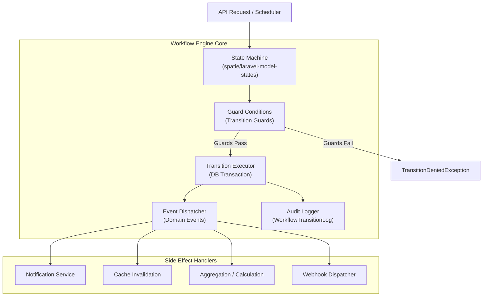
```mermaid
flowchart TB
    subgraph "Workflow Engine Core"
        SM["State Machine\n(spatie/laravel-model-states)"]
        GC["Guard Conditions\n(Transition Guards)"]
        TE["Transition Executor\n(DB Transaction)"]
        ED["Event Dispatcher\n(Domain Events)"]
        AL["Audit Logger\n(WorkflowTransitionLog)"]
    end

    subgraph "Side Effect Handlers"
        NF["Notification Service"]
        CC["Cache Invalidation"]
        AG["Aggregation / Calculation"]
        WH["Webhook Dispatcher"]
    end

    API["API Request / Scheduler"] --> SM
    SM --> GC
    GC -->|"Guards Pass"| TE
    GC -->|"Guards Fail"| ERR["TransitionDeniedException"]
    TE --> ED
    TE --> AL
    ED --> NF
    ED --> CC
    ED --> AG
    ED --> WH
```

### 1.4 State Naming Convention

All state values follow `snake_case` and are stored as `VARCHAR(50)` enum-like columns in the database:

| Convention | Example |
|-----------|---------|
| Simple noun/adjective | `draft`, `published`, `completed` |
| Compound states | `in_progress`, `under_review`, `signed_off` |
| Approval states | `pending_approval`, `under_appeal_review` |
| Terminal states (positive) | `completed`, `approved`, `published`, `disbursed` |
| Terminal states (negative) | `cancelled`, `rejected`, `archived` |

### 1.5 Transition Naming Convention

Transition class names follow `PascalCase` and describe the action:

```
{Entity}{Action}Transition
```

Examples: `RotationPeriodPublishTransition`, `LogbookEntrySubmitTransition`, `GradeApproveTransition`

---

## 2. Workflow Definitions

---

### WF-001: Rotation Period Lifecycle

**Entity**: `RotationPeriod`  
**Domain**: Rotation Management  
**PRD Reference**: FR-020  
**Owner**: Admin Prodi (AP)  
**Database Column**: `rotation_periods.status`

#### State Diagram

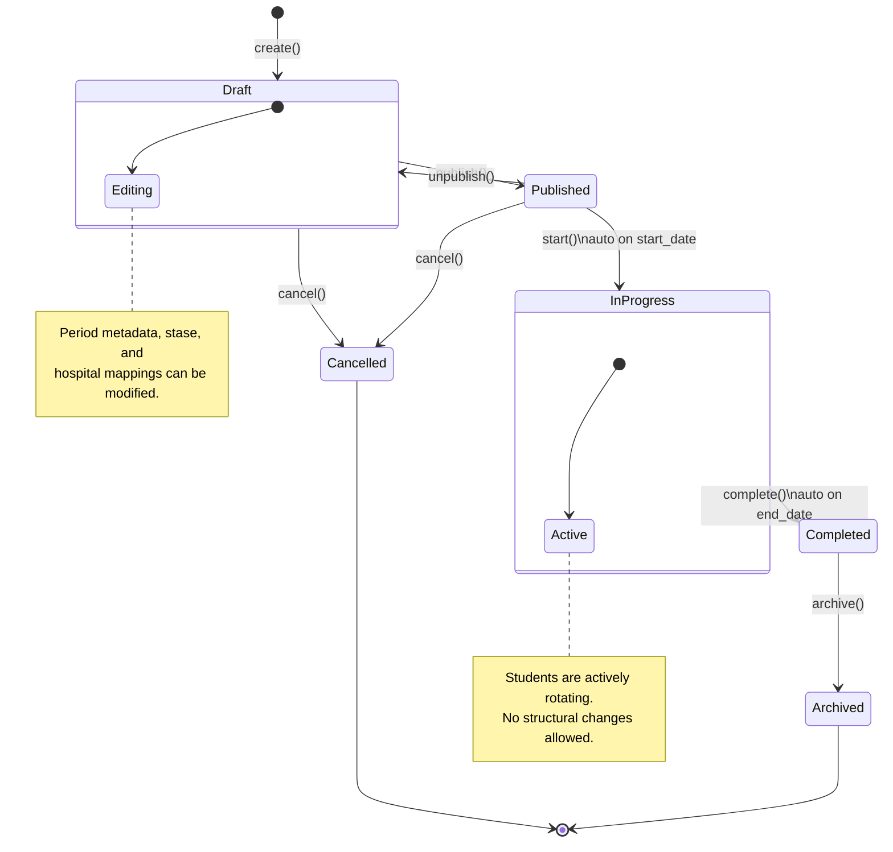
```mermaid
stateDiagram-v2
    [*] --> Draft : create()
    Draft --> Published : publish()
    Published --> Draft : unpublish()
    Published --> InProgress : start()\nauto on start_date
    InProgress --> Completed : complete()\nauto on end_date
    Completed --> Archived : archive()

    Draft --> Cancelled : cancel()
    Published --> Cancelled : cancel()
    Cancelled --> [*]
    Archived --> [*]

    state Draft {
        [*] --> Editing
        note right of Editing
            Period metadata, stase, and
            hospital mappings can be modified.
        end note
    }

    state InProgress {
        [*] --> Active
        note right of Active
            Students are actively rotating.
            No structural changes allowed.
        end note
    }
```

#### States

| State | Value | Description | Editable Fields |
|-------|-------|-------------|-----------------|
| **Draft** | `draft` | Initial state. Period is being configured with dates, stase, hospital capacity, and assignments. | All fields |
| **Published** | `published` | Period is finalized and visible to all stakeholders. Notifications sent. Assignments can still be adjusted. | Capacity, assignments only |
| **In Progress** | `in_progress` | Rotation period has started. Students are actively rotating. No structural changes. | None (read-only) |
| **Completed** | `completed` | Rotation period has ended. Grade finalization reminders triggered. Assessment submission window open. | None (read-only) |
| **Archived** | `archived` | Historical record. Retained for analytics and accreditation reporting. Terminal state. | None (read-only) |
| **Cancelled** | `cancelled` | Period was cancelled before starting. All assignments released. Terminal state. | None (read-only) |

#### Transitions

| # | From | To | Trigger | Guard Conditions | Side Effects |
|---|------|----|---------|------------------|--------------|
| T1 | — | `draft` | `create()` | Actor has `rotation.create` permission; program is active; dates within academic calendar | Emit `RotationPeriodCreated` |
| T2 | `draft` | `published` | `publish()` | At least one stase assigned; at least one hospital mapped; start_date > now + 7 days; capacity > 0 for all stase-hospital pairs; no date overlap with existing published periods for same stase | Emit `RotationPeriodPublished`; notify all assigned students (MH), hospital admins (AR), and preceptors (DK) |
| T3 | `published` | `draft` | `unpublish()` | No confirmed assignments exist (all assignments must be in `pending` state); start_date > now + 14 days | Emit `RotationPeriodUnpublished`; notify affected parties of retraction |
| T4 | `published` | `in_progress` | `start()` | `now() >= start_date`; at least one confirmed assignment exists | Emit `RotationPeriodStarted`; transition all `confirmed` assignments to `in_progress`; activate attendance tracking |
| T5 | `in_progress` | `completed` | `complete()` | `now() >= end_date`; all assessments for the period have been submitted or flagged as missing | Emit `RotationPeriodCompleted`; trigger grade finalization reminders to assessors (DK, DO); open grade submission window (14-day deadline) |
| T6 | `completed` | `archived` | `archive()` | All stase grades for this period are in `published` or `appealed_resolved` state; minimum 30 days since completion | Emit `RotationPeriodArchived` |
| T7 | `draft` | `cancelled` | `cancel()` | No confirmed assignments exist | Emit `RotationPeriodCancelled`; release all pending assignments |
| T8 | `published` | `cancelled` | `cancel()` | start_date > now + 7 days; all assignments can be released; Kaprodi approval obtained | Emit `RotationPeriodCancelled`; cancel all assignments; notify all affected parties |

#### Role Permissions

| Transition | Super Admin (SA) | Admin Prodi (AP) | Kaprodi (KP) | System (Scheduler) |
|------------|:---:|:---:|:---:|:---:|
| `create()` | ✅ | ✅ | ❌ | ❌ |
| `publish()` | ✅ | ✅ | ❌ | ❌ |
| `unpublish()` | ✅ | ✅ | ❌ | ❌ |
| `start()` | ✅ | ✅ | ❌ | ✅ (auto) |
| `complete()` | ✅ | ✅ | ❌ | ✅ (auto) |
| `archive()` | ✅ | ✅ | ❌ | ✅ (auto after 90 days) |
| `cancel()` | ✅ | ✅ | ✅ (co-approval) | ❌ |

#### Timeout & Escalation Rules

| Rule ID | Condition | Timeout | Action |
|---------|-----------|---------|--------|
| WF001-T1 | Period remains in `draft` for > 30 days | 30 days | Email reminder to creator (AP); escalate to Kaprodi (KP) after 45 days |
| WF001-T2 | Period in `published` but `start_date` is tomorrow and < 50% assignments confirmed | 1 day before start | Urgent notification to Admin Prodi (AP) and Kaprodi (KP) |
| WF001-T3 | Period in `completed` but grades not finalized within 14 days | 14 days post-completion | Reminder to all assessors; escalate to Admin Prodi (AP) at 21 days; escalate to Kaprodi (KP) at 28 days |
| WF001-T4 | Auto-transition `published` → `in_progress` | On `start_date` at 00:00 WIB | Scheduler job runs daily at 00:05 WIB |
| WF001-T5 | Auto-transition `in_progress` → `completed` | On `end_date` at 23:59 WIB | Scheduler job runs daily at 00:05 WIB |

---

### WF-002: Student Rotation Assignment

**Entity**: `RotationAssignment`  
**Domain**: Rotation Management  
**PRD Reference**: FR-021  
**Owner**: Admin Prodi (AP)  
**Database Column**: `rotation_assignments.status`

#### State Diagram

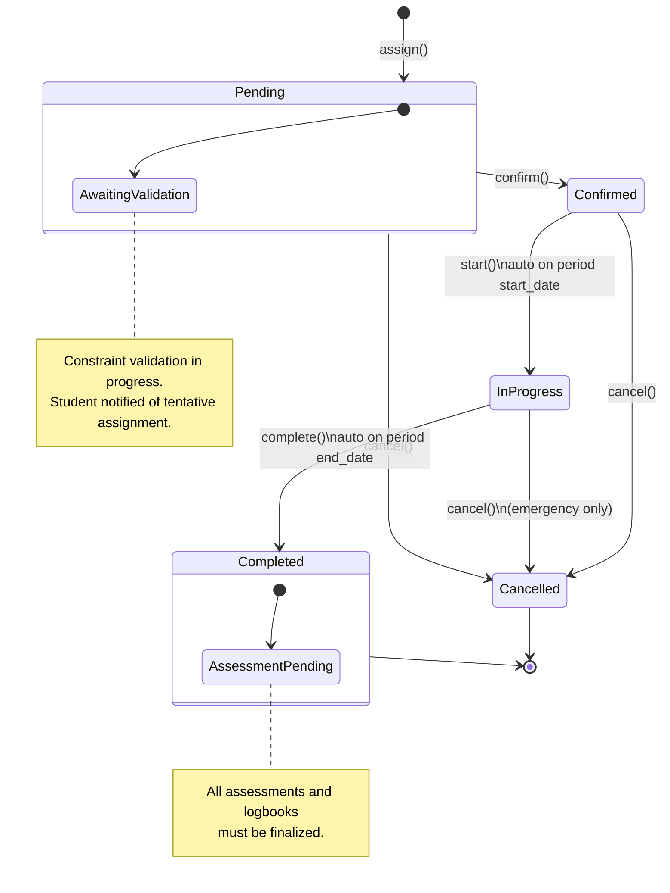
```mermaid
stateDiagram-v2
    [*] --> Pending : assign()
    Pending --> Confirmed : confirm()
    Pending --> Cancelled : cancel()
    Confirmed --> InProgress : start()\nauto on period start_date
    Confirmed --> Cancelled : cancel()
    InProgress --> Completed : complete()\nauto on period end_date
    InProgress --> Cancelled : cancel()\n(emergency only)
    Completed --> [*]
    Cancelled --> [*]

    state Pending {
        [*] --> AwaitingValidation
        note right of AwaitingValidation
            Constraint validation in progress.
            Student notified of tentative assignment.
        end note
    }

    state Completed {
        [*] --> AssessmentPending
        note right of AssessmentPending
            All assessments and logbooks
            must be finalized.
        end note
    }
```

#### States

| State | Value | Description | Invariants |
|-------|-------|-------------|------------|
| **Pending** | `pending` | Assignment created but not yet validated and confirmed. Student is tentatively assigned. | Rotation period is `draft` or `published` |
| **Confirmed** | `confirmed` | Assignment validated against all constraints and confirmed. Student is officially assigned. | All constraints pass; rotation period is `published` |
| **In Progress** | `in_progress` | Student is actively rotating in the assigned stase at the assigned hospital. | Rotation period is `in_progress` |
| **Completed** | `completed` | Rotation period ended. Student's participation is recorded. Terminal positive state. | All required logbook entries submitted; minimum assessment count met |
| **Cancelled** | `cancelled` | Assignment cancelled. Slot released back to capacity pool. Terminal negative state. | Cancellation reason recorded |

#### Transitions

| # | From | To | Trigger | Guard Conditions | Side Effects |
|---|------|----|---------|------------------|--------------|
| T1 | — | `pending` | `assign()` | Student status is `active`; student has no overlapping assignment for the same period; hospital capacity not exceeded; prerequisite stase completed; student has no approved leave overlapping the period; rotation period is `draft` or `published` | Emit `RotationAssignmentCreated`; tentative notification to student (MH) |
| T2 | `pending` | `confirmed` | `confirm()` | Re-validate all T1 guards (capacity may have changed); rotation period is `published` | Emit `RotationAssignmentConfirmed`; notify student (MH), hospital admin (AR), assigned preceptor (DK); decrement available capacity |
| T3 | `confirmed` | `in_progress` | `start()` | Rotation period has transitioned to `in_progress` | Emit `RotationAssignmentStarted`; activate logbook submission for this assignment; activate assessment scheduling |
| T4 | `in_progress` | `completed` | `complete()` | Rotation period has transitioned to `completed`; minimum logbook entry count met OR flagged for admin review; minimum assessment count met OR flagged for admin review | Emit `RotationAssignmentCompleted`; trigger stase grade calculation (WF-006) |
| T5 | `pending` | `cancelled` | `cancel()` | Cancellation reason provided | Emit `RotationAssignmentCancelled`; increment available capacity; notify student (MH) |
| T6 | `confirmed` | `cancelled` | `cancel()` | Cancellation reason provided; start_date > now (period not yet started) | Emit `RotationAssignmentCancelled`; increment available capacity; notify student (MH), hospital admin (AR), preceptor (DK) |
| T7 | `in_progress` | `cancelled` | `cancel()` | Emergency cancellation only; requires Kaprodi (KP) approval; cancellation reason of type `medical_emergency`, `disciplinary`, or `force_majeure` | Emit `RotationAssignmentCancelled`; flag for remedial scheduling; notify all parties |

#### Role Permissions

| Transition | SA | AP | KP | MH | System |
|------------|:---:|:---:|:---:|:---:|:---:|
| `assign()` | ✅ | ✅ | ❌ | ❌ | ✅ (auto-assign) |
| `confirm()` | ✅ | ✅ | ❌ | ❌ | ✅ (batch) |
| `start()` | ❌ | ❌ | ❌ | ❌ | ✅ (auto) |
| `complete()` | ❌ | ❌ | ❌ | ❌ | ✅ (auto) |
| `cancel()` (pending) | ✅ | ✅ | ✅ | ❌ | ❌ |
| `cancel()` (confirmed) | ✅ | ✅ | ✅ | ❌ | ❌ |
| `cancel()` (in_progress) | ✅ | ❌ | ✅ (required) | ❌ | ❌ |

#### Timeout & Escalation Rules

| Rule ID | Condition | Timeout | Action |
|---------|-----------|---------|--------|
| WF002-T1 | Assignment remains `pending` for > 7 days | 7 days | Reminder to Admin Prodi (AP) to confirm or cancel |
| WF002-T2 | Assignment `in_progress` but 0 logbook entries after 7 days | 7 days from start | Alert to student (MH) and preceptor (DK) |
| WF002-T3 | Batch auto-confirm: all `pending` assignments auto-confirm 3 days before period start | 3 days before start_date | System auto-confirms if guards pass; notifies AP of any that fail validation |

---

### WF-003: Rotation Swap Request

**Entity**: `RotationSwapRequest`  
**Domain**: Rotation Management  
**PRD Reference**: FR-022  
**Owner**: Student (MH), approved by Admin Prodi (AP)  
**Database Column**: `rotation_swap_requests.status`

#### State Diagram

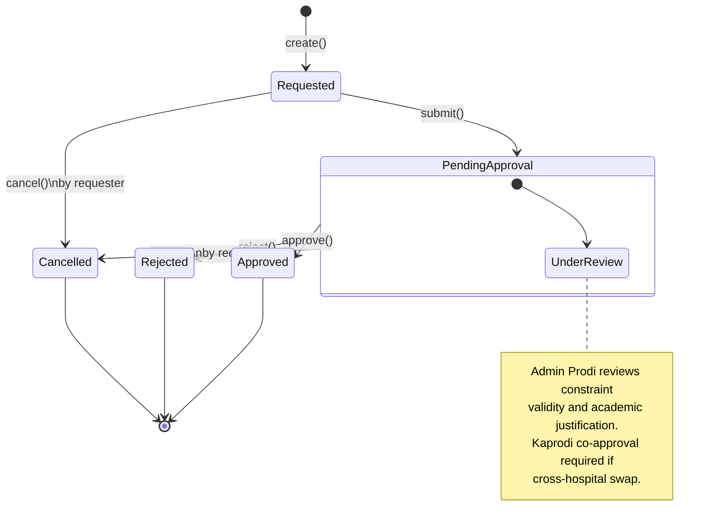
```mermaid
stateDiagram-v2
    [*] --> Requested : create()
    Requested --> PendingApproval : submit()
    Requested --> Cancelled : cancel()\nby requester
    PendingApproval --> Approved : approve()
    PendingApproval --> Rejected : reject()
    PendingApproval --> Cancelled : cancel()\nby requester
    Approved --> [*]
    Rejected --> [*]
    Cancelled --> [*]

    state PendingApproval {
        [*] --> UnderReview
        note right of UnderReview
            Admin Prodi reviews constraint
            validity and academic justification.
            Kaprodi co-approval required if
            cross-hospital swap.
        end note
    }
```

#### States

| State | Value | Description | Invariants |
|-------|-------|-------------|------------|
| **Requested** | `requested` | Student has initiated a swap request with a target partner student and reason. Draft state. | Requester is active student; swap request quota not exceeded |
| **Pending Approval** | `pending_approval` | Request formally submitted for review. Partner student has been notified and accepted. | Partner student has accepted the swap invitation |
| **Approved** | `approved` | Swap approved. Both students' schedules atomically updated. Terminal positive state. | Both assignments swapped in a single transaction |
| **Rejected** | `rejected` | Swap denied with documented reason. Terminal negative state. | Rejection reason recorded |
| **Cancelled** | `cancelled` | Request withdrawn by the requester before approval. Terminal negative state. | — |

#### Transitions

| # | From | To | Trigger | Guard Conditions | Side Effects |
|---|------|----|---------|------------------|--------------|
| T1 | — | `requested` | `create()` | Requester is active student; requester has not exceeded max swap requests per semester (default: 2); target rotation period is `published` and start_date > now + 14 days; both requester and target student have assignments in the relevant period | Emit `SwapRequestCreated`; notify target student for acceptance |
| T2 | `requested` | `pending_approval` | `submit()` | Target student has accepted the swap invitation (confirmed via in-app action); both students' schedules validated against constraints post-swap (capacity, prerequisites, no conflicts) | Emit `SwapRequestSubmitted`; notify Admin Prodi (AP) for review; notify Kaprodi (KP) if cross-hospital swap |
| T3 | `pending_approval` | `approved` | `approve()` | Re-validate all constraints at approval time; approver has `swap.approve` permission; for cross-hospital swaps, both AP and KP have approved | Emit `SwapRequestApproved`; atomically swap both students' `RotationAssignment` records; notify both students (MH), both hospital admins (AR), both preceptors (DK) |
| T4 | `pending_approval` | `rejected` | `reject()` | Rejection reason provided (min 20 characters) | Emit `SwapRequestRejected`; notify both students (MH) with rejection reason |
| T5 | `requested` | `cancelled` | `cancel()` | Requester is the original requester | Emit `SwapRequestCancelled`; notify target student if already notified |
| T6 | `pending_approval` | `cancelled` | `cancel()` | Requester is the original requester; approval has not yet been granted | Emit `SwapRequestCancelled`; notify Admin Prodi (AP) and target student |

#### Role Permissions

| Transition | SA | AP | KP | MH (Requester) | MH (Target) |
|------------|:---:|:---:|:---:|:---:|:---:|
| `create()` | ❌ | ❌ | ❌ | ✅ | ❌ |
| `submit()` | ❌ | ❌ | ❌ | ✅ | ✅ (accept) |
| `approve()` | ✅ | ✅ | ✅ (cross-hospital) | ❌ | ❌ |
| `reject()` | ✅ | ✅ | ✅ | ❌ | ❌ |
| `cancel()` | ✅ | ✅ | ❌ | ✅ | ❌ |

#### Timeout & Escalation Rules

| Rule ID | Condition | Timeout | Action |
|---------|-----------|---------|--------|
| WF003-T1 | Target student has not accepted/declined within 3 days | 3 days | Reminder to target student; auto-cancel after 7 days of no response |
| WF003-T2 | Request in `pending_approval` for > 5 business days | 5 business days | Escalate to Kaprodi (KP); send reminder to Admin Prodi (AP) |
| WF003-T3 | Request `pending_approval` but rotation start_date is within 14 days | Dynamic | Auto-reject with reason "insufficient processing time" and notify requester |

---

### WF-004: Logbook Entry

**Entity**: `LogbookEntry`  
**Domain**: Clinical Activities  
**PRD Reference**: FR-030  
**Owner**: Student (MH), signed off by Dodiknis (DK)  
**Database Column**: `logbook_entries.status`

#### State Diagram

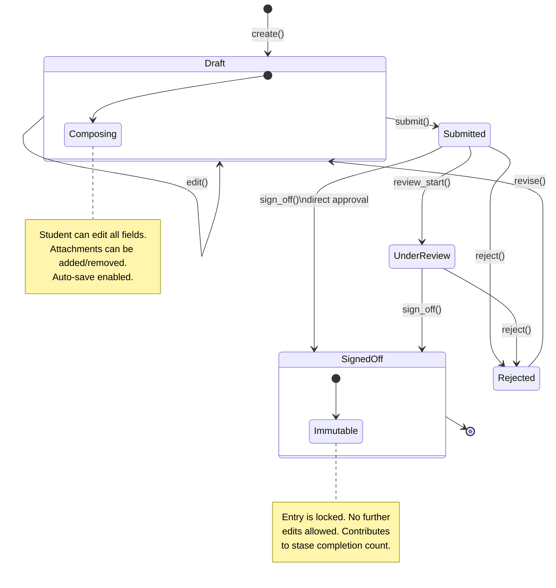
```mermaid
stateDiagram-v2
    [*] --> Draft : create()
    Draft --> Submitted : submit()
    Draft --> Draft : edit()
    Submitted --> UnderReview : review_start()
    Submitted --> SignedOff : sign_off()\ndirect approval
    Submitted --> Rejected : reject()
    UnderReview --> SignedOff : sign_off()
    UnderReview --> Rejected : reject()
    Rejected --> Draft : revise()
    SignedOff --> [*]

    state Draft {
        [*] --> Composing
        note right of Composing
            Student can edit all fields.
            Attachments can be added/removed.
            Auto-save enabled.
        end note
    }

    state SignedOff {
        [*] --> Immutable
        note right of Immutable
            Entry is locked. No further
            edits allowed. Contributes
            to stase completion count.
        end note
    }
```

#### States

| State | Value | Description | Mutability |
|-------|-------|-------------|------------|
| **Draft** | `draft` | Student is composing the entry. All fields editable. Attachments can be managed. | Fully editable |
| **Submitted** | `submitted` | Student has submitted for preceptor review. Student cannot edit. | Read-only for student |
| **Under Review** | `under_review` | Preceptor has opened the entry and is actively reviewing. | Read-only |
| **Signed Off** | `signed_off` | Preceptor has approved the entry. Immutable. Counts toward stase logbook completion. Terminal positive state. | Immutable |
| **Rejected** | `rejected` | Preceptor has rejected with feedback. Returns to Draft for revision. Transient state. | Read-only (until revise) |

#### Transitions

| # | From | To | Trigger | Guard Conditions | Side Effects |
|---|------|----|---------|------------------|--------------|
| T1 | — | `draft` | `create()` | Student has an active `in_progress` rotation assignment for the stase; activity_date is within the rotation period date range; activity_date ≤ now | Emit `LogbookEntryCreated` |
| T2 | `draft` | `submitted` | `submit()` | All required fields populated (date, activity_type, description, diagnosis, supervisor); at least one clinical activity described; activity_date is within 7 days of now (late submission flagged but allowed with grace period); file attachments ≤ 5 MB each, images/PDF only | Emit `LogbookEntrySubmitted`; notify assigned Dodiknis (DK) for review |
| T3 | `submitted` | `under_review` | `review_start()` | Reviewer is the assigned Dodiknis for this student's stase-hospital assignment OR a substitute Dodiknis with delegation | Emit `LogbookEntryReviewStarted` |
| T4 | `submitted` or `under_review` | `signed_off` | `sign_off()` | Reviewer is authorized Dodiknis; reviewer has read the entry (tracked by `review_start` or minimum view time); digital signature captured | Emit `LogbookEntrySigned`; increment student's stase logbook completion count; update stase progress percentage |
| T5 | `submitted` or `under_review` | `rejected` | `reject()` | Rejection feedback provided (min 10 characters); reviewer is authorized Dodiknis | Emit `LogbookEntryRejected`; notify student (MH) with rejection feedback and specific items to revise |
| T6 | `rejected` | `draft` | `revise()` | Student is the entry owner; revision note or change made | Emit `LogbookEntryRevised`; increment revision_count; preserve rejection history |

#### Role Permissions

| Transition | SA | AP | DK | MH (Owner) |
|------------|:---:|:---:|:---:|:---:|
| `create()` | ❌ | ❌ | ❌ | ✅ |
| `submit()` | ❌ | ❌ | ❌ | ✅ |
| `review_start()` | ❌ | ❌ | ✅ | ❌ |
| `sign_off()` | ❌ | ❌ | ✅ | ❌ |
| `reject()` | ❌ | ❌ | ✅ | ❌ |
| `revise()` | ❌ | ❌ | ❌ | ✅ |

#### Timeout & Escalation Rules

| Rule ID | Condition | Timeout | Action |
|---------|-----------|---------|--------|
| WF004-T1 | Entry in `draft` for > 7 days since activity_date | 7 days from activity_date | Reminder to student (MH) about late submission policy (BR-003) |
| WF004-T2 | Entry in `submitted` for > 7 days without review | 7 days from submission | Reminder to Dodiknis (DK); at 14 days escalate to Admin Prodi (AP); at 21 days escalate to Kaprodi (KP) |
| WF004-T3 | Entry `rejected` but student has not revised within 7 days | 7 days from rejection | Reminder to student (MH); flag as "stalled" for Admin Prodi (AP) visibility |
| WF004-T4 | Rotation period ends with entries still in `submitted` or `under_review` | On period `completed` | Urgent batch notification to all Dodiknis (DK) with unreviewed entries; 7-day hard deadline |

---

### WF-005: Assessment (Mini-CEX / DOPS / CBD)

**Entity**: `Assessment` (polymorphic: `MiniCexAssessment`, `DopsAssessment`, `CbdAssessment`)  
**Domain**: Assessment & Grading  
**PRD Reference**: FR-040, FR-041, FR-042  
**Owner**: Assessor (DK or DO)  
**Database Column**: `assessments.status`

#### State Diagram

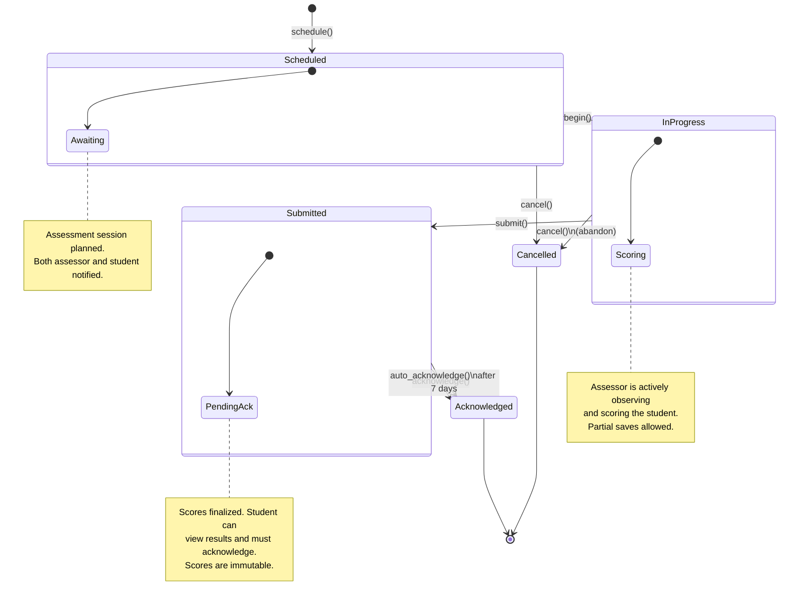
```mermaid
stateDiagram-v2
    [*] --> Scheduled : schedule()
    Scheduled --> InProgress : begin()
    Scheduled --> Cancelled : cancel()
    InProgress --> Submitted : submit()
    InProgress --> Cancelled : cancel()\n(abandon)
    Submitted --> Acknowledged : acknowledge()
    Submitted --> Acknowledged : auto_acknowledge()\nafter 7 days
    Acknowledged --> [*]
    Cancelled --> [*]

    state Scheduled {
        [*] --> Awaiting
        note right of Awaiting
            Assessment session planned.
            Both assessor and student notified.
        end note
    }

    state InProgress {
        [*] --> Scoring
        note right of Scoring
            Assessor is actively observing
            and scoring the student.
            Partial saves allowed.
        end note
    }

    state Submitted {
        [*] --> PendingAck
        note right of PendingAck
            Scores finalized. Student can
            view results and must acknowledge.
            Scores are immutable.
        end note
    }
```

#### States

| State | Value | Description | Score Visibility |
|-------|-------|-------------|------------------|
| **Scheduled** | `scheduled` | Assessment session planned with date, time, and location. Both parties notified. | Scores not yet entered |
| **In Progress** | `in_progress` | Assessor is actively conducting the assessment. Partial scoring saved as draft. | Visible to assessor only |
| **Submitted** | `submitted` | All scoring rubrics completed. Narrative feedback written. Scores finalized. | Visible to assessor + student |
| **Acknowledged** | `acknowledged` | Student has viewed and acknowledged the assessment results. Contributes to grade calculation. Terminal positive state. | Visible to all authorized parties |
| **Cancelled** | `cancelled` | Assessment cancelled (e.g., student absent, scheduling conflict). Does not count. Terminal negative state. | N/A |

#### Transitions

| # | From | To | Trigger | Guard Conditions | Side Effects |
|---|------|----|---------|------------------|--------------|
| T1 | — | `scheduled` | `schedule()` | Assessor has `assessment.create` permission; student has an `in_progress` assignment for the stase; assessment_date within the assignment period; student has not exceeded max assessments for this type in this stase | Emit `AssessmentScheduled`; notify student (MH) and assessor (DK/DO) with date, time, location |
| T2 | `scheduled` | `in_progress` | `begin()` | Assessment date ≤ now; assessor is the assigned assessor; student is present (confirmed by assessor) | Emit `AssessmentStarted` |
| T3 | `in_progress` | `submitted` | `submit()` | All required rubric items scored (no zero/null scores unless marked N/A); narrative feedback provided (min 50 characters for Mini-CEX, min 30 for DOPS/CBD); assessor digital signature captured | Emit `AssessmentSubmitted`; notify student (MH) to view and acknowledge; scores contribute to running grade calculation |
| T4 | `submitted` | `acknowledged` | `acknowledge()` | Student is the assessed student; student has viewed the full assessment (view tracked) | Emit `AssessmentAcknowledged`; lock assessment as fully immutable; update stase grade aggregation |
| T5 | `submitted` | `acknowledged` | `auto_acknowledge()` | 7 days elapsed since submission without student acknowledgment | Emit `AssessmentAutoAcknowledged`; same side effects as manual acknowledgment; flag as "auto-acknowledged" in audit log |
| T6 | `scheduled` | `cancelled` | `cancel()` | Cancellation reason provided; if student-initiated, must be > 24 hours before scheduled time | Emit `AssessmentCancelled`; notify counterparty; does not count toward assessment requirements |
| T7 | `in_progress` | `cancelled` | `cancel()` | Cancellation reason provided; reason type is `student_absent`, `emergency`, or `technical_issue` | Emit `AssessmentCancelled`; partial scores discarded |

#### Role Permissions

| Transition | SA | AP | DK | DO | MH |
|------------|:---:|:---:|:---:|:---:|:---:|
| `schedule()` | ✅ | ✅ | ✅ | ✅ | ❌ |
| `begin()` | ❌ | ❌ | ✅ | ✅ | ❌ |
| `submit()` | ❌ | ❌ | ✅ | ✅ | ❌ |
| `acknowledge()` | ❌ | ❌ | ❌ | ❌ | ✅ |
| `cancel()` (scheduled) | ✅ | ✅ | ✅ | ✅ | ✅ (24h rule) |
| `cancel()` (in_progress) | ❌ | ❌ | ✅ | ✅ | ❌ |

#### Timeout & Escalation Rules

| Rule ID | Condition | Timeout | Action |
|---------|-----------|---------|--------|
| WF005-T1 | Assessment remains `scheduled` past the assessment_date + 3 days | 3 days past scheduled date | Reminder to assessor (DK/DO); at 7 days auto-cancel with reason "expired" |
| WF005-T2 | Assessment `in_progress` for > 24 hours (forgot to submit) | 24 hours | Reminder to assessor to submit or cancel |
| WF005-T3 | Assessment `submitted` but not acknowledged within 7 days | 7 days | Auto-acknowledge (T5); flag in audit log |
| WF005-T4 | Student approaching stase end with fewer than minimum required assessments | 7 days before assignment end_date | Alert to student (MH), assessor (DK/DO), and Admin Prodi (AP) |

---

### WF-006: Stase Grade Approval

**Entity**: `StaseGrade`  
**Domain**: Assessment & Grading  
**PRD Reference**: FR-043, FR-044  
**Owner**: System (calculated), approved by Kaprodi (KP)  
**Database Column**: `stase_grades.status`

#### State Diagram

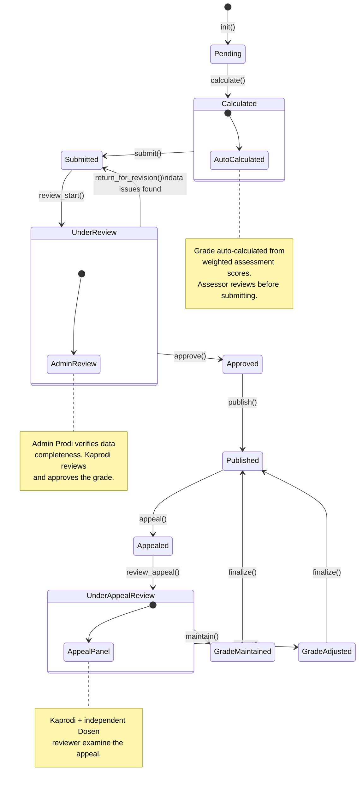
```mermaid
stateDiagram-v2
    [*] --> Pending : init()
    Pending --> Calculated : calculate()
    Calculated --> Submitted : submit()
    Submitted --> UnderReview : review_start()
    UnderReview --> Approved : approve()
    UnderReview --> Submitted : return_for_revision()\ndata issues found
    Approved --> Published : publish()
    Published --> Appealed : appeal()
    Appealed --> UnderAppealReview : review_appeal()
    UnderAppealReview --> GradeMaintained : maintain()
    UnderAppealReview --> GradeAdjusted : adjust()
    GradeMaintained --> Published : finalize()
    GradeAdjusted --> Published : finalize()

    state Calculated {
        [*] --> AutoCalculated
        note right of AutoCalculated
            Grade auto-calculated from
            weighted assessment scores.
            Assessor reviews before submitting.
        end note
    }

    state UnderReview {
        [*] --> AdminReview
        note right of AdminReview
            Admin Prodi verifies data
            completeness. Kaprodi reviews
            and approves the grade.
        end note
    }

    state UnderAppealReview {
        [*] --> AppealPanel
        note right of AppealPanel
            Kaprodi + independent Dosen
            reviewer examine the appeal.
        end note
    }
```

#### States

| State | Value | Description | Grade Visibility |
|-------|-------|-------------|------------------|
| **Pending** | `pending` | Grade record initialized but assessments are still in progress. No score yet. | Not visible |
| **Calculated** | `calculated` | System has auto-calculated the weighted average from all acknowledged assessments. Assessor reviews for accuracy. | Assessor only |
| **Submitted** | `submitted` | Assessor has reviewed and submitted the calculated grade. Ready for administrative review. | Assessor + Admin Prodi |
| **Under Review** | `under_review` | Admin Prodi (AP) is verifying data completeness (all assessments, logbooks). Kaprodi (KP) reviews. | AP + KP |
| **Approved** | `approved` | Kaprodi has approved the grade. Ready for publication to student. | AP + KP + DO/DK |
| **Published** | `published` | Grade is visible to the student. Appeal window opens (14 days). | All authorized parties |
| **Appealed** | `appealed` | Student has filed a formal grade appeal within the appeal window. | All authorized parties + reviewer |
| **Under Appeal Review** | `under_appeal_review` | Appeal panel (Kaprodi + independent Dosen) is reviewing the appeal. | All authorized parties + panel |
| **Grade Maintained** | `grade_maintained` | Appeal reviewed; original grade upheld. Transient state before finalization. | All authorized parties |
| **Grade Adjusted** | `grade_adjusted` | Appeal reviewed; grade changed. New grade recorded with justification. Transient state. | All authorized parties |

#### Transitions

| # | From | To | Trigger | Guard Conditions | Side Effects |
|---|------|----|---------|------------------|--------------|
| T1 | — | `pending` | `init()` | Student has a `completed` rotation assignment for this stase | Emit `StaseGradeInitialized` |
| T2 | `pending` | `calculated` | `calculate()` | All required assessments (Mini-CEX, DOPS, CBD) for the stase are `acknowledged`; logbook completion ≥ minimum threshold; all assessment scores are numeric and within valid range (1-9) | Emit `StaseGradeCalculated`; compute weighted average per grading rubric configuration; map numeric score to letter grade (A through E per FR-043) |
| T3 | `calculated` | `submitted` | `submit()` | Assessor has reviewed the calculated grade; assessor confirms accuracy or provides adjustment justification | Emit `StaseGradeSubmitted`; notify Admin Prodi (AP) for verification |
| T4 | `submitted` | `under_review` | `review_start()` | Admin Prodi confirms: all assessments accounted for, no pending logbook entries, no missing data | Emit `StaseGradeReviewStarted`; notify Kaprodi (KP) for approval |
| T5 | `under_review` | `approved` | `approve()` | Kaprodi confirms grade is appropriate; no data integrity issues flagged | Emit `StaseGradeApproved` |
| T6 | `under_review` | `submitted` | `return_for_revision()` | Data issue identified (missing assessment, calculation error); revision reason provided | Emit `StaseGradeReturnedForRevision`; notify assessor (DK/DO) with revision notes |
| T7 | `approved` | `published` | `publish()` | Grade record is complete; student profile is accessible | Emit `StaseGradePublished`; notify student (MH) with grade details; start 14-day appeal window; if grade < passing threshold, emit `StaseGradeFailed` and flag for remedial scheduling |
| T8 | `published` | `appealed` | `appeal()` | Student is the graded student; appeal filed within 14 days of publication; appeal reason and evidence provided; student has not previously appealed this stase grade | Emit `StaseGradeAppealed`; notify Kaprodi (KP) and assign independent Dosen reviewer |
| T9 | `appealed` | `under_appeal_review` | `review_appeal()` | Independent Dosen reviewer assigned and confirmed; all appeal evidence collected | Emit `StaseGradeAppealReviewStarted` |
| T10 | `under_appeal_review` | `grade_maintained` | `maintain()` | Appeal panel decision is unanimous or majority; written justification provided (min 100 characters) | Emit `StaseGradeAppealMaintained`; notify student (MH) with detailed justification |
| T11 | `under_appeal_review` | `grade_adjusted` | `adjust()` | New grade value provided; adjustment justification provided; new grade validated against scale | Emit `StaseGradeAppealAdjusted`; record both old and new grade; notify student (MH) |
| T12 | `grade_maintained` | `published` | `finalize()` | — | Emit `StaseGradeAppealFinalized`; appeal window closed; grade is now final and immutable |
| T13 | `grade_adjusted` | `published` | `finalize()` | — | Emit `StaseGradeAppealFinalized`; update grade value; recalculate cumulative GPA if applicable; appeal window closed |

#### Role Permissions

| Transition | SA | AP | KP | DO | DK | MH |
|------------|:---:|:---:|:---:|:---:|:---:|:---:|
| `init()` | ❌ | ❌ | ❌ | ❌ | ❌ | ❌ (system) |
| `calculate()` | ❌ | ❌ | ❌ | ❌ | ❌ | ❌ (system) |
| `submit()` | ❌ | ❌ | ❌ | ✅ | ✅ | ❌ |
| `review_start()` | ✅ | ✅ | ❌ | ❌ | ❌ | ❌ |
| `approve()` | ❌ | ❌ | ✅ | ❌ | ❌ | ❌ |
| `return_for_revision()` | ❌ | ✅ | ✅ | ❌ | ❌ | ❌ |
| `publish()` | ✅ | ✅ | ✅ | ❌ | ❌ | ❌ |
| `appeal()` | ❌ | ❌ | ❌ | ❌ | ❌ | ✅ |
| `review_appeal()` | ❌ | ❌ | ✅ | ✅ (reviewer) | ❌ | ❌ |
| `maintain()` | ❌ | ❌ | ✅ | ✅ (reviewer) | ❌ | ❌ |
| `adjust()` | ❌ | ❌ | ✅ | ✅ (reviewer) | ❌ | ❌ |
| `finalize()` | ❌ | ❌ | ✅ | ❌ | ❌ | ❌ |

#### Timeout & Escalation Rules

| Rule ID | Condition | Timeout | Action |
|---------|-----------|---------|--------|
| WF006-T1 | Grade in `pending` but rotation completed > 14 days ago | 14 days post-rotation | Notify assessors (DK/DO) of pending grade calculation; at 21 days escalate to AP |
| WF006-T2 | Grade in `calculated` but not submitted within 7 days | 7 days | Reminder to assessor; at 14 days escalate to Admin Prodi (AP) |
| WF006-T3 | Grade in `submitted` without review start within 5 business days | 5 business days | Reminder to Admin Prodi (AP); at 10 days escalate to Kaprodi (KP) |
| WF006-T4 | Grade in `under_review` without decision within 5 business days | 5 business days | Reminder to Kaprodi (KP) |
| WF006-T5 | Grade `approved` but not published within 3 days | 3 days | Auto-publish if no holds; or reminder to Admin Prodi (AP) |
| WF006-T6 | Appeal window: 14 days from publication date | 14 days | After window closes, grade becomes final (appeal no longer possible) |
| WF006-T7 | Appeal in `under_appeal_review` for > 14 days | 14 days | Escalation to Kaprodi (KP) for expedited decision |

#### Grade Calculation Formula

```
stase_grade = Σ (assessment_type_weight × assessment_type_average)

Where:
  assessment_type_average = mean(all acknowledged assessment scores of that type)
  assessment_type_weight = configured per stase (e.g., Mini-CEX: 30%, DOPS: 30%, CBD: 20%, Logbook: 20%)

Letter Grade Mapping:
  A  = score ≥ 85    (4.00)
  A- = score ≥ 80    (3.75)
  B+ = score ≥ 75    (3.50)
  B  = score ≥ 70    (3.00)
  C+ = score ≥ 65    (2.50)
  C  = score ≥ 60    (2.00)  ← Default passing threshold
  D  = score ≥ 50    (1.00)
  E  = score < 50    (0.00)

Note: Assessment scores on a 1-9 rubric scale are normalized
      to a 0-100 scale before weighted aggregation:
      normalized_score = ((raw_score - 1) / 8) × 100
```

---

### WF-007: Honorarium Processing

**Entity**: `HonorariumBatch` / `HonorariumItem`  
**Domain**: Finance  
**PRD Reference**: FR-061  
**Owner**: Finance (FN)  
**Database Column**: `honorarium_batches.status`

#### State Diagram

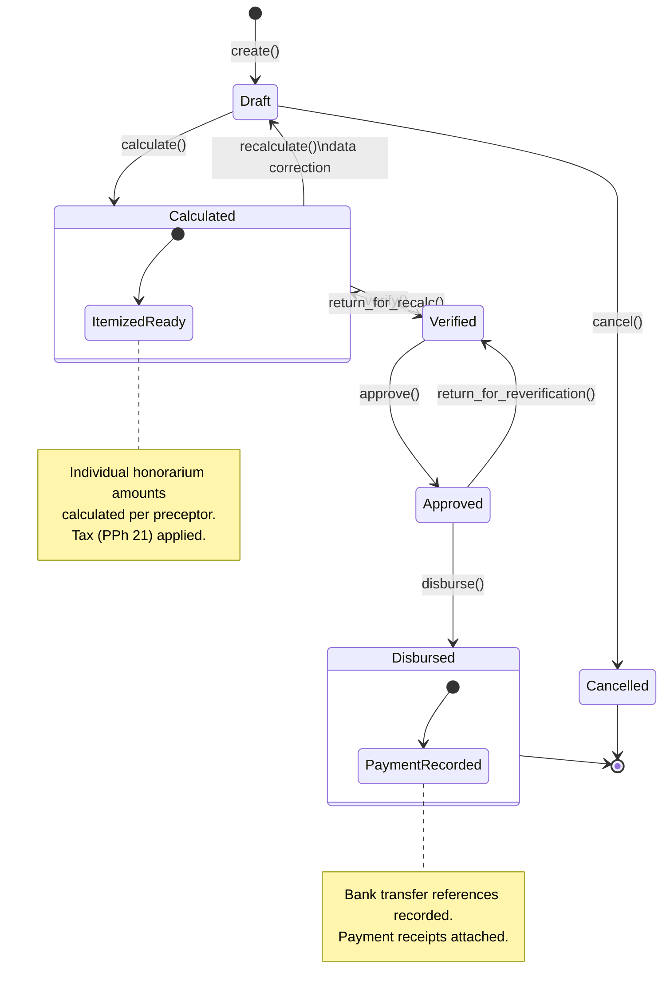
```mermaid
stateDiagram-v2
    [*] --> Draft : create()
    Draft --> Calculated : calculate()
    Draft --> Cancelled : cancel()
    Calculated --> Verified : verify()
    Calculated --> Draft : recalculate()\ndata correction
    Verified --> Approved : approve()
    Verified --> Calculated : return_for_recalc()
    Approved --> Disbursed : disburse()
    Approved --> Verified : return_for_reverification()
    Disbursed --> [*]
    Cancelled --> [*]

    state Calculated {
        [*] --> ItemizedReady
        note right of ItemizedReady
            Individual honorarium amounts
            calculated per preceptor.
            Tax (PPh 21) applied.
        end note
    }

    state Disbursed {
        [*] --> PaymentRecorded
        note right of PaymentRecorded
            Bank transfer references recorded.
            Payment receipts attached.
        end note
    }
```

#### States

| State | Value | Description | Financial Commitment |
|-------|-------|-------------|---------------------|
| **Draft** | `draft` | Batch created for a specific period. No calculations yet. | None |
| **Calculated** | `calculated` | System has calculated individual amounts per Dodiknis based on supervision data. Tax withheld. | Projected |
| **Verified** | `verified` | Admin Prodi has verified supervision data accuracy and calculation correctness. | Committed (pending approval) |
| **Approved** | `approved` | Kaprodi has approved the batch for disbursement. | Authorized |
| **Disbursed** | `disbursed` | Finance has processed bank transfers and recorded payment references. Terminal positive state. | Settled |
| **Cancelled** | `cancelled` | Batch cancelled before disbursement. Terminal negative state. | Void |

#### Transitions

| # | From | To | Trigger | Guard Conditions | Side Effects |
|---|------|----|---------|------------------|--------------|
| T1 | — | `draft` | `create()` | Rotation period is `completed` or `archived`; no existing honorarium batch for this period; actor has `finance.honorarium.create` permission | Emit `HonorariumBatchCreated` |
| T2 | `draft` | `calculated` | `calculate()` | All rotation assignments for the period are `completed`; all assessment data is finalized; honorarium rate configuration exists for all stase-hospital combinations | Emit `HonorariumBatchCalculated`; compute per-Dodiknis amounts: (students_supervised × rate_per_student × stase_multiplier); apply PPh 21 tax; generate itemized report |
| T3 | `calculated` | `verified` | `verify()` | Admin Prodi has reviewed itemized report; no flagged discrepancies; all Dodiknis bank details on file | Emit `HonorariumBatchVerified`; notify Kaprodi (KP) for approval |
| T4 | `calculated` | `draft` | `recalculate()` | Data correction needed (e.g., late assessment submission altered supervision data) | Emit `HonorariumBatchRecalculationRequested`; clear previous calculation |
| T5 | `verified` | `approved` | `approve()` | Kaprodi confirms batch; total amount within budget threshold (if configured) | Emit `HonorariumBatchApproved`; notify Finance (FN) to process disbursement |
| T6 | `verified` | `calculated` | `return_for_recalc()` | Kaprodi identifies data issue; return reason provided | Emit `HonorariumBatchReturnedForRecalculation`; notify Finance (FN) and Admin Prodi (AP) |
| T7 | `approved` | `disbursed` | `disburse()` | Bank transfer reference numbers recorded for each item; payment date recorded; total disbursed matches total approved (within IDR 1,000 rounding tolerance) | Emit `HonorariumBatchDisbursed`; notify each Dodiknis (DK) of payment; generate disbursement report |
| T8 | `approved` | `verified` | `return_for_reverification()` | Disbursement issue discovered; return reason provided | Emit `HonorariumBatchReturnedForReverification` |
| T9 | `draft` | `cancelled` | `cancel()` | Cancellation reason provided | Emit `HonorariumBatchCancelled` |

#### Role Permissions

| Transition | SA | AP | KP | FN |
|------------|:---:|:---:|:---:|:---:|
| `create()` | ✅ | ❌ | ❌ | ✅ |
| `calculate()` | ❌ | ❌ | ❌ | ✅ |
| `verify()` | ❌ | ✅ | ❌ | ❌ |
| `recalculate()` | ❌ | ✅ | ❌ | ✅ |
| `approve()` | ❌ | ❌ | ✅ | ❌ |
| `return_for_recalc()` | ❌ | ❌ | ✅ | ❌ |
| `disburse()` | ❌ | ❌ | ❌ | ✅ |
| `return_for_reverification()` | ✅ | ❌ | ✅ | ❌ |
| `cancel()` | ✅ | ❌ | ✅ | ✅ |

#### Timeout & Escalation Rules

| Rule ID | Condition | Timeout | Action |
|---------|-----------|---------|--------|
| WF007-T1 | Rotation period completed but no honorarium batch created within 14 days | 14 days | Reminder to Finance (FN) |
| WF007-T2 | Batch in `calculated` for > 7 days without verification | 7 days | Reminder to Admin Prodi (AP) |
| WF007-T3 | Batch in `verified` for > 5 days without approval | 5 days | Reminder to Kaprodi (KP) |
| WF007-T4 | Batch `approved` but not disbursed within 14 days | 14 days | Escalation to Finance supervisor; notify Kaprodi (KP) |
| WF007-T5 | Maximum processing time: 30 days from period completion to disbursement | 30 days total | Compliance alert to all stakeholders |

---

### WF-008: Student Leave Request

**Entity**: `LeaveRequest`  
**Domain**: Academic Management  
**PRD Reference**: FR-012 (student status management)  
**Owner**: Student (MH), approved by Admin Prodi (AP) / Kaprodi (KP)  
**Database Column**: `leave_requests.status`

#### State Diagram

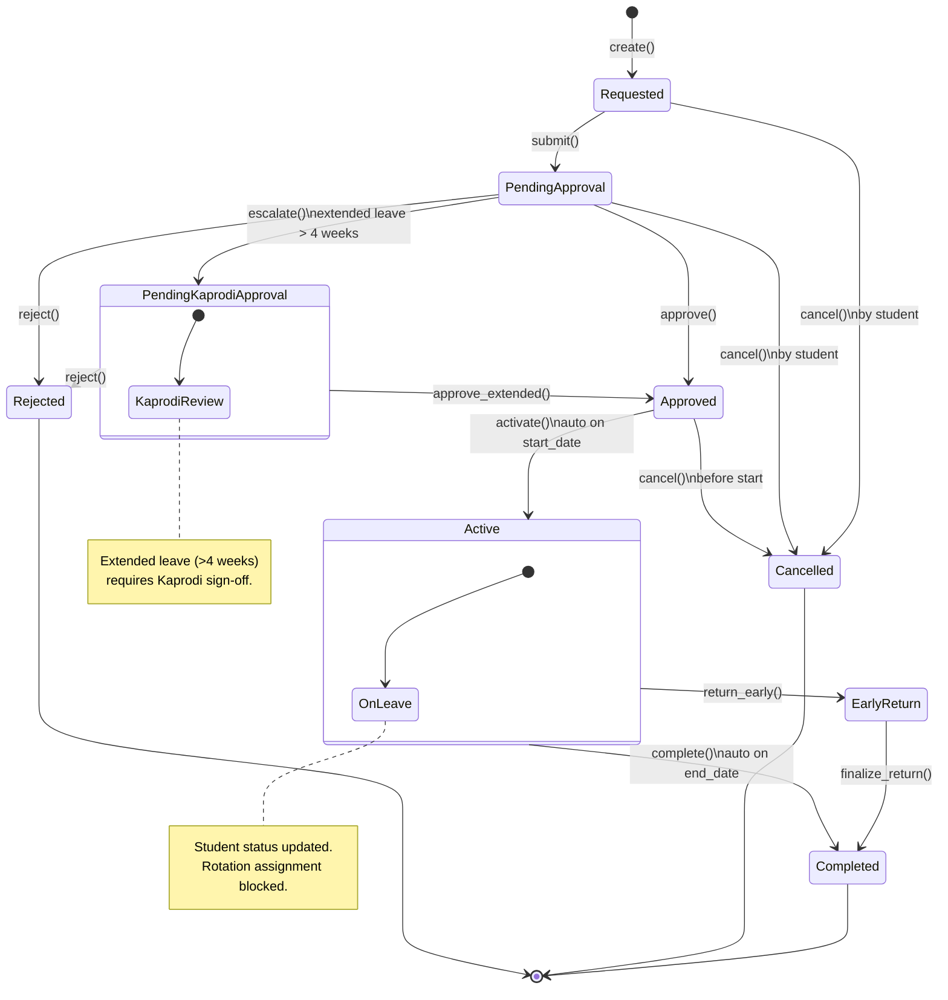
```mermaid
stateDiagram-v2
    [*] --> Requested : create()
    Requested --> PendingApproval : submit()
    Requested --> Cancelled : cancel()\nby student
    PendingApproval --> Approved : approve()
    PendingApproval --> PendingKaprodiApproval : escalate()\nextended leave > 4 weeks
    PendingApproval --> Rejected : reject()
    PendingApproval --> Cancelled : cancel()\nby student
    PendingKaprodiApproval --> Approved : approve_extended()
    PendingKaprodiApproval --> Rejected : reject()
    Approved --> Active : activate()\nauto on start_date
    Active --> Completed : complete()\nauto on end_date
    Approved --> Cancelled : cancel()\nbefore start
    Active --> EarlyReturn : return_early()
    EarlyReturn --> Completed : finalize_return()
    Completed --> [*]
    Cancelled --> [*]
    Rejected --> [*]

    state PendingKaprodiApproval {
        [*] --> KaprodiReview
        note right of KaprodiReview
            Extended leave (>4 weeks)
            requires Kaprodi sign-off.
        end note
    }

    state Active {
        [*] --> OnLeave
        note right of OnLeave
            Student status updated.
            Rotation assignment blocked.
        end note
    }
```

#### States

| State | Value | Description | Assignment Impact |
|-------|-------|-------------|-------------------|
| **Requested** | `requested` | Student has initiated a leave request with dates and reason. Draft state. | None |
| **Pending Approval** | `pending_approval` | Request submitted to Admin Prodi for review. | None |
| **Pending Kaprodi Approval** | `pending_kaprodi_approval` | Extended leave (> 4 weeks) escalated to Kaprodi. | None |
| **Approved** | `approved` | Leave approved. Student will be on leave during the specified dates. | Blocks future assignment for leave period |
| **Active** | `active` | Leave period has started. Student status temporarily set to "On Leave". | All rotation assignments blocked |
| **Early Return** | `early_return` | Student is returning from leave before the end date. | Assignment blocking released early |
| **Completed** | `completed` | Leave period ended. Student status restored to "Active". Terminal positive state. | Assignment blocking lifted |
| **Rejected** | `rejected` | Leave request denied with reason. Terminal negative state. | None |
| **Cancelled** | `cancelled` | Request withdrawn by student. Terminal negative state. | None |

#### Transitions

| # | From | To | Trigger | Guard Conditions | Side Effects |
|---|------|----|---------|------------------|--------------|
| T1 | — | `requested` | `create()` | Student status is `active` or `in_progress`; no overlapping approved leave exists; leave start_date > now + 3 days | Emit `LeaveRequestCreated` |
| T2 | `requested` | `pending_approval` | `submit()` | Leave dates provided; reason provided (min 20 characters); leave type selected (medical, personal, family, academic); supporting documents attached if medical | Emit `LeaveRequestSubmitted`; notify Admin Prodi (AP) |
| T3 | `pending_approval` | `approved` | `approve()` | Leave duration ≤ 4 weeks; no critical rotation overlap (or rotation rescheduled); Admin Prodi confirmation | Emit `LeaveRequestApproved`; notify student (MH); block rotation assignment for leave period |
| T4 | `pending_approval` | `pending_kaprodi_approval` | `escalate()` | Leave duration > 4 weeks | Emit `LeaveRequestEscalated`; notify Kaprodi (KP) |
| T5 | `pending_kaprodi_approval` | `approved` | `approve_extended()` | Kaprodi approves; academic impact assessment completed | Emit `LeaveRequestApproved`; update student status; block assignments; if leave > 1 semester, flag for program extension review |
| T6 | `pending_approval` or `pending_kaprodi_approval` | `rejected` | `reject()` | Rejection reason provided | Emit `LeaveRequestRejected`; notify student (MH) with reason and alternatives |
| T7 | `approved` | `active` | `activate()` | now >= leave start_date | Emit `LeaveActivated`; set student status to `on_leave`; cancel any conflicting pending rotation assignments |
| T8 | `active` | `completed` | `complete()` | now >= leave end_date | Emit `LeaveCompleted`; restore student status to `active`; student becomes eligible for rotation assignment |
| T9 | `active` | `early_return` | `return_early()` | Student requests early return; actual_return_date < end_date | Emit `LeaveEarlyReturnRequested` |
| T10 | `early_return` | `completed` | `finalize_return()` | Admin Prodi confirms return; student status restored | Emit `LeaveEarlyReturnCompleted`; update end_date to actual_return_date; restore student status |
| T11 | `requested` or `pending_approval` or `approved` (before start) | `cancelled` | `cancel()` | Canceller is the student; leave has not yet started (status is not `active`) | Emit `LeaveRequestCancelled`; unblock rotation assignments if previously blocked |

#### Role Permissions

| Transition | SA | AP | KP | MH |
|------------|:---:|:---:|:---:|:---:|
| `create()` | ❌ | ❌ | ❌ | ✅ |
| `submit()` | ❌ | ❌ | ❌ | ✅ |
| `approve()` | ✅ | ✅ | ❌ | ❌ |
| `escalate()` | ❌ | ✅ | ❌ | ❌ |
| `approve_extended()` | ✅ | ❌ | ✅ | ❌ |
| `reject()` | ✅ | ✅ | ✅ | ❌ |
| `activate()` | ❌ | ❌ | ❌ | ❌ (system) |
| `complete()` | ❌ | ❌ | ❌ | ❌ (system) |
| `return_early()` | ❌ | ❌ | ❌ | ✅ |
| `finalize_return()` | ✅ | ✅ | ❌ | ❌ |
| `cancel()` | ✅ | ✅ | ❌ | ✅ |

#### Timeout & Escalation Rules

| Rule ID | Condition | Timeout | Action |
|---------|-----------|---------|--------|
| WF008-T1 | Request in `pending_approval` for > 3 business days | 3 business days | Reminder to Admin Prodi (AP) |
| WF008-T2 | Request in `pending_kaprodi_approval` for > 5 business days | 5 business days | Reminder to Kaprodi (KP) |
| WF008-T3 | Approved leave ending within 7 days | 7 days before end_date | Reminder to student (MH) about return; notify Admin Prodi (AP) to prepare re-assignment |

---

### WF-009: Invoice Lifecycle

**Entity**: `Invoice`  
**Domain**: Finance  
**PRD Reference**: FR-060  
**Owner**: Finance (FN)  
**Database Column**: `invoices.status`

#### State Diagram

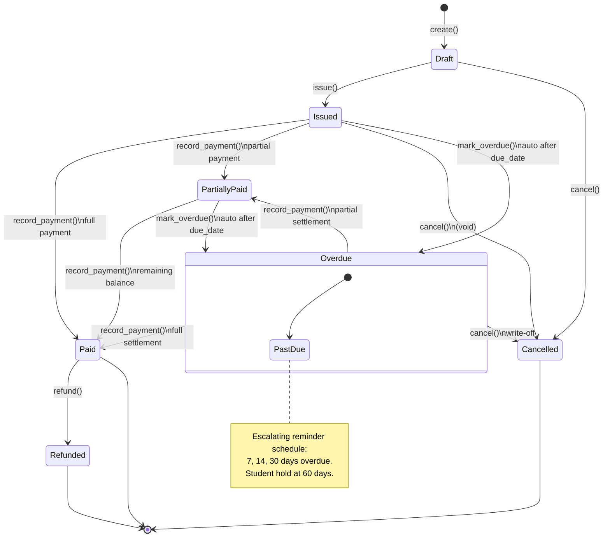
```mermaid
stateDiagram-v2
    [*] --> Draft : create()
    Draft --> Issued : issue()
    Draft --> Cancelled : cancel()
    Issued --> Paid : record_payment()\nfull payment
    Issued --> PartiallyPaid : record_payment()\npartial payment
    Issued --> Overdue : mark_overdue()\nauto after due_date
    Issued --> Cancelled : cancel()\n(void)
    PartiallyPaid --> Paid : record_payment()\nremaining balance
    PartiallyPaid --> Overdue : mark_overdue()\nauto after due_date
    Overdue --> Paid : record_payment()\nfull settlement
    Overdue --> PartiallyPaid : record_payment()\npartial settlement
    Overdue --> Cancelled : cancel()\nwrite-off
    Paid --> Refunded : refund()
    Paid --> [*]
    Cancelled --> [*]
    Refunded --> [*]

    state Overdue {
        [*] --> PastDue
        note right of PastDue
            Escalating reminder schedule:
            7, 14, 30 days overdue.
            Student hold at 60 days.
        end note
    }
```

#### States

| State | Value | Description | Financial Status |
|-------|-------|-------------|-----------------|
| **Draft** | `draft` | Invoice being prepared. Line items and amounts being configured. | No obligation |
| **Issued** | `issued` | Invoice sent to student. Payment is expected by due_date. | Accounts receivable |
| **Partially Paid** | `partially_paid` | Some payment received but balance remains. | Partial receivable |
| **Paid** | `paid` | Full payment received. Terminal positive state (unless refunded). | Settled |
| **Overdue** | `overdue` | Payment not received by due_date. Escalating reminders active. | Delinquent receivable |
| **Cancelled** | `cancelled` | Invoice voided. No payment expected. Terminal negative state. | Written off / void |
| **Refunded** | `refunded` | Payment was received but subsequently refunded. Terminal state. | Refunded |

#### Transitions

| # | From | To | Trigger | Guard Conditions | Side Effects |
|---|------|----|---------|------------------|--------------|
| T1 | — | `draft` | `create()` | Actor has `finance.invoice.create` permission; student exists and is active; billing period defined | Emit `InvoiceCreated` |
| T2 | `draft` | `issued` | `issue()` | At least one line item; total_amount > 0; due_date > now; student email and profile valid; invoice number generated (auto-increment per fiscal year) | Emit `InvoiceIssued`; notify student (MH) via email and in-app with invoice details and payment instructions |
| T3 | `issued` or `partially_paid` or `overdue` | `paid` | `record_payment()` | Payment amount + previously_paid = total_amount (within IDR 100 tolerance); payment method recorded; payment reference number provided; payment date provided | Emit `InvoicePaymentReceived`; emit `InvoicePaidInFull`; clear any student financial holds; generate payment receipt |
| T4 | `issued` or `overdue` | `partially_paid` | `record_payment()` | Payment amount > 0; payment amount + previously_paid < total_amount; payment details recorded | Emit `InvoicePaymentReceived`; update balance_due; generate partial payment receipt |
| T5 | `issued` or `partially_paid` | `overdue` | `mark_overdue()` | now > due_date; balance_due > 0 | Emit `InvoiceOverdue`; start reminder escalation schedule |
| T6 | `paid` | `refunded` | `refund()` | Refund reason provided; refund amount ≤ total_paid; Super Admin approval for refund; refund reference number generated | Emit `InvoiceRefunded`; notify student (MH); create refund accounting entry |
| T7 | `draft` or `issued` or `overdue` | `cancelled` | `cancel()` | Cancellation reason provided; for `issued`/`overdue`: no payments recorded (balance_due = total_amount) OR Super Admin approval for partial cancellation | Emit `InvoiceCancelled`; void accounting entry; notify student (MH) if previously issued |

#### Role Permissions

| Transition | SA | AP | FN | MH |
|------------|:---:|:---:|:---:|:---:|
| `create()` | ✅ | ❌ | ✅ | ❌ |
| `issue()` | ✅ | ❌ | ✅ | ❌ |
| `record_payment()` | ✅ | ❌ | ✅ | ❌ |
| `mark_overdue()` | ❌ | ❌ | ❌ | ❌ (system) |
| `cancel()` | ✅ | ❌ | ✅ (draft only) | ❌ |
| `refund()` | ✅ | ❌ | ✅ (with SA approval) | ❌ |

#### Timeout & Escalation Rules

| Rule ID | Condition | Timeout | Action |
|---------|-----------|---------|--------|
| WF009-T1 | Auto-transition `issued`/`partially_paid` → `overdue` | On due_date + 1 day | Scheduler runs daily at 06:00 WIB |
| WF009-T2 | Invoice overdue by 7 days | 7 days past due | First reminder email to student (MH); in-app notification |
| WF009-T3 | Invoice overdue by 14 days | 14 days past due | Second reminder email; notify Admin Prodi (AP) |
| WF009-T4 | Invoice overdue by 30 days | 30 days past due | Third reminder; escalate to Finance supervisor and Kaprodi (KP) |
| WF009-T5 | Invoice overdue by 60 days | 60 days past due | Apply student financial hold (block grade publication, block rotation assignment); notify student with hold details |
| WF009-T6 | Invoice in `draft` for > 30 days | 30 days | Reminder to Finance (FN); suggest auto-cancellation |

---

### WF-010: OSCE Session

**Entity**: `OsceSession`  
**Domain**: Examination  
**PRD Reference**: FR-050  
**Owner**: Admin Prodi (AP)  
**Database Column**: `osce_sessions.status`

#### State Diagram

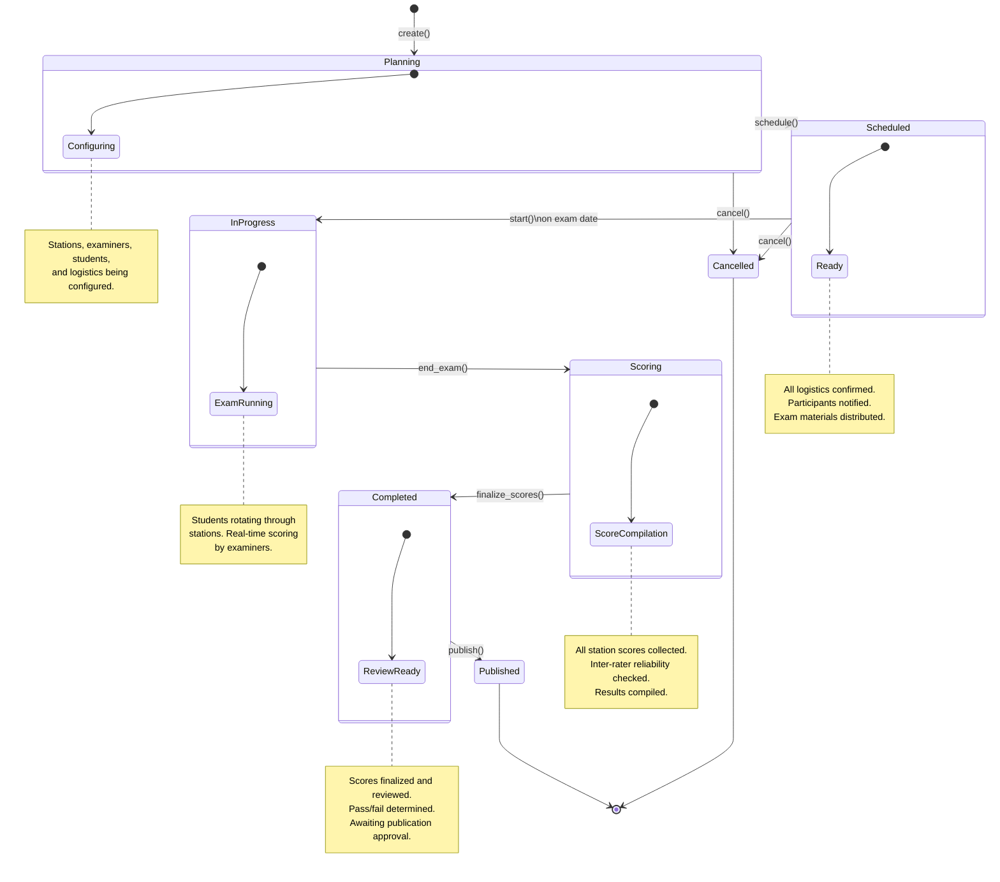
```mermaid
stateDiagram-v2
    [*] --> Planning : create()
    Planning --> Scheduled : schedule()
    Planning --> Cancelled : cancel()
    Scheduled --> InProgress : start()\non exam date
    Scheduled --> Cancelled : cancel()
    InProgress --> Scoring : end_exam()
    Scoring --> Completed : finalize_scores()
    Completed --> Published : publish()
    Published --> [*]
    Cancelled --> [*]

    state Planning {
        [*] --> Configuring
        note right of Configuring
            Stations, examiners, students,
            and logistics being configured.
        end note
    }

    state Scheduled {
        [*] --> Ready
        note right of Ready
            All logistics confirmed.
            Participants notified.
            Exam materials distributed.
        end note
    }

    state InProgress {
        [*] --> ExamRunning
        note right of ExamRunning
            Students rotating through
            stations. Real-time scoring
            by examiners.
        end note
    }

    state Scoring {
        [*] --> ScoreCompilation
        note right of ScoreCompilation
            All station scores collected.
            Inter-rater reliability checked.
            Results compiled.
        end note
    }

    state Completed {
        [*] --> ReviewReady
        note right of ReviewReady
            Scores finalized and reviewed.
            Pass/fail determined.
            Awaiting publication approval.
        end note
    }
```

#### States

| State | Value | Description | Score Availability |
|-------|-------|-------------|-------------------|
| **Planning** | `planning` | Session being designed: stations, examiners, student list, logistics. | N/A |
| **Scheduled** | `scheduled` | Session fully configured and confirmed. All participants notified. | N/A |
| **In Progress** | `in_progress` | Exam is actively running. Examiners entering scores in real-time. | Examiners entering scores |
| **Scoring** | `scoring` | Exam ended. Score compilation and quality assurance in progress. | Admin + examiners |
| **Completed** | `completed` | All scores finalized. Pass/fail determined. Ready for publication approval. | Admin + KP |
| **Published** | `published` | Results published to students. Terminal positive state. | All authorized parties |
| **Cancelled** | `cancelled` | Session cancelled (weather, emergency, logistics failure). Terminal negative state. | N/A |

#### Transitions

| # | From | To | Trigger | Guard Conditions | Side Effects |
|---|------|----|---------|------------------|--------------|
| T1 | — | `planning` | `create()` | Actor has `examination.osce.create` permission; exam date is at least 14 days in the future | Emit `OsceSessionCreated` |
| T2 | `planning` | `scheduled` | `schedule()` | Minimum 10 stations defined; each station has: scenario, checklist, passing criteria; at least 1 examiner assigned per station; all examiners confirmed availability; student list finalized (min 1 student); venue confirmed; exam date and time per station set; time_per_station configured (default: 8 minutes + 2 minutes transition) | Emit `OsceSessionScheduled`; notify all examiners (DO, DK) with station assignments; notify all students (MH) with exam date, time, location, and instructions; notify Admin RS (AR) if hospital venue |
| T3 | `scheduled` | `in_progress` | `start()` | now ≥ exam_date and exam_start_time; at least 80% of assigned examiners checked in; at least 80% of students checked in | Emit `OsceSessionStarted`; enable real-time score entry interface for examiners; start station rotation timer |
| T4 | `in_progress` | `scoring` | `end_exam()` | All students have completed all stations OR exam time limit reached; exam end time recorded | Emit `OsceSessionEnded`; disable real-time score entry; lock submitted scores; flag any missing scores for follow-up |
| T5 | `scoring` | `completed` | `finalize_scores()` | All station scores for all students submitted (no gaps); inter-rater reliability check completed (if multiple examiners per station); pass/fail calculated per student per station and overall; score anomalies reviewed and resolved | Emit `OsceSessionScoresFinalized`; compute per-student results: station scores, total score, pass/fail status; notify Kaprodi (KP) for publication approval |
| T6 | `completed` | `published` | `publish()` | Kaprodi has approved publication; all student results validated | Emit `OsceSessionPublished`; notify each student (MH) with individual results; results contribute to stase grade (WF-006) if configured; generate aggregate session report |
| T7 | `planning` or `scheduled` | `cancelled` | `cancel()` | Cancellation reason provided; if `scheduled`, notify all participants | Emit `OsceSessionCancelled`; if scheduled, notify all examiners and students; release venue booking |

#### Role Permissions

| Transition | SA | AP | KP | DO | DK | MH |
|------------|:---:|:---:|:---:|:---:|:---:|:---:|
| `create()` | ✅ | ✅ | ❌ | ❌ | ❌ | ❌ |
| `schedule()` | ✅ | ✅ | ❌ | ❌ | ❌ | ❌ |
| `start()` | ✅ | ✅ | ❌ | ❌ | ❌ | ❌ |
| `end_exam()` | ✅ | ✅ | ❌ | ❌ | ❌ | ❌ |
| `finalize_scores()` | ✅ | ✅ | ❌ | ❌ | ❌ | ❌ |
| `publish()` | ✅ | ❌ | ✅ | ❌ | ❌ | ❌ |
| `cancel()` | ✅ | ✅ | ✅ | ❌ | ❌ | ❌ |
| Score entry (during exam) | ❌ | ❌ | ❌ | ✅ | ✅ | ❌ |

#### Timeout & Escalation Rules

| Rule ID | Condition | Timeout | Action |
|---------|-----------|---------|--------|
| WF010-T1 | Session in `planning` for > 30 days | 30 days | Reminder to Admin Prodi (AP) |
| WF010-T2 | Session `scheduled` but exam date is tomorrow and < 100% examiner confirmation | 1 day before exam | Urgent alert to Admin Prodi (AP); suggest backup examiners |
| WF010-T3 | Session in `scoring` for > 3 days | 3 days | Reminder to Admin Prodi (AP) to finalize missing scores |
| WF010-T4 | Session `completed` but not published within 7 days | 7 days | Reminder to Kaprodi (KP) for publication approval |

---

## 3. Cross-Workflow Dependencies

### 3.1 Dependency Graph

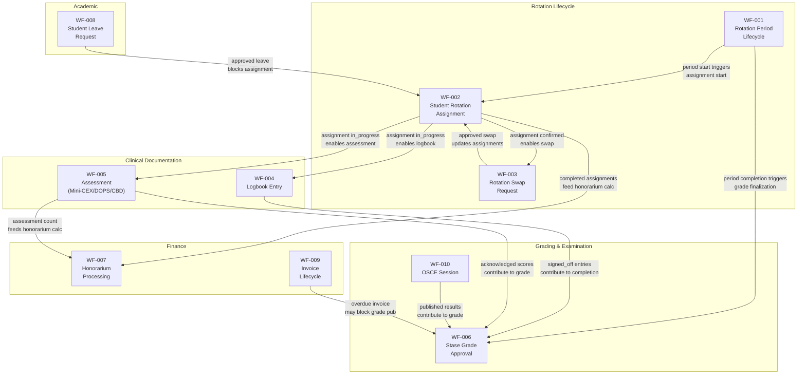
```mermaid
flowchart TB
    subgraph "Rotation Lifecycle"
        WF001["WF-001\nRotation Period\nLifecycle"]
        WF002["WF-002\nStudent Rotation\nAssignment"]
        WF003["WF-003\nRotation Swap\nRequest"]
    end

    subgraph "Clinical Documentation"
        WF004["WF-004\nLogbook Entry"]
        WF005["WF-005\nAssessment\n(Mini-CEX/DOPS/CBD)"]
    end

    subgraph "Grading & Examination"
        WF006["WF-006\nStase Grade\nApproval"]
        WF010["WF-010\nOSCE Session"]
    end

    subgraph "Finance"
        WF007["WF-007\nHonorarium\nProcessing"]
        WF009["WF-009\nInvoice\nLifecycle"]
    end

    subgraph "Academic"
        WF008["WF-008\nStudent Leave\nRequest"]
    end

    WF001 -->|"period start triggers\nassignment start"| WF002
    WF001 -->|"period completion triggers\ngrade finalization"| WF006
    WF002 -->|"assignment in_progress\nenables logbook"| WF004
    WF002 -->|"assignment in_progress\nenables assessment"| WF005
    WF002 -->|"assignment confirmed\nenables swap"| WF003
    WF003 -->|"approved swap\nupdates assignments"| WF002
    WF004 -->|"signed_off entries\ncontribute to completion"| WF006
    WF005 -->|"acknowledged scores\ncontribute to grade"| WF006
    WF010 -->|"published results\ncontribute to grade"| WF006
    WF002 -->|"completed assignments\nfeed honorarium calc"| WF007
    WF005 -->|"assessment count\nfeeds honorarium calc"| WF007
    WF008 -->|"approved leave\nblocks assignment"| WF002
    WF009 -->|"overdue invoice\nmay block grade pub"| WF006
```

### 3.2 Dependency Matrix

This matrix documents which workflow state transitions depend on the state of entities in other workflows.

| Dependent Transition | Depends On | Dependency Type | Enforcement |
|---------------------|-----------|-----------------|-------------|
| WF-002 `start()` | WF-001 period → `in_progress` | **Hard** | Cascading transition: period start triggers all assignment starts |
| WF-002 `complete()` | WF-001 period → `completed` | **Hard** | Cascading transition: period completion triggers all assignment completions |
| WF-002 `assign()` | WF-008 no overlapping approved leave | **Hard** | Guard condition on assignment creation |
| WF-003 `create()` | WF-002 both assignments in `confirmed` | **Hard** | Guard: both students must have confirmed assignments |
| WF-003 `approve()` | WF-002 constraint re-validation | **Hard** | Re-validates all rotation constraints post-swap |
| WF-004 `create()` | WF-002 assignment is `in_progress` | **Hard** | Guard: student must have active rotation |
| WF-004 `sign_off()` | WF-004 all required fields valid | **Hard** | Guard: entry completeness |
| WF-005 `schedule()` | WF-002 assignment is `in_progress` | **Hard** | Guard: student must have active rotation |
| WF-006 `calculate()` | WF-005 all required assessments `acknowledged` | **Hard** | Guard: minimum assessment count met |
| WF-006 `calculate()` | WF-004 logbook completion ≥ threshold | **Soft** | Guard: logbook percentage above minimum (flagged if not met but can override) |
| WF-006 `calculate()` | WF-010 OSCE results `published` (if applicable) | **Soft** | Guard: OSCE score included if session exists for this stase |
| WF-006 `publish()` | WF-009 no financial hold on student | **Soft** | Configurable: financial hold can block grade publication |
| WF-007 `create()` | WF-001 period → `completed` or `archived` | **Hard** | Guard: honorarium only for completed periods |
| WF-007 `calculate()` | WF-002 all assignments `completed` | **Hard** | Guard: all supervision data must be finalized |
| WF-007 `calculate()` | WF-005 assessment data finalized | **Soft** | Assessment count contributes to honorarium formula |
| WF-008 `activate()` | WF-002 cancel conflicting pending assignments | **Side Effect** | Active leave cancels overlapping pending assignments |

### 3.3 Cascading Transitions

Some transitions in one workflow automatically trigger transitions in dependent workflows:

| Source Workflow | Source Transition | Target Workflow | Target Transition | Mechanism |
|----------------|------------------|-----------------|-------------------|-----------|
| WF-001 | `start()` (→ `in_progress`) | WF-002 | `start()` (all confirmed assignments) | Event listener: `RotationPeriodStarted` |
| WF-001 | `complete()` (→ `completed`) | WF-002 | `complete()` (all in-progress assignments) | Event listener: `RotationPeriodCompleted` |
| WF-001 | `cancel()` (→ `cancelled`) | WF-002 | `cancel()` (all pending/confirmed assignments) | Event listener: `RotationPeriodCancelled` |
| WF-002 | `complete()` (→ `completed`) | WF-006 | `init()` (create pending grade) | Event listener: `RotationAssignmentCompleted` |
| WF-003 | `approve()` (→ `approved`) | WF-002 | Swap both assignments atomically | Event listener: `SwapRequestApproved` |
| WF-008 | `activate()` (→ `active`) | WF-002 | `cancel()` conflicting pending assignments | Event listener: `LeaveActivated` |

### 3.4 Stase Completion Checklist

A stase is considered complete when ALL of the following are satisfied:

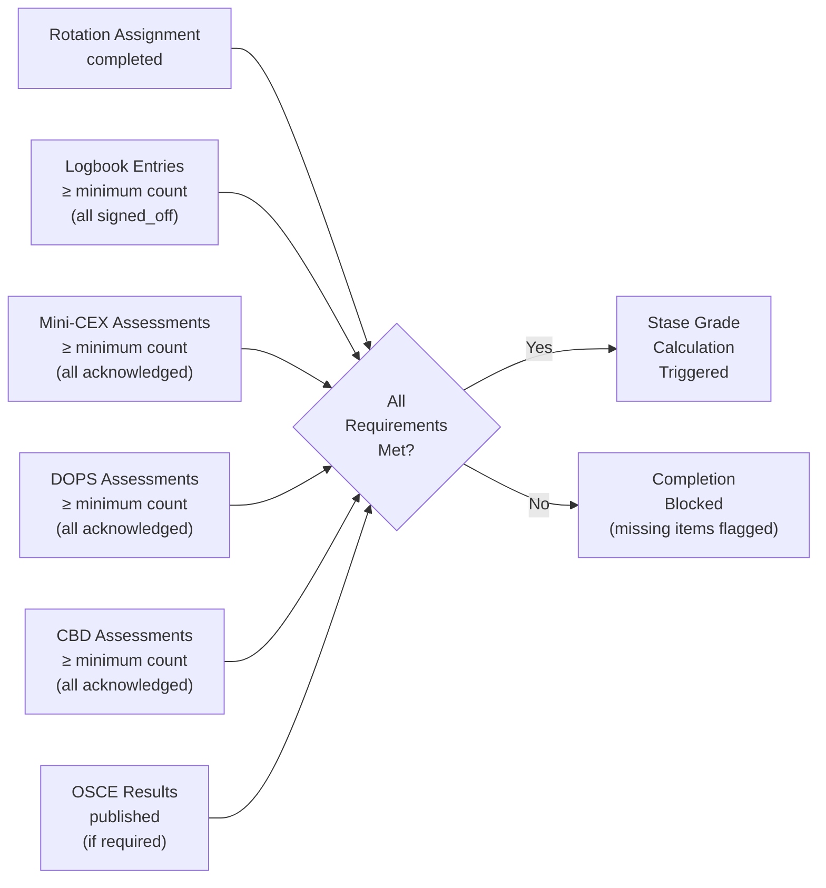
```mermaid
flowchart LR
    A["Rotation Assignment\ncompleted"] --> CHECK{"All\nRequirements\nMet?"}
    B["Logbook Entries\n≥ minimum count\n(all signed_off)"] --> CHECK
    C["Mini-CEX Assessments\n≥ minimum count\n(all acknowledged)"] --> CHECK
    D["DOPS Assessments\n≥ minimum count\n(all acknowledged)"] --> CHECK
    E["CBD Assessments\n≥ minimum count\n(all acknowledged)"] --> CHECK
    F["OSCE Results\npublished\n(if required)"] --> CHECK
    CHECK -->|Yes| G["Stase Grade\nCalculation\nTriggered"]
    CHECK -->|No| H["Completion\nBlocked\n(missing items flagged)"]
```

| Requirement | Source Workflow | Minimum Count | Configurable |
|-------------|---------------|---------------|:---:|
| Rotation Assignment Completed | WF-002 | 1 | ❌ |
| Logbook Entries Signed Off | WF-004 | Per stase config (default: 10) | ✅ |
| Mini-CEX Acknowledged | WF-005 | Per stase config (default: 2) | ✅ |
| DOPS Acknowledged | WF-005 | Per stase config (default: 2) | ✅ |
| CBD Acknowledged | WF-005 | Per stase config (default: 1) | ✅ |
| OSCE Results Published | WF-010 | 0 or 1 (stase-dependent) | ✅ |

---

## 4. Error Handling

### 4.1 Invalid Transition Handling

When a transition is attempted that violates the state machine definition:

| Error Type | HTTP Status | Error Code | Description | Example |
|-----------|:---:|-----------|-------------|---------|
| **Invalid Transition** | 422 | `WORKFLOW_INVALID_TRANSITION` | The requested transition is not defined from the current state | Attempting `publish()` on a `completed` rotation period |
| **Guard Failure** | 422 | `WORKFLOW_GUARD_FAILED` | The transition exists but guard conditions are not met | Publishing a period with 0 stase assigned |
| **Permission Denied** | 403 | `WORKFLOW_PERMISSION_DENIED` | The actor does not have the role/permission for this transition | Student attempting to approve their own grade |
| **Concurrency Conflict** | 409 | `WORKFLOW_CONCURRENCY_CONFLICT` | Another user/process has already transitioned the entity | Two admins approving the same swap request simultaneously |
| **Dependency Not Met** | 422 | `WORKFLOW_DEPENDENCY_UNMET` | A cross-workflow dependency is not satisfied | Calculating grade when assessments are not acknowledged |

#### Error Response Format

All workflow errors follow RFC 7807 Problem Details format:

```json
{
  "type": "https://acms.ums.ac.id/errors/workflow/guard-failed",
  "title": "Workflow Guard Failed",
  "status": 422,
  "detail": "Cannot publish rotation period: no stase have been assigned to this period.",
  "instance": "/api/v1/rotation-periods/rp-2026-001/transitions/publish",
  "workflow": "WF-001",
  "entity_id": "rp-2026-001",
  "current_state": "draft",
  "attempted_transition": "publish",
  "failed_guards": [
    {
      "guard": "HasAssignedStase",
      "message": "At least one stase must be assigned before publishing.",
      "current_value": 0,
      "required_value": "≥ 1"
    }
  ],
  "timestamp": "2026-06-08T14:30:00+07:00",
  "trace_id": "acms-trace-abc123"
}
```

### 4.2 Timeout Handling

All timeout rules defined in each workflow are enforced by the Laravel Task Scheduler. The timeout engine operates as follows:

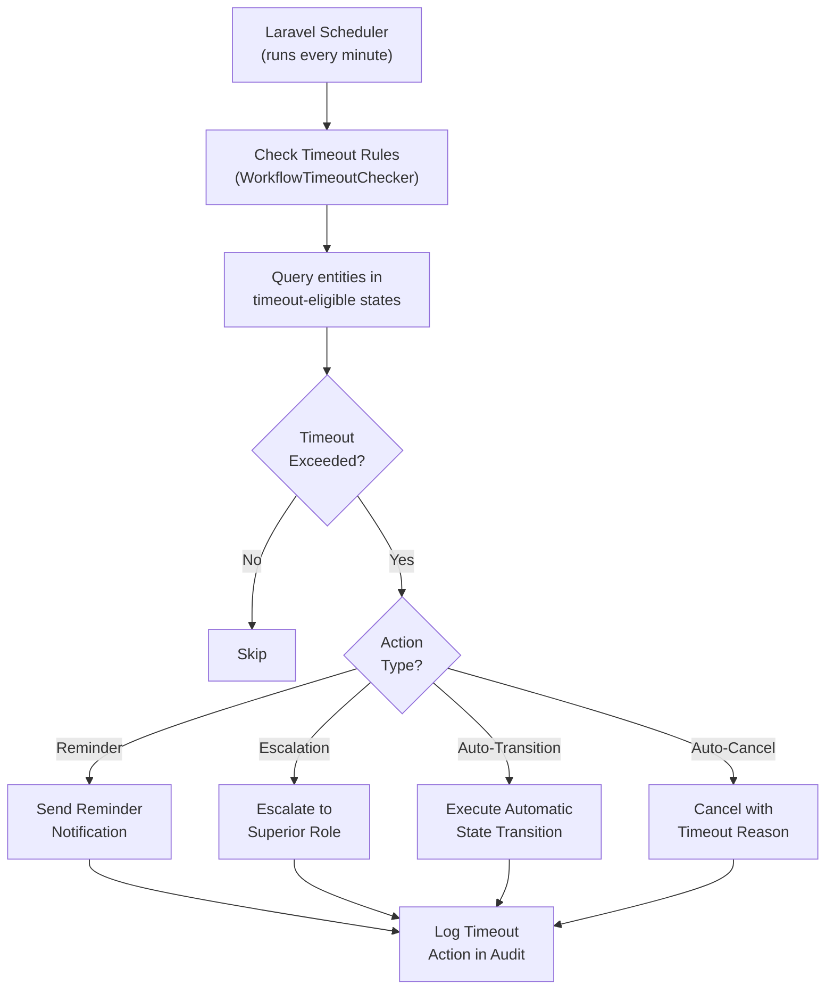
```mermaid
flowchart TB
    SCHED["Laravel Scheduler\n(runs every minute)"] --> CHECK["Check Timeout Rules\n(WorkflowTimeoutChecker)"]
    CHECK --> QUERY["Query entities in\ntimeout-eligible states"]
    QUERY --> EVAL{"Timeout\nExceeded?"}
    EVAL -->|No| SKIP["Skip"]
    EVAL -->|Yes| ACTION{"Action\nType?"}
    ACTION -->|Reminder| NOTIFY["Send Reminder\nNotification"]
    ACTION -->|Escalation| ESCALATE["Escalate to\nSuperior Role"]
    ACTION -->|Auto-Transition| TRANSITION["Execute Automatic\nState Transition"]
    ACTION -->|Auto-Cancel| CANCEL["Cancel with\nTimeout Reason"]
    NOTIFY --> LOG["Log Timeout\nAction in Audit"]
    ESCALATE --> LOG
    TRANSITION --> LOG
    CANCEL --> LOG
```

#### Timeout Configuration

Timeouts are stored in a configuration table, not hardcoded:

| Config Key | Workflow | Default Value | Unit | Configurable By |
|-----------|----------|:---:|------|-----------------|
| `wf001.draft.stale_timeout` | WF-001 | 30 | days | Super Admin |
| `wf001.completed.grade_finalization` | WF-001 | 14 | days | Admin Prodi |
| `wf002.pending.auto_confirm` | WF-002 | 3 | days before start | Admin Prodi |
| `wf003.target_acceptance` | WF-003 | 3 | days | Super Admin |
| `wf003.pending_approval.max_wait` | WF-003 | 5 | business days | Super Admin |
| `wf004.submitted.review_deadline` | WF-004 | 7 | days | Admin Prodi |
| `wf004.submitted.escalation_1` | WF-004 | 14 | days | Admin Prodi |
| `wf004.submitted.escalation_2` | WF-004 | 21 | days | Super Admin |
| `wf005.submitted.auto_acknowledge` | WF-005 | 7 | days | Super Admin |
| `wf006.appeal_window` | WF-006 | 14 | days | Kaprodi |
| `wf007.max_processing_time` | WF-007 | 30 | days | Finance |
| `wf009.overdue.reminder_1` | WF-009 | 7 | days | Finance |
| `wf009.overdue.reminder_2` | WF-009 | 14 | days | Finance |
| `wf009.overdue.reminder_3` | WF-009 | 30 | days | Finance |
| `wf009.overdue.financial_hold` | WF-009 | 60 | days | Super Admin |

### 4.3 Deadlock Prevention

Deadlocks can occur when workflows have circular dependencies. The ACMS workflow engine prevents deadlocks through these mechanisms:

| Mechanism | Description | Implementation |
|-----------|-------------|----------------|
| **Unidirectional Cascades** | Cascading transitions flow in one direction only (period → assignment → grade). No reverse cascades. | Event listener ordering in `EventServiceProvider` |
| **Optimistic Locking** | Each workflow entity has a `version` column. Transitions check `WHERE version = ?` and increment on success. Concurrent modifications fail with `WORKFLOW_CONCURRENCY_CONFLICT`. | Eloquent scope with `lockForUpdate()` in transition executor |
| **Transaction Isolation** | All transitions execute within a `SERIALIZABLE` or `REPEATABLE READ` transaction. Cross-workflow cascades execute in the same transaction when synchronous, or in separate transactions when asynchronous (via queued events). | `DB::transaction()` wrapper in `TransitionExecutor` |
| **Timeout Breakers** | If a workflow entity is stuck in a non-terminal state beyond maximum timeout, it can be force-transitioned by Super Admin with an override flag. | `ForceTransition` middleware with audit logging |
| **Saga Pattern for Multi-Entity Transitions** | Complex transitions spanning multiple entities (e.g., swap approval updating two assignments) use the Saga pattern with compensating transactions on failure. | `SagaOrchestrator` service class |

#### Force Override Protocol

Super Admin can force-transition an entity stuck in any state. This is a break-glass procedure:

1. Super Admin must provide a written justification (min 50 characters)
2. Force transition bypasses all guard conditions
3. Force transition is logged as `force_override` in audit trail with maximum severity
4. Email notification sent to Kaprodi and relevant Admin Prodi
5. Force overrides are reported in the monthly compliance audit report

---

## 5. Event Bus Integration

### 5.1 Event Naming Convention

All domain events follow this naming pattern:

```
{Domain}{Entity}{Action}
```

| Component | Convention | Examples |
|-----------|-----------|----------|
| **Domain** | PascalCase domain name | `Rotation`, `Clinical`, `Assessment`, `Finance`, `Academic`, `Examination` |
| **Entity** | PascalCase entity name | `Period`, `Assignment`, `SwapRequest`, `LogbookEntry`, `Grade`, `Invoice` |
| **Action** | Past tense PascalCase verb | `Created`, `Published`, `Started`, `Completed`, `Approved`, `Rejected` |

### 5.2 Complete Event Catalog

#### WF-001: Rotation Period Lifecycle Events

| Event Name | Emitted On Transition | Dispatch Mode | Payload Keys |
|-----------|----------------------|:---:|-------------|
| `RotationPeriodCreated` | → `draft` | Sync | `period_id`, `program_id`, `start_date`, `end_date`, `created_by` |
| `RotationPeriodPublished` | `draft` → `published` | Async | `period_id`, `program_id`, `stase_ids[]`, `hospital_ids[]`, `student_count`, `published_by` |
| `RotationPeriodUnpublished` | `published` → `draft` | Async | `period_id`, `unpublished_by`, `reason` |
| `RotationPeriodStarted` | `published` → `in_progress` | Sync | `period_id`, `assignment_count`, `triggered_by` (system/manual) |
| `RotationPeriodCompleted` | `in_progress` → `completed` | Sync | `period_id`, `assignment_count`, `completion_date` |
| `RotationPeriodArchived` | `completed` → `archived` | Async | `period_id`, `archived_by` |
| `RotationPeriodCancelled` | → `cancelled` | Sync | `period_id`, `cancelled_by`, `cancellation_reason`, `affected_assignment_count` |

#### WF-002: Student Rotation Assignment Events

| Event Name | Emitted On Transition | Dispatch Mode | Payload Keys |
|-----------|----------------------|:---:|-------------|
| `RotationAssignmentCreated` | → `pending` | Async | `assignment_id`, `student_id`, `stase_id`, `hospital_id`, `period_id`, `assigned_by` |
| `RotationAssignmentConfirmed` | `pending` → `confirmed` | Async | `assignment_id`, `student_id`, `stase_id`, `hospital_id`, `preceptor_id`, `confirmed_by` |
| `RotationAssignmentStarted` | `confirmed` → `in_progress` | Sync | `assignment_id`, `student_id`, `start_date` |
| `RotationAssignmentCompleted` | `in_progress` → `completed` | Sync | `assignment_id`, `student_id`, `stase_id`, `completion_date`, `logbook_count`, `assessment_count` |
| `RotationAssignmentCancelled` | → `cancelled` | Async | `assignment_id`, `student_id`, `cancelled_by`, `cancellation_reason`, `cancellation_type` |

#### WF-003: Rotation Swap Request Events

| Event Name | Emitted On Transition | Dispatch Mode | Payload Keys |
|-----------|----------------------|:---:|-------------|
| `SwapRequestCreated` | → `requested` | Async | `request_id`, `requester_id`, `target_student_id`, `requester_assignment_id`, `target_assignment_id`, `reason` |
| `SwapRequestSubmitted` | `requested` → `pending_approval` | Async | `request_id`, `target_accepted_at` |
| `SwapRequestApproved` | `pending_approval` → `approved` | Sync | `request_id`, `approved_by`, `requester_new_assignment_id`, `target_new_assignment_id` |
| `SwapRequestRejected` | `pending_approval` → `rejected` | Async | `request_id`, `rejected_by`, `rejection_reason` |
| `SwapRequestCancelled` | → `cancelled` | Async | `request_id`, `cancelled_by` |

#### WF-004: Logbook Entry Events

| Event Name | Emitted On Transition | Dispatch Mode | Payload Keys |
|-----------|----------------------|:---:|-------------|
| `LogbookEntryCreated` | → `draft` | Sync | `entry_id`, `student_id`, `stase_id`, `activity_date`, `activity_type` |
| `LogbookEntrySubmitted` | `draft` → `submitted` | Async | `entry_id`, `student_id`, `preceptor_id`, `submitted_at`, `is_late_submission` |
| `LogbookEntryReviewStarted` | `submitted` → `under_review` | Sync | `entry_id`, `reviewer_id`, `review_started_at` |
| `LogbookEntrySigned` | → `signed_off` | Async | `entry_id`, `student_id`, `stase_id`, `signed_by`, `signed_at`, `new_completion_count`, `total_required` |
| `LogbookEntryRejected` | → `rejected` | Async | `entry_id`, `student_id`, `rejected_by`, `rejection_feedback`, `revision_count` |
| `LogbookEntryRevised` | `rejected` → `draft` | Sync | `entry_id`, `student_id`, `revision_count` |

#### WF-005: Assessment Events

| Event Name | Emitted On Transition | Dispatch Mode | Payload Keys |
|-----------|----------------------|:---:|-------------|
| `AssessmentScheduled` | → `scheduled` | Async | `assessment_id`, `assessment_type`, `student_id`, `assessor_id`, `stase_id`, `scheduled_date`, `location` |
| `AssessmentStarted` | `scheduled` → `in_progress` | Sync | `assessment_id`, `started_at` |
| `AssessmentSubmitted` | `in_progress` → `submitted` | Async | `assessment_id`, `assessment_type`, `student_id`, `assessor_id`, `overall_score`, `rubric_scores`, `feedback_text` |
| `AssessmentAcknowledged` | `submitted` → `acknowledged` | Async | `assessment_id`, `student_id`, `acknowledged_at`, `auto_acknowledged` |
| `AssessmentAutoAcknowledged` | `submitted` → `acknowledged` (auto) | Async | `assessment_id`, `student_id`, `days_since_submission` |
| `AssessmentCancelled` | → `cancelled` | Async | `assessment_id`, `cancelled_by`, `cancellation_reason` |

#### WF-006: Stase Grade Events

| Event Name | Emitted On Transition | Dispatch Mode | Payload Keys |
|-----------|----------------------|:---:|-------------|
| `StaseGradeInitialized` | → `pending` | Sync | `grade_id`, `student_id`, `stase_id`, `period_id` |
| `StaseGradeCalculated` | `pending` → `calculated` | Sync | `grade_id`, `numeric_score`, `letter_grade`, `component_scores`, `calculation_formula` |
| `StaseGradeSubmitted` | `calculated` → `submitted` | Async | `grade_id`, `submitted_by`, `numeric_score`, `letter_grade` |
| `StaseGradeReviewStarted` | `submitted` → `under_review` | Sync | `grade_id`, `reviewer_id` |
| `StaseGradeApproved` | `under_review` → `approved` | Async | `grade_id`, `approved_by` |
| `StaseGradeReturnedForRevision` | `under_review` → `submitted` | Async | `grade_id`, `returned_by`, `revision_notes` |
| `StaseGradePublished` | `approved` → `published` | Async | `grade_id`, `student_id`, `stase_id`, `letter_grade`, `numeric_score`, `is_passing` |
| `StaseGradeFailed` | (sub-event of Published) | Async | `grade_id`, `student_id`, `stase_id`, `numeric_score`, `remedial_required` |
| `StaseGradeAppealed` | `published` → `appealed` | Async | `grade_id`, `student_id`, `appeal_reason`, `evidence_files` |
| `StaseGradeAppealReviewStarted` | `appealed` → `under_appeal_review` | Sync | `grade_id`, `reviewer_id`, `panel_members` |
| `StaseGradeAppealMaintained` | `under_appeal_review` → `grade_maintained` | Async | `grade_id`, `justification` |
| `StaseGradeAppealAdjusted` | `under_appeal_review` → `grade_adjusted` | Async | `grade_id`, `old_grade`, `new_grade`, `adjustment_justification` |
| `StaseGradeAppealFinalized` | → `published` (final) | Async | `grade_id`, `outcome` (`maintained` / `adjusted`) |

#### WF-007: Honorarium Events

| Event Name | Emitted On Transition | Dispatch Mode | Payload Keys |
|-----------|----------------------|:---:|-------------|
| `HonorariumBatchCreated` | → `draft` | Sync | `batch_id`, `period_id`, `created_by` |
| `HonorariumBatchCalculated` | `draft` → `calculated` | Async | `batch_id`, `total_amount`, `item_count`, `tax_total`, `net_total` |
| `HonorariumBatchVerified` | `calculated` → `verified` | Async | `batch_id`, `verified_by` |
| `HonorariumBatchApproved` | `verified` → `approved` | Async | `batch_id`, `approved_by`, `total_amount` |
| `HonorariumBatchDisbursed` | `approved` → `disbursed` | Async | `batch_id`, `disbursed_by`, `disbursement_date`, `total_disbursed`, `item_count` |
| `HonorariumBatchCancelled` | → `cancelled` | Async | `batch_id`, `cancelled_by`, `cancellation_reason` |
| `HonorariumBatchRecalculationRequested` | `calculated` → `draft` | Async | `batch_id`, `requested_by`, `reason` |
| `HonorariumBatchReturnedForRecalculation` | `verified` → `calculated` | Async | `batch_id`, `returned_by`, `reason` |
| `HonorariumBatchReturnedForReverification` | `approved` → `verified` | Async | `batch_id`, `returned_by`, `reason` |

#### WF-008: Student Leave Events

| Event Name | Emitted On Transition | Dispatch Mode | Payload Keys |
|-----------|----------------------|:---:|-------------|
| `LeaveRequestCreated` | → `requested` | Sync | `request_id`, `student_id`, `start_date`, `end_date`, `leave_type`, `reason` |
| `LeaveRequestSubmitted` | `requested` → `pending_approval` | Async | `request_id`, `student_id`, `documents_attached` |
| `LeaveRequestEscalated` | `pending_approval` → `pending_kaprodi_approval` | Async | `request_id`, `leave_duration_weeks`, `escalated_by` |
| `LeaveRequestApproved` | → `approved` | Async | `request_id`, `student_id`, `approved_by`, `start_date`, `end_date` |
| `LeaveRequestRejected` | → `rejected` | Async | `request_id`, `student_id`, `rejected_by`, `rejection_reason` |
| `LeaveActivated` | `approved` → `active` | Sync | `request_id`, `student_id`, `affected_assignments[]` |
| `LeaveCompleted` | `active` → `completed` | Sync | `request_id`, `student_id`, `actual_end_date` |
| `LeaveEarlyReturnRequested` | `active` → `early_return` | Async | `request_id`, `student_id`, `actual_return_date` |
| `LeaveEarlyReturnCompleted` | `early_return` → `completed` | Sync | `request_id`, `student_id`, `original_end_date`, `actual_end_date` |
| `LeaveRequestCancelled` | → `cancelled` | Async | `request_id`, `student_id`, `cancelled_by` |

#### WF-009: Invoice Events

| Event Name | Emitted On Transition | Dispatch Mode | Payload Keys |
|-----------|----------------------|:---:|-------------|
| `InvoiceCreated` | → `draft` | Sync | `invoice_id`, `student_id`, `total_amount`, `line_items[]`, `created_by` |
| `InvoiceIssued` | `draft` → `issued` | Async | `invoice_id`, `student_id`, `invoice_number`, `total_amount`, `due_date` |
| `InvoicePaymentReceived` | (any) → `paid`/`partially_paid` | Async | `invoice_id`, `payment_id`, `amount_paid`, `payment_method`, `payment_reference`, `balance_due` |
| `InvoicePaidInFull` | → `paid` | Async | `invoice_id`, `student_id`, `total_paid`, `payment_date` |
| `InvoiceOverdue` | → `overdue` | Async | `invoice_id`, `student_id`, `amount_due`, `days_overdue` |
| `InvoiceRefunded` | `paid` → `refunded` | Async | `invoice_id`, `student_id`, `refund_amount`, `refund_reason`, `refund_reference` |
| `InvoiceCancelled` | → `cancelled` | Async | `invoice_id`, `cancelled_by`, `cancellation_reason` |

#### WF-010: OSCE Session Events

| Event Name | Emitted On Transition | Dispatch Mode | Payload Keys |
|-----------|----------------------|:---:|-------------|
| `OsceSessionCreated` | → `planning` | Sync | `session_id`, `exam_date`, `created_by` |
| `OsceSessionScheduled` | `planning` → `scheduled` | Async | `session_id`, `station_count`, `examiner_count`, `student_count`, `venue` |
| `OsceSessionStarted` | `scheduled` → `in_progress` | Sync | `session_id`, `actual_start_time`, `students_checked_in`, `examiners_checked_in` |
| `OsceSessionEnded` | `in_progress` → `scoring` | Sync | `session_id`, `actual_end_time`, `missing_scores_count` |
| `OsceSessionScoresFinalized` | `scoring` → `completed` | Async | `session_id`, `student_results_count`, `pass_count`, `fail_count`, `average_score` |
| `OsceSessionPublished` | `completed` → `published` | Async | `session_id`, `published_by`, `student_count` |
| `OsceSessionCancelled` | → `cancelled` | Async | `session_id`, `cancelled_by`, `cancellation_reason`, `affected_student_count` |

### 5.3 Event Payload Schema

All domain events implement a common base schema:

```json
{
  "$schema": "https://acms.ums.ac.id/schemas/domain-event/v1",
  "event_id": "uuid-v7",
  "event_type": "RotationPeriodPublished",
  "event_version": "1.0",
  "occurred_at": "2026-06-08T14:30:00.000+07:00",
  "actor": {
    "user_id": "uuid",
    "role": "admin_prodi",
    "ip_address": "192.168.1.100",
    "user_agent": "Mozilla/5.0..."
  },
  "entity": {
    "type": "RotationPeriod",
    "id": "uuid",
    "previous_state": "draft",
    "new_state": "published"
  },
  "metadata": {
    "workflow_id": "WF-001",
    "transition": "publish",
    "trace_id": "acms-trace-abc123",
    "correlation_id": "acms-corr-xyz789",
    "program_id": "uuid",
    "tenant_context": {
      "faculty_id": "uuid",
      "program_id": "uuid"
    }
  },
  "payload": {
    "...workflow-specific payload keys..."
  }
}
```

### 5.4 Event Dispatch Rules

| Rule | Description |
|------|-------------|
| **Sync for Cascading** | Events that trigger cascading transitions in other workflows are dispatched synchronously within the same database transaction. This ensures atomicity across workflow boundaries. |
| **Async for Notifications** | Events that trigger notifications, analytics updates, or external integrations are dispatched asynchronously via Redis Queue. This prevents notification failures from blocking state transitions. |
| **At-Least-Once Delivery** | Async events use Laravel's queue with retry (max 3 attempts, exponential backoff: 10s, 60s, 300s). Failed events land in the `failed_jobs` table for manual retry. |
| **Idempotent Handlers** | All event handlers must be idempotent. Processing the same event twice must not produce duplicate side effects (e.g., duplicate notifications). Use `event_id` for deduplication. |
| **Event Ordering** | Events within a single transaction are ordered by emission sequence. Cross-transaction ordering is not guaranteed and handlers must not depend on it. |

---

## 6. Implementation Guidelines

### 6.1 Model Trait / Interface for Stateful Entities

Every entity governed by a workflow must implement the `HasWorkflowState` interface and use the `InteractsWithWorkflow` trait:

```
Interface: HasWorkflowState
├── getWorkflowId(): string              // e.g., "WF-001"
├── getCurrentState(): State             // Returns current state object
├── getAllowedTransitions(): Collection   // Returns transitions available from current state
├── canTransitionTo(string $state): bool  // Guard evaluation without executing
├── transitionTo(string $state): void    // Execute transition with guards + side effects
├── getStateHistory(): Collection        // Ordered list of past state changes
└── getStateColumn(): string             // Database column name (default: "status")

Trait: InteractsWithWorkflow
├── bootInteractsWithWorkflow()          // Register state machine on model boot
├── registerStates(): void               // Define states (spatie config)
├── registerTransitions(): void          // Define allowed transitions
├── scopeInState($query, $state)         // Eloquent scope for filtering by state
├── scopeNotInState($query, $state)      // Eloquent scope for excluding states
└── getWorkflowTimeline(): Collection    // Formatted timeline of state changes
```

#### State Class Structure (spatie/laravel-model-states)

```
app/Modules/{Domain}/States/
├── {Entity}State.php                    // Abstract base state
├── Draft.php                            // Concrete state
├── Published.php
├── InProgress.php
├── Completed.php
├── Cancelled.php
└── ...

app/Modules/{Domain}/Transitions/
├── {Entity}{Action}Transition.php       // Transition class with guard() and handle()
├── PublishTransition.php
├── StartTransition.php
├── CompleteTransition.php
└── ...
```

### 6.2 Transition Logging Middleware

All state transitions pass through a `LogWorkflowTransition` middleware that captures:

| Field | Type | Description |
|-------|------|-------------|
| `id` | UUID v7 | Unique transition log ID |
| `workflow_id` | VARCHAR(10) | Workflow identifier (e.g., `WF-001`) |
| `entity_type` | VARCHAR(100) | Fully qualified model class name |
| `entity_id` | UUID | Primary key of the transitioned entity |
| `from_state` | VARCHAR(50) | State before transition (null for initial creation) |
| `to_state` | VARCHAR(50) | State after transition |
| `transition_name` | VARCHAR(100) | Name of the transition class executed |
| `actor_id` | UUID (nullable) | User who triggered the transition (null for system) |
| `actor_role` | VARCHAR(30) | Role of the actor at time of transition |
| `actor_ip` | INET | IP address of the actor |
| `guard_results` | JSONB | Array of guard evaluations: `[{guard, passed, message}]` |
| `metadata` | JSONB | Additional context (reason, related entities, etc.) |
| `events_emitted` | JSONB | List of domain events emitted during this transition |
| `duration_ms` | INTEGER | Time taken to execute the transition (ms) |
| `is_force_override` | BOOLEAN | Whether force override was used |
| `created_at` | TIMESTAMPTZ | Timestamp of the transition |
| `program_id` | UUID | Multi-tenant discriminator |

This table is **append-only** — no UPDATE or DELETE operations are permitted. The table is partitioned by `created_at` (monthly partitions) for query performance.

### 6.3 State Machine Configuration Format

Each workflow is configured declaratively in a PHP configuration file:

```
config/workflows/
├── wf-001-rotation-period.php
├── wf-002-rotation-assignment.php
├── wf-003-swap-request.php
├── wf-004-logbook-entry.php
├── wf-005-assessment.php
├── wf-006-stase-grade.php
├── wf-007-honorarium.php
├── wf-008-leave-request.php
├── wf-009-invoice.php
└── wf-010-osce-session.php
```

#### Configuration Structure

Each workflow configuration file follows this structure:

```
return [
    'id'     => 'WF-001',
    'name'   => 'Rotation Period Lifecycle',
    'entity' => \App\Modules\Rotation\Models\RotationPeriod::class,
    'column' => 'status',

    'states' => [
        'draft' => [
            'label'       => 'Draft',
            'description' => 'Period is being configured.',
            'is_initial'  => true,
            'is_terminal' => false,
            'color'       => '#6B7280',   // UI display hint
        ],
        'published' => [
            'label'       => 'Published',
            'description' => 'Period visible to stakeholders.',
            'is_initial'  => false,
            'is_terminal' => false,
            'color'       => '#2563EB',
        ],
        // ... additional states
    ],

    'transitions' => [
        'publish' => [
            'from'   => ['draft'],
            'to'     => 'published',
            'class'  => \App\Modules\Rotation\Transitions\PublishTransition::class,
            'guards' => [
                \App\Modules\Rotation\Guards\HasAssignedStase::class,
                \App\Modules\Rotation\Guards\HasMappedHospitals::class,
                \App\Modules\Rotation\Guards\StartDateInFuture::class,
                \App\Modules\Rotation\Guards\CapacityConfigured::class,
                \App\Modules\Rotation\Guards\NoDateOverlap::class,
            ],
            'permissions' => ['rotation.period.publish'],
            'roles'       => ['super_admin', 'admin_prodi'],
            'events'      => [
                \App\Modules\Rotation\Events\RotationPeriodPublished::class,
            ],
            'sync_events' => false,   // false = async dispatch
        ],
        // ... additional transitions
    ],

    'timeouts' => [
        [
            'state'        => 'draft',
            'max_duration' => 'P30D',   // ISO 8601 duration
            'action'       => 'notify',
            'notify_roles' => ['admin_prodi'],
            'escalate_to'  => 'kaprodi',
            'escalate_after' => 'P45D',
        ],
        // ... additional timeout rules
    ],
];
```

### 6.4 API Endpoint Convention for Transitions

All workflow transitions are exposed via a consistent API pattern:

```
POST /api/v1/{entity-plural}/{id}/transitions/{transition-name}
```

Examples:

| Workflow | Endpoint | Body |
|----------|----------|------|
| WF-001 | `POST /api/v1/rotation-periods/{id}/transitions/publish` | `{}` |
| WF-004 | `POST /api/v1/logbook-entries/{id}/transitions/submit` | `{}` |
| WF-005 | `POST /api/v1/assessments/{id}/transitions/submit` | `{ "rubric_scores": {...}, "feedback": "..." }` |
| WF-006 | `POST /api/v1/stase-grades/{id}/transitions/approve` | `{}` |
| WF-009 | `POST /api/v1/invoices/{id}/transitions/record-payment` | `{ "amount": 500000, "method": "bank_transfer", "reference": "TRF-123" }` |

#### Transition Query Endpoint

To check which transitions are available for an entity:

```
GET /api/v1/{entity-plural}/{id}/transitions
```

Response:

```json
{
  "data": {
    "entity_id": "uuid",
    "current_state": "draft",
    "available_transitions": [
      {
        "name": "publish",
        "target_state": "published",
        "allowed": true,
        "guard_status": [
          { "guard": "HasAssignedStase", "passed": true },
          { "guard": "HasMappedHospitals", "passed": true },
          { "guard": "StartDateInFuture", "passed": true }
        ]
      },
      {
        "name": "cancel",
        "target_state": "cancelled",
        "allowed": true,
        "guard_status": [
          { "guard": "NoConfirmedAssignments", "passed": true }
        ]
      }
    ],
    "state_history": [
      {
        "from": null,
        "to": "draft",
        "transitioned_at": "2026-06-01T10:00:00+07:00",
        "actor": "Admin Prodi"
      }
    ]
  }
}
```

### 6.5 Frontend State Display Guidelines

The frontend must render workflow states consistently using these conventions:

| State Category | Badge Color | Icon | Examples |
|---------------|-------------|------|----------|
| **Initial / Draft** | Gray (`bg-gray-100 text-gray-700`) | `PenLine` | `draft`, `requested`, `planning` |
| **Awaiting Action** | Yellow (`bg-yellow-100 text-yellow-700`) | `Clock` | `pending`, `pending_approval`, `submitted` |
| **In Progress / Active** | Blue (`bg-blue-100 text-blue-700`) | `Play` | `in_progress`, `active`, `under_review`, `scoring` |
| **Positive Terminal** | Green (`bg-green-100 text-green-700`) | `CheckCircle` | `completed`, `approved`, `published`, `signed_off`, `paid`, `disbursed` |
| **Negative Terminal** | Red (`bg-red-100 text-red-700`) | `XCircle` | `cancelled`, `rejected` |
| **Warning / Escalated** | Orange (`bg-orange-100 text-orange-700`) | `AlertTriangle` | `overdue`, `appealed` |
| **Archived / Final** | Slate (`bg-slate-100 text-slate-700`) | `Archive` | `archived`, `refunded` |

### 6.6 Testing Strategy for Workflows

Each workflow must have the following test coverage:

| Test Type | Coverage | Tool |
|-----------|----------|------|
| **Unit Tests** | Each transition class: guard evaluation, state change, event emission | PHPUnit |
| **Integration Tests** | Full transition lifecycle from initial → terminal state (happy path) | PHPUnit + DatabaseTransactions |
| **Guard Tests** | Each guard condition tested in isolation with edge cases | PHPUnit |
| **Cross-Workflow Tests** | Cascading transitions across workflow boundaries | PHPUnit + DatabaseTransactions |
| **Timeout Tests** | Scheduler-triggered transitions and escalation rules | PHPUnit with `travelTo()` time manipulation |
| **Concurrency Tests** | Optimistic locking conflict detection and resolution | PHPUnit with parallel database sessions |
| **API Tests** | Transition endpoints: valid transitions, invalid transitions, permission denied | PHPUnit Feature Tests |

Minimum test count per workflow: **20 test cases** covering all transitions, guards, and error paths.

---

*End of Document*
